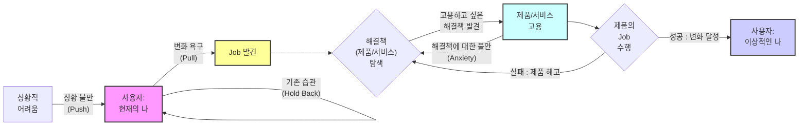

# 07 — JTBD(Jobs To Be Done) 인터뷰 방법론

> 기회점수가 **어디를 파야 할지**를 정했다면, JTBD 인터뷰는 그 자리를 **실제 사람의 이야기로 확인**한다.
> 선행 방법론: [기회점수(OS·AOS) 산출](../OS/기회점수-AOS-방법론.md) · [DOS 시장 가중형](../OS/DOS-시장가중형-방법론.md) · [CJM 작성](../CJM/CJM-작성-방법론.md)
> 작성일: 2026-08-11

## JTBD가 보는 것 — 제품이 아니라 진전

JTBD는 사용자가 **긍정적인 변화를 이루고 싶어 하며, 그 변화는 진전(progress)을 통해 이루어진다**고 본다. 그래서 질문의 대상이 "이 기능이 마음에 드십니까"가 아니라 **"당신은 무엇이 되고 싶었고, 그래서 무엇을 고용했습니까"** 로 바뀐다.

이 전환이 실무에서 뜻하는 바는 하나다. **사용자는 제품을 사지 않고 고용한다.** 고용된 제품이 Job을 해내지 못하면 해고된다. 경쟁자는 같은 카테고리의 제품이 아니라 **그 Job을 지금 해내고 있는 모든 것**이다 — 종이와 펜, 지인에게 묻기, 아무것도 하지 않기까지 포함한다.

---

## 1. 고객의 문제해결 활동 구조

이 그림에서 눈여겨볼 것은 **되돌아오는 화살표 둘**이다.

- `A → A` **기존 습관** — 사용자는 제자리에 머문다. 불편을 느끼면서도 아무 일도 일어나지 않는 상태가 기본값이다.
- `D → C` **해결책에 대한 불안** — 고용을 결정한 뒤에도 다시 탐색으로 돌아간다. 결정은 한 번에 끝나지 않는다.
- `DD → C` **실패 시 해고** — Job을 못 해내면 사용자는 탐색으로 돌아가고, 그 제품은 다시 고용되지 않는다.

앞으로 나아가는 화살표만 그리면 여정이 매끄러워 보이지만, **실제로 시간을 잡아먹는 것은 이 세 개의 역방향 화살표**다.

---

## 2. 전환을 결정하는 네 가지 힘

### 전환을 이끄는 힘 (Driving Forces)

**① 현 상황의 불만 (Situation Push)**

> "아, 지금 쓰는 이거 너무 불편해!", "이대로는 안 되겠어."

고객을 현재 상태(기존 제품)에서 밀어내는 힘이다. **이 힘이 약하면 고객은 아예 탐색조차 시작하지 않는다.**

**② 새 솔루션의 매력 (Situation Pull)**

> "오, 저 신제품이 내 문제를 완벽하게 해결해 줄 것 같아!", "저거 쓰면 훨씬 편해지겠는데?"

고객을 새로운 상태(자사 제품)로 끌어당기는 힘이다.

### 전환을 막는 힘 (Restraining Forces)

**③ 기존 습관의 관성 (Holding Back Habit)**

> "지금 쓰는 게 불편하긴 해도 그냥 익숙해서 쓸 만해.", "바꾸는 거 자체가 귀찮아."

고객을 현재 상태에 머무르게 하는 아주 강력한 힘이다.

**④ 새로운 것에 대한 불안 (Anxiety for New Habit)**

> "괜히 바꿨다가 더 복잡하면 어떡하지?", "저 신제품, 비싸기만 하고 별로면?", "사용법 다시 배워야 하나?"

새로운 솔루션을 도입할 때 발생할 수 있는 잠재적 손실이나 마찰에 대한 두려움이다.

### 네 힘을 읽는 방법

| 힘 | 방향 | 작용하는 자리 | 인터뷰에서 나오는 말 |
|---|---|---|---|
| **① Push** | 현재에서 밀어냄 | 전환 사건 이전 | "그날 이후로 못 참겠더라고요" |
| **② Pull** | 새것으로 당김 | 탐색·고용 | "이거면 되겠다 싶었어요" |
| **③ Habit** | 현재에 붙잡음 | 항상 | "불편해도 그냥 써요" |
| **④ Anxiety** | 새것에서 밀어냄 | 고용 직전·직후 | "잘못되면 어쩌나 싶었죠" |

**전환은 `① + ② > ③ + ④`일 때만 일어난다.** 그래서 진단의 순서가 정해진다.

1. **Push가 없으면 나머지는 무의미하다.** 아무리 좋은 제품을 만들어도 밀어내는 힘이 없으면 탐색이 시작되지 않는다.
2. **Pull만 키우는 개선은 자주 실패한다.** 기능을 더 좋게 만드는 일은 ②만 건드린다. ③과 ④가 크면 합계가 뒤집히지 않는다.
3. **③과 ④는 제품 밖에 있다.** 습관과 불안은 기능이 아니라 이름·절차·가격·설명·평판으로 움직인다.

---

## 3. 인터뷰 준비와 구조

### 시간 배정

클래식한 생성 연구(generative research) 세션과 유사하게, 인터뷰 시간은 보통 **60분에서 90분**을 배정한다. 이 기법에 익숙하지 않은 경우 참가자가 편안함을 느끼는 데 시간이 걸리기 때문이다.

### 고유한 참가자 모집 (Recruiting)

JTBD의 핵심은 **전환 행동(switching behavior)** 을 이해하는 것이다. 그래서 일반적인 사용자 모집과 다르게 특히 다음 **세 그룹**을 스크리닝해 모집한다.

| 그룹 | 대상 | 여기서 얻는 것 |
|---|---|---|
| **A** | 최근에 우리 제품·서비스를 **사용하기 시작한** 사람 | 무엇이 밀어냈고(Push) 무엇이 당겼는가(Pull) |
| **B** | 최근에 우리 제품·서비스 사용을 **중단한** 사람 | 어떤 Job을 못 해내서 해고됐는가 |
| **C** | 우리 제품·서비스에 대해 **아직 들어본 적이 없는** 사람 | 지금 그 Job을 무엇이 대신하고 있는가 |

이 셋을 통해 사람들이 우리 제품으로 **전환하거나 떠나는 이유**, 그리고 경쟁 제품으로 이끄는 **푸시·풀 요소**를 이해한다.

> **왜 만족한 현재 사용자만 만나면 안 되는가.** A만 모으면 "우리 제품이 좋다"는 이야기가 모인다. B는 우리가 못 해낸 Job을 알려주고, C는 우리가 경쟁자로 인식조차 하지 못한 대체 수단을 알려준다. **세 그룹 중 C가 가장 구하기 어렵고 가장 많이 알려준다.**

---

## 4. 심층 목표 파헤치기 (Focus on Deeper Goals)

### 표면적 답변 피하기

단순히 사용자에게 **왜 다른 제품으로 전환했는지 직설적으로 묻는 것을 피해야 한다.** 그렇게 물으면 행동을 유도하는 더 깊은 목표에 도달할 수 없다. "왜 바꾸셨어요?"에 대한 답은 대개 그 자리에서 만들어진 사후 합리화다.

### 전환 사건에 집중

인터뷰이는 대화의 방향을 이끌도록 허용하되, 연구자는 참가자가 변화를 일으키게 된 **전환 사건(switch event)** 에 초점을 맞춰야 한다. 사람이 오래 참다가 어느 날 움직이는 그 지점이 있다. 그날 무슨 일이 있었는지가 Push의 실체다.

### 스토리텔링 유도

깊은 목표와 행동을 이해하려면 사용자가 **무언가를 하기로 결정한 배경에 대한 이야기를 하도록** 유도해야 한다. 생성 연구와 마찬가지로 질문을 심층적으로 파고들어야 하지만, 특정 방식으로 진행해야 한다 — **의견을 묻지 않고 사건을 묻는다.**

---

## 5. 핵심 질문 전략 (Interview Scripting)

### 대안 및 맥락 파악 질문

대화의 맥락을 잡는 단계다. 대안과 상황 파악에 중점을 둔다.

1. 제품·서비스를 시도하기 전에 다른 어떤 해결책을 고려했습니까?
2. 이러한 해결책을 고려할 때 무엇을 찾고 있었습니까?
3. 무엇을 해결하려고 했습니까?
4. 이 제품·서비스들을 어떻게 찾아보았는지 이야기해 주십시오.
5. 실제로 사용해 본 다른 해결책은 무엇입니까?
6. 시도하거나 사용해 본 다른 해결책 중에서 좋았던 점과 싫었던 점은 무엇입니까?
7. 이 제품·서비스를 사용할 수 없었다면 대신 무엇을 했을 것입니까?
8. 주변 사람들이 시도하거나 사용해 본 해결책은 무엇입니까?
9. 과거와 비교했을 때 지금 무엇을 하고 있습니까?

### 맥락 및 감정적 질문

경쟁사와 잠재적 전환 행동을 파악한 후, 더 감정적인 질문으로 깊이 파고든다.

1. 문제를 해결할 무언가가 필요하다는 것을 언제 처음 깨달았습니까?
2. 고려 중인 선택에 대해 다른 사람과 이야기했습니까? 대화는 어땠습니까?
3. 이 제품·서비스를 사용하면 어떤 모습일지 상상했습니까?
4. 제품·서비스로부터 무엇을 원했습니까?
5. 이 제품·서비스를 구매·사용하는 것에 대해 **불안감(anxiety)** 이 있었습니까?
6. 사용하는 것에 대해 걱정하게 만드는 요소가 있었습니까?

### 스토리텔링을 위한 연상 유도

사용자의 기억은 **사람, 장소, 냄새, 소리와의 연상**을 통해 회상되는 경우가 많다.

- 그때는 하루 중 몇 시였습니까?
- 집에 있었습니까, 직장에 있었습니까?
- 뒤에서 TV가 켜져 있었습니까?
- 당신은 어떤 상태였습니까?

> 이 질문들이 사소해 보이지만 **기억을 여는 열쇠**다. "왜 그러셨어요"라고 물으면 해석이 나오고, "몇 시였어요"라고 물으면 장면이 나온다. JTBD가 찾는 것은 해석이 아니라 장면이다.

### 질문이 네 힘의 어디를 겨냥하는가

| 질문 묶음 | 주로 캐내는 힘 |
|---|---|
| 대안 및 맥락 (1~9) | **① Push** · **③ Habit** — 무엇이 불편했고 무엇을 계속 쓰고 있었는가 |
| 맥락 및 감정 (1~4) | **② Pull** — 무엇을 기대했는가 |
| 맥락 및 감정 (5~6) | **④ Anxiety** — 무엇이 망설이게 했는가 |
| 연상 유도 | 전환 사건의 **장면 복원** |

---

## 6. 결론 — 진전에 집중한다

JTBD는 사용자가 **긍정적인 변화를 이루고 싶어 하며, 그 변화는 진전(progress)을 통해 이루어진다**는 점을 시사한다.

연구자로서 우리가 긍정적인 변화와 사용자가 그 변화를 만들도록 돕는 방법에 집중한다면, 그들의 원하는 목표에 **더 효율적이고 즐거운 방식으로** 도달하도록 도울 수 있다.

### 연습이 핵심이다

이러한 기술을 숙달하는 것은 까다로우며 많은 연습이 필요하다. **사용자들과 직접 만나기 전에 회사 내부나 친구들과 함께 이 기법을 시도해 보는 것이 좋다.**

---

## 이 저장소에서 JTBD를 쓰는 자리

앞 챕터들은 전부 **책상에서 만든 판단**이다. 페르소나 12인은 실존 인물이 아니고, AOS·DOS 점수도 관측이 아니라 우리 채점이다. JTBD 인터뷰는 그 사슬에서 **처음으로 사람을 만나는 단계**다.

### 무엇을 확인하러 가는가

| 확인 대상 | 지금 상태 | JTBD로 메우는 방법 |
|---|---|---|
| [OS04](../OS/OS04-AOS-DOS-혼합매트릭스.md)의 **D1 6건** | 두 지표가 합의한 1순위 후보 | 그 Job이 실재하는지, Push가 실제로 있는지 |
| **Importance 채점** | 25건 전부 우리 판정 | 자기보고와 대조. 특히 잠재 Goal 2건 |
| **Satisfaction 채점** | 대체 솔루션 기준, 우리 판정 | "이걸 못 쓰면 대신 무엇을 했겠습니까"로 직접 확인 |
| **대체 솔루션 목록** | 문자 중계·라디오·TV 자막·점자단말기 | 질문 5·7·8로 우리가 모르는 대체재 발견 |

### 참가자 세 그룹과 페르소나 스펙트럼의 대응

모집 그룹이 이미 만들어 둔 스펙트럼과 맞물린다.

| 모집 그룹 | 대응하는 페르소나 | 겨냥하는 항목 |
|---|---|---|
| **A** 최근 사용 시작 | 핵심 C1~C5 | Push와 Pull의 실체 |
| **B** 최근 사용 중단 | **N1 문세림** (학습된 회피) | 해고 사유. Anxiety와 Habit |
| **C** 들어본 적 없음 | **N2 배옥순** · 확장 A1·A2 | 지금 그 Job을 무엇이 하고 있는가 |

**B 그룹이 가장 중요하다.** 상위 문서가 "접근성 부족이 시청 이탈의 핵심 원인"을 아직 확인하지 못한 명제로 남겨 뒀는데, 그 답은 떠난 사람에게만 있다. 지금 잘 쓰는 사람을 아무리 많이 만나도 나오지 않는다.

### 이 저장소의 인터뷰 규칙

1. **감각 채널을 한 그룹으로 합치지 않는다.** 시각 손실과 청각 손실은 Job이 다르다. 최소한 유형별로 나눠 모집하고 나눠 분석한다.
2. **Pain을 확인하러 가지 않는다.** 우리가 적어 둔 Pain 목록을 읽어 주고 동의를 구하면 전부 "맞다"는 답이 나온다. 사건을 묻고, 그 사건에서 Pain이 나오는지 본다.
3. **불안(④)을 반드시 묻는다.** 접근성 서비스에는 낙인감이라는 고유한 Anxiety가 있다. C5 임정호의 여정 전체가 이 힘 하나로 설명된다.
4. **모든 인용은 원문 그대로 남긴다.** 요약하면 그 순간 우리 언어로 번역되고, 다음 문서에서 그것이 근거가 된다.

## 적용 사례

- (예정) JTBD01 — 스포츠 OTT 접근성 인터뷰 설계와 스크립트
