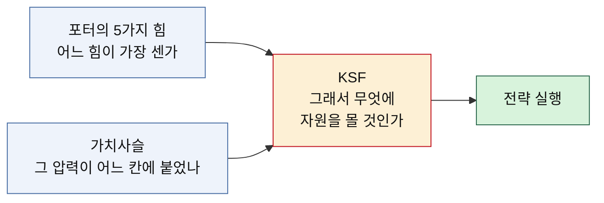

# 03 — 핵심 성공 요인(KSF) 도출 방법론

> 분석에서 전략으로 넘어가는 다리.
> 선행 분석: [포터의 5가지 힘](../포터/) · [가치사슬](../가치사슬/)
> 작성일: 2026-08-06

## KSF란 무엇인가

핵심 성공 요인(Key Success Factor)은 **그 시장에서 살아남기 위해 반드시 잘해야만 하는 소수의 변수**다. 잘하면 좋은 것이 아니라, 못하면 죽는 것을 골라내는 작업이다.

그래서 KSF 도출의 본질은 나열이 아니라 **선별**이다. 성공에 기여하는 요인은 수십 개지만, 신규 진입자의 자원은 한정돼 있다. 무엇을 먼저 할지 정해주지 못하는 목록은 KSF가 아니라 체크리스트다.

## 도출 규칙

1. **가장 센 힘에서 출발한다.** 5힘 분석에서 ★★★★★로 판정된 힘이 그 시장의 생사를 가른다. 약한 힘을 잘 다뤄봐야 판정을 뒤집지 못한다.
2. **그 힘이 붙은 활동을 짚는다.** 가치사슬에서 해당 압력이 어느 칸에 걸려 있는지 확인한다. 같은 "공급자의 힘"이라도 투입 물류에 붙었는지 마케팅·영업에 붙었는지에 따라 손댈 곳이 달라진다.
3. **신규 진입자 기준으로 다시 거른다.** 기존 사업자에게 유효한 처방이 신규 진입자에게는 불가능한 경우가 많다. 자본, 시간, 협상력이 없는 상태에서 실행 가능한 것만 남긴다.
4. **다섯 개로 줄이고 순서를 매긴다.** 치명성이 높은 것, 그리고 다른 요인의 선행 조건이 되는 것을 앞에 둔다.

## 서술 규칙

각 KSF는 두 부분으로 쓴다.

| 구성 | 내용 |
|---|---|
| **KSF 명칭** | 성공 요인을 간결하게 정의하는 이름 |
| **선정 근거** | 왜 핵심인지를 선행 분석의 특정 대목을 직접 인용하며 논증 |

근거는 반드시 **선행 분석 문서의 문장을 인용**한다. 추적 가능하지 않은 근거는 컨설턴트의 직관이지 분석 결과가 아니다.

## 적용 사례

- [KSF01 — OTT 신규 진입자](./KSF01-OTT.md)
- [KSF02 — 온라인 커머스 신규 진입자](./KSF02-온라인커머스.md)
- [비교 — 두 시장의 KSF 대조](./비교-KSF-OTT-vs-온라인커머스.md)
