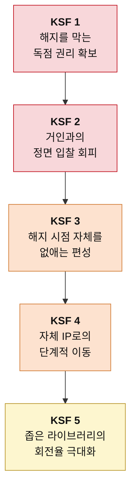

# 신규 진입자를 위한 Top 5 핵심 성공 요인 — OTT

> 도출 방법론: [KSF-도출-방법론.md](./KSF-도출-방법론.md)
> 선행 분석: [5힘 분석](../포터/분석01-OTT.md) · [가치사슬 분석](../가치사슬/분석03-OTT-가치사슬.md)
> 대상 독자: OTT 시장 진입을 준비하는 창업가 또는 전략 기획팀
> 작성일: 2026-08-06

## 판단의 전제

선행 분석은 이 산업을 매력도 낮음으로 판정했다. 신규 진입자는 그 판정을 뒤집을 수 없다. 산업 구조는 개별 기업이 바꿀 수 있는 대상이 아니기 때문이다.

그러므로 이 문서의 목적은 "어떻게 이 시장을 매력적으로 만들 것인가"가 아니다. **구조적으로 불리한 시장에서 자원을 어디에 몰아야 생존 확률이 가장 높아지는가**를 정하는 것이다. 아래 다섯 가지는 우선순위 순으로 배열했으며, 앞의 것을 해결하지 못한 상태에서 뒤의 것에 투자하는 것은 자원 낭비다.

---

## 1. 해지를 막는 독점 콘텐츠 권리의 확보

### KSF 명칭
**시청자를 시즌 단위로 묶어두는 좁고 깊은 독점 권리**

### 선정 근거

5힘 분석은 이 산업의 공급자의 힘을 ★★★★★ 매우 강함으로 판정하면서, 그 압력이 가치사슬의 어느 칸에 걸리는지를 명시했다. 가치사슬 분석의 표현을 그대로 옮기면 투입·조달 물류는 "원가 압도적 / 차별화 높음"이며 "여기가 이 사업의 전부"다. 아홉 개 활동 중 첫 번째 칸 하나가 원가와 차별화를 동시에 쥐고 있다는 뜻이다. 나머지 여덟 칸을 아무리 잘 설계해도 볼 것이 없으면 고객은 오지 않는다.

여기서 결정적인 단서는 구매자의 힘 분석에 있다. 이 시장의 구매자 힘은 ★★★★☆로 강하지만, 분석은 하나의 예외를 명시했다. "스포츠는 예외다. 응원하는 팀 경기를 봐야 하니 시즌 내내 묶이고, 구독료 인상을 받아들이는 정도도 다르며, 계정 공유 단속마저 스포츠 쪽이 훨씬 잘 먹힌다. 이 산업에서 구매자 힘을 낮추는 거의 유일한 수단이다."

즉 콘텐츠라고 다 같은 콘텐츠가 아니다. **몰아보고 해지할 수 있는 콘텐츠와, 시즌이 끝날 때까지 해지할 수 없는 콘텐츠는 전혀 다른 자산이다.** 신규 진입자는 전 장르 라이브러리를 구축할 자본이 없으므로, 확보할 권리를 고를 때 양이 아니라 락인 강도를 기준으로 삼아야 한다. 이 한 가지 선택이 5힘 분석에서 강하게 판정된 구매자의 힘과 대체재의 위협을 동시에 낮춘다.

---

## 2. 채산성을 무시하는 거인과의 정면 입찰 회피

### KSF 명칭
**대형 자본이 관심을 두지 않는 권리 영역의 선점**

### 선정 근거

신규 진입자의 위협이 ★★★☆☆ 중간으로 판정된 이유를 오독하면 치명적이다. 5힘 분석은 이렇게 적었다. "문제는 이 장벽을 넘을 수 있는 상대가 하필 가장 무서운 상대라는 점이다. 자금력이 압도적인 인접 산업의 거인들이 중계권을 사간다. 이들에게 OTT는 하드웨어나 커머스를 팔기 위한 미끼라서 수지가 안 맞는 가격에도 입찰할 수 있다."

그리고 결론은 명확하다. "장벽이 오히려 최악의 경쟁자만 걸러 들여보내는 셈이다."

이 대목이 뜻하는 바는 하나다. **대형 리그 중계권 경매에 들어가는 순간 신규 진입자는 반드시 진다.** 상대는 그 권리로 수익을 낼 필요가 없는 사업자이기 때문이다. 합리적인 가격을 계산하는 쪽이 계산하지 않는 쪽을 이길 방법은 없다.

가치사슬 분석은 이 압력의 결과를 원가 구조로 설명했다. "중계권료 재입찰 때마다 가격이 오르는 구조"이며, "규모를 키우는 것 말고는 단가를 낮출 방법이 없고, 규모를 키우려면 또 더 비싼 권리를 사야 한다." 신규 진입자에게는 그 규모가 없다.

따라서 KSF 1에서 정한 락인 권리는 반드시 **거인의 사정권 밖에서** 골라야 한다. 마이너 리그, 지역 리그, 특정 종목, 좁은 팬덤을 가진 장르가 후보다. 시장이 작다는 것이 여기서는 약점이 아니라 방어막이다.

---

## 3. 해지 시점 자체를 제거하는 편성 설계

### KSF 명칭
**몰아보기가 불가능하도록 소비 리듬을 설계하는 능력**

### 선정 근거

가치사슬 분석은 마케팅·영업 칸에서 이 산업의 가장 고약한 누수를 지적했다. "'가입 → 몰아보기 → 해지' 패턴 때문에 마케팅비가 유지가 아니라 재획득에 반복 지출된다. 같은 고객을 여러 번 사오는 셈이라, CAC가 낮아지지 않으면 구조적으로 마진이 나오지 않는다."

5힘 분석의 구매자 힘 항목도 같은 현상을 짚었다. "전환 비용이 사실상 0이기 때문이다. 해지 버튼 하나면 끝이고 잃는 건 시청 기록 정도다."

정상적인 사업이라면 고객 획득 비용은 초기에 한 번 지출하고 끝난다. 이 시장에서는 그것이 반복 비용이 된다. **자본이 두꺼운 기존 사업자는 이 굴레를 버틸 수 있지만 신규 진입자는 버틸 수 없다.** 획득 비용을 여러 번 치를 체력이 없기 때문이다.

그러므로 신규 진입자는 마케팅 예산을 늘리는 방향이 아니라, 해지가 발생하는 시점 자체를 없애는 방향으로 설계해야 한다. 주간 단위 공개, 시즌 진행형 라이브, 결과를 미리 알 수 없는 실시간 콘텐츠가 이 조건을 만족한다. 가치사슬 분석의 표현대로 "이 칸을 줄이려면 마케팅을 줄일 게 아니라 떠날 이유를 없애야" 한다.

---

## 4. 자체 IP로의 단계적 이동

### KSF 명칭
**사온 권리를 남는 자산으로 전환하는 이행 계획**

### 선정 근거

가치사슬 분석의 최종 처방은 명확했다. "투입 물류를 자체 제작 쪽으로 옮기는 것 말고는 구조를 바꿀 방법이 없다. 사온 권리는 계약이 끝나면 사라지지만 자체 IP는 남는다."

5힘 분석도 같은 방향을 가리켰다. "남의 콘텐츠를 빌려 트는 유통업으로는 구조상 돈을 벌 수 없다. 자체 IP 보유나 장기 독점 계약으로 공급자 쪽으로 올라가는 것이 유일한 방향이다."

다만 이 요인을 앞의 세 가지보다 뒤에 둔 이유가 있다. 가치사슬 분석은 같은 대목에서 대가를 함께 명시했다. "자체 제작은 흥행 실패 위험을 회사가 직접 떠안는 선택이다. 사온 콘텐츠는 실패해도 계약 기간이 끝나면 정리되지만, 직접 만든 실패작은 제작비가 그대로 손실로 남는다. 통제권을 얻는 대가로 위험을 사오는 거래다."

신규 진입자가 이 거래를 처음부터 크게 체결하면 한 번의 실패로 사업이 끝난다. **따라서 이 KSF의 실체는 "자체 제작을 하라"가 아니라 "언제 얼마만큼 옮길지를 미리 정해두라"이다.** 진입 시점에는 사온 권리로 시청자를 모으고, 그 시청 데이터가 쌓인 다음에 제작 투자를 시작하는 순서가 위험을 가장 크게 낮춘다. 가치사슬의 개선 질문 중 "시청 데이터를 다음 제작 투자 결정에 실제로 되먹이고 있는가"가 이 판단의 기준이 된다.

---

## 5. 좁은 라이브러리의 회전율 극대화

### KSF 명칭
**적은 콘텐츠로 시청 시간을 뽑아내는 큐레이션 역량**

### 선정 근거

가치사슬 분석은 산출·배송 물류를 "이 산업에서 차별화 여지가 남아 있는 몇 안 되는 칸"으로 평가했다. 근거는 이렇다. "같은 콘텐츠를 가지고도 무엇을 언제 보여주느냐에 따라 시청 시간이 갈린다."

신규 진입자에게 이 칸의 의미는 기존 사업자보다 크다. 콘텐츠 양에서는 이미 졌기 때문에, **가진 것의 회전율을 높이는 것 말고는 시청 시간을 늘릴 방법이 없다.** 가치사슬의 개선 질문 중 "카탈로그에서 한 번도 재생되지 않는 콘텐츠 비중을 줄일 수 있는가"가 이 지점을 정확히 겨냥한다. 비싸게 산 권리가 재생되지 않고 있다면 그것은 큐레이션의 실패이지 콘텐츠의 실패가 아니다.

이 KSF에는 반대편의 경고가 함께 붙는다. 가치사슬 분석은 기술 개발을 "차별화 원천이 아니라 원가 방어선"으로 판정했고, 운영·생산을 "위생 요인 — 못하면 죽지만 잘해도 안 알아줌"으로 분류했다. "버퍼링이 잦으면 즉시 이탈하지만, 아무리 매끄럽게 틀어도 그걸 이유로 구독하지는 않는다."

따라서 신규 진입자의 기술 자원은 화질이나 재생 성능의 우위를 만드는 데 쓰면 안 된다. 최소 기준을 충족하는 선에서 원가를 방어하고, 남은 역량을 추천과 편성에 몰아야 한다. **단 하나의 예외는 라이브 스포츠 안정성이다.** 가치사슬 분석의 지적대로 "결승 경기 중 장애 한 번이 브랜드를 통째로 깎아먹는다." KSF 1에서 스포츠 권리를 택했다면 이 한 항목만은 위생 요인이 아니라 생존 요인으로 취급해야 한다.

---

## 요약

| 순위 | KSF | 겨냥하는 힘·활동 | 실패 시 결과 |
|---|---|---|---|
| 1 | 해지를 막는 독점 권리 확보 | 공급자 ★★★★★ / 투입 물류 | 시작 자체가 불가능 |
| 2 | 거인과의 정면 입찰 회피 | 신규 진입자 ★★★☆☆ / 조달·구매 | 자본 소진 후 퇴출 |
| 3 | 해지 시점 제거 편성 | 구매자 ★★★★☆ / 마케팅·영업 | CAC 굴레에서 마진 소멸 |
| 4 | 자체 IP로의 단계적 이동 | 공급자 ★★★★★ / 투입 물류 | 계약 만료와 함께 자산 증발 |
| 5 | 좁은 라이브러리의 회전율 | 대체재 ★★★★☆ / 산출 물류 | 비싼 권리가 사장됨 |

다섯 가지 중 세 개가 투입·조달 물류와 연결된다. 이것은 우연이 아니라 가치사슬 분석이 내린 결론 그대로다. **"첫 번째 칸이 전부다."** 신규 진입자가 자원 배분에서 저지를 수 있는 가장 큰 실수는, 손대기 쉬운 칸(앱, 기술, 마케팅)에 먼저 투자하고 가장 어려운 칸을 나중으로 미루는 것이다. 이 시장에서는 그 순서가 곧 실패의 순서다.
