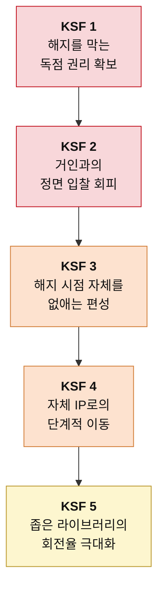

# 신규 진입자를 위한 Top 5 핵심 성공 요인 — OTT

> 도출 방법론: [KSF-도출-방법론.md](./KSF-도출-방법론.md)
> 선행 분석: [5힘 분석](../포터/분석01-OTT.md) · [가치사슬 분석](../가치사슬/분석03-OTT-가치사슬.md)
> 대상 독자: OTT 시장 진입을 준비하는 창업가 또는 전략 기획팀
> 작성일: 2026-08-06

## 판단의 전제

선행 분석은 이 산업을 매력도 낮음으로 판정했다. 신규 진입자는 그 판정을 뒤집을 수 없다. 산업 구조는 개별 기업이 바꿀 수 있는 대상이 아니기 때문이다.

그러므로 이 문서의 목적은 "어떻게 이 시장을 매력적으로 만들 것인가"가 아니다. **구조적으로 불리한 시장에서 자원을 어디에 몰아야 생존 확률이 가장 높아지는가**를 정하는 것이다. 아래 다섯 가지는 우선순위 순으로 배열했으며, 앞의 것을 해결하지 못한 상태에서 뒤의 것에 투자하는 것은 자원 낭비다.

각 요인마다 실증 사례를 붙였다. **성공 사례와 함께 같은 요인을 놓쳐 무너진 반례를 나란히 두었다.** 성공한 회사만 모으면 그 요인이 정말 결정적이었는지 알 수 없기 때문이다.

> 사례의 수치와 시점은 공개 보도를 기준으로 정리했다. 인용 전 원출처 확인을 권한다.

---

## 1. 해지를 막는 독점 콘텐츠 권리의 확보

### KSF 명칭
**시청자를 시즌 단위로 묶어두는 좁고 깊은 독점 권리**

### 선정 근거

5힘 분석은 이 산업의 공급자의 힘을 ★★★★★ 매우 강함으로 판정하면서, 그 압력이 가치사슬의 어느 칸에 걸리는지를 명시했다. 가치사슬 분석의 표현을 그대로 옮기면 투입·조달 물류는 "원가 압도적 / 차별화 높음"이며 "여기가 이 사업의 전부"다. 아홉 개 활동 중 첫 번째 칸 하나가 원가와 차별화를 동시에 쥐고 있다는 뜻이다. 나머지 여덟 칸을 아무리 잘 설계해도 볼 것이 없으면 고객은 오지 않는다.

여기서 결정적인 단서는 구매자의 힘 분석에 있다. 이 시장의 구매자 힘은 ★★★★☆로 강하지만, 분석은 하나의 예외를 명시했다. "스포츠는 예외다. 응원하는 팀 경기를 봐야 하니 시즌 내내 묶이고, 구독료 인상을 받아들이는 정도도 다르며, 계정 공유 단속마저 스포츠 쪽이 훨씬 잘 먹힌다. 이 산업에서 구매자 힘을 낮추는 거의 유일한 수단이다."

즉 콘텐츠라고 다 같은 콘텐츠가 아니다. **몰아보고 해지할 수 있는 콘텐츠와, 시즌이 끝날 때까지 해지할 수 없는 콘텐츠는 전혀 다른 자산이다.** 신규 진입자는 전 장르 라이브러리를 구축할 자본이 없으므로, 확보할 권리를 고를 때 양이 아니라 락인 강도를 기준으로 삼아야 한다. 이 한 가지 선택이 5힘 분석에서 강하게 판정된 구매자의 힘과 대체재의 위협을 동시에 낮춘다.

### 기업 사례

**티빙 — KBO 리그 중계권 (2024~2026)**
CJ ENM은 2024년부터 3년간 KBO 리그의 유무선 중계권을 확보했다. 계약 규모는 약 1,350억 원으로 보도됐다. 이 권리의 성격이 KSF 1의 정의에 정확히 부합한다. 프로야구 시즌은 3월부터 10월까지 이어지고, 팬은 응원 팀 경기를 놓칠 수 없다. **드라마 한 편은 몰아보고 해지할 수 있지만 시즌은 몰아볼 수 없다.** 티빙이 이 권리를 산 것은 콘텐츠를 늘리려는 판단이 아니라 해지 버튼을 잠그려는 판단으로 읽어야 한다.

**Peacock — NFL 플레이오프 독점 중계 (2024년 1월)**
NBC유니버설의 Peacock은 NFL 와일드카드 경기 한 경기를 스트리밍 독점으로 중계했다. 단 한 경기에 수백만 명 규모의 신규 가입이 몰린 것으로 보도됐다. 라이브러리 수백 편이 만들지 못한 유입을 경기 하나가 만든 셈이다. 여기서 확인되는 것은 **락인 강도가 콘텐츠 양보다 훨씬 강력한 변수**라는 점이다.

**반례 — 왓챠**
왓챠는 방대한 영화 데이터베이스와 평점 기반 추천이라는 분명한 강점을 갖고 출발했다. 그러나 확보한 콘텐츠 대부분이 라이선스 영화·드라마여서 몰아보고 해지하는 소비를 막지 못했다. 이후 콘텐츠 수급 비용을 감당하지 못해 심각한 경영난을 겪었다. 좋은 콘텐츠를 모으는 것과 떠나지 못하게 만드는 것은 다른 일이라는 사실이 여기서 드러난다.

---

## 2. 채산성을 무시하는 거인과의 정면 입찰 회피

### KSF 명칭
**대형 자본이 관심을 두지 않는 권리 영역의 선점**

### 선정 근거

신규 진입자의 위협이 ★★★☆☆ 중간으로 판정된 이유를 오독하면 치명적이다. 5힘 분석은 이렇게 적었다. "문제는 이 장벽을 넘을 수 있는 상대가 하필 가장 무서운 상대라는 점이다. 자금력이 압도적인 인접 산업의 거인들이 중계권을 사간다. 이들에게 OTT는 하드웨어나 커머스를 팔기 위한 미끼라서 수지가 안 맞는 가격에도 입찰할 수 있다."

그리고 결론은 명확하다. "장벽이 오히려 최악의 경쟁자만 걸러 들여보내는 셈이다."

이 대목이 뜻하는 바는 하나다. **대형 리그 중계권 경매에 들어가는 순간 신규 진입자는 반드시 진다.** 상대는 그 권리로 수익을 낼 필요가 없는 사업자이기 때문이다. 합리적인 가격을 계산하는 쪽이 계산하지 않는 쪽을 이길 방법은 없다.

가치사슬 분석은 이 압력의 결과를 원가 구조로 설명했다. "중계권료 재입찰 때마다 가격이 오르는 구조"이며, "규모를 키우는 것 말고는 단가를 낮출 방법이 없고, 규모를 키우려면 또 더 비싼 권리를 사야 한다." 신규 진입자에게는 그 규모가 없다.

따라서 KSF 1에서 정한 락인 권리는 반드시 **거인의 사정권 밖에서** 골라야 한다. 마이너 리그, 지역 리그, 특정 종목, 좁은 팬덤을 가진 장르가 후보다. 시장이 작다는 것이 여기서는 약점이 아니라 방어막이다.

### 기업 사례

**Crunchyroll — 애니메이션 단일 장르 집중**
크런치롤은 일본 애니메이션이라는 하나의 장르만 파고들어 글로벌 유료 구독자를 확보했고, 이후 소니에 인수됐다. 넷플릭스나 디즈니가 종합 라이브러리를 두고 싸우는 동안 정면 충돌을 피한 것이 핵심이다. 애니메이션 팬덤은 규모는 작아도 충성도가 높고 신작 방영 주기가 뚜렷해서, **거인이 탐내기에는 작고 팬에게는 대체 불가능한 영역**이었다.

**라프텔 — 국내 애니메이션 전문**
같은 논리가 국내에서도 작동했다. 라프텔은 애니메이션 전문 서비스로 자리 잡았고, 대형 종합 OTT들이 이 영역에 본격적으로 들어오지 않는 동안 팬층을 축적했다. 장르를 좁히는 선택이 경쟁 회피와 락인을 동시에 만들어낸 사례다.

**반례 — DAZN**
DAZN은 "스포츠계의 넷플릭스"를 표방하며 세계 각지의 대형 중계권을 공격적으로 사들였다. 결과는 막대한 누적 적자였다. 좁은 영역을 골랐다는 점에서는 KSF 2의 앞부분을 지켰지만, **그 안에서 다시 최상위 권리를 두고 거인들과 정면 입찰에 뛰어들었다는 점에서 뒷부분을 어겼다.** 니치를 고르는 것만으로는 부족하고, 니치 안에서도 가격 경쟁이 붙지 않는 자리를 찾아야 한다는 점을 보여준다.

---

## 3. 해지 시점 자체를 제거하는 편성 설계

### KSF 명칭
**몰아보기가 불가능하도록 소비 리듬을 설계하는 능력**

### 선정 근거

가치사슬 분석은 마케팅·영업 칸에서 이 산업의 가장 고약한 누수를 지적했다. "'가입 → 몰아보기 → 해지' 패턴 때문에 마케팅비가 유지가 아니라 재획득에 반복 지출된다. 같은 고객을 여러 번 사오는 셈이라, CAC가 낮아지지 않으면 구조적으로 마진이 나오지 않는다."

5힘 분석의 구매자 힘 항목도 같은 현상을 짚었다. "전환 비용이 사실상 0이기 때문이다. 해지 버튼 하나면 끝이고 잃는 건 시청 기록 정도다."

정상적인 사업이라면 고객 획득 비용은 초기에 한 번 지출하고 끝난다. 이 시장에서는 그것이 반복 비용이 된다. **자본이 두꺼운 기존 사업자는 이 굴레를 버틸 수 있지만 신규 진입자는 버틸 수 없다.** 획득 비용을 여러 번 치를 체력이 없기 때문이다.

그러므로 신규 진입자는 마케팅 예산을 늘리는 방향이 아니라, 해지가 발생하는 시점 자체를 없애는 방향으로 설계해야 한다. 주간 단위 공개, 시즌 진행형 라이브, 결과를 미리 알 수 없는 실시간 콘텐츠가 이 조건을 만족한다. 가치사슬 분석의 표현대로 "이 칸을 줄이려면 마케팅을 줄일 게 아니라 떠날 이유를 없애야" 한다.

### 기업 사례

**디즈니+ — 만달로리안 주간 공개 (2019)**
디즈니+는 출범작 만달로리안을 주 1회 공개로 편성했다. 넷플릭스의 전편 일괄 공개와 정반대 선택이었다. 8부작을 주간으로 내보내면 구독을 최소 두 달 유지해야 하고, 매주 화제가 재점화되면서 마케팅 비용까지 절약된다. **편성 방식 하나가 구독 기간과 마케팅 효율을 동시에 바꾼 사례다.**

**넷플릭스 — 일괄 공개 원칙의 부분 철회**
주목할 것은 일괄 공개를 발명한 넷플릭스조차 방향을 바꿨다는 점이다. 기묘한 이야기 시즌 4를 두 파트로 나눠 공개한 이후, 대형 작품에서 파트 분할 방식을 반복해 쓰고 있다. 시장 지배 사업자가 자신의 원칙을 수정했다는 사실이 **몰아보기 구조의 비용이 실재한다는 가장 강한 증거**다.

**티빙 — 라이브 스포츠라는 구조적 해법**
KBO 중계는 편성 기법을 쓸 필요조차 없다. 경기는 실시간으로만 존재하고 결과를 미리 알 수 없으므로 몰아보기가 원천적으로 불가능하다. KSF 1과 KSF 3이 하나의 선택으로 동시에 해결되는 경우이며, 자원이 부족한 신규 진입자에게 가장 효율이 높은 조합이다.

---

## 4. 자체 IP로의 단계적 이동

### KSF 명칭
**사온 권리를 남는 자산으로 전환하는 이행 계획**

### 선정 근거

가치사슬 분석의 최종 처방은 명확했다. "투입 물류를 자체 제작 쪽으로 옮기는 것 말고는 구조를 바꿀 방법이 없다. 사온 권리는 계약이 끝나면 사라지지만 자체 IP는 남는다."

5힘 분석도 같은 방향을 가리켰다. "남의 콘텐츠를 빌려 트는 유통업으로는 구조상 돈을 벌 수 없다. 자체 IP 보유나 장기 독점 계약으로 공급자 쪽으로 올라가는 것이 유일한 방향이다."

다만 이 요인을 앞의 세 가지보다 뒤에 둔 이유가 있다. 가치사슬 분석은 같은 대목에서 대가를 함께 명시했다. "자체 제작은 흥행 실패 위험을 회사가 직접 떠안는 선택이다. 사온 콘텐츠는 실패해도 계약 기간이 끝나면 정리되지만, 직접 만든 실패작은 제작비가 그대로 손실로 남는다. 통제권을 얻는 대가로 위험을 사오는 거래다."

신규 진입자가 이 거래를 처음부터 크게 체결하면 한 번의 실패로 사업이 끝난다. **따라서 이 KSF의 실체는 "자체 제작을 하라"가 아니라 "언제 얼마만큼 옮길지를 미리 정해두라"이다.** 진입 시점에는 사온 권리로 시청자를 모으고, 그 시청 데이터가 쌓인 다음에 제작 투자를 시작하는 순서가 위험을 가장 크게 낮춘다. 가치사슬의 개선 질문 중 "시청 데이터를 다음 제작 투자 결정에 실제로 되먹이고 있는가"가 이 판단의 기준이 된다.

**넷플릭스 — 이 KSF의 교과서**
넷플릭스는 정확히 이 순서를 밟았다. 초기에는 스튜디오 라이선스 콘텐츠로 가입자를 모았고, 2013년 하우스 오브 카드를 시작으로 오리지널 제작에 진입했다. 결정적인 대목은 타이밍이다. 2019년 디즈니가 디즈니+를 출범하며 자사 콘텐츠를 회수했을 때, 넷플릭스는 이미 오리지널 라인업으로 상당 부분 대체할 수 있는 상태였다. **라이선스가 끊길 것을 알고 그 전에 이동을 마친 것이 이 사례의 핵심이다.** 5힘 분석이 지적한 "스튜디오의 전방 통합"이 현실화되기 전에 대비한 셈이다.

**아마존 — MGM 인수 (2022)**
아마존은 다른 경로를 택했다. 제작 역량을 키우는 대신 MGM을 약 85억 달러에 인수해 IP 카탈로그를 통째로 확보했다. 자본이 충분할 때 쓸 수 있는 방식이며, 007 같은 프랜차이즈는 계약 만료로 사라지지 않는 자산이다. 다만 신규 진입자가 따라 할 수 있는 경로는 아니라는 점에서, **KSF 4의 목적지는 같아도 도달 방법은 자본 규모에 따라 갈린다**는 것을 보여준다.

**반례 — 애플 TV+**
애플 TV+는 2019년 출범 당시 라이선스 콘텐츠 없이 오리지널만으로 시작했다. 작품의 완성도는 높은 평가를 받았지만 절대량이 부족해 초기 구독자 확보에 오래 어려움을 겪었다. **단계를 건너뛰고 처음부터 자체 IP로 간 대가**다. 애플은 다른 사업의 현금으로 이 기간을 버텼지만 신규 진입자에게는 그런 완충 장치가 없다. 이 반례가 KSF 4의 순서를 지켜야 하는 이유를 보여준다.

---

## 5. 좁은 라이브러리의 회전율 극대화

### KSF 명칭
**적은 콘텐츠로 시청 시간을 뽑아내는 큐레이션 역량**

### 선정 근거

가치사슬 분석은 산출·배송 물류를 "이 산업에서 차별화 여지가 남아 있는 몇 안 되는 칸"으로 평가했다. 근거는 이렇다. "같은 콘텐츠를 가지고도 무엇을 언제 보여주느냐에 따라 시청 시간이 갈린다."

신규 진입자에게 이 칸의 의미는 기존 사업자보다 크다. 콘텐츠 양에서는 이미 졌기 때문에, **가진 것의 회전율을 높이는 것 말고는 시청 시간을 늘릴 방법이 없다.** 가치사슬의 개선 질문 중 "카탈로그에서 한 번도 재생되지 않는 콘텐츠 비중을 줄일 수 있는가"가 이 지점을 정확히 겨냥한다. 비싸게 산 권리가 재생되지 않고 있다면 그것은 큐레이션의 실패이지 콘텐츠의 실패가 아니다.

이 KSF에는 반대편의 경고가 함께 붙는다. 가치사슬 분석은 기술 개발을 "차별화 원천이 아니라 원가 방어선"으로 판정했고, 운영·생산을 "위생 요인 — 못하면 죽지만 잘해도 안 알아줌"으로 분류했다. "버퍼링이 잦으면 즉시 이탈하지만, 아무리 매끄럽게 틀어도 그걸 이유로 구독하지는 않는다."

따라서 신규 진입자의 기술 자원은 화질이나 재생 성능의 우위를 만드는 데 쓰면 안 된다. 최소 기준을 충족하는 선에서 원가를 방어하고, 남은 역량을 추천과 편성에 몰아야 한다. **단 하나의 예외는 라이브 스포츠 안정성이다.** 가치사슬 분석의 지적대로 "결승 경기 중 장애 한 번이 브랜드를 통째로 깎아먹는다." KSF 1에서 스포츠 권리를 택했다면 이 한 항목만은 위생 요인이 아니라 생존 요인으로 취급해야 한다.

### 기업 사례

**MUBI — 라이브러리가 작다는 사실을 상품으로 만든 사례**
MUBI는 출범 당시 매일 한 편을 새로 올리고 한 편을 내리는 방식으로 30편 안팎만 유지했다. 넷플릭스가 수천 편을 놓고 "볼 게 없다"는 말을 듣는 동안, MUBI는 **선택지를 없애는 것 자체를 서비스로 팔았다.** 콘텐츠 예산이 적은 사업자가 그 약점을 정체성으로 뒤집은 사례이며, KSF 5가 자원 부족의 변명이 아니라 전략이 될 수 있음을 보여준다.

**Criterion Channel — 주제별 편성으로 구작을 되살리는 방식**
크라이테리언 채널은 고전·아트하우스 영화를 감독별, 주제별, 시대별로 묶어 편성한다. 개별 작품은 오래됐고 다른 곳에서도 볼 수 있지만, 묶음 자체가 다른 데 없는 상품이 된다. 가치사슬의 개선 질문 "카탈로그에서 한 번도 재생되지 않는 콘텐츠 비중"에 대한 실질적인 답이 여기 있다. **새로 사지 않고 이미 가진 것을 다시 꺼내는 방식**이다.

**반례 — 티빙 KBO 중계 초기 운영 논란 (2024)**
티빙은 KBO 중계 첫 시즌 초반에 자막 표기 오류와 하이라이트 편집 문제로 상당한 비판을 받았다. 권리 확보라는 가장 어려운 관문을 통과하고도 운영 품질에서 신뢰를 깎아먹은 것이다. 가치사슬 분석이 라이브 스포츠를 위생 요인의 예외로 따로 분류한 이유가 여기서 확인된다. **KSF 1에 성공한 회사도 KSF 5의 예외 조항을 놓치면 그 성과를 스스로 훼손할 수 있다.**

---

## 요약

| 순위 | KSF | 겨냥하는 힘·활동 | 실증 사례 | 반례 |
|---|---|---|---|---|
| 1 | 해지를 막는 독점 권리 확보 | 공급자 ★★★★★ / 투입 물류 | 티빙 KBO, Peacock NFL | 왓챠 |
| 2 | 거인과의 정면 입찰 회피 | 신규 진입자 ★★★☆☆ / 조달·구매 | Crunchyroll, 라프텔 | DAZN |
| 3 | 해지 시점 제거 편성 | 구매자 ★★★★☆ / 마케팅·영업 | 디즈니+ 만달로리안, 넷플릭스 파트 분할 | — |
| 4 | 자체 IP로의 단계적 이동 | 공급자 ★★★★★ / 투입 물류 | 넷플릭스, 아마존 MGM | 애플 TV+ |
| 5 | 좁은 라이브러리의 회전율 | 대체재 ★★★★☆ / 산출 물류 | MUBI, Criterion Channel | 티빙 중계 초기 운영 |

다섯 가지 중 세 개가 투입·조달 물류와 연결된다. 이것은 우연이 아니라 가치사슬 분석이 내린 결론 그대로다. **"첫 번째 칸이 전부다."** 신규 진입자가 자원 배분에서 저지를 수 있는 가장 큰 실수는, 손대기 쉬운 칸(앱, 기술, 마케팅)에 먼저 투자하고 가장 어려운 칸을 나중으로 미루는 것이다. 이 시장에서는 그 순서가 곧 실패의 순서다.

사례들을 겹쳐 보면 한 가지 규칙성이 보인다. **살아남은 회사는 모두 자기 크기에 맞는 싸움터를 골랐고, 무너진 회사는 자기보다 큰 상대와 같은 자리에서 겨뤘다.** 왓챠는 종합 라이브러리 경쟁에, DAZN은 최상위 중계권 입찰에, 애플 TV+는 초기 물량 경쟁에 각각 발을 들였다. 반대로 크런치롤과 MUBI는 거인이 관심 없는 자리를 골랐다. KSF 다섯 개를 한 문장으로 줄이면 이것이다.
