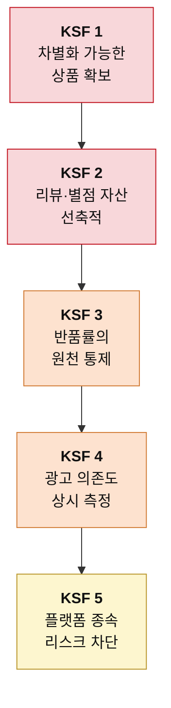

# 신규 진입자를 위한 Top 5 핵심 성공 요인 — 온라인 커머스

> 도출 방법론: [KSF-도출-방법론.md](./KSF-도출-방법론.md)
> 선행 분석: [5힘 분석](../포터/분석02-온라인커머스.md) · [가치사슬 분석](../가치사슬/분석04-온라인커머스-가치사슬.md)
> 대상 독자: 온라인 커머스 진입을 준비하는 창업가 또는 전략 기획팀
> 작성일: 2026-08-06

## 판단의 전제

이 시장의 특수성은 진입이 쉽다는 데 있다. 5힘 분석은 신규 진입자의 위협을 ★★★★★ 매우 강함으로 판정하며 "사업자등록과 오픈마켓 입점이면 오늘 시작할 수 있고, 위탁 판매를 쓰면 재고 없이도 가능하다"고 적었다.

**진입이 쉽다는 사실은 신규 진입자에게 좋은 소식이 아니다.** 나에게 열린 문은 남에게도 열려 있기 때문이다. 그래서 이 시장의 KSF는 "어떻게 들어갈 것인가"가 아니라 "들어간 다음 어떻게 남을 것인가"에 관한 것이다. 아래 다섯 가지는 우선순위 순이며, 앞의 둘은 진입 설계 단계에서, 뒤의 셋은 운영 단계에서 결정된다.

---

## 1. 차별화 가능한 상품의 확보

### KSF 명칭
**사입 재판매에 머무르지 않는 상품 소싱 구조**

### 선정 근거

가치사슬 분석은 투입·조달 물류를 이 사업의 갈림길로 규정하며 이렇게 적었다. "이 칸이 사업 전체의 성격을 결정한다. 사입 재판매를 택하면 같은 물건을 누구나 뗄 수 있으므로 차별화가 원천적으로 봉쇄되고, 가치사슬의 나머지 여덟 칸이 전부 가격 경쟁에 끌려간다."

5힘 분석의 구매자의 힘 항목이 그 귀결을 보여준다. 이 시장의 구매자 힘은 ★★★★★ 매우 강함이고, 이유는 "'낮은 가격순' 정렬 한 번이면 끝난다"는 데 있다. 분석의 결론 문장은 이렇다. **"똑같은 물건이면 최저가 하나만 팔린다."**

이 두 문장을 겹쳐 놓으면 신규 진입자가 저지를 수 있는 가장 흔한 실수가 드러난다. 진입이 쉬운 경로(사입·위탁 판매)를 택하는 순간, 그 사업자는 최저가 정렬이라는 기계 앞에 다른 수십 명과 나란히 서게 된다. 이후에 무엇을 잘하든 그 기계는 가격만 본다.

따라서 첫 번째 KSF는 상품 자체에 차별화 여지를 남겨두는 것이다. 자체 제조(OEM·ODM)가 가장 확실한 답이지만, 초기 자본이 부족하다면 독점 유통권, 조합 상품, 카테고리 재정의 같은 대안도 같은 목적에 부합한다. 판단 기준은 하나다. **내가 파는 것과 똑같은 물건을 다른 판매자가 오늘 시작할 수 있는가.** 답이 "그렇다"이면 이 KSF는 아직 충족되지 않았다.

---

## 2. 리뷰·별점 자산의 선축적

### KSF 명칭
**광고비를 대신할 수 있는 신뢰 자산의 초기 확보**

### 선정 근거

가치사슬 분석은 서비스 칸을 이 사업에서 가장 저평가된 영역으로 지목했다. "원가 비중은 중간인데 차별화 기여는 이 사업에서 가장 높다. 리뷰와 별점이 검색 노출과 구매 결정을 동시에 좌우하기 때문이다." 결론 문장은 더 직접적이다. "문의 한 건을 잘 처리하면 별점이 남고, 그 별점이 광고비를 대신한다."

이 요인이 신규 진입자에게 특별히 중요한 이유는 5힘 분석의 공급자의 힘 항목에 있다. 플랫폼은 "상단에 뜨려면 광고를 사야 하고 다들 사니까 입찰가가 오르고 오른 만큼 마진이 빠지는, 잘될수록 더 내는 구조"를 운영한다. 자본이 두꺼운 기존 사업자와 같은 경매장에서 겨루면 신규 진입자는 이길 수 없다.

**리뷰와 별점은 이 경매장을 우회하는 유일한 통화다.** 돈으로 살 수 없고 시간으로만 쌓이기 때문에, 자본이 적은 쪽이 자본이 많은 쪽과 대등하게 겨룰 수 있는 거의 유일한 영역이기도 하다. 가치사슬 분석이 개선 우선순위의 첫 단계로 "서비스 강화 — 별점·리뷰 축적, 비용 대비 효과 최대, 지금 당장 가능"을 배치한 것도 같은 판단이다.

실행 관점에서 이 KSF는 CS 조직을 크게 두라는 뜻이 아니다. 초기 주문 한 건 한 건을 리뷰가 남을 확률이 가장 높은 방식으로 처리하라는 뜻이다. 이 시기에 쌓인 별점이 이후 수년간의 광고비를 결정한다.

---

## 3. 반품률의 원천 통제

### KSF 명칭
**상세페이지 단계에서 기대치를 관리하는 능력**

### 선정 근거

가치사슬 분석은 산출·배송 물류에서 진짜 비용의 소재를 지목했다. "반품이 이 칸의 진짜 비용이다. 쉬워진 반품은 사실상 무료 체험으로 작동하고, 그 비용은 판매자가 진다."

5힘 분석도 같은 구조를 구매자의 힘 근거로 제시했다. "반품·교환이 쉬워지면서 사실상 무료 체험이 된 탓에 반품 물류비와 재판매 불가 재고가 마진을 그대로 갉아먹는다."

주목할 점은 이 문제의 해결 지점이 배송 칸이 아니라는 것이다. 가치사슬 분석은 개선 질문에서 원인을 세 갈래로 나눴다. "반품률을 낮출 수 있는가 — 원인이 상품인가, 상세페이지인가, 배송인가?" 그리고 운영·생산 칸에서는 "상세페이지는 이 칸에서 유일하게 차별화가 발생하는 지점"이라고 평가했다.

**반품의 상당 부분은 물류 사고가 아니라 기대치 불일치다.** 실제와 다르게 보이도록 찍은 사진, 빠진 규격 정보, 과장된 설명이 반품을 만든다. 그러므로 이 KSF의 실행 지점은 상세페이지이며, 전환율을 조금 낮추더라도 정확하게 설명하는 편이 신규 진입자에게 유리하다. 반품 한 건이 마진에서 차지하는 비중이 규모가 작을수록 크기 때문이다. 게다가 반품은 낮은 별점으로 이어져 KSF 2를 직접 훼손한다.

---

## 4. 광고 의존도의 상시 측정

### KSF 명칭
**"광고를 끄면 매출이 얼마나 남는가"를 지표로 관리하는 규율**

### 선정 근거

가치사슬 분석은 마케팅·영업 칸을 이 사업의 최대 누수 지점으로 판정했다. "원가 비중이 가장 크면서 차별화 기여는 가장 낮은 칸이다. 판매 수수료에 광고비가 얹히고, 상단 노출을 두고 모두가 입찰하니 입찰가는 계속 오른다. 잘 팔릴수록 더 내는 구조라서, 매출이 늘어도 마진이 따라오지 않는다."

그리고 이 칸에서 던져야 할 질문을 하나로 압축했다. **"광고를 끄면 매출이 얼마나 남는가? 답이 0에 가깝다면 이 사업은 판매업이 아니라 광고 대행업에 가깝다."**

5힘 분석은 그 배경을 구조로 설명한다. 매장이 없다는 것은 "손님이 오는 길이 플랫폼 하나뿐이라는 뜻"이고, "검색 노출이 끊기면 매출이 그날로 0이 된다." 가치사슬 분석의 표현을 빌리면 판매자는 "자기 가치사슬의 한 칸을 통째로 임대해 쓰는" 상태다.

이 KSF가 요구하는 것은 광고를 줄이라는 지시가 아니다. 가치사슬 분석이 경고했듯 "광고비가 가장 아프다고 해서 광고부터 줄이면 매출이 먼저 사라진다." 요구되는 것은 측정의 규율이다. 광고 없이 발생하는 매출의 비중을 상시로 보고, 그 비중이 늘고 있는지를 사업의 건강 지표로 삼아야 한다. **매출 규모가 아니라 이 비율이 신규 진입자의 생존 여부를 알려주는 숫자다.**

---

## 5. 플랫폼 종속 리스크의 사전 차단

### KSF 명칭
**규칙 변경과 계정 리스크에 대비한 최소 방어 장치**

### 선정 근거

5힘 분석은 플랫폼의 공급자 힘을 설명하며 두 가지 위험을 명시했다. 첫째는 규칙의 일방성이다. "노출 순위 알고리즘도 플랫폼이 정한다. 규칙이 바뀌면 매출이 통째로 흔들리는데 항의할 창구는 없다." 둘째는 전방 통합이다. "플랫폼은 어떤 상품이 얼마나 팔리는지 다 본다. 그 데이터로 자체 브랜드를 만들어 검색 상단에 올린다. 내가 시장을 검증해주고 그 결과를 넘기는 셈이다."

가치사슬 분석은 이 위험이 기업 인프라 칸에서 어떻게 현실화되는지를 지적했다. "진입 장벽이 낮다는 것은 인프라를 갖추지 않고도 시작할 수 있다는 뜻이다. 문제는 그 상태로 규모가 커질 때다. 상표를 뒤늦게 출원하려는데 이미 남이 가져간 경우가 이 산업에서 반복된다." 개선 질문에도 "플랫폼 제재나 계정 정지에 대비한 대응 절차가 있는가"가 들어 있다.

이 요인을 다섯 번째에 둔 이유는 중요도가 낮아서가 아니라, **비용이 거의 들지 않으면서 미루면 회복이 불가능해지는 종류의 위험이기 때문이다.** 상표권 출원, 판매 채널의 최소 이원화, 고객 연락 수단의 자체 확보는 초기에 처리하면 부담이 작다. 반면 KSF 1이 성공해 상품이 팔리기 시작한 뒤에는 이미 늦다. 잘 팔린다는 사실 자체가 플랫폼의 자체 브랜드와 모방 판매자를 불러들이기 때문이다.

---

## 요약

| 순위 | KSF | 겨냥하는 힘·활동 | 실패 시 결과 |
|---|---|---|---|
| 1 | 차별화 가능한 상품 확보 | 구매자 ★★★★★ / 투입 물류 | 최저가 경쟁에 영구 편입 |
| 2 | 리뷰·별점 자산 선축적 | 공급자 ★★★★★ / 서비스 | 광고 없이는 노출 불가 |
| 3 | 반품률 원천 통제 | 구매자 ★★★★★ / 산출 물류 | 매출은 느는데 마진이 사라짐 |
| 4 | 광고 의존도 상시 측정 | 공급자 ★★★★★ / 마케팅·영업 | 사실상 광고 대행업으로 전락 |
| 5 | 플랫폼 종속 리스크 차단 | 공급자 ★★★★★ / 기업 인프라 | 규칙 한 번 바뀌면 사업 소멸 |

다섯 가지 모두가 공급자 또는 구매자의 힘을 겨냥한다. 이 시장에서 신규 진입자를 죽이는 것은 경쟁사가 아니라 **위아래에서 동시에 들어오는 압력**이기 때문이다. 5힘 분석이 두 힘을 나란히 ★★★★★로 판정한 것이 그대로 KSF의 구성으로 나타났다.

한 가지 더 짚어둘 것이 있다. 이 다섯 가지는 순차적으로 실행되지만 **효과는 서로를 강화한다.** 차별화된 상품이 좋은 리뷰를 만들고, 리뷰가 광고 의존도를 낮추며, 낮아진 광고비가 자체 제조 투자의 재원이 된다. 반대로 하나라도 무너지면 연쇄적으로 무너진다. 반품이 늘면 별점이 떨어지고, 별점이 떨어지면 광고비가 올라간다. 이 시장에서 KSF를 골라 실행할 때 순서가 특히 중요한 이유가 여기에 있다.
