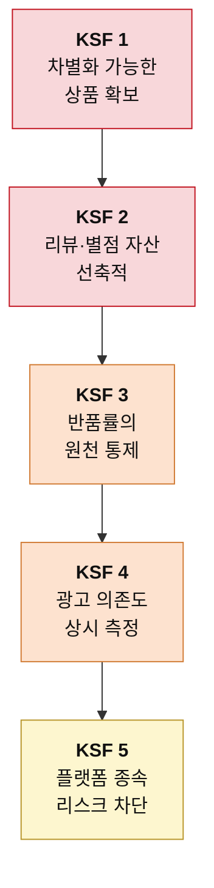

# 신규 진입자를 위한 Top 5 핵심 성공 요인 — 온라인 커머스

> 도출 방법론: [KSF-도출-방법론.md](./KSF-도출-방법론.md)
> 선행 분석: [5힘 분석](../포터/분석02-온라인커머스.md) · [가치사슬 분석](../가치사슬/분석04-온라인커머스-가치사슬.md)
> 대상 독자: 온라인 커머스 진입을 준비하는 창업가 또는 전략 기획팀
> 작성일: 2026-08-06

## 판단의 전제

이 시장의 특수성은 진입이 쉽다는 데 있다. 5힘 분석은 신규 진입자의 위협을 ★★★★★ 매우 강함으로 판정하며 "사업자등록과 오픈마켓 입점이면 오늘 시작할 수 있고, 위탁 판매를 쓰면 재고 없이도 가능하다"고 적었다.

**진입이 쉽다는 사실은 신규 진입자에게 좋은 소식이 아니다.** 나에게 열린 문은 남에게도 열려 있기 때문이다. 그래서 이 시장의 KSF는 "어떻게 들어갈 것인가"가 아니라 "들어간 다음 어떻게 남을 것인가"에 관한 것이다. 아래 다섯 가지는 우선순위 순이며, 앞의 둘은 진입 설계 단계에서, 뒤의 셋은 운영 단계에서 결정된다.

각 요인마다 실증 사례를 붙였다. **성공 사례와 함께 같은 요인을 놓쳐 무너진 반례를 나란히 두었다.** 성공한 회사만 모으면 그 요인이 정말 결정적이었는지 알 수 없기 때문이다.

> 사례의 수치와 시점은 공개 보도를 기준으로 정리했다. 인용 전 원출처 확인을 권한다.

---

## 1. 차별화 가능한 상품의 확보

### KSF 명칭
**사입 재판매에 머무르지 않는 상품 소싱 구조**

### 선정 근거

가치사슬 분석은 투입·조달 물류를 이 사업의 갈림길로 규정하며 이렇게 적었다. "이 칸이 사업 전체의 성격을 결정한다. 사입 재판매를 택하면 같은 물건을 누구나 뗄 수 있으므로 차별화가 원천적으로 봉쇄되고, 가치사슬의 나머지 여덟 칸이 전부 가격 경쟁에 끌려간다."

5힘 분석의 구매자의 힘 항목이 그 귀결을 보여준다. 이 시장의 구매자 힘은 ★★★★★ 매우 강함이고, 이유는 "'낮은 가격순' 정렬 한 번이면 끝난다"는 데 있다. 분석의 결론 문장은 이렇다. **"똑같은 물건이면 최저가 하나만 팔린다."**

이 두 문장을 겹쳐 놓으면 신규 진입자가 저지를 수 있는 가장 흔한 실수가 드러난다. 진입이 쉬운 경로(사입·위탁 판매)를 택하는 순간, 그 사업자는 최저가 정렬이라는 기계 앞에 다른 수십 명과 나란히 서게 된다. 이후에 무엇을 잘하든 그 기계는 가격만 본다.

따라서 첫 번째 KSF는 상품 자체에 차별화 여지를 남겨두는 것이다. 자체 제조(OEM·ODM)가 가장 확실한 답이지만, 초기 자본이 부족하다면 독점 유통권, 조합 상품, 카테고리 재정의 같은 대안도 같은 목적에 부합한다. 판단 기준은 하나다. **내가 파는 것과 똑같은 물건을 다른 판매자가 오늘 시작할 수 있는가.** 답이 "그렇다"이면 이 KSF는 아직 충족되지 않았다.

### 기업 사례

**Anker — 아마존 안에서 자체 브랜드로 올라선 경로**
앤커는 중국 제조 기반으로 출발했지만 남의 물건을 되파는 방식을 택하지 않고 처음부터 자체 브랜드 충전기와 케이블을 만들었다. 아마존이라는 완전 경쟁 시장 안에서도 브랜드명으로 검색되는 상품을 만들어냈고, 결국 카테고리 상위 사업자가 됐다. **같은 플랫폼, 같은 최저가 정렬 아래에서도 상품이 다르면 결과가 달라진다**는 것을 보여준다.

**Gymshark — 자체 제조 D2C의 정석**
짐샤크는 창업 초기부터 직접 디자인하고 제조한 피트니스 의류를 팔았다. 남의 브랜드를 떼다 파는 편집숍 경로를 택하지 않은 것이 결정적이었다. 상품이 유일하니 가격을 스스로 정할 수 있었고, 그 마진이 이후 커뮤니티 마케팅의 재원이 됐다. KSF 1이 충족되면 뒤의 요인들이 실행 가능해진다는 순서를 그대로 보여주는 사례다.

**반례 — 최저가 경쟁에 편입된 일반 사입 셀러**
개별 회사를 특정하기보다 구조로 말하는 편이 정확하다. 오픈마켓에서 같은 도매처의 같은 상품을 파는 판매자들은 상품명·이미지·옵션까지 거의 동일하다. 이 경우 남는 변수는 가격과 광고비뿐이고, 둘 다 마진을 깎는 방향으로만 작동한다. 5힘 분석이 "소싱처가 사실상 공개돼 있어 따라 하는 데 며칠이면 된다"고 적은 상태가 바로 이것이다. **이 구조에 들어간 판매자는 잘해서 이기는 게 아니라 더 오래 버텨서 남는다.**

---

## 2. 리뷰·별점 자산의 선축적

### KSF 명칭
**광고비를 대신할 수 있는 신뢰 자산의 초기 확보**

### 선정 근거

가치사슬 분석은 서비스 칸을 이 사업에서 가장 저평가된 영역으로 지목했다. "원가 비중은 중간인데 차별화 기여는 이 사업에서 가장 높다. 리뷰와 별점이 검색 노출과 구매 결정을 동시에 좌우하기 때문이다." 결론 문장은 더 직접적이다. "문의 한 건을 잘 처리하면 별점이 남고, 그 별점이 광고비를 대신한다."

이 요인이 신규 진입자에게 특별히 중요한 이유는 5힘 분석의 공급자의 힘 항목에 있다. 플랫폼은 "상단에 뜨려면 광고를 사야 하고 다들 사니까 입찰가가 오르고 오른 만큼 마진이 빠지는, 잘될수록 더 내는 구조"를 운영한다. 자본이 두꺼운 기존 사업자와 같은 경매장에서 겨루면 신규 진입자는 이길 수 없다.

**리뷰와 별점은 이 경매장을 우회하는 유일한 통화다.** 돈으로 살 수 없고 시간으로만 쌓이기 때문에, 자본이 적은 쪽이 자본이 많은 쪽과 대등하게 겨룰 수 있는 거의 유일한 영역이기도 하다. 가치사슬 분석이 개선 우선순위의 첫 단계로 "서비스 강화 — 별점·리뷰 축적, 비용 대비 효과 최대, 지금 당장 가능"을 배치한 것도 같은 판단이다.

실행 관점에서 이 KSF는 CS 조직을 크게 두라는 뜻이 아니다. 초기 주문 한 건 한 건을 리뷰가 남을 확률이 가장 높은 방식으로 처리하라는 뜻이다. 이 시기에 쌓인 별점이 이후 수년간의 광고비를 결정한다.

### 기업 사례

**오늘의집 — 후기가 곧 상품 노출이 되는 구조**
오늘의집은 커머스를 먼저 만들지 않고 사용자가 올리는 인테리어 사진과 후기를 먼저 쌓았다. 그 콘텐츠가 검색 유입과 구매 결정을 동시에 만들어냈고, 상품 판매는 그 위에 얹혔다. **사용자 후기가 광고를 대체한 가장 선명한 국내 사례**이며, 가치사슬 분석이 서비스 칸을 "마케팅 활동"으로 봐야 한다고 한 판단과 정확히 일치한다.

**Glossier — 커뮤니티 후기로 성장한 뷰티 브랜드**
글로시에는 창업자가 운영하던 뷰티 블로그의 독자 반응에서 출발해, 사용자 후기와 커뮤니티 의견을 제품 기획에 직접 반영했다. 초기 성장의 상당 부분이 유료 광고가 아니라 사용자 추천에서 나왔다. 리뷰를 관리 대상이 아니라 자산으로 다룬 사례다.

**무신사 — 후기 적립금이라는 설계**
무신사는 구매 후기 작성에 적립금을 지급하는 구조를 오래 운영해 왔다. 후기가 쌓이면 상품 노출과 전환율이 함께 올라가므로, 적립금은 비용이 아니라 광고비를 앞당겨 지출하는 투자에 가깝다. **리뷰를 우연에 맡기지 않고 제도로 확보한 사례**로 읽을 수 있다.

**반례 — 초기 리뷰 없이 광고로만 밀어붙인 신규 셀러**
리뷰가 없는 상품은 광고를 태워 노출시켜도 전환되지 않는다. 소비자가 별점 없는 판매자를 건너뛰기 때문이다. 이 상태에서 광고비를 늘리면 노출만 사고 매출은 사지 못하는 구조가 된다. 순서를 뒤집었을 때 무슨 일이 벌어지는지 보여주는 전형이며, KSF 2가 KSF 4보다 앞에 놓인 이유이기도 하다.

---

## 3. 반품률의 원천 통제

### KSF 명칭
**상세페이지 단계에서 기대치를 관리하는 능력**

### 선정 근거

가치사슬 분석은 산출·배송 물류에서 진짜 비용의 소재를 지목했다. "반품이 이 칸의 진짜 비용이다. 쉬워진 반품은 사실상 무료 체험으로 작동하고, 그 비용은 판매자가 진다."

5힘 분석도 같은 구조를 구매자의 힘 근거로 제시했다. "반품·교환이 쉬워지면서 사실상 무료 체험이 된 탓에 반품 물류비와 재판매 불가 재고가 마진을 그대로 갉아먹는다."

주목할 점은 이 문제의 해결 지점이 배송 칸이 아니라는 것이다. 가치사슬 분석은 개선 질문에서 원인을 세 갈래로 나눴다. "반품률을 낮출 수 있는가 — 원인이 상품인가, 상세페이지인가, 배송인가?" 그리고 운영·생산 칸에서는 "상세페이지는 이 칸에서 유일하게 차별화가 발생하는 지점"이라고 평가했다.

**반품의 상당 부분은 물류 사고가 아니라 기대치 불일치다.** 실제와 다르게 보이도록 찍은 사진, 빠진 규격 정보, 과장된 설명이 반품을 만든다. 그러므로 이 KSF의 실행 지점은 상세페이지이며, 전환율을 조금 낮추더라도 정확하게 설명하는 편이 신규 진입자에게 유리하다. 반품 한 건이 마진에서 차지하는 비중이 규모가 작을수록 크기 때문이다. 게다가 반품은 낮은 별점으로 이어져 KSF 2를 직접 훼손한다.

### 기업 사례

**Zappos — 무료 반품을 감당하기 위해 정보를 늘린 사례**
자포스는 무료 반품과 긴 반품 기한으로 유명하지만, 그 정책을 감당하기 위해 상품 정보에 크게 투자했다. 신발 한 켤레를 여러 각도에서 촬영하고 착용 영상을 붙이는 방식이다. **반품 정책을 관대하게 열어두려면 반품 이유 자체를 줄여야 한다**는 판단이며, 관대한 정책과 낮은 반품률이 양립할 수 있음을 보여준다.

**무신사 — 실측 사이즈 정보의 표준화**
의류는 반품률이 가장 높은 카테고리이고, 그 원인의 큰 부분이 사이즈다. 무신사는 상품별 실측 치수를 표준 항목으로 제공해 소비자가 구매 전에 판단할 수 있게 했다. 상세페이지 정보 하나가 반품 물류비를 줄이는 직접적인 수단이 된 사례다.

**반례 — ASOS의 반품 부담과 정책 강화**
온라인 패션 사업자 ASOS는 높은 반품률이 수익성을 압박하자, AR 기반 착용 미리보기 같은 기술을 도입하는 한편 상습적으로 과도한 반품을 하는 고객에 대한 정책을 강화하는 방향으로 대응했다. **반품을 방치하면 나중에는 고객을 걸러내는 조치까지 가게 된다**는 뜻이다. 신규 진입자는 그 단계에 도달하기 전에 상세페이지에서 막아야 한다.

---

## 4. 광고 의존도의 상시 측정

### KSF 명칭
**"광고를 끄면 매출이 얼마나 남는가"를 지표로 관리하는 규율**

### 선정 근거

가치사슬 분석은 마케팅·영업 칸을 이 사업의 최대 누수 지점으로 판정했다. "원가 비중이 가장 크면서 차별화 기여는 가장 낮은 칸이다. 판매 수수료에 광고비가 얹히고, 상단 노출을 두고 모두가 입찰하니 입찰가는 계속 오른다. 잘 팔릴수록 더 내는 구조라서, 매출이 늘어도 마진이 따라오지 않는다."

그리고 이 칸에서 던져야 할 질문을 하나로 압축했다. **"광고를 끄면 매출이 얼마나 남는가? 답이 0에 가깝다면 이 사업은 판매업이 아니라 광고 대행업에 가깝다."**

5힘 분석은 그 배경을 구조로 설명한다. 매장이 없다는 것은 "손님이 오는 길이 플랫폼 하나뿐이라는 뜻"이고, "검색 노출이 끊기면 매출이 그날로 0이 된다." 가치사슬 분석의 표현을 빌리면 판매자는 "자기 가치사슬의 한 칸을 통째로 임대해 쓰는" 상태다.

이 KSF가 요구하는 것은 광고를 줄이라는 지시가 아니다. 가치사슬 분석이 경고했듯 "광고비가 가장 아프다고 해서 광고부터 줄이면 매출이 먼저 사라진다." 요구되는 것은 측정의 규율이다. 광고 없이 발생하는 매출의 비중을 상시로 보고, 그 비중이 늘고 있는지를 사업의 건강 지표로 삼아야 한다. **매출 규모가 아니라 이 비율이 신규 진입자의 생존 여부를 알려주는 숫자다.**

### 기업 사례

**반례 — Casper의 상장과 그 이후**
매트리스 D2C 브랜드 캐스퍼는 공격적인 온라인 광고로 빠르게 매출을 키웠지만, 마케팅 비용이 매출 성장을 계속 따라다녔다. 2020년 상장 이후 수익성 문제로 주가가 크게 하락했고 결국 2022년 사모펀드에 인수되며 비공개 전환했다. **매출이 커져도 광고를 끄면 남는 것이 없는 구조**의 대표적 사례이며, 가치사슬 분석이 던진 질문의 답이 0에 가까웠던 경우로 읽을 수 있다.

**반례 — 블랭크코퍼레이션의 광고 단가 상승**
국내 미디어커머스 대표 주자였던 블랭크코퍼레이션은 소셜미디어 광고로 히트 상품을 연달아 만들어냈다. 그러나 같은 방식을 쓰는 경쟁자가 늘면서 광고 단가가 오르자 수익성이 급격히 나빠졌다. 5힘 분석이 지적한 "잘될수록 더 내는 구조"가 광고 채널에서 그대로 재현된 사례다.

**대조 사례 — Gymshark의 커뮤니티 기반 유입**
짐샤크는 초기부터 피트니스 인플루언서와의 관계, 그리고 사용자 커뮤니티에 마케팅의 무게를 뒀다. 유료 광고 입찰에 전적으로 의존하지 않았기 때문에 경쟁 심화로 광고 단가가 올라도 매출 구조가 흔들리지 않았다. **KSF 1(자체 상품)이 충족돼 있었기에 가능했던 선택**이라는 점도 함께 봐야 한다. 남의 물건을 팔았다면 커뮤니티를 만들 이유 자체가 없었다.

---

## 5. 플랫폼 종속 리스크의 사전 차단

### KSF 명칭
**규칙 변경과 계정 리스크에 대비한 최소 방어 장치**

### 선정 근거

5힘 분석은 플랫폼의 공급자 힘을 설명하며 두 가지 위험을 명시했다. 첫째는 규칙의 일방성이다. "노출 순위 알고리즘도 플랫폼이 정한다. 규칙이 바뀌면 매출이 통째로 흔들리는데 항의할 창구는 없다." 둘째는 전방 통합이다. "플랫폼은 어떤 상품이 얼마나 팔리는지 다 본다. 그 데이터로 자체 브랜드를 만들어 검색 상단에 올린다. 내가 시장을 검증해주고 그 결과를 넘기는 셈이다."

가치사슬 분석은 이 위험이 기업 인프라 칸에서 어떻게 현실화되는지를 지적했다. "진입 장벽이 낮다는 것은 인프라를 갖추지 않고도 시작할 수 있다는 뜻이다. 문제는 그 상태로 규모가 커질 때다. 상표를 뒤늦게 출원하려는데 이미 남이 가져간 경우가 이 산업에서 반복된다." 개선 질문에도 "플랫폼 제재나 계정 정지에 대비한 대응 절차가 있는가"가 들어 있다.

이 요인을 다섯 번째에 둔 이유는 중요도가 낮아서가 아니라, **비용이 거의 들지 않으면서 미루면 회복이 불가능해지는 종류의 위험이기 때문이다.** 상표권 출원, 판매 채널의 최소 이원화, 고객 연락 수단의 자체 확보는 초기에 처리하면 부담이 작다. 반면 KSF 1이 성공해 상품이 팔리기 시작한 뒤에는 이미 늦다. 잘 팔린다는 사실 자체가 플랫폼의 자체 브랜드와 모방 판매자를 불러들이기 때문이다.

### 기업 사례

**쿠팡 PB 검색순위 사건 — 전방 통합 위험의 실증 (2024)**
공정거래위원회는 2024년 쿠팡이 자체 브랜드(PB) 상품을 검색 결과 상위에 노출되도록 한 행위를 문제 삼아 대규모 과징금을 부과했다. 규제 판단의 옳고 그름과 별개로, 이 사건이 보여주는 사실은 명확하다. **판매자가 통제할 수 없는 노출 규칙이 플랫폼의 자체 이익에 따라 조정될 수 있다는 것이다.** 5힘 분석이 지적한 전방 통합 위험이 추상적 우려가 아니라 실제로 벌어지는 일임을 확인해 준다.

**아마존 셀러 데이터 논란 — 같은 구조의 해외 판본**
아마존이 입점 판매자의 판매 데이터를 자체 브랜드 상품 기획에 활용했다는 보도가 나온 뒤 미국과 유럽에서 조사가 이어졌다. 가치사슬 분석의 "내가 시장을 검증해주고 그 결과를 넘기는 셈이다"라는 문장이 그대로 현실화된 사례다. **잘 팔리는 상품을 만든 판매자일수록 이 위험에 더 크게 노출된다**는 점이 이 KSF를 미루면 안 되는 이유다.

**Nike — 종속을 끊기로 한 선택 (2019)**
나이키는 2019년 아마존 직판 중단을 발표하고 자사 앱과 자사몰 중심의 직접 판매로 무게를 옮겼다. 플랫폼 노출에 의존하지 않아도 되는 브랜드 힘이 있었기에 가능한 결정이었다. 다만 이후 유통 전략을 다시 조정했다는 보도도 있어, **탈종속이 한 번의 선언으로 끝나는 일이 아니라 계속 저울질해야 하는 문제**라는 점까지 함께 읽어야 한다.

**반례 — 상표 출원을 미룬 판매자**
개별 사례를 특정하기보다 반복되는 패턴으로 정리하는 편이 정확하다. 상품이 잘 팔리기 시작한 뒤 상표를 출원하려다 이미 타인이 선점한 것을 발견하는 일은 이 업계에서 드물지 않다. 브랜드명을 바꾸면 그동안 쌓은 KSF 2(리뷰·별점)가 함께 사라진다. **초기에 수십만 원으로 막을 수 있었던 위험이 나중에는 사업의 축적분 전체를 날리는 위험이 된다.**

---

## 요약

| 순위 | KSF | 겨냥하는 힘·활동 | 실증 사례 | 반례 |
|---|---|---|---|---|
| 1 | 차별화 가능한 상품 확보 | 구매자 ★★★★★ / 투입 물류 | Anker, Gymshark | 사입 재판매 구조 |
| 2 | 리뷰·별점 자산 선축적 | 공급자 ★★★★★ / 서비스 | 오늘의집, Glossier, 무신사 | 리뷰 없이 광고만 태우기 |
| 3 | 반품률 원천 통제 | 구매자 ★★★★★ / 산출 물류 | Zappos, 무신사 실측 정보 | ASOS 반품 부담 |
| 4 | 광고 의존도 상시 측정 | 공급자 ★★★★★ / 마케팅·영업 | Gymshark | Casper, 블랭크코퍼레이션 |
| 5 | 플랫폼 종속 리스크 차단 | 공급자 ★★★★★ / 기업 인프라 | Nike 직판 전환 | 쿠팡 PB 사건, 상표 선점 피해 |

다섯 가지 모두가 공급자 또는 구매자의 힘을 겨냥한다. 이 시장에서 신규 진입자를 죽이는 것은 경쟁사가 아니라 **위아래에서 동시에 들어오는 압력**이기 때문이다. 5힘 분석이 두 힘을 나란히 ★★★★★로 판정한 것이 그대로 KSF의 구성으로 나타났다.

한 가지 더 짚어둘 것이 있다. 이 다섯 가지는 순차적으로 실행되지만 **효과는 서로를 강화한다.** 차별화된 상품이 좋은 리뷰를 만들고, 리뷰가 광고 의존도를 낮추며, 낮아진 광고비가 자체 제조 투자의 재원이 된다. 반대로 하나라도 무너지면 연쇄적으로 무너진다. 반품이 늘면 별점이 떨어지고, 별점이 떨어지면 광고비가 올라간다. 이 시장에서 KSF를 골라 실행할 때 순서가 특히 중요한 이유가 여기에 있다.

사례들을 겹쳐 보면 규칙이 하나 보인다. **살아남은 회사는 예외 없이 자기 상품을 가졌다.** 앤커도 짐샤크도 남의 물건을 되팔지 않았고, 그 덕에 리뷰가 브랜드에 쌓였고 커뮤니티가 광고를 대신했다. 반대로 캐스퍼와 블랭크코퍼레이션은 상품이 있었음에도 유입을 유료 광고에 의존해 광고 단가 상승과 함께 무너졌다. **KSF 1은 나머지 넷의 전제 조건이고, KSF 4는 그 전제가 제대로 작동하는지 확인하는 계기판이다.**
