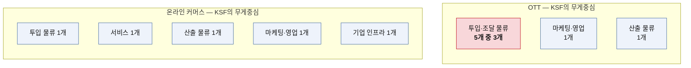
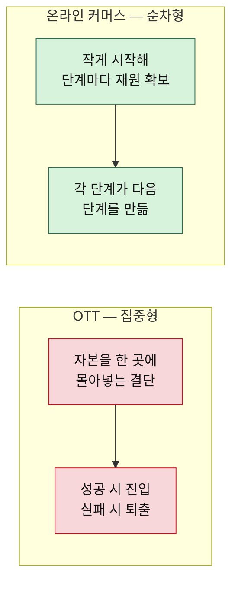
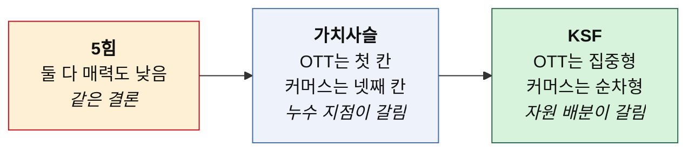

# KSF 비교 분석 — OTT vs 온라인 커머스

> 도출 방법론: [KSF-도출-방법론.md](./KSF-도출-방법론.md)
> 개별 KSF: [KSF01 — OTT](./KSF01-OTT.md) · [KSF02 — 온라인 커머스](./KSF02-온라인커머스.md)
> 선행 비교: [5힘 비교](../포터/비교-OTT-vs-온라인커머스.md) · [가치사슬 비교](../가치사슬/비교-가치사슬-OTT-vs-온라인커머스.md)
> 작성일: 2026-08-06

## 이 비교로 확인하려는 것

두 시장은 5힘에서 같은 판정(매력도 낮음)을 받았고, 가치사슬에서 누수 지점이 갈렸다. KSF 단계에서는 그 차이가 **신규 진입자의 자원 배분 방식**으로 어떻게 번역되는지를 본다.

## KSF 대조표

| 순위 | OTT | 온라인 커머스 |
|---|---|---|
| 1 | 해지를 막는 독점 권리 확보 | 차별화 가능한 상품 확보 |
| 2 | 거인과의 정면 입찰 회피 | 리뷰·별점 자산 선축적 |
| 3 | 해지 시점 제거 편성 | 반품률 원천 통제 |
| 4 | 자체 IP로의 단계적 이동 | 광고 의존도 상시 측정 |
| 5 | 좁은 라이브러리의 회전율 | 플랫폼 종속 리스크 차단 |

첫 번째 차이가 여기서 바로 드러난다. **OTT의 KSF는 한 칸에 몰려 있고, 커머스의 KSF는 다섯 칸에 흩어져 있다.**

---

## 1. 공통점 — 둘 다 "빼앗긴 칸을 되찾는 일"이 1순위다

순위 1번을 나란히 놓으면 같은 구조가 보인다.

| | OTT | 온라인 커머스 |
|---|---|---|
| 1순위 KSF | 해지를 막는 독점 권리 확보 | 차별화 가능한 상품 확보 |
| 겨냥하는 것 | 투입 물류의 통제권 | 투입 물류의 통제권 |
| 근거가 된 판정 | 공급자 ★★★★★ | 구매자 ★★★★★ |

둘 다 가치사슬의 첫 번째 칸을 가리킨다. 5힘 비교 분석이 내렸던 결론 — "산업의 매력도는 시장이 얼마나 크냐가 아니라 만들어진 부가가치를 누가 가져가느냐로 결정된다" — 가 신규 진입자의 언어로 번역되면 이렇게 된다. **무엇을 팔 것인지를 남이 정하고 있다면, 나머지를 아무리 잘해도 이익은 남지 않는다.**

또 하나 겹치는 대목은 두 시장 모두에서 **기술이 KSF에 오르지 못했다**는 점이다. 가치사슬 분석은 OTT에서 기술을 "차별화 원천이 아니라 원가 방어선"으로, 커머스에서 "차별화가 아니라 규모 확장의 전제 조건"으로 판정했다. 소프트웨어를 다루는 사업이라고 해서 기술 투자가 자동으로 우선순위를 갖지는 않는다는 뜻이다. 신규 진입자가 기술로 승부하겠다고 결정하는 순간, 이미 잘못된 칸에 자원을 넣고 있는 것이다.

---

## 2. 결정적 차이 — 자원을 몰 것인가, 순서대로 밟을 것인가

### OTT는 집중, 커머스는 순차

OTT의 KSF 다섯 개 중 셋이 투입·조달 물류에 걸려 있다. 가치사슬 분석의 결론 "첫 번째 칸이 전부다"가 그대로 반영된 결과다. 신규 진입자에게 요구되는 것은 **한 곳에 자원을 몰아넣는 결단**이다. 좁고 깊은 권리 하나를 확보하지 못하면 나머지 네 가지는 실행할 기회조차 오지 않는다.

커머스의 KSF는 다섯 칸에 하나씩 흩어져 있다. 대신 각각이 앞의 것을 전제로 삼는다. 차별화된 상품이 좋은 리뷰를 만들고, 리뷰가 광고 의존도를 낮추고, 낮아진 광고비가 자체 제조의 재원이 된다. 요구되는 것은 결단이 아니라 **순서를 지키는 규율**이다.

### 실패의 비용이 다르다

이 차이는 곧 실패했을 때 무엇이 남는지의 차이다.

| | OTT | 온라인 커머스 |
|---|---|---|
| 최소 진입 자본 | 매우 큼 (권리 확보 선지출) | 매우 작음 |
| 실패 시 회수 | 거의 불가 — 권리료는 매몰비용 | 제한적 손실, 재시도 가능 |
| 재도전 가능성 | 낮음 | 높음 |

가치사슬 분석은 OTT의 투입 물류 지출을 "고정비이면서 매몰비용"으로 규정했다. 중계권료는 시청자가 한 명이든 천만 명이든 똑같이 나간다. 신규 진입자가 이 판단을 틀리면 회수할 것이 남지 않는다.

커머스에서는 5힘 분석의 표현대로 "고정비가 낮아 퇴출도 쉽다." 이것은 경쟁 강도를 극심하게 만드는 원인이지만, 동시에 신규 진입자에게는 **틀려도 다시 해볼 수 있다는 뜻**이기도 하다. 같은 구조적 사실이 기존 사업자에게는 악재이고 신규 진입자에게는 완충재로 작동한다.

### 그래서 KSF의 성격이 다르다

- **OTT의 KSF는 진입 조건이다.** 다섯 가지 중 앞의 둘을 충족하지 못하면 시장에 들어갈 수 없다. 무엇을 잘할 것인가 이전에, 들어갈 수 있는가를 먼저 답해야 한다.
- **커머스의 KSF는 생존 조건이다.** 들어가는 것은 오늘 가능하다. 다섯 가지는 들어간 다음 6개월에서 2년 사이에 결판나는 항목들이다.

---

## 3. 두 시장을 함께 보면 드러나는 것

### 진입 장벽의 높낮이가 신규 진입자에게 유리한 쪽을 정하지 않는다

5힘 비교에서 이미 확인한 명제 — "진입 장벽은 필요조건이지 충분조건이 아니다" — 가 KSF 단계에서 뒤집힌 형태로 다시 나타난다.

OTT는 장벽이 높아 경쟁자가 적지만, 그 장벽이 신규 진입자 자신도 막는다. 게다가 5힘 분석이 지적했듯 "장벽이 오히려 최악의 경쟁자만 걸러 들여보내는 셈"이라 안에서 만나는 상대가 더 무섭다. 커머스는 장벽이 없어 경쟁자가 무수하지만, 그 덕에 실험하고 배우고 다시 시도할 수 있다.

**신규 진입자에게는 "경쟁자가 적은 시장"이 아니라 "틀렸을 때 다시 해볼 수 있는 시장"이 유리하다.** 자원이 한정된 쪽일수록 이 판단 기준이 중요해진다.

### 같은 활동이라도 시장에 따라 KSF가 되기도 하고 안 되기도 한다

서비스 칸이 가장 극명하다. 커머스에서는 2순위 KSF지만 OTT에서는 다섯 안에 들지 못했다.

| | OTT | 온라인 커머스 |
|---|---|---|
| 불만이 생기면 | 문의 없이 그냥 해지 | 별점으로 공개 축적 |
| 가치사슬 판정 | "원가 낮음 / 영향 낮음" | "원가 대비 영향이 큰 유일한 칸" |
| KSF 순위 | 미포함 | **2순위** |

가치사슬 비교에서 짚었던 "서비스 칸의 위상이 정반대"라는 관찰이, KSF 단계에서 자원 배분 결정으로 확정된 것이다. 커머스 신규 진입자가 CS에 자원을 쓰는 것은 비용이 아니라 광고비 대체 투자다. 반대로 OTT 신규 진입자가 같은 판단을 하면 효과 없는 곳에 돈을 넣는 셈이 된다.

**같은 프레임워크로 같은 항목을 봐도 결론이 반대로 나올 수 있다.** 이것이 KSF를 시장별로 따로 도출해야 하는 이유다.

---

## 4. 사례가 말해주는 것

두 시장의 KSF에 붙인 실증 사례를 나란히 놓으면, 개별 분석에서는 보이지 않던 규칙이 드러난다.

| | OTT | 온라인 커머스 |
|---|---|---|
| 살아남은 방식 | 거인이 관심 없는 자리를 골랐다 | 자기 상품을 가졌다 |
| 대표 사례 | Crunchyroll, MUBI, 라프텔 | Anker, Gymshark |
| 무너진 방식 | 자기보다 큰 상대와 같은 자리에서 겨뤘다 | 유입을 유료 광고에 의존했다 |
| 대표 반례 | 왓챠, DAZN, 애플 TV+ | Casper, 블랭크코퍼레이션 |

### 실패의 원인이 다르다

OTT의 반례들은 **자리 선택**에서 무너졌다. 왓챠는 종합 라이브러리 경쟁에, DAZN은 최상위 중계권 입찰에, 애플 TV+는 초기 물량 경쟁에 각각 발을 들였다. 셋 다 상품이나 운영이 나빠서 실패한 것이 아니라, 자기 자본으로는 이길 수 없는 싸움터를 골랐다.

커머스의 반례들은 **유입 구조**에서 무너졌다. 캐스퍼와 블랭크코퍼레이션은 상품도 있었고 초기 성장도 만들었다. 문제는 그 성장을 유료 광고가 떠받치고 있었다는 점이다. 광고 단가가 오르는 순간 매출이 아니라 마진이 먼저 사라졌다.

이 차이는 앞서 정리한 KSF의 성격 차이와 정확히 맞물린다. **진입 조건이 걸린 시장에서는 들어가기 전 판단에서 죽고, 생존 조건이 걸린 시장에서는 들어간 뒤 운영에서 죽는다.**

### 성공 사례의 공통 문법

한편 살아남은 쪽에는 시장을 가로질러 겹치는 대목이 있다. 크런치롤과 앤커, MUBI와 짐샤크는 업종도 규모도 다르지만 **대체 불가능한 무언가를 자기 손에 쥐고 시작했다**는 점이 같다. 크런치롤에게는 애니메이션 팬덤이, 앤커에게는 자체 설계한 상품이, MUBI에게는 큐레이션 관점이, 짐샤크에게는 커뮤니티가 그것이었다.

반대로 무너진 쪽은 남의 것을 빌려 썼다. 왓챠는 라이선스 콘텐츠를, 캐스퍼는 플랫폼 광고 노출을 빌렸다. 계약이 끝나거나 단가가 오르면 사라지는 자산이었다.

> **선행 분석의 결론이 사례로 확인된다. 남의 칸을 빌려 쓰는 사업은 그 칸의 임대료가 오르는 순간 끝난다.**

---

## 5. 세 프레임워크를 이어서 본 결과

세 단계를 거치며 해상도가 계속 올라갔다.

- **5힘**에서 두 시장은 구분되지 않았다. 둘 다 "공급자가 세고 경쟁이 극심한 저수익 산업"이었다.
- **가치사슬**에서 갈라졌다. 압력이 붙은 칸이 달랐고, 그래서 손댈 곳이 달랐다.
- **KSF**에서 실행 지침으로 바뀌었다. 무엇에 먼저 돈과 시간을 쓸지, 무엇을 하지 않을지가 정해졌다.

> **5힘은 "여기서 싸울 것인가", 가치사슬은 "어느 칸부터 손댈 것인가", KSF는 "그중 무엇을 먼저 할 것인가"를 묻는다.**

세 질문을 다 던져야 분석이 전략이 된다. 5힘에서 멈추면 "둘 다 하지 마라"는 답밖에 나오지 않는데, 그것은 시장에 들어가려는 사람에게 아무 도움이 되지 않는다. **매력도가 낮은 산업에도 들어가야 할 이유가 있는 사람은 있고, 그 사람에게 필요한 것은 판정이 아니라 순서다.**
