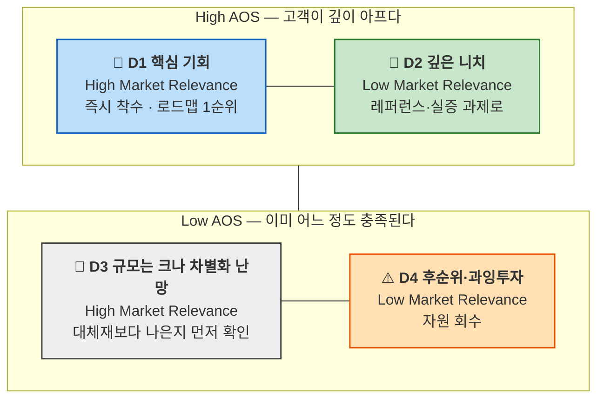

# 06-2 — 시장 가중형 기회점수(DOS) 산출 방법론

> AOS가 **고객 한 명이 얼마나 아픈지**를 쟀다면, DOS는 그 아픔에 **시장 규모와 맥락을 곱해** 팔리는 기회를 가려낸다.
> 선행 방법론: [기회점수(OS · AOS · DOS) 산출 방법론](./기회점수-AOS-방법론.md) · [TAM-SAM-SOM 방법론](../시장규모/TAM-SAM-SOM-방법론.md)
> 선행 산출물: [OS01 — Pain·Goal 리스트](./OS01-CJM-Pain-리스트.md) · [OS02 — AOS 산출과 Matrix](./OS02-AOS-산출.md)
> 작성일: 2026-08-11

## 왜 AOS에서 멈추면 안 되는가

AOS는 고객 한 명의 체감만 담는다. 그래서 **한 사람이 겪는 고통의 깊이**와 **그 고통을 겪는 사람의 수**를 구분하지 못한다. 둘 다 높은 점수를 받을 자격이 있지만, 사업 판단에서는 전혀 다른 결론으로 이어진다.

이 저장소의 OS02가 그 한계를 그대로 보여 줬다. 25개를 채점했더니 AOS 최상위 다섯 개 중 **우리가 지금 착수할 수 있는 항목이 하나뿐**이었고, 스펙트럼별 평균은 극단(3.10) > 비활성(2.84) > 핵심(2.72) 순으로 나왔다. 대체 수단이 아예 없는 사람일수록 만족도가 1로 떨어져 AOS가 밀려 올라간 결과다.

AOS가 틀린 것이 아니다. **AOS는 "아무도 안 하고 있는 곳"을 정확히 짚어 주지만, 그곳이 얼마나 큰 곳인지는 말해 주지 않는다.** DOS는 거기에 시장이라는 두 번째 축을 붙인다.

> **기회 점수 = 고객 미충족 × 시장 파급력**

VC와 PM이 실제로 쓰는 구조와 같다. 투자 판단에서 "이 문제가 심각한가"와 "이 문제를 가진 사람이 몇 명인가"를 따로 묻고 곱하는 방식이다.

## AOS vs. DOS

| 구분 | AOS | DOS |
|---|---|---|
| **계산 기준** | 고객 체감 중심 | 시장 가중 중심 |
| **데이터 출처** | 페르소나, CJM, 인터뷰 | TAM/SAM/SOM, 산업 리서치 |
| **목적** | 혁신 아이디어 탐색 | 시장 확장성 검증 |
| **적용 시점** | 리서치 초기 | 비즈니스 모델 검증 |
| **AI 활용** | 중요도·만족도 평가 | 시장 규모 가중치 계산 |
| **답하는 질문** | 이 사람은 얼마나 아픈가 | 이 아픔은 얼마나 넓게 퍼져 있는가 |

## DOS의 정의

"고객의 미충족 × 시장 가치"가 교차하는 지점이 진짜 기회 영역이다.

```
DOS = (Importance − Satisfaction) × Market Relevance
```

| 항목 | 범위 | 뜻 |
|---|---|---|
| **Importance** | 1~5 | 고객에게 이 Pain/Goal이 얼마나 중요한가 (관여도) |
| **Satisfaction** | 1~5 | 현재 대체 솔루션이 이 Pain을 얼마나 해결하는가 (만족도) |
| **Importance − Satisfaction** | −4 ~ +4 | 미충족 격차. **음수가 나올 수 있다** |
| **Market Relevance** | 0.1~1.0 | 시장 파급력. 이 Pain이 시장에서 갖는 상대적 비중 |
| **DOS** | −4.0 ~ +4.0 | 시장까지 감안한 기회 강도 |

> DOS는 *Discovered Opportunity Score*의 약자다. 원 교안에는 *Discovered Opportunity Simulation*으로 적힌 곳도 있는데, 이 저장소에서는 점수 체계라는 성격에 맞춰 **Score**로 통일한다.

## Market Relevance를 정하는 법

이 값이 DOS의 전부라고 해도 지나치지 않다. Importance와 Satisfaction은 1~5 정수라 폭이 좁지만, Market Relevance는 0.1~1.0 연속값이라 **결론을 뒤집을 만한 힘**을 갖는다. 그래서 근거 없이 찍은 숫자를 넣으면 DOS 전체가 장식이 된다.

### 1단계 — 적정 모수를 고른다

TAM·SAM·SOM 중 **그 Pain이 걸려 있는 층위**를 먼저 정한다. 층위를 섞으면 비중이 서로 비교 불가능해진다.

| 그 Pain이 걸린 자리 | 쓰는 모수 |
|---|---|
| 문제 자체가 전 세계·전 산업에 걸쳐 있다 | TAM |
| 우리가 실제로 서비스할 지역·채널·사용자군에 있다 | **SAM (기본값)** |
| 1년 차에 우리가 만날 수 있는 범위에 있다 | SOM |

실무에서는 **SAM을 기본값으로 쓴다.** TAM 기준으로 계산하면 모든 Pain의 비중이 0.0x대로 눌려 변별력이 사라지고, SOM 기준으로 하면 아직 확정되지 않은 1년 차 계획이 시장 판단을 좌우한다.

### 2단계 — 비중을 환산한다

해당 Pain을 겪는 인구(또는 거래·계약 수)가 그 모수에서 차지하는 비율을 낸다.

```
기초 비중 = 이 Pain을 겪는 인구 ÷ 적정 모수의 전체 인구
```

### 3단계 — 네 가지 요인으로 보정한다

기초 비중은 "몇 명인가"만 담는다. 여기에 시장의 성격을 얹는다.

| 보정 요인 | 올리는 경우 | 내리는 경우 |
|---|---|---|
| **시장 성장률** | 인구·수요가 늘고 있다 (고령화, 규제 강화) | 축소되고 있다 |
| **채택 난이도** | 별도 기기·학습 없이 쓸 수 있다 | 전용 하드웨어나 훈련이 필요하다 |
| **확산성** | 한 사람이 쓰면 주변으로 번진다 | 개인 안에서 끝난다 |
| **정책·규제 압력** | 법정 의무나 조달 요건에 걸린다 | 자율 영역이다 |

### 4단계 — 0.1~1.0 척도에 놓는다

| 값 | 뜻 | 판정 기준 |
|---|---|---|
| **0.9~1.0** | 시장의 중심 문제 | 적정 모수의 다수가 겪고, 성장·규제가 함께 민다 |
| **0.7~0.8** | 주류 세그먼트 | 상당 비중이 겪고 확산 경로가 있다 |
| **0.4~0.6** | 뚜렷한 니치 | 소수지만 경계가 분명하고 접근 가능하다 |
| **0.2~0.3** | 좁은 니치 | 규모가 작거나 채택 장벽이 높다 |
| **0.1** | 경계 사례 | 인구는 확인되지만 도달 경로가 없다 |

### 5단계 — 근거 강도 라벨을 붙인다

[TAM-SAM-SOM 방법론](../시장규모/TAM-SAM-SOM-방법론.md)의 규칙을 그대로 가져온다. **Market Relevance 값마다 아래 라벨 중 하나를 명시한다.**

| 라벨 | 뜻 |
|---|---|
| 직접통계 | 공식 통계에서 그 정의 그대로 관측된 인구로 계산 |
| 기관조사 | 특정 기관 조사의 표본 비율로 계산 |
| 추정 | 외부 자료를 근거로 계산했으나 원출처 확인 필요 |
| 가정 | 우리가 세운 값. 근거는 논리뿐 |

라벨이 붙으면 DOS 표가 **결론이 아니라 검증 계획**으로 바뀐다. 순위 1위 항목의 Market Relevance가 '가정'이라면, 그 순위는 아직 결론이 아니라 다음에 확인할 대상이다.

## 계산식 적용 예시

| Pain | Importance | Satisfaction | Market Relevance* | DOS |
|---|:---:|:---:|:---:|:---:|
| 자동화 한계 | 5 | 2 | 0.8 | (5 − 2) × 0.8 = **2.4** |
| AI 학습 피로 | 3 | 2 | 0.6 | (3 − 2) × 0.6 = **0.6** |
| 신뢰 부족 | 2 | 4 | 0.7 | (2 − 4) × 0.7 = **−1.4** |

<sub>* TAM-SAM-SOM 중 적정 모수에 대한 해당 Pain/Goal의 비중</sub>

## 수식을 쓰기 전에 알아 둘 두 가지

### ① 음수는 오류가 아니라 경고다

만족도가 중요도보다 높으면 DOS가 음수로 떨어진다. 위 예시의 "신뢰 부족"(−1.4)이 그렇다. **중요하지도 않은 문제가 이미 과하게 잘 해결되고 있다**는 뜻이며, 자원이 잘못 배분된 자리를 가리킨다.

여기서 시장 가중이 하는 일이 하나 더 있다. 음수 항목에 큰 Market Relevance가 곱해지면 음수는 더 커진다. **과잉투자의 손실도 시장 규모에 비례한다**는 사실이 숫자로 드러나는 셈이다. AOS는 0 아래로 내려가지 않아 이 신호를 만들지 못한다.

### ② DOS는 AOS × Market Relevance가 아니다

두 수식의 앞부분이 다르다.

```
AOS = Importance × (1 − Satisfaction / 5)     ← 중요도로 가중된 미충족 비율
DOS = (Importance − Satisfaction) × MR        ← 가중 없는 미충족 격차
```

그래서 **AOS 순위와 DOS 순위는 Market Relevance가 모두 같아도 어긋날 수 있다.** 예를 들어 보면 분명해진다.

| Pain | I | S | AOS | I − S | MR 동일(0.8) 가정 시 DOS |
|---|:---:|:---:|:---:|:---:|:---:|
| **가** | 5 | 3 | **2.0** | 2 | 1.6 |
| **나** | 3 | 1 | **2.4** | 2 | 1.6 |

AOS는 '나'를 위로 올리고 DOS는 둘을 같게 본다. AOS가 중요도를 곱해 가중하는 반면, `(I − S)`는 5→3과 3→1의 격차를 똑같이 2로 취급하기 때문이다. **DOS는 중요도의 무게를 덜어 내고 격차만 본다.**

둘 중 무엇이 옳다기보다 **보는 각도가 다르다.** 이 저장소에서는 교안의 표준식을 그대로 쓰되, 두 순위가 크게 어긋나는 항목은 따로 표시해 함께 읽는다. 중요도 가중을 유지한 채 시장을 곱하고 싶다면 아래 변형식을 병기한다.

```
DOS_alt = AOS × Market Relevance     (= Importance × (1 − Satisfaction/5) × MR)
```

## AOS × 시장 파급력 교차 지도

DOS 하나의 숫자로 줄이기 전에, 두 축을 살려서 보면 처방이 갈린다. Y축은 AOS(고객 미충족 강도), X축은 Market Relevance(시장 파급력)다.



| 사분면 | 의미 | 전략 행동 |
|---|---|---|
| **D1** 핵심 기회 | 깊고 넓다 | 로드맵 1순위. MVP와 인터뷰를 여기에 건다 |
| **D2** 깊은 니치 | 깊지만 좁다 | 버리지 않는다. 실증 사례와 정책 레퍼런스로 쓴다 |
| **D3** 규모는 크나 차별화 난망 | 넓지만 이미 대체재가 작동한다 | 진입 전에 "대체재보다 나은가"를 먼저 검증한다 |
| **D4** 후순위 | 얕고 좁다 | 자원을 넣지 않는다 |

**D2를 버리지 않는 것이 이 지도의 핵심이다.** DOS 하나로 줄이면 D2는 낮은 점수로 밀려 목록에서 사라진다. 그러나 접근성처럼 규제·조달·사회적 정당성이 걸린 영역에서는 좁고 깊은 문제가 **파트너 설득의 근거**가 된다. 점수가 아니라 역할로 남겨 둔다.

## DOS 시뮬레이션 프롬프트 템플릿

```markdown
# Context
나는 [산업/분야명] 시장에서 [타깃 페르소나/고객유형]을 대상으로
신규 서비스 기획을 진행 중이다.

# Task
아래 Pain/Goal 목록에 대해
각 항목별로 다음 항목을 평가하고 DOS 점수를 계산하라.

| Pain/Goal | Importance(1~5) | Satisfaction(1~5) | Market Relevance(0.1~1.0) | DOS |

# Rules
1. DOS = (Importance - Satisfaction) × Market Relevance
2. Market Relevance는 TAM-SAM-SOM(페르소나 또는 페인포인트가 포함되는
   구체적 영역), 성장률, 채택난이도, 확산성 등을 고려해 평가하라.
3. 점수가 높을수록 혁신기회가 큼.
4. 결과를 DOS 내림차순으로 정렬하라.
5. 표의 마지막 열에 "기회 해석(Insight)" 항목을 추가해,
   각 Pain이 가지는 의미를 설명하라.

# Output Format
| Pain/Goal | Importance | Satisfaction | Market Relevance | DOS | Insight |
```

### AI 평가 결과 예시 — 인공지능 기반 보고서 자동화 서비스

| Pain/Goal | Imp | Sat | Market Rel | DOS | Insight |
|---|:---:|:---:|:---:|:---:|---|
| 리포트 자동화 한계 | 5 | 2 | 0.9 | **2.7** | SaaS 자동화 시장의 고성장 트렌드와 맞물림 |
| AI 학습 피로감 | 3 | 2 | 0.7 | **0.7** | 유저 피로 문제는 UX 개선 필요하지만 확산 제한적 |
| 신뢰 부족 | 2 | 4 | 0.8 | **−1.6** | 기술 수용성 문제, 단기 개선 효과 낮음 |

### 이 저장소에서 프롬프트를 쓸 때의 보완 규칙

템플릿을 그대로 쓰면 Market Relevance를 AI가 감으로 채운다. 앞서 정한 절차를 지키려면 규칙 두 개를 덧붙인다.

1. **Market Relevance는 AI가 만들지 않는다.** 적정 모수와 인구 근거를 프롬프트에 함께 넣고, AI에게는 4단계 척도표에 놓는 일만 맡긴다.
2. **값마다 근거 강도 라벨을 함께 출력하게 한다.** 출력 형식에 `근거` 열을 추가해 직접통계·기관조사·추정·가정 중 하나를 적게 한다.

이 두 가지를 빼면 DOS 표는 그럴듯한 숫자로 채워지지만 검증할 수 없다.

---

# 이 프로젝트의 모수 판단 — 무엇을 분모로 쓸 것인가

OS01의 Pain 36개(AOS 대상 25개)에 Market Relevance를 매기려면 분모를 먼저 정해야 한다. [시장규모01](../시장규모/시장규모01-스포츠OTT-접근성.md)이 세 층위를 이미 세어 두었으니 그중 하나를 고르면 될 것 같지만, **고를 수 있는 것이 하나도 그대로는 맞지 않는다.** 판단 과정을 남긴다.

## 후보 검토 — 셋 다 그대로는 못 쓴다

| 후보 | 값 | 판정 | 이유 |
|---|---|:---:|---|
| **TAM** (매출) | 연 약 2,400억 원 | ❌ | 매출 기준이라 Pain의 인구 비중을 환산할 수 없다 |
| **TAM** (인구) | 전 세계 난청 15억 + 시각손상 22억 | ❌ | 시장규모01이 "매출로 환산할 수 없다"고 명시했고, 37억을 분모로 쓰면 **모든 Pain이 0.00x대로 눌려 변별력이 사라진다** |
| **SAM** (매출) | 연 약 12억 원 · 950경기 | ❌ | 과금 단위(경기)와 가치 단위(사람)를 섞지 말라는 시장규모01의 경고에 걸린다 |
| **SAM** (인구) | 약 13만 명 | ⚠️ | 방향은 맞지만 **그대로 쓰면 안 된다.** 아래 참조 |
| **SOM** | 약 1,300명 · 90경기 | ❌ | SOM은 "1개 구단 홈경기 파일럿"이라는 **우리 실행 계획의 결과**다. 이걸 분모로 쓰면 시장의 크기를 우리 계획으로 재는 순환 논증이 된다 |

SOM 제외는 특히 중요하다. TAM-SAM-SOM 방법론이 "SOM을 먼저 정해놓고 TAM을 역산하는 문서는 순서를 뒤집은 것"이라고 경고했는데, SOM을 Market Relevance 분모로 쓰는 것이 정확히 그 실수다.

## SAM 13만을 그대로 쓰면 안 되는 이유

SAM 인구는 이렇게 계산됐다.

```
SAM 인구 13만 = 등록 시·청각장애 67만 × OTT 접근 가능 0.65 × 스포츠 시청 의향 0.30
```

문제는 **뒤의 두 계수를 우리 Pain 중 일부가 정면으로 겨냥하고 있다**는 점이다.

| 계수 | 이 계수를 움직이려는 Pain | AOS |
|---|---|:---:|
| **OTT 접근 가능 0.65** | **N2-3** 설치·로그인·결제 세 관문을 못 넘는다 | 4.0 (공동 1위) |
| **스포츠 시청 의향 0.30** | **N1-2** 과거 실망 때문에 확인조차 하지 않는다 | 3.2 (공동 6위) |

CJM01도 같은 말을 했다. N1의 여정을 두고 "상위 문서는 SAM 인구를 셀 때 스포츠 시청 의향 30%를 곱했다. 남은 70%가 이 사람이다"라고 적었다.

즉 **13만을 분모로 쓰면, 13만을 늘리려는 Pain의 시장 가치가 구조적으로 0이 된다.** AOS 1위와 6위가 DOS에서 소멸한다는 뜻이다.

여기서 원칙이 하나 나온다.

> ### 모수에는 우리가 바꿀 수 없는 것만 곱한다
>
> 우리 제품이 움직이려는 변수를 분모에 미리 곱해 두면, 그 변수를 움직이는 Pain은 항상 낮은 점수를 받는다. 그런 변수는 모수에서 빼고 **Market Relevance의 보정 요인(채택 난이도·확산성)으로 옮긴다.**

## 권고 — 기본 모수는 SAM의 모집단 67만 명

| | 내용 |
|---|---|
| **기본 모수** | 국내 등록 시·청각장애 인구 **약 67만 명** (SAM 인구 계산식의 분모) |
| **하위 분할** | 청각 손실 **약 43만** · 시각 손실 **약 25만** |
| **분할 근거** | 시장규모01의 Market Segment Map 1축(손실 감각 채널)과 동일하다. 축이 갈리면 만들 제품이 갈리므로 Pain의 비중도 이 축으로 나눠야 한다 |
| **제외한 계수** | 0.65(OTT 접근 가능)와 0.30(스포츠 시청 의향)은 분모에서 빼고, 항목별 Market Relevance 보정에서 다룬다 |

기초 비중은 이렇게 나온다.

| 계열 | 인구 | 67만 대비 비중 | 해당 세그먼트 |
|---|---|:---:|---|
| 청각 정보 손실 | 약 43만 | **0.64** | Q1 이벤트 자막 (1차 SOM) |
| 시각 정보 손실 | 약 25만 | **0.37** | Q2 경기특화 ADC (2차) |

<sub>시장규모01은 43만 + 25만의 합계를 약 67만으로 적었다. 실제 합은 68만이며 반올림 차이로 보인다. 자릿수와 결론에는 영향이 없다.</sub>

## 그런데 25개 중 11개는 67만 밖에 있다

여기서 이번 판단의 실제 결론이 나온다. **페르소나를 열둘로 넓힌 대가로, Pain의 절반 가까이가 시장규모01이 세지 않은 인구 위에 놓인다.**

| 모수 계열 | 정의 | 항목 수 | 해당 Pain | 근거 강도 |
|---|---|:---:|---|---|
| **M1-청각** | 등록 청각장애 약 43만 | 9 | C1-1 · C2-1 · C2-2 · E2-1 · N1-1 · N1-2 · N2-1 · N2-2 · N2-3 | 추정 (등록 통계) |
| **M1-시각** | 등록 시각장애 약 25만 | 5 | C3-1 · C3-2 · C4-1 · C4-2 · C4-3 | 추정 (등록 통계) |
| **M2-중복** | 시청각 중복장애 | 3 | E1-1 · E1-2 · E1-3 | **데이터 공백** |
| **M3-미등록** | 미등록 노인성 난청 | 2 | C5-1 · C5-2 | **데이터 공백** |
| **M4-비장애 수혜** | 무음 환경 · 언어 장벽 · 동행자 | 6 | A1-1 · A1-2 · A2-1 · A2-2 · A2-3 · A3-1 | **데이터 공백** |

**시장규모01이 실제로 센 인구 위에 놓이는 것은 14개(56%)뿐이다.** 나머지 11개는 세 종류의 공백 위에 있다.

- **M3 미등록 난청** — 시장규모01이 이미 "등록장애인 기준은 SAM을 낮게 잡는다. 경도 난청과 저시력 상당수가 등록되지 않는다"고 적어 둔 자리다. C5-2는 AOS 공동 1위(4.0)인데 분모가 없다.
- **M4 비장애 수혜** — A1(무음 환경)·A2(언어 장벽)·A3(동행자)는 시·청각장애인이 아니어서 67만에 들어가지 않는다. 그런데 CJM01은 A1을 "매출 논거", A3를 "제3자 수혜"로 규정했고, AOS 1위 A3-1(4.0)이 여기 속한다.
- **M2 시청각 중복** — 국내 인구 추정치가 문서 어디에도 없다.

### 세 공백에 대한 처리 방침

DOS 표를 못 만들 이유는 아니다. 다만 **공백 위에 놓인 11개는 Market Relevance에 반드시 '가정' 라벨을 붙이고, 그 값이 순위를 만들었는지 따로 확인한다.**

| 계열 | 1차 산정 방법 | 다음에 확인할 것 |
|---|---|---|
| **M2 중복** | 등록 시청각중복장애 통계로 대체. 없으면 0.1(경계 사례) 고정 | 국내 시청각 중복장애 등록 인구 |
| **M3 미등록** | 국내 65세 이상 난청 유병률 추정으로 파생 모수를 만든다 | 미등록 난청 인구 규모 — **SAM 재산정으로 이어진다** |
| **M4 비장애 수혜** | A1은 스포츠 OTT 이용자 중 무음 시청 비중, A2는 국내 체류 외국인, A3는 시·청각장애 1인당 동행자 계수로 각각 파생 모수를 만든다 | CJM01이 지표 과제로 남긴 "무음 시청 세션 별도 계측"이 그대로 A1의 근거가 된다 |

M3와 M4는 채워지면 **SAM 자체를 다시 세야 하는 항목**이다. 시장규모01이 "SAM을 몇 배로 바꾸는 변수" 절에 적은 세 변수(제도·종목·해외) 외에, **누구를 세는가**라는 네 번째 변수가 여기서 나온다.

## 정리 — 한 문장

**기본 모수는 SAM 인구 13만이 아니라 그 모집단인 등록 시·청각장애 67만(청각 43만 / 시각 25만)이고, 25개 중 11개는 이 모수 밖에 있어 파생 모수와 '가정' 라벨로 처리한다.**

13만이 아닌 이유는 그 안에 이미 우리가 바꾸려는 두 계수가 곱해져 있기 때문이고, 11개를 따로 다루는 이유는 페르소나 스펙트럼이 시장 정의보다 넓게 그려졌기 때문이다. 후자는 결함이 아니라 **시장 정의를 다시 볼 자리를 페르소나가 먼저 찾아냈다**는 뜻으로 읽는다.

## 적용 사례

- (예정) OS03 — 스포츠 OTT 접근성 Pain 25개의 DOS 산출. 위 모수 판단을 그대로 적용한다
