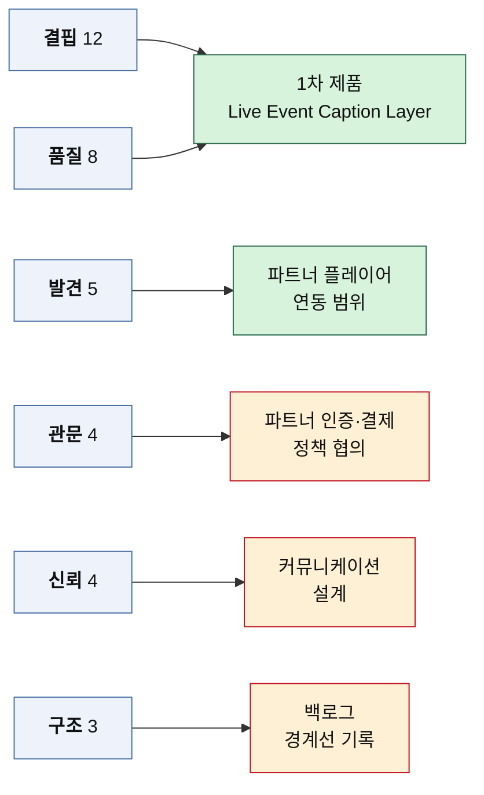

# OS01 — CJM 기반 Pain·Goal 리스트 (페르소나 12인 × 대표 Pain 3)

> 산출 방법론: [기회점수-AOS-방법론.md](./기회점수-AOS-방법론.md) — **① Pain 리스트 정리** 단계의 산출물
> 원자료: [CJM01 — 스포츠 OTT 접근성 (페르소나 12인 고객 여정 지도)](../CJM/CJM01-스포츠OTT-접근성.md)
> 대상 페르소나: [페르소나02 — 스펙트럼 ① 1차 생성](../페르소나/페르소나02-스펙트럼-1차생성.md)의 12명 전원
> 작성일: 2026-08-11

## 이 문서가 하는 일

CJM01에는 열두 사람의 여정에 걸쳐 Pain Point가 59칸 들어 있다. 그대로 놓고 중요도와 만족도를 매기면 표가 먼저 무너진다. 그래서 인물마다 **대표 Pain 세 개**를 뽑아 36개로 줄이고, 각 Pain이 막고 있는 **Goal**을 함께 적어 다음 단계인 Importance·Satisfaction 평가가 바로 얹힐 수 있게 정렬했다.

줄이는 작업에서 무엇을 버렸는지가 뒤 단계의 결론을 좌우한다. 선정 기준과 제외 기준을 아래에 먼저 적어 둔다.

### 대표 Pain 선정 기준

세 가지를 순서대로 적용했다.

1. **감정 곡선의 최저점 단계**에서 나온 Pain을 먼저 넣는다. CJM01이 인물마다 "가장 아픈 지점"으로 지목한 칸이 여기에 해당한다.
2. **그 여정이 정하는 것**(12인 표의 마지막 열)에 직결되는 Pain을 넣는다. C3의 "조작 접근성의 무게", C5의 "자기 배제라는 장벽"처럼 그 인물을 스펙트럼에 넣은 이유가 담긴 칸이다.
3. 남은 자리는 **유형이 겹치지 않는 쪽**으로 채운다. 한 인물에서 같은 성격의 Pain을 셋 고르면 그 사람이 한 문제만 가진 것처럼 보인다.

### 제외한 것 — 계측 실패는 고객의 Pain이 아니다

CJM01의 공통 Pain 다섯 중 하나인 **계측 실패**(C1⑤ · C3⑥ · C4⑤ · A1⑤ · A3⑤ · N2④)는 이 리스트에서 뺐다. "효과가 지표에 남지 않는다", "이 사용자군이 성과 보고에 잡히지 않는다"는 문장의 주어는 고객이 아니라 우리다.

방법론 문서가 평가 대상을 **"기존 솔루션 생태계 아래에서 고객이 겪고 있는 Pain"** 으로 못 박은 이유가 여기 있다. 우리 조직의 문제에 Importance와 Satisfaction을 매기면 고객의 중요도 자리에 사업자의 절박함이 들어앉는다. 계측 실패 여섯 칸은 [부록](#부록--aos-대상에서-제외한-계측-실패-6칸)에 따로 남겨 두었다. 지표 설계 과제로는 그대로 살아 있다.

### Goal을 적는 규칙 — Pain을 뒤집지 않는다

Goal은 CJM01에 명시되어 있지 않다. 두 층위로 나눠 다르게 세웠다.

- **페르소나 Goal**은 CJM01 「12인 한눈에 보기」의 *핵심 기대* 열과 각 인물의 시나리오에서 가져왔다. 추론이라기보다 인용에 가깝다.
- **Pain별 Goal**은 추론이다. 여기서 지킨 규칙 하나 — **Pain 문장을 부정문으로 뒤집어 쓰지 않는다.**

뒤집기가 왜 문제인지는 예를 보면 바로 드러난다. C1-1의 Pain은 "자막이 비언어 이벤트를 전달하지 않는다"이다. 이걸 뒤집으면 "비언어 이벤트를 전달받고 싶다"가 되는데, 이것은 Goal이 아니라 **기능 요구**다. 고객이 원하는 진보는 "지금 무슨 일이 일어났는지 즉시 알고 싶다"이고, 이벤트 자막은 그 진보에 이르는 여러 수단 중 하나일 뿐이다.

Goal 자리에 기능을 적으면 ②단계의 Importance 평가가 **기능 선호도 조사로 변질된다.** 중요도를 묻는 대상이 "그 사람이 이루려는 진보"가 아니라 "우리가 만들려는 기능"이 되기 때문이다. 그러면 AOS는 우리가 이미 만들기로 한 것에 높은 점수를 돌려준다.

### Goal 축 세 가지

36개 Goal을 겹쳐 보면 세 갈래로 모인다. 이 축은 CJM01이 지도 앞머리에 세운 검증 질문과 그대로 대응한다.

| 축 | 뜻 | 대응하는 CJM 검증 질문 |
|---|---|---|
| **상황** | 경기에서 지금 무슨 일이 일어나는지 제때 정확히 안다 | 결정적 순간을 놓치지 않았는가 / 현장감을 느꼈는가 |
| **자립** | 남의 도움이나 낙인 없이 스스로 시작하고 끝낸다 | 혼자서 원하는 설정과 시청을 마칠 수 있는가 |
| **연결** | 함께 보고, 다음 날 대화에 낀다 | 다시 볼 의향과 남에게 권할 의향이 생겼는가 |

### 상태 표기 — 현재 Pain과 미래 Pain을 섞지 않는다

CJM01은 제품이 없는 현재 상태와 제품을 전제한 미래 상태를 한 장에 이어 그렸다. Pain도 두 종류가 섞여 있다.

| 표기 | 뜻 | 다음 단계에서의 취급 |
|---|---|---|
| **현재** | 기존 솔루션 생태계에서 이미 겪고 있는 문제 | **AOS 산출의 1차 대상.** Satisfaction을 대체 솔루션 기준으로 매길 수 있다 |
| **미래** | 우리 제품을 켠 상태에서 예상되는 문제 | AOS 대상이 아니라 **제품 요구사항**. 성능 하한선과 설계 제약으로 관리한다 |

36개 중 **현재 25개 · 미래 11개**다. 미래 Pain에 만족도를 매기면 아직 존재하지 않는 제품의 만족도를 상상해서 적는 셈이 되고, 그 숫자가 AOS 표에 그대로 남는다.

### Pain 유형 여섯 가지

CJM01의 공통 Pain 다섯 유형을 이 리스트에 맞게 다시 갈랐다. 계측을 빼고, 다섯에 담기지 않던 **결핍**과 **관문**을 세웠다.

| 유형 | 정의 | 처방의 성격 |
|---|---|---|
| **결핍** | 필요한 정보가 애초에 전달되지 않는다 | 기능을 만든다 |
| **발견** | 기능은 있는데 닿지 못한다 (이름·배치·경로) | 이름과 자리를 바꾼다 |
| **품질** | 켜져 있는데 지연·혼선으로 무효가 된다 | 성능 하한선을 정한다 |
| **신뢰** | 메시지가 과거 실망이나 자기 배제에 막힌다 | 설명 대신 결과를 보인다 |
| **관문** | 콘텐츠에 닿기 전 조작·절차에서 막힌다 | 앞단을 치운다 |
| **구조** | 감각 채널·지불 능력·기기가 배제한다 | 제품으로 풀리지 않는다 |

---

## 1. 페르소나별 Goal 12

| # | 인물 | 스펙트럼 | 페르소나 Goal | 주된 축 | 대표 Pain 3의 축 구성 |
|---|---|---|---|---|---|
| **C1** | 강민서 · 32 | 핵심 | 결정적 순간을 남보다 먼저, 결과가 새기 전에 이해한다 | 상황 | 상황 2 · 자립 1 |
| **C2** | 윤태경 · 27 | 핵심 | 제1 언어인 수어와 기호로 경기의 핵심만 빠르게 파악한다 | 상황 | 상황 2 · 자립 1 |
| **C3** | 배현우 · 41 | 핵심 | 도움 없이 혼자 조작해 경기까지 도달하고, 화면 정보를 귀로 받는다 | 상황 | 상황 2 · 자립 1 |
| **C4** | 정소윤 · 24 | 핵심 | 확대하고 대비를 높여도 핵심 정보가 그대로 남는 화면으로 본다 | 상황 | 상황 3 |
| **C5** | 임정호 · 67 | 핵심 | 장애인용이라는 딱지 없이 기능을 만나고, 가족과 다투지 않고 본다 | 자립 | 자립 2 · 연결 1 |
| **A1** | 조하늘 · 29 | 확장 | 소리를 켤 수 없는 자리에서도 짧게 들어와 상황을 파악한다 | 상황 | 상황 2 · 자립 1 |
| **A2** | 응웬 티 마이 · 34 | 확장 | 경기 용어까지 이해해 다음 날 동료들의 대화에 낀다 | 상황 | 상황 2 · 연결 1 |
| **A3** | 한지영 · 45 | 확장 | 설명하는 사람이 아니라 함께 보는 사람이 된다 | 연결 | 연결 3 |
| **E1** | 서기범 · 38 | 극단 | 남아 있는 감각인 촉각·점자로 실시간 상황을 전달받는다 | 상황 | 상황 2 · 연결 1 |
| **E2** | 오재민 · 19 | 극단 | 낮은 성능·대역·지불 능력에서도 자막만은 제때 받는다 | 상황 | 상황 2 · 자립 1 |
| **N1** | 문세림 · 35 | 비활성 | 가입 부담 없이, 이번엔 정말 다른지 스스로 확인한다 | 자립 | 자립 2 · 연결 1 |
| **N2** | 배옥순 · 74 | 비활성 | 자녀에게 부탁하지 않고 지금 보던 방식 그대로 더 잘 본다 | 자립 | 자립 2 · 상황 1 |

**주된 축이 스펙트럼을 따라 옮겨 간다.** 핵심 5인 중 넷이 상황 축이고, 비활성 2인은 둘 다 자립 축이다. 우리 제품이 아직 만나지 못한 사람일수록 "경기를 더 잘 보고 싶다"가 아니라 **"내 힘으로 거기까지 갈 수 있는가"** 가 먼저 걸려 있다는 뜻이다.

## 2. 전체 Pain·Goal 리스트 36 (스펙트럼 · 여정 단계 순)

ID 접두어가 스펙트럼이다. **C** 핵심 · **A** 확장 · **E** 극단 · **N** 비활성.

| ID | 인물 | 여정 단계 | Pain Point | 이 Pain이 막고 있는 Goal | 축 | 유형 | 상태 | 감정 |
|---|---|---|---|---|---|---|---|---|
| **C1-1** | 강민서 | ① 반 박자 늦은 시청 | 자막이 해설 음성만 옮기고 휘슬·함성·타구음·화자 구분 같은 비언어 이벤트를 전달하지 않는다 | 지금 관중이 왜 소리치는지를 소리 없이도 그 자리에서 안다 | 상황 | 결핍 | 현재 | 🙁 −1 |
| **C1-2** | 강민서 | ③ 경기 초반 10분 | 설정이 접근성 하위 메뉴 깊숙이 있어 라이브 중에는 켜다가 경기를 놓친다 | 한 번 정한 시청 방식을 매번 다시 찾지 않고 경기에 바로 들어간다 | 자립 | 발견 | 미래 | 🙂 +1 |
| **C1-3** | 강민서 | ④ 결정적 순간 | 자막 지연이 3~5초를 넘기는 순간 커뮤니티 알림이 먼저 도착해 결과를 알아 버린다 | 결정적 장면을 남의 반응이 아니라 중계로 먼저 겪는다 | 상황 | 품질 | 미래 | 😣 **−2** |
| **C2-1** | 윤태경 | ① 자막이 있어도 못 따라감 | 생중계 자막이 전술·기록 용어를 빠른 속도로 쏟아내 제2 언어 사용자에게는 자막량 증가가 이해도 증가로 이어지지 않는다 | 글자 수가 아니라 이해한 양이 늘어난다 | 상황 | 결핍 | 현재 | 🙁 −1 |
| **C2-2** | 윤태경 | ② 수어·아이콘 표시 발견 | 접근성 안내가 '자막'으로만 표기되어 수어 사용자는 자기 얘기로 읽지 않는다 | 여러 접근성 기능 중 나에게 맞는 것을 안내만 보고 골라낸다 | 자립 | 발견 | 현재 | 🙂 +1 |
| **C2-3** | 윤태경 | ④ 경기 중 시선 분할 | 수어를 보는 동안 화면을 놓치고 화면을 보면 해설을 놓쳐, 두 정보가 같은 시간에 다른 위치를 요구한다 | 해설과 경기 장면 중 하나를 포기하지 않는다 | 상황 | 품질 | 미래 | 🙁 −1 |
| **C3-1** | 배현우 | ① 라디오와 문자 중계 | 일반 해설이 화면을 보는 사람을 전제해 공 위치·선수 움직임·전술·스코어 변화를 말로 옮기지 않는다 | 화면을 보지 않고도 공이 어디로 갔고 수비가 어떻게 섰는지 그린다 | 상황 | 결핍 | 현재 | 🙁 −1 |
| **C3-2** | 배현우 | ② 앱 진입 | 스크린리더 라벨이 비어 있거나 의미 없이 붙어 있어 무엇을 누르는지 알 수 없다 | 가족을 부르지 않고 혼자 앱을 열어 경기까지 도달한다 | 자립 | 관문 | 현재 | 😣 **−2** |
| **C3-3** | 배현우 | ④ ADC 청취 | 해설과 ADC가 같은 채널에서 겹쳐 둘 다 못 듣는 구간이 생긴다 | 해설의 맥락과 공간 정보를 둘 다 잃지 않고 듣는다 | 상황 | 품질 | 미래 | 😀 +2 |
| **C4-1** | 정소윤 | ① 확대하면 사라짐 | 스코어·이닝·잔여 시간이 화면 모서리에 작게 붙어 있어 확대할수록 화면 밖으로 밀려난다 | 화면을 캡처해 키우지 않고도 점수와 남은 시간을 확인한다 | 상황 | 결핍 | 현재 | 🙁 −1 |
| **C4-2** | 정소윤 | ② 표시 설정 탐색 | 자막 설정이 크기 한 종류뿐이라 저시력에 결정적인 대비·배경·굵기를 조절할 수 없다 | 내 잔존시력에 맞는 대비로 글자를 읽어 낸다 | 상황 | 결핍 | 현재 | 😐 0 |
| **C4-3** | 정소윤 | ④ 빠른 화면 전환 | 화면 전환 속도가 저시력 사용자의 인지 속도를 앞질러 상황 파악이 경기 속도를 못 따라간다 | 화면이 빠르게 바뀌어도 흐름을 놓치지 않는다 | 상황 | 품질 | 현재 | 🙁 −1 |
| **C5-1** | 임정호 | ① 볼륨과 가족 항의 | 해설이 안 들리는 문제를 노화로 받아들여 해결 대상으로 보지 않는다 | 가족과 볼륨으로 다투지 않고 거실에서 편하게 경기를 본다 | 연결 | 신뢰 | 현재 | 🙁 −1 |
| **C5-2** | 임정호 | ② 비인지 | 기능이 '접근성' 이름 아래 있어 자기 배제가 먼저 일어나고, 미등록 난청 인구 전체가 여기서 걸러진다 | 나를 장애인으로 분류하지 않고도 잘 들리게 보는 방법을 쓴다 | 자립 | 발견 | 현재 | 🙁 −1 |
| **C5-3** | 임정호 | ③ 우연한 노출 | 제안 시점이 없으면 스스로 찾는 경로가 작동하지 않는 유형이라 기능에 영원히 닿지 않는다 | 찾아 나서지 않아도 필요한 기능이 나를 찾아온다 | 자립 | 발견 | 미래 | 😐 0 |
| **A1-1** | 조하늘 | ① 무음 포기와 문자 중계 | 무음 상태에서는 영상만으로 알 수 있는 정보가 거의 없어 앱을 여는 행동 자체가 무의미해진다 | 소리를 켤 수 없는 자리에서도 경기를 계속 따라간다 | 상황 | 결핍 | 현재 | 🙁 −1 |
| **A1-2** | 조하늘 | ② 우연한 발견 | 기능이 접근성 메뉴에만 있어 필요한데도 자신을 대상으로 인식하지 못한다 | 내 상황에 맞는 시청 모드를 내 문제 이름으로 찾아낸다 | 자립 | 발견 | 현재 | 🙂 +1 |
| **A1-3** | 조하늘 | ③ 이동 중 5~10분 | 처음부터 본 사람을 전제한 자막이라 중간에 들어온 사람에게 필요한 '지금 상황' 요약이 없다 | 중간에 들어와도 몇 초 안에 현재 국면을 따라잡는다 | 상황 | 결핍 | 미래 | 😐 0 |
| **A2-1** | 응웬 티 마이 | ① 자국어 커뮤니티 중계 | 해설 속도와 야구 용어가 함께 쏟아져 청취가 되는데도 이해가 되지 않는다 | 중계를 보면서 규칙과 용어를 같이 익힌다 | 상황 | 결핍 | 현재 | 🙁 −1 |
| **A2-2** | 응웬 티 마이 | ③ 용어에서 막힘 | 모르는 용어를 찾는 동안 경기가 진행되어 두 번 놓친다 | 경기를 멈추지 않고 모르는 말의 뜻을 그 자리에서 안다 | 상황 | 품질 | 현재 | 🙁 −1 |
| **A2-3** | 응웬 티 마이 | ④ 대화 참여 | 경기를 봤는데도 얘기할 언어가 없어 시청이 사회적 참여로 이어지지 않는다 | 다음 날 동료들의 경기 이야기에 내 문장으로 낀다 | 연결 | 결핍 | 현재 | 😀 +2 |
| **A3-1** | 한지영 | ① 계속 구술 설명 | 접근성 기능의 부재가 동행자의 노동으로 대체되어 두 사람이 한 경기를 보는데 즐기는 사람은 없다 | 설명하는 사람이 아니라 나도 관객으로 경기를 본다 | 연결 | 결핍 | 현재 | 🙁 −1 |
| **A3-2** | 한지영 | ③ 함께 시청 | 한 기기에서 ADC와 일반 음성을 동시에 낼 수 없어 한 사람이 참아야 한다 | 한 소파에 앉아 각자 필요한 소리를 듣는다 | 연결 | 품질 | 미래 | 😐 0 |
| **A3-3** | 한지영 | ④ 역할 이관 | ADC가 설명하지 못하는 구간에서 다시 동행자를 찾게 되어 역할이 완전히 넘어가지 않는다 | 언제 불릴지 신경 쓰지 않고 경기에 몰입한다 | 연결 | 품질 | 미래 | 🙂 +1 |
| **E1-1** | 서기범 | ① 점자와 촉수어 | 자막은 보이지 않고 음성 해설은 들리지 않아 두 감각 채널이 모두 막혀 있다 | 남아 있는 감각인 촉각과 점자로 경기 상황을 받는다 | 상황 | 구조 | 현재 | 🙁 −1 |
| **E1-2** | 서기범 | ② 접근성 발표 접함 | 접근성 개선이 발표될 때마다 대상에서 빠져 있음을 재확인해, 개선 소식이 반복적인 배제 경험으로 작동한다 | 개선 로드맵 안에 내 채널이 언제 들어오는지 확인한다 | 연결 | 신뢰 | 현재 | 😣 **−2** |
| **E1-3** | 서기범 | ④ 보류 | 1차 제품 범위에 촉각 출력이 없어 개선 기회를 적어도 실행 시점이 없다 | 실시간 경기를 나중에 되짚는 것이 아니라 그 시간에 함께 겪는다 | 상황 | 구조 | 현재 | 🙁 −1 |
| **E2-1** | 오재민 | ① 영상 대신 텍스트 | 접근성 기능이 없는 상태에서 영상은 데이터만 쓰고 얻는 정보는 없어 시청 자체가 후보에서 빠져 있다 | 남은 데이터를 계산하지 않고도 경기를 본다 | 상황 | 결핍 | 현재 | 🙁 −1 |
| **E2-2** | 오재민 | ③ 저녁 혼잡 시간대 | 저대역·저사양 환경에서 자막 지연이 목표치를 크게 넘거나 렌더링이 실패해, 켜져 있는데도 정보가 도착하지 않는다 | 회선이 느린 저녁에도 자막만은 제때 받는다 | 상황 | 품질 | 미래 | 😣 **−2** |
| **E2-3** | 오재민 | ⑥ 전환하지 못한 채 남음 | 접근성 기능이 유료 구간에만 있으면 지불 능력과 접근 권리가 묶여 구조적으로 배제된다 | 돈을 내지 못해도 볼 수 있는 최소한의 조건을 유지한다 | 자립 | 구조 | 미래 | 😐 0 |
| **N1-1** | 문세림 | ① 무관심 상태 | 과거의 실패가 취향으로 굳어, 접근성이 원인이었다는 사실 자체가 기억에서 지워졌다 | *(잠재)* 포기했던 즐거움을 다시 가질 수 있는지 확인한다 | 연결 | 신뢰 | 현재 | 😐 0 |
| **N1-2** | 문세림 | ② 우연한 노출 | '접근성 지원'이라는 표현이 과거 실망과 곧바로 이어져 메시지가 도달해도 신뢰가 붙지 않는다 | 이번엔 정말 다른지 남의 말이 아니라 내 판단으로 가린다 | 자립 | 신뢰 | 현재 | 🙁 −1 |
| **N1-3** | 문세림 | ③ 반신반의 확인 | 가입·결제·설치가 앞에 있으면 확인해 보려는 동기가 절차를 넘지 못해 이 단계에서 전원 이탈한다 | 아무것도 걸지 않고 먼저 확인해 본다 | 자립 | 관문 | 미래 | 😐 0 |
| **N2-1** | 배옥순 | ① 지상파 자막 방송 | TV 자막은 이벤트 정보를 담지 않지만 비교 대상이 없어 불편이 인식되지 않는다 | *(잠재)* 지금 보던 TV 그대로 경기 상황을 더 알아본다 | 상황 | 결핍 | 현재 | 😐 0 |
| **N2-2** | 배옥순 | ② 자녀의 권유 | 권유가 도달해도 실행 주체가 본인이라 정보 전달과 실행 사이의 간격이 메워지지 않는다 | 자녀에게 미안해하지 않고 더 나은 방법으로 옮겨 간다 | 자립 | 관문 | 현재 | 😐 0 |
| **N2-3** | 배옥순 | ③ 절차의 벽 | 설치·로그인·결제라는 세 관문이 접근성 기능보다 앞에 있어 기능에 닿기 전에 여정이 끝난다 | 비밀번호와 카드 번호를 넣지 않고 경기 화면까지 간다 | 자립 | 관문 | 현재 | 😣 **−2** |

> **감정 열을 순위로 읽지 않는다.** 감정은 그 단계에서 관찰된 값이지 Pain의 크기가 아니다. C3-3(😀 +2)과 A2-3(😀 +2)은 감정이 가장 높은 칸에서 나왔지만 Pain은 그대로 남아 있다. 개선된 뒤의 단계라 표정이 좋을 뿐이다. 크기 판정은 다음 단계의 Importance·Satisfaction이 한다.

## 3. Goal 열이 드러내는 것 — 해설

Goal 두 열을 채우고 나서야 보이는 것이 네 가지 있다. 셋은 다음 단계에 곧바로 영향을 주고, 하나는 AOS 정렬을 실행 순서로 그대로 쓰면 안 되는 이유다.

### 3-1. Goal 축과 Pain 유형이 거의 일대일로 붙는다

| 유형 \ 축 | 상황 | 자립 | 연결 | 계 |
|---|---|---|---|---|
| **결핍** | 10 | 0 | 2 | 12 |
| **품질** | 6 | 0 | 2 | 8 |
| **발견** | 0 | 5 | 0 | 5 |
| **관문** | 0 | 4 | 0 | 4 |
| **신뢰** | 0 | 1 | 3 | 4 |
| **구조** | 2 | 1 | 0 | 3 |
| **합계** | **18** | **11** | **7** | **36** |

표가 세 덩어리로 갈린다.

**첫째, 발견·관문 유형 아홉 개가 예외 없이 자립 축이다.** 기능을 못 찾거나 절차에 막히는 문제는 한 건도 "경기를 더 잘 보고 싶다"에서 나오지 않았다. 전부 "내 힘으로 거기까지 갈 수 있는가"의 문제다. 그래서 이 아홉 개는 자막을 정교하게 만들거나 지연을 줄여도 한 칸도 풀리지 않는다.

**둘째, 결핍·품질 스무 개 중 열여섯이 상황 축이다.** 우리가 1차 제품으로 만들려는 것이 정확히 여기에 걸려 있다. 제품 로드맵과 Goal 축이 맞물려 있다는 뜻이라 안심되는 신호이면서, 동시에 **1차 제품이 자립 축 11개와 연결 축 7개에는 거의 손을 대지 않는다**는 경고이기도 하다.

**셋째, 연결 축 일곱 개만 유형이 흩어진다.** 신뢰 3 · 결핍 2 · 품질 2로 갈린다. 함께 보고 대화에 끼는 문제는 한 가지 처방으로 묶이지 않는다는 뜻이다. A3(동행자)는 오디오 분리라는 기술 문제이고, N1(학습된 회피)은 메시지 문제이며, A2(대화 참여)는 경기 후 요약이라는 콘텐츠 문제다. 같은 축이라고 한 묶음으로 처리하면 셋 다 놓친다.

### 3-2. Goal을 본인이 말하지 못하는 사람이 둘 있다

N1-1과 N2-1의 Goal에는 *(잠재)* 표시를 붙였다. 이 둘은 본인에게 물으면 Goal이 나오지 않는다.

- **N1 문세림**은 "스포츠는 원래 내 취미가 아니다"라고 말한다. 접근성이 원인이었다는 사실이 기억에서 지워져 있어서, 본인의 언어에는 이루려는 진보가 없다.
- **N2 배옥순**은 "지금 이대로도 그냥 본다"고 말한다. 비교 대상이 없어 불편이 인식되지 않는다.

여기서 ②단계 Importance 평가에 함정이 하나 생긴다. **중요도를 자기보고로 매기면 이 둘은 1~2점이 나오고, AOS 하위로 밀려 로드맵에서 사라진다.** 그런데 CJM01은 N1의 여정이 "SAM 인구를 셀 때 곱한 시청 의향 30%의 남은 70%"를 대표한다고 적었다. 시장 크기를 정하는 사람이 중요도 최하위로 계산되는 셈이다.

그래서 ②단계에는 규칙이 하나 필요하다. **잠재 Goal 항목의 Importance는 자기보고가 아니라 행동 관찰과 대체 행동의 비용으로 매긴다.** 문세림이 스포츠를 안 본다는 사실이 아니라, 그가 결과를 뉴스 제목으로만 확인하며 수년을 보냈다는 사실이 중요도의 근거다. 이 규칙을 세우지 않으면 AOS는 **이미 우리를 원한다고 말하는 사람에게만 높은 점수를 준다.**

### 3-3. 페르소나 Goal과 Pain Goal의 거리가 항목마다 다르다

같은 사람의 대표 Pain 셋이라도 상위 Goal에 닿는 거리가 다르다.

| 거리 | 뜻 | 해당 항목 | 다음 단계에서의 취급 |
|---|---|---|---|
| **직결** | 이 Pain이 풀리면 페르소나 Goal이 그만큼 달성된다 | C1-1 · C3-1 · C4-1 · A2-1 · E1-1 등 결핍·품질 20개 | Importance를 페르소나 Goal 기준으로 그대로 매긴다 |
| **선행** | 이 Pain이 풀려야 다른 Pain을 풀 기회가 생긴다 | C3-2 · N1-3 · N2-2 · N2-3 (관문 4개) | AOS와 별개로 **순서 제약**을 표시한다 |

**관문 네 개가 문제다.** C3-2(스크린리더 라벨)는 그 자체로 배현우의 Goal인 "화면 정보를 귀로 받는다"에 직접 기여하지 않는다. 라벨을 고쳐도 경기 이해도는 1도 올라가지 않는다. 그런데 이걸 먼저 고치지 않으면 ADC를 아무리 잘 만들어도 배현우는 그 화면까지 도달하지 못한다. CJM01이 "순서를 바꿔 투자하면 만든 기능이 닿지 않는다"고 적은 대목이다.

Importance를 Goal 기여도로 매기는 한, **관문 유형은 구조적으로 낮은 점수를 받는다.** 그러므로 ⑤단계 Matrix에서 관문 4개는 사분면 위치와 무관하게 선행 제약으로 따로 표시해야 한다. 이것이 이 리스트에서 얻은 가장 실무적인 단서다.

### 3-4. 12명의 Goal이 서로 충돌하지는 않는다

CJM01은 개선안이 충돌하는 두 쌍(C1↔C2, C3↔C4)을 지적했다. Goal 층위에서 다시 보면 **충돌하는 것은 Goal이 아니라 수단이다.**

- C1의 Goal은 "결정적 순간을 먼저 이해한다", C2의 Goal은 "핵심만 빠르게 파악한다"이다. 둘 다 상황 축이고 서로 어긋나지 않는다. 부딪히는 것은 자막량을 늘리는 수단뿐이다.
- C3와 C4도 Goal은 나란히 상황 축이다. 음성이냐 표시냐는 수단의 차이다.

Goal 층위로 올라가면 열두 사람이 **세 축 안에서 정렬된다.** 페르소나03이 네 명으로 줄였을 때 "네 사람의 요구가 하나의 1차 제품으로 모였다"고 적은 결과가, 열두 명으로 늘려도 축 단위에서는 유지된다는 뜻이다. 수단을 선택지로 두고 Goal을 지표로 삼으면 열둘을 한 제품으로 감당할 수 있다.

## 4. 유형별 분포

```
결핍  ████████████  12   기능을 만들어야 풀린다
품질  ████████       8   성능 하한선을 정해야 풀린다
발견  █████          5   이름과 자리를 바꾸면 풀린다
관문  ████           4   앞단을 치워야 풀린다
신뢰  ████           4   설명이 아니라 결과를 보여야 풀린다
구조  ███            3   제품으로는 풀리지 않는다
      └────┴────┴────┴
      0    5    10   15
```

**결핍 12개가 최다이지만 절반이 조금 넘는 수준이다.** 나머지 24개는 기능을 만들어서 풀리는 문제가 아니다. CJM01이 "다섯 중 넷이 기능을 더 만드는 문제가 아니다"라고 적은 대목이 36개 단위로도 유지된다.

## 5. 스펙트럼 × 유형 교차표

| 스펙트럼 | 결핍 | 품질 | 발견 | 관문 | 신뢰 | 구조 | 계 |
|---|---|---|---|---|---|---|---|
| **핵심(Core)** C1~C5 | 5 | 4 | 4 | 1 | 1 | 0 | 15 |
| **확장(Adjacent)** A1~A3 | 5 | 3 | 1 | 0 | 0 | 0 | 9 |
| **극단(Extreme)** E1·E2 | 1 | 1 | 0 | 0 | 1 | 3 | 6 |
| **비활성(Non-user)** N1·N2 | 1 | 0 | 0 | 3 | 2 | 0 | 6 |
| **합계** | **12** | **8** | **5** | **4** | **4** | **3** | **36** |

표가 대각선으로 기운다. **스펙트럼 바깥으로 갈수록 제품으로 풀 수 있는 유형이 줄어든다.**

- 핵심 5인은 결핍·품질·발견에 13개가 몰려 있다. 전부 1차 제품과 파트너 플레이어 연동의 사정권이다.
- 극단 2인은 여섯 중 셋이 구조다. 감각 채널과 지불 능력이 걸린 자리라 잘 만드는 것으로는 닿지 않는다.
- 비활성 2인은 여섯 중 다섯이 관문·신뢰다. 이 두 사람에게 기능을 더 만들어 주는 처방은 한 칸도 나오지 않았다.

페르소나를 열둘로 넓힌 성과가 여기에 있다. 핵심 5인만 놓고 리스트를 만들었다면 구조 0개, 관문 1개가 나왔을 것이고, **접근성 문제 전체가 "기능을 만들면 풀리는 문제"처럼 보였을 것**이다.

## 6. 유형이 실행 주체를 가른다



20개(결핍·품질)가 우리 손 안에 있고, 5개(발견)는 파트너 플레이어에 얹어야 하며, 11개(관문·신뢰·구조)는 제품 백로그가 아니라 협의·메시지·경계선의 영역이다. **AOS 점수가 높게 나와도 실행 주체가 우리가 아닐 수 있다.** 이 갈래는 ④단계 AOS 계산이 끝난 뒤 우선순위를 확정할 때 다시 쓴다.

## 7. AOS 산출 대상 25개 (현재 상태 Pain)

다음 단계인 Importance·Satisfaction 평가는 아래 25개에 매긴다. 미래 상태 11개는 [8절](#8-제품-요구사항으로-넘기는-미래-상태-pain-11개)로 넘긴다.

| 인물 | 대상 ID | 제외된 ID (미래) |
|---|---|---|
| C1 강민서 | C1-1 | C1-2 · C1-3 |
| C2 윤태경 | C2-1 · C2-2 | C2-3 |
| C3 배현우 | C3-1 · C3-2 | C3-3 |
| C4 정소윤 | C4-1 · C4-2 · C4-3 | — |
| C5 임정호 | C5-1 · C5-2 | C5-3 |
| A1 조하늘 | A1-1 · A1-2 | A1-3 |
| A2 응웬 티 마이 | A2-1 · A2-2 · A2-3 | — |
| A3 한지영 | A3-1 | A3-2 · A3-3 |
| E1 서기범 | E1-1 · E1-2 · E1-3 | — |
| E2 오재민 | E2-1 | E2-2 · E2-3 |
| N1 문세림 | N1-1 · N1-2 | N1-3 |
| N2 배옥순 | N2-1 · N2-2 · N2-3 | — |

**C1이 한 칸만 남는다.** 가장 핵심적인 페르소나인데 대표 Pain 셋 중 둘이 미래 상태다. C1의 여정은 제품을 켠 뒤의 시간축을 따라 흐르기 때문이다. 이 사람에 대해 현재 상태 Pain을 하나밖에 세지 못한다는 사실은, 뒤집으면 **C1의 Pain 대부분이 이미 우리 제품의 요구사항으로 번역되어 있다**는 뜻이기도 하다.

반대로 E1·N2는 세 칸이 모두 현재 상태다. 제품에 닿지 못한 채 끝나는 여정이라 미래 단계 자체가 없다.

## 8. 제품 요구사항으로 넘기는 미래 상태 Pain 11개

AOS 대상은 아니지만 버리는 항목이 아니다. 각각 1차 제품이 지켜야 할 하한선이나 설계 제약으로 옮겨 간다.

| ID | Pain 요약 | 지켜야 할 Goal | 넘어가는 형태 |
|---|---|---|---|
| C1-2 | 라이브 중 설정 진입 경로가 길다 | 매번 다시 찾지 않는다 | 첫 실행 1회 질의 + 프로필 저장, 라이브 단축 경로 |
| C1-3 | 자막 지연 3~5초 초과 | 남의 반응보다 먼저 겪는다 | **성능 하한선** — 이벤트 지연 3~5초, 정확도 90% |
| C2-3 | 수어와 화면의 시선 분할 | 둘 중 하나를 포기하지 않는다 | 득점·반칙 화면 위 대형 기호 표시 |
| C3-3 | 해설과 ADC 채널 충돌 | 맥락과 공간 정보를 둘 다 듣는다 | 오디오 분리 채널, 겹칠 때 우선순위 규칙 |
| C5-3 | 제안 시점이 없으면 미도달 | 찾아 나서지 않아도 만난다 | 볼륨 상한 도달 등 행동 신호 기반 제안 트리거 |
| A1-3 | 중간 진입자용 상황 요약 부재 | 몇 초 안에 국면을 따라잡는다 | 진입 즉시 상황 카드(스코어·주자·최근 이벤트) |
| A3-2 | 한 기기에서 두 오디오 출력 불가 | 각자 필요한 소리를 듣는다 | 동반 시청 오디오 분리 출력 |
| A3-3 | ADC 공백 구간에서 역할 재이관 | 언제 불릴지 신경 쓰지 않는다 | 공백 구간 표시 규격 |
| E2-2 | 저대역에서 자막 지연·렌더 실패 | 느린 회선에도 자막은 제때 | **성능 하한선** — 화질을 먼저 낮추고 자막을 유지 |
| E2-3 | 접근성 기능이 유료 구간에만 존재 | 지불 능력과 접근을 분리한다 | **사업 구조 제약** — 접근성은 요금제와 분리, 과금은 파트너 계약 단위 |
| N1-3 | 가입·결제가 체험 앞에 있음 | 아무것도 걸지 않고 확인한다 | 로그인·결제 없는 10분 체험 경로 |

굵게 표시한 셋은 기능 목록이 아니라 **제품이 넘지 말아야 할 선**이다. 나머지와 성격이 달라 로드맵이 아니라 수용 기준(acceptance criteria)에 들어가야 한다.

## 부록 — AOS 대상에서 제외한 계측 실패 6칸

고객이 아니라 우리가 겪는 문제다. 점수를 매기지 않되, 지표 설계 과제로 남긴다.

| 출처 | 내용 | 지표 설계 과제 |
|---|---|---|
| C1 ⑤ | 기능 효과를 사용자가 스스로 확인할 방법이 없다 | 월간 리캡("놓친 이벤트 n건 감소") |
| C3 ⑥ | 자립 시청이 늘어난 것을 서비스가 모른다 | 도움 요청 없는 완주 세션 |
| C4 ⑤ | 피로로 끊는 것과 실망으로 끊는 것이 같은 숫자다 | 재진입 간격, 끊김 유형 구분 |
| A1 ⑤ | 무음 시청자가 접근성 사용자로만 집계된다 | 무음 시청 세션 별도 계측 |
| A3 ⑤ | 동행자의 부담 감소가 어디에도 남지 않는다 | 동반 시청 세션 |
| N2 ④ | 설치 전에 떠나므로 존재 자체가 데이터에 없다 | TV·셋톱 경로 유입 추적 |

CJM01은 이 여섯을 "계측 실패 — 데이터로 남지 않으면 결재도 재구독도 근거가 없다"로 묶고 최우선 개선 기회 3순위에 올려 두었다. 그 판단은 유효하다. 다만 그것은 **기회점수로 정할 우선순위가 아니라 파트너 결재 근거를 만드는 작업**이라 계산 대상에서 분리한다.

## 다음 단계

| 단계 | 할 일 | 산출물 |
|---|---|---|
| ① Pain 리스트 정리 | **완료** — 36개 추출, Goal 2층위 부여, AOS 대상 25개 확정 | 이 문서 |
| ② Importance 평가 | 25개에 **페르소나 Goal 달성 기여도** 기준 1~5 | Importance Table |
| ③ Satisfaction 평가 | 기존 대체 솔루션 기준 만족도 1~5 | Satisfaction Table |
| ④ AOS 계산 | AOS = Importance × (1 − Satisfaction/5) | AOS Table |
| ⑤ Matrix 시각화 | 사분면 배치, 기준점 명시, 관문 4개 선행 제약 표시 | Opportunity Score Matrix |

이 문서에서 나온 세 가지 단서를 다음 단계에 넘긴다.

1. **Importance는 Goal 기여도로 매긴다.** 기능 선호도가 아니다. Goal 열을 만든 이유가 여기 있다.
2. **잠재 Goal 두 개(N1-1 · N2-1)는 자기보고로 매기지 않는다.** 행동 관찰과 대체 행동의 비용으로 매긴다.
3. **관문 4개는 AOS와 별개로 순서 제약을 단다.** 점수가 낮게 나와도 먼저 해야 하는 항목이다.

③단계에서 주의할 점이 하나 더 있다. **대체 솔루션이 인물마다 다르다.** C3는 라디오 중계, N2는 지상파 TV 자막 방송, A1은 포털 문자 중계, E1은 점자정보단말기다. 같은 1~5 척도를 쓰되 무엇을 기준으로 매겼는지 인물별로 적어야 ④단계의 AOS가 비교 가능해진다.
