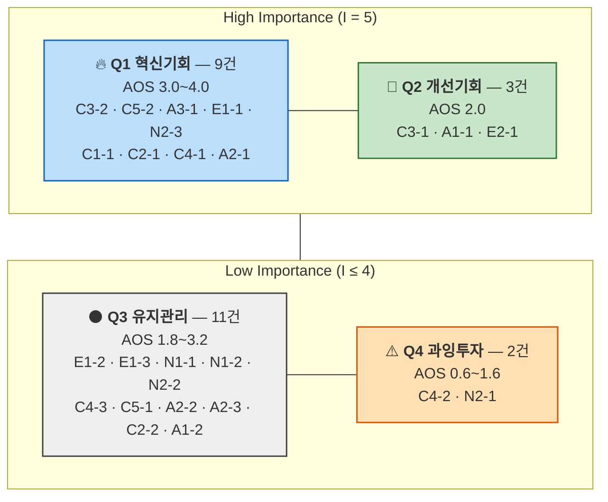

# OS02 — AOS 산출과 Opportunity Matrix (②~⑤단계)

> 산출 방법론: [기회점수-AOS-방법론.md](./기회점수-AOS-방법론.md) — **② Importance · ③ Satisfaction · ④ AOS 계산 · ⑤ Matrix 시각화**
> 입력: [OS01 — CJM 기반 Pain·Goal 리스트](./OS01-CJM-Pain-리스트.md)의 현재 상태 Pain **25개**
> 계산식: `AOS = Importance × (1 − Satisfaction / 5)`
> 사분면 기준점: **각 지표의 중앙값** (Importance 4 · Satisfaction 2)
> 작성일: 2026-08-11

## 0. 채점에 앞서 — OS01에서 넘어온 세 규칙

OS01이 다음 단계에 넘긴 단서 세 개를 그대로 적용했다. 규칙을 먼저 적어 두는 이유는, 이 셋이 실제로 순위를 갈랐기 때문이다.

| 규칙 | 적용 방식 | 실제 결과 |
|---|---|---|
| **Importance는 Goal 기여도로 매긴다** | 기능 선호도가 아니라 "이 Pain이 남으면 페르소나 Goal이 성립하는가"로 판정 | 5점 12개 · 4점 10개 · 3점 3개 |
| **잠재 Goal 2건은 자기보고로 매기지 않는다** | N1-1 · N2-1은 행동 관찰과 대체 행동의 비용으로 채점 | N1-1이 8위(3.2)로 올라오고 N2-1은 25위(0.6)로 내려감 |
| **관문 유형은 순서 제약을 따로 단다** | C3-2 · N2-2 · N2-3에 **선행** 표시 | 셋 중 둘이 AOS 최상위권, 하나는 Q3에 떨어짐 |

### Importance 채점 기준 (1~5)

아래 표에서는 이 값을 **관여도**로 적는다. 수식의 `Importance` 자리에 들어가는 값이며, OS01의 규칙대로 **이 Pain이 페르소나 Goal에 얼마나 관여하는가**로 판정했기 때문이다.

| 점수 | 뜻 |
|---|---|
| **5** | 이 Pain이 남아 있으면 페르소나 Goal이 아예 성립하지 않는다 |
| **4** | Goal 달성의 질을 크게 좌우한다 |
| **3** | Goal에 기여하지만 다른 경로가 남아 있다 |
| 2 | 있으면 좋다 |
| 1 | 부차적이다 |

### Satisfaction 채점 기준 (1~5)

현재 이 사람이 **실제로 쓰고 있는 대체 솔루션**이 그 Pain을 얼마나 해결하는지로 매겼다. 우리 제품을 가정하지 않는다.

| 점수 | 뜻 |
|---|---|
| **5** | 대체 솔루션으로 충분히 해결된다 |
| **4** | 대부분 해결되고 본인도 불편을 느끼지 않는다 |
| **3** | 번거롭지만 우회 수단이 실제로 작동한다 |
| **2** | 부분적으로만 닿고 핵심은 남는다 |
| **1** | 대체 수단이 없거나 있어도 작동하지 않는다 |

**대체 솔루션이 인물마다 다르다.** C3는 라디오 중계, N2는 지상파 TV 자막 방송, A1은 포털 문자 중계와 알림 앱, E1은 점자정보단말기다. 아래 ③단계 표에 인물별로 무엇을 기준으로 매겼는지 함께 적었다.

---

## ② Importance Table

| ID | 인물 | 이 Pain이 막고 있는 Goal | **관여도** | 판정 근거 |
|---|---|---|:---:|---|
| **C1-1** | 강민서 | 지금 관중이 왜 소리치는지 소리 없이도 그 자리에서 안다 | **5** | 비언어 이벤트가 빠지면 "즉시 이해"라는 Goal이 성립하지 않는다 |
| **C2-1** | 윤태경 | 글자 수가 아니라 이해한 양이 늘어난다 | **5** | 자막 형식이 제1 언어와 어긋나면 자막을 아무리 늘려도 Goal에 닿지 않는다 |
| **C2-2** | 윤태경 | 나에게 맞는 기능을 안내만 보고 골라낸다 | **3** | 발견 문제. 커뮤니티가 대신 알려주는 경로가 실제로 작동한다 |
| **C3-1** | 배현우 | 화면을 보지 않고도 공이 어디로 갔는지 그린다 | **5** | 공간 정보가 없으면 이 사람의 Goal 자체가 없다 |
| **C3-2** | 배현우 | 가족을 부르지 않고 혼자 앱을 열어 경기까지 도달한다 | **5** | 조작에서 막히면 콘텐츠가 아무리 좋아도 도달 자체가 불가능하다 · **선행** |
| **C4-1** | 정소윤 | 캡처하지 않고도 점수와 남은 시간을 확인한다 | **5** | 확대할수록 핵심 정보가 사라지면 Goal이 뒤집힌다 |
| **C4-2** | 정소윤 | 내 잔존시력에 맞는 대비로 글자를 읽어 낸다 | **4** | 대비가 결정적이지만 크기 조절과 OS 색반전이라는 우회가 남아 있다 |
| **C4-3** | 정소윤 | 화면이 빠르게 바뀌어도 흐름을 놓치지 않는다 | **4** | Goal의 질을 크게 좌우하고 우회 수단이 거의 없다 |
| **C5-1** | 임정호 | 가족과 볼륨으로 다투지 않고 편하게 본다 | **4** | 문제로 인식하는 것이 Goal 달성의 전제다 |
| **C5-2** | 임정호 | 나를 장애인으로 분류하지 않고도 잘 들리게 본다 | **5** | 이름 때문에 메뉴를 지나치면 기능이 있어도 없는 것과 같다 |
| **A1-1** | 조하늘 | 소리를 켤 수 없는 자리에서도 경기를 계속 따라간다 | **5** | 무음에서 얻는 정보가 0이면 무음 시청이라는 Goal이 성립하지 않는다 |
| **A1-2** | 조하늘 | 내 상황에 맞는 시청 모드를 내 문제 이름으로 찾아낸다 | **3** | 발견 문제이고, 문자 중계라는 대체 경로가 이미 있다 |
| **A2-1** | 응웬 티 마이 | 중계를 보면서 규칙과 용어를 같이 익힌다 | **5** | 용어가 막히면 이해가 성립하지 않는다 |
| **A2-2** | 응웬 티 마이 | 경기를 멈추지 않고 모르는 말의 뜻을 그 자리에서 안다 | **4** | Goal의 질을 좌우하지만 A2-1의 하위 문제다 |
| **A2-3** | 응웬 티 마이 | 다음 날 동료들의 경기 이야기에 내 문장으로 낀다 | **4** | 이 인물의 최종 목적지이나 A2-1·A2-2가 풀리면 상당 부분 따라온다 |
| **A3-1** | 한지영 | 설명하는 사람이 아니라 나도 관객으로 경기를 본다 | **5** | 설명 노동이 남아 있는 한 이 사람의 Goal은 0이다 |
| **E1-1** | 서기범 | 남아 있는 감각인 촉각과 점자로 경기 상황을 받는다 | **5** | 두 감각 채널이 막혀 있으면 어떤 Goal도 성립하지 않는다 |
| **E1-2** | 서기범 | 개선 로드맵 안에 내 채널이 언제 들어오는지 확인한다 | **4** | Goal에 직결되지만 상황 이해 자체를 만들지는 않는다 |
| **E1-3** | 서기범 | 실시간 경기를 그 시간에 함께 겪는다 | **4** | E1-1과 같은 결핍의 다른 단계라 기여가 겹친다 |
| **E2-1** | 오재민 | 남은 데이터를 계산하지 않고도 경기를 본다 | **5** | 영상이 후보에서 빠져 있으면 시청 자체가 시작되지 않는다 |
| **N1-1** | 문세림 | *(잠재)* 포기했던 즐거움을 다시 가질 수 있는지 확인한다 | **4** | **관찰 채점** — 자기보고는 1~2점이지만 수년간 시청 0이라는 손실이 크다 |
| **N1-2** | 문세림 | 이번엔 정말 다른지 내 판단으로 가린다 | **4** | 방어 반응을 넘지 못하면 확인 단계로 가지 못한다 |
| **N2-1** | 배옥순 | *(잠재)* 지금 보던 TV 그대로 경기 상황을 더 알아본다 | **3** | **관찰 채점** — TV 자막 방송으로 시청이 유지되고 있어 손실이 상대적으로 작다 |
| **N2-2** | 배옥순 | 자녀에게 미안해하지 않고 더 나은 방법으로 옮겨 간다 | **4** | 실행 주체 문제가 전환 전체를 막는다 · **선행** |
| **N2-3** | 배옥순 | 비밀번호와 카드 번호를 넣지 않고 경기 화면까지 간다 | **5** | 세 관문을 못 넘으면 기능에 닿기 전에 여정이 끝난다 · **선행** |

**분포 — 5점 12개 · 4점 10개 · 3점 3개. 중앙값 4.** 2점 이하가 한 건도 없다는 사실 자체가 데이터다. OS01에서 인물마다 상위 세 개만 남겼으니 당연한 결과이고, **선별을 거친 리스트는 Importance가 위로 쏠린다**는 뜻이다. 이 쏠림이 ⑤단계 사분면에 그대로 영향을 준다.

---

## ③ Satisfaction Table

| ID | 인물 | 지금 쓰고 있는 대체 솔루션 | **만족도** | 판정 근거 |
|---|---|---|:---:|---|
| **C1-1** | 강민서 | 기존 OTT 자막 + 포털 문자 중계 | **2** | 득점 사실은 알 수 있으나 휘슬·함성·화자 구분은 통째로 빠진다 |
| **C2-1** | 윤태경 | 기존 OTT 자막 + 다음 날 수어 요약 영상 | **2** | 자막은 제공되지만 형식이 안 맞고, 수어 요약은 실시간이 아니다 |
| **C2-2** | 윤태경 | 수어 커뮤니티 · SNS 공유 | **2** | 안내에 구분이 전혀 없고 커뮤니티가 대신 알려주는 수준에 그친다 |
| **C3-1** | 배현우 | **라디오 중계** + 포털 문자 중계 | **3** | 야구 라디오 중계는 공간 언어화를 실제로 해왔다. 다만 편성이 계속 줄고 있다 |
| **C3-2** | 배현우 | 가족의 도움 | **1** | 기존 OTT 앱의 스크린리더 대응이 낮아 우회가 사람뿐이다 · **선행** |
| **C4-1** | 정소윤 | OS 확대 + 화면 캡처 후 확대 | **2** | 우회가 작동은 하지만 매번 경기를 멈춰야 한다 |
| **C4-2** | 정소윤 | OS 색반전 + 자막 크기 조절 | **3** | 대비 문제를 OS 기능으로 상당 부분 우회하고 있다 |
| **C4-3** | 정소윤 | 리플레이 되감기 | **2** | 전환 속도 자체를 늦출 수단이 없다 |
| **C5-1** | 임정호 | TV 볼륨 최대 + 다음 날 하이라이트 | **2** | 소리는 들리지만 가족 마찰이라는 비용이 매번 발생한다 |
| **C5-2** | 임정호 | 없음 (메뉴에 진입하지 않음) | **1** | 자기 배제가 먼저 일어나 기능에 닿는 경로가 아예 없다 |
| **A1-1** | 조하늘 | **포털 문자 중계 + 득점 알림 앱** | **3** | 대체재가 꽤 잘 작동한다. 이 사람은 참지 않고 곧바로 갈아탄다 |
| **A1-2** | 조하늘 | 지인의 언급 · 우연한 노출 | **2** | 찾지 못하지만 아쉬움이 크지 않다. 이미 쓰는 대안이 있다 |
| **A2-1** | 응웬 티 마이 | 자국어 커뮤니티 채팅 + 번역 앱 | **2** | 상황은 따라가지만 규칙과 용어를 배우는 경로는 없다 |
| **A2-2** | 응웬 티 마이 | 검색 | **2** | 찾을 수는 있으나 찾는 동안 경기를 놓쳐 두 번 손해다 |
| **A2-3** | 응웬 티 마이 | 자국어 커뮤니티 대화 | **2** | 같은 언어권에서는 대화가 되지만 직장 동료와는 되지 않는다 |
| **A3-1** | 한지영 | 본인의 구술 설명 + 이어폰 나눠 끼기 | **1** | 해결 수단이 본인의 노동이라 Goal 달성이 0이다 |
| **E1-1** | 서기범 | 점자정보단말기 문자 중계 | **1** | 실시간성이 거의 없고 경기의 재미를 만드는 단서가 담기지 않는다 |
| **E1-2** | 서기범 | 없음 | **1** | 발표가 나올 때마다 배제를 재확인하는 상태다 |
| **E1-3** | 서기범 | 실시간 포기 (사후 확인) | **1** | 국내에 도입된 촉각 출력 경로가 없다 |
| **E2-1** | 오재민 | **포털 문자 중계 + 메신저** | **3** | 텍스트 중계가 실제 대안으로 작동하고 있다. 데이터도 거의 안 든다 |
| **N1-1** | 문세림 | 없음 (뉴스 제목으로 결과만 확인) | **1** | **관찰 채점** — 본인은 불만이 없다고 말하지만 회복은 한 건도 일어나지 않았다 |
| **N1-2** | 문세림 | 커뮤니티 후기 | **1** | 후기가 도달해도 방어 반응을 넘기지 못한다 |
| **N2-1** | 배옥순 | **지상파 TV 자막 방송** | **4** | **관찰 채점** — 자막 방송이 실제 제공되고 본인도 불편을 느끼지 않는다 |
| **N2-2** | 배옥순 | 자녀의 권유 (실행되지 않음) | **1** | 미안해서 부탁하지 않아 전환이 한 번도 일어나지 않는다 · **선행** |
| **N2-3** | 배옥순 | 없음 | **1** | 설치·로그인·결제 세 관문을 한 번도 넘지 못했다 · **선행** |

**분포 — 1점 10개 · 2점 10개 · 3점 4개 · 4점 1개. 중앙값 2.**

여기서 갈리는 지점이 하나 보인다. **대체 솔루션이 실제로 작동하는 사람과 아예 없는 사람이 반씩이다.** 라디오 중계(C3-1), 문자 중계(A1-1 · E2-1), TV 자막 방송(N2-1), OS 색반전(C4-2)을 쓰는 다섯은 3점 이상을 받았고, 대체 수단이 사람이거나 아무것도 없는 열 명은 1점이다. 이 차이가 ④단계 AOS를 사실상 결정한다.

---

## ④ AOS Table (내림차순)

`AOS = Importance × (1 − Satisfaction / 5)` · 이론 최댓값 4.0

| 순위 | ID | 인물 | **관여도** | **만족도** | **AOS** | 유형 | 실행 주체 | 비고 |
|:---:|---|---|:---:|:---:|:---:|---|---|---|
| **1** | **A3-1** | 한지영 | 5 | 1 | **4.0** | 결핍 | 1차 제품 | 동행자의 설명 노동 |
| **1** | **C3-2** | 배현우 | 5 | 1 | **4.0** | 관문 | 파트너 협의 | **선행** · 스크린리더 라벨 |
| **1** | **C5-2** | 임정호 | 5 | 1 | **4.0** | 발견 | 파트너 연동 | 접근성 이름의 자기 배제 |
| **1** | **E1-1** | 서기범 | 5 | 1 | **4.0** | 구조 | 백로그 | 두 감각 채널 모두 막힘 |
| **1** | **N2-3** | 배옥순 | 5 | 1 | **4.0** | 관문 | 파트너 협의 | **선행** · 설치·로그인·결제 |
| **6** | E1-2 | 서기범 | 4 | 1 | **3.2** | 신뢰 | 커뮤니케이션 | 배제의 재확인 |
| **6** | E1-3 | 서기범 | 4 | 1 | **3.2** | 구조 | 백로그 | 실행 시점 부재 |
| **6** | N1-1 | 문세림 | 4 | 1 | **3.2** | 신뢰 | 커뮤니케이션 | *(잠재 Goal · 관찰 채점)* |
| **6** | N1-2 | 문세림 | 4 | 1 | **3.2** | 신뢰 | 커뮤니케이션 | 방어 반응 |
| **6** | N2-2 | 배옥순 | 4 | 1 | **3.2** | 관문 | 파트너 협의 | **선행** · 실행 주체 문제 |
| **11** | A2-1 | 응웬 티 마이 | 5 | 2 | **3.0** | 결핍 | 1차 제품 | 속도와 용어 |
| **11** | C1-1 | 강민서 | 5 | 2 | **3.0** | 결핍 | 1차 제품 | 비언어 이벤트 미전달 |
| **11** | C2-1 | 윤태경 | 5 | 2 | **3.0** | 결핍 | 1차 제품 | 자막량 ≠ 이해도 |
| **11** | C4-1 | 정소윤 | 5 | 2 | **3.0** | 결핍 | 1차 제품 | 확대의 역설 |
| **15** | A2-2 | 응웬 티 마이 | 4 | 2 | **2.4** | 품질 | 1차 제품 | 용어 검색이 곧 이탈 |
| **15** | A2-3 | 응웬 티 마이 | 4 | 2 | **2.4** | 결핍 | 1차 제품 | 대화에 낄 언어 없음 |
| **15** | C4-3 | 정소윤 | 4 | 2 | **2.4** | 품질 | 1차 제품 | 화면 전환 속도 |
| **15** | C5-1 | 임정호 | 4 | 2 | **2.4** | 신뢰 | 커뮤니케이션 | 노화로 수용 |
| **19** | A1-1 | 조하늘 | 5 | 3 | **2.0** | 결핍 | 1차 제품 | 무음이면 볼 이유 없음 |
| **19** | C3-1 | 배현우 | 5 | 3 | **2.0** | 결핍 | 1차 제품 | 공간 정보 미전달 |
| **19** | E2-1 | 오재민 | 5 | 3 | **2.0** | 결핍 | 1차 제품 | 데이터만 쓰고 정보 없음 |
| **22** | A1-2 | 조하늘 | 3 | 2 | **1.8** | 발견 | 파트너 연동 | 접근성 메뉴에만 존재 |
| **22** | C2-2 | 윤태경 | 3 | 2 | **1.8** | 발견 | 파트너 연동 | 안내가 '자막'으로만 표기 |
| **24** | C4-2 | 정소윤 | 4 | 3 | **1.6** | 결핍 | 1차 제품 | 대비·굵기 조절 불가 |
| **25** | N2-1 | 배옥순 | 3 | 4 | **0.6** | 결핍 | 파트너 협의 | *(잠재 Goal · 관찰 채점)* |

**중앙값 3.0 · 평균 2.78 · 최댓값 4.0 · 최솟값 0.6**

---

## ⑤ Opportunity Matrix

### 기준점 — 중앙값과 동점 처리 규칙

방법론 문서가 남겨 둔 질문("사분면을 가르는 수치 기준점은 어디인가")에 이 문서는 **중앙값**으로 답한다.

| 축 | 중앙값 | 상위 판정 |
|---|:---:|---|
| Y축 Importance | **4** | 중앙값 **초과**(=5)를 High Importance |
| X축 Satisfaction | **2** | 중앙값 **초과**(≥3)를 High Satisfaction |

**동점 처리 규칙을 먼저 정해야 한다.** 1~5 이산 척도에서 25개를 채점하면 중앙값과 같은 값에 항목이 몰린다. 실제로 Importance 4에 10개, Satisfaction 2에 10개가 걸렸다. "중앙값 이상을 상위로" 잡으면 High Importance가 22개가 되어 축이 기능을 잃는다. 그래서 **중앙값 초과를 상위, 중앙값 이하를 하위**로 통일했다.

이 규칙 때문에 **경계선에 걸린 항목이 20개 중 10개**다. Importance 4점 열 개(C4-2 · C4-3 · C5-1 · A2-2 · A2-3 · E1-2 · E1-3 · N1-1 · N1-2 · N2-2)는 "이상" 규칙을 썼다면 전부 위쪽 사분면으로 올라간다. 기준점을 한 칸 옮기는 것만으로 열 개가 Q3에서 Q1으로 이동한다는 뜻이라, **사분면 위치를 결론으로 쓰지 않고 AOS 값과 함께 읽어야 한다.**

### 매트릭스 (X: Satisfaction · Y: Importance · 셀 값: AOS)

```
 Importance
     ↑
     │        Q1 · 혁신기회  (9)              ┃        Q2 · 개선기회  (3)
     │
   5 │  C3-2  C5-2  A3-1   │  C1-1  C2-1     ┃   C3-1  A1-1                  ·          ·
     │  E1-1  N2-3         │  C4-1  A2-1     ┃   E2-1
     │  ▸ AOS 4.0          │  ▸ AOS 3.0      ┃   ▸ AOS 2.0
 ════╪═════════════════════╪═════════════════╋═══════════════════════════════════════════ I 중앙값 4
   4 │  E1-2  E1-3  N1-1   │  C4-3  C5-1     ┃   C4-2                        ·          ·
     │  N1-2  N2-2         │  A2-2  A2-3     ┃
     │  ▸ AOS 3.2          │  ▸ AOS 2.4      ┃   ▸ AOS 1.6
     │                     │                 ┃
   3 │         ·           │  C2-2  A1-2     ┃      ·                      N2-1         ·
     │                     │  ▸ AOS 1.8      ┃                             ▸ AOS 0.6
   2 │         ·           │       ·         ┃      ·                        ·          ·
   1 │         ·           │       ·         ┃      ·                        ·          ·
     │        Q3 · 유지관리 (11)              ┃        Q4 · 과잉투자  (2)
     └─────────┴───────────┴─────────────────┸──────────┴────────────────────┴──────────→
              S=1                 S=2        ┃         S=3                  S=4        S=5
                                             ↑ S 중앙값 2                        Satisfaction
```

같은 칸에 있는 항목은 AOS가 같다. 좌상단으로 갈수록 기회가 크고, 우하단으로 갈수록 작다.



### 사분면 해석

| 사분면 | 건수 | 항목 | 읽는 법 |
|---|:---:|---|---|
| **Q1 혁신기회** | 9 | C3-2 · C5-2 · A3-1 · E1-1 · N2-3 · C1-1 · C2-1 · C4-1 · A2-1 | 중요한데 아무도 못 풀고 있다. 인터뷰와 MVP 실험의 1순위 |
| **Q2 개선기회** | 3 | C3-1 · A1-1 · E2-1 | 중요한데 **대체 솔루션이 이미 꽤 잘 하고 있다.** 우리가 들어가려면 라디오 중계·문자 중계보다 나아야 한다 |
| **Q3 유지관리** | 11 | E1-2 · E1-3 · N1-1 · N1-2 · N2-2 · C4-3 · C5-1 · A2-2 · A2-3 · C2-2 · A1-2 | 이름과 달리 **버려도 되는 칸이 아니다.** 아래 경고 참조 |
| **Q4 과잉투자** | 2 | C4-2 · N2-1 | 이미 우회가 작동한다. 자원을 더 넣을 자리가 아니다 |

> ### ⚠️ Q3를 "유지관리"로 읽으면 다섯 개를 잃는다
>
> Q3 열한 개 중 다섯(**E1-2 · E1-3 · N1-1 · N1-2 · N2-2**)의 AOS가 **3.2**다. Q1 안쪽의 C1-1 · C2-1 · C4-1 · A2-1(3.0)보다 높다. Importance 4점이 중앙값 이하로 분류되면서 사분면만 아래로 내려간 것이다.
>
> **사분면과 AOS 순위가 어긋나는 구간이 실재한다.** 중앙값을 기준점으로 쓰기로 한 이상 이 어긋남은 제거되지 않는다. 사분면은 분포 안에서의 상대 위치를, AOS는 절대 강도를 알려주는 서로 다른 렌즈다. 우선순위는 **AOS로 정하고, 사분면은 그 항목이 분포 어디에 있는지 확인하는 용도로만 쓴다.**

---

## 교차 분석 — AOS가 가리키는 곳과 우리가 할 수 있는 곳

### 유형별 평균 AOS

```
관문  ███████████████████  3.73  (n=3)   파트너 인증·결제 협의
구조  ██████████████████   3.60  (n=2)   백로그 · 경계선
신뢰  ███████████████      3.00  (n=4)   커뮤니케이션 설계
발견  ████████████         2.53  (n=3)   파트너 플레이어 연동
결핍  ████████████         2.42  (n=11)  1차 제품
품질  ████████████         2.40  (n=2)   1차 제품
      └─────┴─────┴─────┴─────┴
      0    1.0   2.0   3.0   4.0
```

**우리가 만들려는 것이 최하위로 나왔다.** 1차 제품이 직접 겨냥하는 결핍(2.42)과 품질(2.40)이 여섯 유형 중 꼴찌 둘이고, 우리가 단독으로 풀 수 없는 관문(3.73)과 구조(3.60)가 1·2위다.

원인은 ③단계 표에 그대로 적혀 있다. **결핍·품질 Pain에는 대체 솔루션이 이미 작동하고 있다.** 문자 중계, 라디오 중계, OS 확대, TV 자막 방송이 부분적으로 자리를 메우고 있어 Satisfaction이 2~3에 머문다. 반면 관문·구조 Pain은 대체 수단이 사람이거나 아예 없어서 Satisfaction이 1로 떨어지고, 그만큼 AOS가 밀려 올라간다.

즉 **AOS는 "아무도 안 하고 있는 곳"을 정확히 짚어 주지만, 그곳이 우리가 할 수 있는 곳인지는 말해 주지 않는다.**

### 스펙트럼별 평균 AOS

| 스펙트럼 | n | 평균 AOS | 읽는 법 |
|---|:---:|:---:|---|
| **극단(Extreme)** E1·E2 | 4 | **3.10** | 대체 수단이 아예 없어 가장 높다 |
| **비활성(Non-user)** N1·N2 | 5 | **2.84** | 절차와 신뢰에 막혀 있어 만족도가 1에 몰린다 |
| **핵심(Core)** C1~C5 | 10 | **2.72** | 우회 수단이 있어 만족도가 2~3으로 올라간다 |
| **확장(Adjacent)** A1~A3 | 6 | **2.60** | 문자 중계·알림 앱이라는 대안이 가장 잘 작동한다 |

순서가 뒤집혀 있다. **우리를 아직 만나지 못한 사람일수록 AOS가 높다.** 페르소나03이 핵심 4인으로 좁혀 1차 제품을 정한 판단과 정반대 방향을 가리키는 셈인데, 이것은 그 판단이 틀렸다는 뜻이 아니라 **AOS 한 지표만으로는 실행 순서를 정할 수 없다**는 뜻이다. E1의 AOS가 가장 높은 이유는 아무도 촉각 출력을 제공하지 않기 때문이고, 우리도 제공할 수 없다.

### 실행 주체 필터를 씌운 실제 착수 순서

AOS 순위에 OS01의 실행 주체 갈래를 겹치면 목록이 이렇게 갈린다.

| 순서 | 대상 | 항목 | 근거 |
|:---:|---|---|---|
| **0** | **선행 제약** | **C3-2**(4.0) · **N2-3**(4.0) · **N2-2**(3.2) | 관문 3건. Goal 기여도와 무관하게 앞에 있다. C3-2를 통과하지 못하면 배현우에게는 뒤의 모든 기능이 존재하지 않는다 |
| **1** | **1차 제품** | **A3-1**(4.0) → A2-1 · C1-1 · C2-1 · C4-1(3.0) → A2-2 · A2-3 · C4-3(2.4) | 우리가 단독으로 착수 가능한 최상위는 **A3-1 하나뿐**이다 |
| **2** | **파트너 연동** | **C5-2**(4.0) → C2-2 · A1-2(1.8) | C5-2는 CJM01이 "이것만으로 여정이 뒤집힌다"고 지목한 항목이다 |
| **3** | **커뮤니케이션** | E1-2 · N1-1 · N1-2(3.2) → C5-1(2.4) | 제품이 아니라 메시지로 푸는 넷 |
| **4** | **경쟁 확인 후 판단** | C3-1 · A1-1 · E2-1(2.0) | Q2. 라디오·문자 중계보다 나은지 먼저 확인해야 한다 |
| **—** | **백로그(경계선)** | E1-1(4.0) · E1-3(3.2) | AOS 최상위권이지만 1차 제품 범위 밖이다. 기록만 남긴다 |
| **—** | **손대지 않음** | C4-2(1.6) · N2-1(0.6) | Q4. 우회가 작동하고 있다 |

**AOS 4.0짜리 다섯 개 중 우리가 지금 손댈 수 있는 것은 A3-1 하나다.** 나머지 넷은 파트너 협의 둘, 파트너 연동 하나, 백로그 하나로 나간다. 기회가 큰 자리와 우리 손이 닿는 자리가 어긋난다는 사실이 이 회차의 결론이다.

---

## 이 결과의 한계

| 한계 | 내용 | 해소 방법 |
|---|---|---|
| **Importance 쏠림** | 25개 모두 3점 이상이다. 대표 Pain만 남긴 리스트의 구조적 결과다 | 인물별 상위 3 제한을 풀고 59칸 전부를 채점해 분포를 넓힌다 |
| **채점 주체** | 실제 고객이 아니라 CJM01 서술을 근거로 우리가 매겼다 | 인터뷰·설문으로 Importance를, 사용 로그로 Satisfaction을 대체한다 |
| **동점 다발** | 25개가 8개 값에만 분포해 순위가 5·5·4·4·3·2·1·1로 뭉친다 | 척도를 1~7로 넓히거나 항목 수를 늘린다 |
| **시장 규모 미반영** | 한 사람의 체감만 담겨 있다. E1의 4.0과 C1의 3.0이 같은 무게로 놓인다 | **DOS 단계에서 TAM-SAM-SOM 비중을 곱한다** |

마지막 한계가 다음 단계다. 방법론 문서 4절이 적은 대로 **DOS = (Importance − Satisfaction) × Market Relevance**를 적용하면, E1(전국 추정 수천 명 규모)과 C5(미등록 노인성 난청, 수십만 명 규모)의 순위가 뒤집힐 가능성이 높다. AOS가 "아무도 안 하고 있는 곳"을 짚었다면, DOS는 그중 **팔리는 곳**을 가른다.

## 다음 단계

| 단계 | 할 일 | 산출물 |
|---|---|---|
| ①~⑤ | **완료** — Pain 36 → AOS 대상 25 → 채점 → Matrix | [OS01](./OS01-CJM-Pain-리스트.md) · 이 문서 |
| **DOS 확장** | 25개에 TAM-SAM-SOM 비중을 곱해 시장 가중 순위 산출 | DOS Table · 기회 영역 교차 지도 |
| 검증 | Q1 9건을 대상으로 JTBD 인터뷰. Importance 자기보고와 우리 채점의 차이 확인 | 채점 보정본 |
