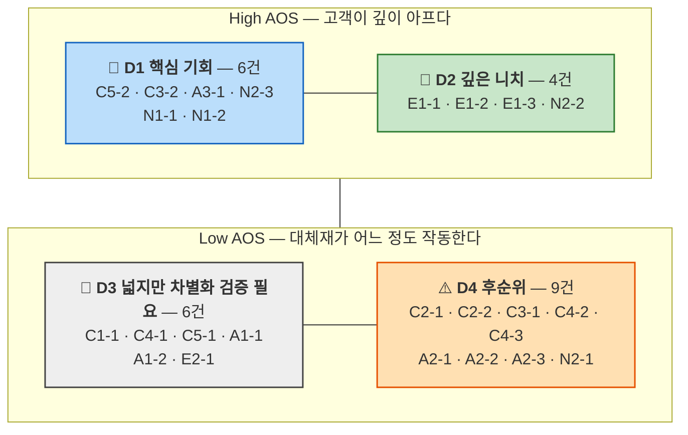

# OS03 — DOS 산출과 시장 가중 우선순위

> 산출 방법론: [DOS 시장 가중형 방법론](./DOS-시장가중형-방법론.md)
> 입력: [OS02 — AOS 산출과 Matrix](./OS02-AOS-산출.md)의 현재 상태 Pain **25개**와 그 Importance·Satisfaction
> 시장 기준: [시장규모01 — 스포츠 OTT 접근성](../시장규모/시장규모01-스포츠OTT-접근성.md)의 **Market Segment Map**
> 계산식: `DOS = (Importance − Satisfaction) × Market Relevance`
> 작성일: 2026-08-11

## 0. Market Relevance를 어디서 가져왔는가

Market Relevance를 감으로 채우지 않기 위해, 시장규모01이 이미 그려 둔 **Market Segment Map**을 분모이자 근거로 삼았다. 그 지도는 시장을 두 축으로 잘랐다 — **손실 감각 채널**(청각/시각) × **시청 맥락**(원격/현장).

| 분면 | 정의 | 인구 | 시장규모01의 판단 | 이 문서의 MR 대역 |
|---|---|---|---|---|
| **Q1** | 원격 × 청각 손실 — Live Event Caption Layer | 약 43만 | **1차 SOM.** 기술 난도 최저 + 인구 최대 + 국내 OTT 영역 공백 | **0.6~0.9** |
| **Q2** | 원격 × 시각 손실 — Enhanced ADC | 약 25만 | 2차 확장. 실시간 전문인력·자동화 난도가 높다 | **0.3~0.5** |
| **Q3** | 현장 × 청각 손실 — 경기장 자막 | — | 후순위. 시설·하드웨어 의존이 커 단독 진입이 어렵다 | **0.2~0.3** |
| **Q4** | 현장 × 시각 손실 — 중계음성·햅틱 | — | 레퍼런스. 국내 유일 실증 영역, 규모는 작지만 설득 명분 | **0.1~0.2** |

**MR 대역을 분면의 판단에서 그대로 가져온 것이 이 산출의 핵심 설계다.** 시장규모01은 이미 "Q1은 인구가 가장 많고 기술 난도가 가장 낮으며 국내 OTT 영역은 비어 있다"고 판정했다. 그 판정이 곧 Market Relevance의 세 보정 요인(모수 크기·채택 난이도·경쟁 공백)이므로, 같은 판단을 두 번 내리지 않고 한 번 내린 것을 이어 쓴다.

분모는 [DOS 방법론의 모수 판단](./DOS-시장가중형-방법론.md#이-프로젝트의-모수-판단--무엇을-분모로-쓸-것인가)에서 정한 대로 **SAM 인구 13만이 아니라 그 모집단인 등록 시·청각장애 67만**이다. 13만에는 우리 Pain이 겨냥하는 두 계수(OTT 접근 0.65 · 시청 의향 0.30)가 이미 곱해져 있기 때문이다.

### 25개 Pain의 세그먼트 배치

| 배치 | n | 항목 | 성격 |
|---|:---:|---|---|
| **Q1** | 4 | C1-1 · C2-1 · C2-2 · E2-1 | 등록 청각장애 43만 위에 그대로 놓인다 |
| **Q1+** | 2 | C5-1 · C5-2 | Q1 기능이지만 **미등록**이라 43만 밖. 모수는 더 크다 |
| **Q1 잠재** | 2 | N1-1 · N1-2 | Q1 인구인데 시청 의향 30%의 **남은 70%**에 있다 |
| **Q1 공유** | 5 | A1-1 · A1-2 · A2-1 · A2-2 · A2-3 | 같은 기능을 쓰는 **비장애 수혜층**. 모수는 별도 |
| **Q2** | 5 | C3-1 · C3-2 · C4-1 · C4-2 · C4-3 | 등록 시각장애 25만 |
| **Q2 공유** | 1 | A3-1 | Q2 기능의 동행자 수혜. 모수는 별도 |
| **Q4 인접** | 3 | E1-1 · E1-2 · E1-3 | 촉각·점자. 국내 도입 계획 없음 |
| **축 밖** | 3 | N2-1 · N2-2 · N2-3 | 지상파 TV·셋톱. 시장규모01의 채널 축 밖 |

**Q3(현장 × 청각)에 해당하는 Pain이 하나도 없다.** 페르소나 12인이 모두 원격 시청자이거나 아직 진입하지 못한 사람이어서다. 경기장 자막 수요는 이 리스트로는 관측되지 않는다는 사실 자체가 기록할 값이다.

---

## 1. Market Relevance Table

`추정` = 등록장애인 통계 기반 · `가정` = 인구 근거가 없어 논리로 세운 값

| ID | 세그먼트 | 인구 근거 | 보정 요인 | **MR** | 근거 |
|---|---|---|---|:---:|:---:|
| **C1-1** | Q1 | 청각 43만 전원. 자막을 켜는 모든 사람 | 채택 난도 최저(기존 자막 확장) · 무음 시청자로 확산 · 접근성 기준 공백이 메워지는 국면 | **0.9** | 추정 |
| **C2-1** | Q1 | 43만 중 수어 제1 언어 사용자 하위군 | 수어 통역 제작비가 높아 채택 난도 상승 | **0.4** | 추정 |
| **C2-2** | Q1 | 같은 하위군 | 표기만 바꾸므로 비용 최저이나 모수가 작다 | **0.4** | 추정 |
| **E2-1** | Q1 | 43만 중 저사양·저대역·저소득층 | 경량 모드는 전 사용자에게 이득이라 확산성 높음 | **0.6** | 추정 |
| **C5-1** | **Q1+** | 미등록 노인성 난청. 43만 밖 | 고령화로 모수가 계속 커진다 · 문제 인식 전환이 필요해 난도 중간 | **0.8** | **가정** |
| **C5-2** | **Q1+** | 같은 모수 | 메뉴 이름·진입 경로만 바꾸므로 **채택 난도 최저** · 고령화 성장률 최고 | **0.9** | **가정** |
| **N1-1** | Q1 잠재 | 43만 × 시청 의향 미형성 70% ≈ 30만 | 모수는 크지만 회복 가능성이 검증되지 않아 난도 높음 | **0.7** | 추정 |
| **N1-2** | Q1 잠재 | 같은 모수 | 메시지 교체만으로 접근 가능해 비용 낮음 | **0.7** | 추정 |
| **A1-1** | Q1 공유 | 스포츠 OTT 이용자 중 무음 시청 상황 — 43만보다 크다 | C1-1과 같은 기능이라 추가 비용 없음 · 확산성 최고 · CJM01이 "매출 논거"로 지목 | **0.9** | **가정** |
| **A1-2** | Q1 공유 | 같은 모수 | 이름·배치 변경만 필요 | **0.8** | **가정** |
| **A2-1** | Q1 공유 | 국내 체류 외국인 중 스포츠 시청층 | 용어 해설을 별도 제작해야 해 난도 상승 | **0.4** | **가정** |
| **A2-2** | Q1 공유 | 같은 모수 | 실시간 용어 조회 구현 필요 | **0.4** | **가정** |
| **A2-3** | Q1 공유 | 같은 모수 | 경기 후 요약이라는 별도 콘텐츠 · 확산성 낮음 | **0.3** | **가정** |
| **C3-1** | Q2 | 시각 25만 중 전맹·중증 | ADC 자동화 난도 높음(시장규모01 명시) · FIFA 2026이 표준 압력을 만든다 | **0.4** | 추정 |
| **C3-2** | Q2 | 시각 25만 전원 | **라벨 정비라 비용 최저** · 앱 전체로 확산 · 접근성 지침이라는 규제 근거 존재 | **0.5** | 추정 |
| **C4-1** | Q2 | 25만 중 저시력이 다수 | 표시 계층은 난도 낮음 | **0.5** | 추정 |
| **C4-2** | Q2 | 같은 하위군 | 구현은 쉬우나 OS 색반전 우회가 이미 작동해 확산성 낮음 | **0.4** | 추정 |
| **C4-3** | Q2 | 저시력 중 일부 | 중계 제작 개입(전환 감속)이 필요해 난도 높음 | **0.3** | 추정 |
| **A3-1** | Q2 공유 | 시·청각장애 1인당 동행자 계수 | 규모는 상당하나 지불 주체가 아니다 | **0.5** | **가정** |
| **E1-1** | Q4 인접 | 시청각 중복장애 — 인구 통계 없음 | Q4는 국내 유일 실증 영역이라 레퍼런스 가치가 있다 | **0.2** | **가정** |
| **E1-2** | Q4 인접 | 같음 | 메시지 문제라 시장 파급이 거의 없다 | **0.1** | **가정** |
| **E1-3** | Q4 인접 | 같음 | Q4 레퍼런스 가치 반영 | **0.2** | **가정** |
| **N2-1** | 축 밖 | 고령 청각장애 중 TV 경로 | TV·셋톱은 우리 채널이 아니라 채택 난도 최고 | **0.3** | **가정** |
| **N2-2** | 축 밖 | 같음 | 계정 위임은 파트너 정책 영역 | **0.3** | **가정** |
| **N2-3** | 축 밖 | 43만 × OTT 미접근 35% ≈ 15만. Q1으로 편입 가능한 층 | 모수가 크고 간편 인증이라는 정책 압력이 있으나 파트너 영역 | **0.5** | **가정** |

**추정 11건 · 가정 14건.** 절반이 넘는 값이 인구 근거 없이 논리로 세워졌다. 그 사실이 결과 해석의 전제다.

---

## 2. DOS Table (내림차순)

`gap = Importance − Satisfaction` · `DOS = gap × MR` · `ALT = AOS × MR`(참고용 변형식)

| 순위 | ID | 인물 | I | S | gap | **MR** | **DOS** | AOS(순위) | 이동 | ALT | 세그먼트 | 근거 |
|:---:|---|---|:---:|:---:|:---:|:---:|:---:|:---:|:---:|:---:|---|:---:|
| **1** | **C5-2** | 임정호 | 5 | 1 | 4 | 0.9 | **3.6** | 4.0 (3위) | ▲2 | 3.60 | Q1+ | 가정 |
| **2** | **C1-1** | 강민서 | 5 | 2 | 3 | 0.9 | **2.7** | 3.0 (12위) | **▲10** | 2.70 | Q1 | 추정 |
| **3** | **N1-1** | 문세림 | 4 | 1 | 3 | 0.7 | **2.1** | 3.2 (8위) | ▲5 | 2.24 | Q1 잠재 | 추정 |
| **4** | **N1-2** | 문세림 | 4 | 1 | 3 | 0.7 | **2.1** | 3.2 (9위) | ▲5 | 2.24 | Q1 잠재 | 추정 |
| **5** | A3-1 | 한지영 | 5 | 1 | 4 | 0.5 | **2.0** | 4.0 (1위) | ▼4 | 2.00 | Q2 공유 | 가정 |
| **6** | C3-2 | 배현우 | 5 | 1 | 4 | 0.5 | **2.0** | 4.0 (2위) | ▼4 | 2.00 | Q2 | 추정 |
| **7** | N2-3 | 배옥순 | 5 | 1 | 4 | 0.5 | **2.0** | 4.0 (5위) | ▼2 | 2.00 | 축 밖 | 가정 |
| **8** | **A1-1** | 조하늘 | 5 | 3 | 2 | 0.9 | **1.8** | 2.0 (19위) | **▲11** | 1.80 | Q1 공유 | 가정 |
| **9** | C5-1 | 임정호 | 4 | 2 | 2 | 0.8 | **1.6** | 2.4 (18위) | ▲9 | 1.92 | Q1+ | 가정 |
| **10** | C4-1 | 정소윤 | 5 | 2 | 3 | 0.5 | **1.5** | 3.0 (14위) | ▲4 | 1.50 | Q2 | 추정 |
| **11** | A2-1 | 응웬 티 마이 | 5 | 2 | 3 | 0.4 | **1.2** | 3.0 (11위) | — | 1.20 | Q1 공유 | 가정 |
| **12** | C2-1 | 윤태경 | 5 | 2 | 3 | 0.4 | **1.2** | 3.0 (13위) | ▲1 | 1.20 | Q1 | 추정 |
| **13** | E2-1 | 오재민 | 5 | 3 | 2 | 0.6 | **1.2** | 2.0 (21위) | ▲8 | 1.20 | Q1 | 추정 |
| **14** | N2-2 | 배옥순 | 4 | 1 | 3 | 0.3 | **0.9** | 3.2 (10위) | ▼4 | 0.96 | 축 밖 | 가정 |
| **15** | A1-2 | 조하늘 | 3 | 2 | 1 | 0.8 | **0.8** | 1.8 (22위) | ▲7 | 1.44 | Q1 공유 | 가정 |
| **16** | A2-2 | 응웬 티 마이 | 4 | 2 | 2 | 0.4 | **0.8** | 2.4 (15위) | ▼1 | 0.96 | Q1 공유 | 가정 |
| **17** | C3-1 | 배현우 | 5 | 3 | 2 | 0.4 | **0.8** | 2.0 (20위) | ▲3 | 0.80 | Q2 | 추정 |
| **18** | **E1-1** | 서기범 | 5 | 1 | 4 | 0.2 | **0.8** | 4.0 (4위) | **▼14** | 0.80 | Q4 인접 | 가정 |
| **19** | A2-3 | 응웬 티 마이 | 4 | 2 | 2 | 0.3 | **0.6** | 2.4 (16위) | ▼3 | 0.72 | Q1 공유 | 가정 |
| **20** | C4-3 | 정소윤 | 4 | 2 | 2 | 0.3 | **0.6** | 2.4 (17위) | ▼3 | 0.72 | Q2 | 추정 |
| **21** | **E1-3** | 서기범 | 4 | 1 | 3 | 0.2 | **0.6** | 3.2 (7위) | **▼14** | 0.64 | Q4 인접 | 가정 |
| **22** | C2-2 | 윤태경 | 3 | 2 | 1 | 0.4 | **0.4** | 1.8 (23위) | ▲1 | 0.72 | Q1 | 추정 |
| **23** | C4-2 | 정소윤 | 4 | 3 | 1 | 0.4 | **0.4** | 1.6 (24위) | ▲1 | 0.64 | Q2 | 추정 |
| **24** | **E1-2** | 서기범 | 4 | 1 | 3 | 0.1 | **0.3** | 3.2 (6위) | **▼18** | 0.32 | Q4 인접 | 가정 |
| **25** | N2-1 | 배옥순 | 3 | 4 | −1 | 0.3 | **−0.3** | 0.6 (25위) | — | 0.18 | 축 밖 | 가정 |

**중앙값 1.2 · 평균 1.27 · 최댓값 3.6 · 최솟값 −0.3**

변형식 `ALT = AOS × MR`을 병기했다. 상위 열 개의 순서는 두 식이 거의 같고, 차이는 Importance 3점대 항목에서만 벌어진다. **A1-2**가 대표적이다 — DOS 0.8(15위)인데 ALT는 1.44로 열 계단쯤 위로 올라간다. `(I − S)`가 중요도 가중을 덜어 낸 결과이며, 중요도를 살리고 싶다면 이 항목은 다시 봐야 한다.

---

## 3. AOS → DOS, 순위가 크게 움직인 항목

### 올라온 항목 — 시장이 뒷받침했다

| 항목 | 이동 | 왜 올라왔나 |
|---|:---:|---|
| **A1-1** 무음 환경에서 정보 0 | ▲11 (19→8) | AOS에서는 문자 중계·알림 앱이라는 대체재 때문에 만족도 3으로 눌렸다. 그런데 모수가 43만이 아니라 **스포츠 OTT 이용자 전체**라 파급력이 가장 크다. CJM01이 이 여정을 "매출 논거"로 규정한 판단이 숫자로 확인됐다 |
| **C1-1** 비언어 이벤트 미전달 | ▲10 (12→2) | Q1의 정의 그 자체다. AOS에서는 문자 중계가 부분 대체해 3.0에 머물렀지만, 43만 전원이 겪고 무음 시청자로 확산되며 규제 압력까지 붙는다 |
| **C5-1** 노화로 수용 | ▲9 (18→9) | 미등록 난청 모수가 등록 43만보다 크고 고령화로 계속 커진다 |
| **E2-1** 저사양에서 영상 배제 | ▲8 (21→13) | 경량 모드가 저사양 사용자만이 아니라 전 사용자에게 이득이라 확산성이 높다 |

### 내려간 항목 — 아프지만 좁다

| 항목 | 이동 | 왜 내려갔나 |
|---|:---:|---|
| **E1-2** 배제의 재확인 | ▼18 (6→24) | Q4 인접이고 메시지 문제라 시장 파급이 거의 없다 |
| **E1-1** 두 감각 채널 차단 | ▼14 (4→18) | AOS 공동 1위(4.0)였다. 아무도 풀고 있지 않아 만족도가 1이었을 뿐, 국내 인구 통계조차 없다 |
| **E1-3** 실행 시점 부재 | ▼14 (7→21) | 같은 이유 |
| **A3-1** 동행자 설명 노동 | ▼4 (1→5) | AOS 1위였다. 동행자 모수는 상당하지만 **지불 주체가 아니라는 점**이 파급력을 깎는다 |
| **N2-2** 실행 주체 문제 | ▼4 (10→14) | TV·셋톱 경로는 우리 채널이 아니다 |

**E1 세 항목이 한꺼번에 바닥으로 내려간 것이 이 산출의 가장 큰 변화다.** OS02에서 "AOS가 높은 곳과 우리 손이 닿는 곳이 어긋난다"고 적었는데, 시장 가중이 그 어긋남을 자동으로 걸러 냈다. 다만 **걸러 낸 근거가 관측이 아니라 우리가 매긴 0.1~0.2라는 점**은 잊지 않아야 한다. 시청각 중복장애 인구 통계가 나오면 이 세 줄은 다시 계산해야 한다.

---

## 4. AOS × 시장 파급력 매트릭스

### 기준점

OS02와 같은 규칙을 쓴다 — **각 지표의 중앙값을 경계선으로 두고, 중앙값 초과를 상위로 본다.**

| 축 | 중앙값 | 상위 판정 |
|---|:---:|---|
| Y축 AOS (고객 미충족 강도) | **3.0** | 3.0 **초과** |
| X축 Market Relevance (시장 파급력) | **0.4** | 0.4 **초과** |

```
  AOS │ 0.1    0.2    0.3  ┃ 0.4  ┃ 0.5    0.6    0.7    0.8    0.9
──────┼────────────────────╂──────╂────────────────────────────────
  4.0 │  ·    E1-1     ·   ┃  ·   ┃ C3-2    ·      ·      ·    C5-2
      │                    ┃      ┃ A3-1
      │                    ┃      ┃ N2-3
  3.2 │ E1-2  E1-3   N2-2  ┃  ·   ┃  ·      ·    N1-1     ·      ·
      │                    ┃      ┃              N1-2
══════╪════════════════════╂══════╂════════════════════════════════  AOS 중앙값 3.0
  3.0 │  ·      ·      ·   ┃ C2-1 ┃ C4-1     ·      ·      ·    C1-1
      │                    ┃ A2-1 ┃
  2.4 │  ·      ·    A2-3  ┃ A2-2 ┃  ·      ·      ·    C5-1     ·
      │              C4-3  ┃      ┃
  2.0 │  ·      ·      ·   ┃ C3-1 ┃  ·    E2-1     ·      ·    A1-1
  1.8 │  ·      ·      ·   ┃ C2-2 ┃  ·      ·      ·    A1-2     ·
  1.6 │  ·      ·      ·   ┃ C4-2 ┃  ·      ·      ·      ·      ·
  0.6 │  ·      ·    N2-1  ┃  ·   ┃  ·      ·      ·      ·      ·
──────┴────────────────────┸──────┸────────────────────────────────→ MR
       D2 · D4 (저 파급력)    ↑중앙값     D1 · D3 (고 파급력)
```



| 사분면 | n | 읽는 법 |
|---|:---:|---|
| **D1 핵심 기회** | 6 | 깊고 넓다. 로드맵 1순위 |
| **D2 깊은 니치** | 4 | 깊지만 좁다. **버리지 않는다.** E1 셋은 제품 경계의 기록이고, N2-2는 파트너 협의 안건이다 |
| **D3 넓지만 차별화 검증 필요** | 6 | 대체재가 이미 작동한다. 진입 전에 "문자 중계·라디오·OS 확대보다 나은가"를 확인해야 한다 |
| **D4 후순위** | 9 | 얕고 좁다 |

> ### ⚠️ 경계선 경고 — DOS 2위가 D3에 있다
>
> **C1-1**은 DOS 2위(2.7)인데 D3에 떨어진다. AOS가 정확히 중앙값 3.0이라 "초과" 규칙에서 하위로 분류됐기 때문이다. 같은 처지가 C2-1 · A2-1 · C4-1까지 넷이다.
>
> OS02에서 지적한 문제가 그대로 반복된다. **사분면은 분포 안의 상대 위치이고, DOS는 절대 강도다.** 우선순위는 DOS 값으로 정하고 사분면은 성격 판정에만 쓴다.

---

## 5. 교차 분석 — 세그먼트 맵이 재현됐다

### 세그먼트별 평균 DOS

```
Q1 계열 (13건)  ███████████████  1.55   Q1 1.38 · Q1+ 2.60 · Q1잠재 2.10 · Q1공유 1.04
Q2 계열  (6건)  ████████████     1.22   Q2 1.06 · Q2공유 2.00
축 밖    (3건)  █████████        0.87
Q4 인접  (3건)  ██████           0.57
                └────┴────┴────┴
                0   0.5  1.0  1.5  2.0
```

**시장규모01이 정한 진입 순서가 그대로 나왔다.** 그 문서는 세그먼트 맵을 그리면서 "1차 진입은 Q1, 2차 확장은 Q2, Q4는 레퍼런스, Q3는 후순위"라고 판정했다. 페르소나 12인의 여정에서 독립적으로 뽑은 Pain 25개를 채점했더니 **Q1 계열 1.55 > Q2 계열 1.22 > 축 밖 0.87 > Q4 인접 0.57** 순서가 재현됐다.

두 결과가 완전히 독립적인 것은 아니다. MR 대역을 세그먼트 판단에서 가져왔으니 어느 정도는 순환이다. 다만 **각 분면 안에서 항목이 어떻게 흩어지는지는 순환이 아니다.** Q1 안에서도 C1-1(2.7)과 C2-2(0.4)가 여섯 배 넘게 벌어지고, Q1+(2.60)와 Q1 잠재(2.10)가 본진 Q1(1.38)보다 높게 나온 것은 세그먼트 맵이 예측하지 못한 결과다.

**그 두 칸이 이번 산출의 발견이다.** Q1+와 Q1 잠재는 시장규모01의 SAM 13만에 들어 있지 않은 사람들이다. 미등록 난청과 학습된 회피가 본진보다 높은 점수를 받았다는 것은, **SAM 정의를 다시 보라는 신호**다.

### 유형별 평균 — 구조가 무너졌다

| 유형 | AOS | **DOS** | 변화 | 읽는 법 |
|---|:---:|:---:|:---:|---|
| 관문 | 3.73 | **1.63** | 1위 유지 | 아프고 넓다. 다만 파트너 영역이다 |
| 발견 | 2.53 | **1.60** | 4위 → 2위 | **이름과 자리를 바꾸는 일이 가장 남는 장사다** |
| 신뢰 | 3.00 | **1.52** | 3위 유지 | 메시지로 푸는 넷 |
| 결핍 | 2.42 | **1.19** | 5위 → 4위 | 편차가 크다. C1-1(2.7) ↔ N2-1(−0.3) |
| 품질 | 2.40 | **0.70** | 6위 → 공동 5위 | — |
| **구조** | **3.60** | **0.70** | **2위 → 공동 5위** | 시장 가중이 걸러 냈다 |

**구조 유형이 3.60에서 0.70으로 다섯 분의 일 토막이 났다.** OS02에서 "우리가 단독으로 못 푸는 관문·구조가 1·2위"라고 적었던 불편한 결과 중 절반이 해소됐다. 구조는 아프지만 좁았다.

반면 **관문은 1위를 지켰다.** 아프고 넓다. C3-2(스크린리더 라벨)와 N2-3(설치·로그인·결제)은 시장 가중을 통과했고, 여전히 파트너 협의 안건이다.

가장 크게 올라온 것은 **발견**이다. 4위에서 2위로 왔고, 그중 C5-2가 전체 1위(3.6)다. **기능을 새로 만들지 않고 이름과 배치만 바꾸는 일**이 이 시장에서 가장 효율이 높다는 뜻이다.

---

## 6. 실행 순서 — DOS와 실행 주체를 겹친다

| 순서 | 주체 | 항목 (DOS) | 근거 |
|:---:|---|---|---|
| **0** | **선행 제약** | **C3-2**(2.0) · **N2-3**(2.0) · N2-2(0.9) | 관문 3건. DOS를 통과했고 순서상으로도 앞이다 |
| **1** | **파트너 플레이어 연동** | **C5-2**(3.6) · A1-2(0.8) · C2-2(0.4) | **전체 1위가 여기 있다.** 메뉴 이름과 진입 경로를 바꾸는 일이라 비용이 가장 낮다 |
| **2** | **1차 제품** | **C1-1**(2.7) → **A3-1**(2.0) → C4-1(1.5) → A2-1·C2-1·E2-1(1.2) | C1-1이 2위로 올라오면서 1차 제품의 핵심 기능이 제자리를 찾았다 |
| **3** | **커뮤니케이션** | **N1-1·N1-2**(2.1) · C5-1(1.6) | 넷 다 상위권. 제품이 아니라 메시지로 푼다 |
| **4** | **경쟁 확인 후 판단** | A1-1(1.8) · C3-1(0.8) | D3. 문자 중계·라디오보다 나은지 먼저 확인한다 |
| **—** | **백로그(경계선)** | E1-1(0.8) · E1-3(0.6) · E1-2(0.3) | 시장 가중에서 걸러졌다. 인구 통계가 나오면 재계산한다 |
| **—** | **손대지 않음** | N2-1(−0.3) | 유일한 음수. TV 자막 방송으로 이미 충족됐다 |

**OS02와 결론이 갈리는 지점이 하나 있다.** OS02에서는 "AOS 4.0 다섯 개 중 우리가 지금 손댈 수 있는 것은 A3-1 하나"였다. DOS에서는 **상위 다섯 중 셋(C5-2 · C1-1 · N1-1/N1-2)이 우리 사정권**에 들어온다. 시장 가중이 우리가 할 수 없는 항목을 걸러 내면서 실행 가능한 목록이 위로 올라온 것이다.

**그리고 1순위가 기능 개발이 아니다.** DOS 1위 C5-2는 "접근성 메뉴 이름을 '크게·또렷하게' 계열로 바꾸고 진입 경로를 이중화한다"는 과제다. CJM01이 "C5는 이것만으로 여정이 뒤집힌다"고 적은 항목이고, 여기서 가장 높은 점수를 받았다.

---

## 7. 이 결과를 무너뜨릴 수 있는 것

### 상위 10위 중 다섯 개가 '가정' 위에 있다

| 순위 | 항목 | MR | 근거 | 이 값이 흔들리면 |
|:---:|---|:---:|:---:|---|
| **1** | C5-2 | 0.9 | **가정** | 미등록 난청 인구가 등록 43만보다 작으면 1위가 바뀐다 |
| 5 | A3-1 | 0.5 | **가정** | 동행자 계수가 근거 없이 세워졌다 |
| 7 | N2-3 | 0.5 | **가정** | OTT 미접근 35%를 그대로 썼다 |
| 8 | A1-1 | 0.9 | **가정** | 무음 시청 비중이 관측된 적이 없다 |
| 9 | C5-1 | 0.8 | **가정** | C5-2와 같은 모수 |

**1위가 가정이다.** 이 표에서 순위를 그대로 실행 계획으로 옮기면 안 되는 이유가 여기 있다.

### 다음에 확인할 것

| 확인 항목 | 흔들리는 값 | 어디서 확인하나 |
|---|---|---|
| **미등록 노인성 난청 인구** | C5-1 · C5-2 (1·9위) → **SAM 재산정** | 65세 이상 난청 유병률 조사 |
| **무음 시청 세션 비중** | A1-1 · A1-2 (8·15위) | CJM01이 지표 과제로 남긴 "무음 시청 세션 별도 계측" |
| **시청각 중복장애 등록 인구** | E1 3건 (18·21·24위) | 등록장애인 통계 세부 분류 |
| **시·청각장애 1인당 동행자 계수** | A3-1 (5위) | 가구 구성 통계 |
| **국내 체류 외국인 중 스포츠 시청층** | A2 3건 (11·16·19위) | 체류 외국인 통계 + 여가 조사 |
| **스포츠 시청 의향 30%** | N1 2건 (3·4위) → **SAM 인구** | 시장규모01이 이미 남긴 조사 항목 |

앞의 셋이 채워지면 **SAM 자체를 다시 세야 한다.** 시장규모01은 "SAM을 몇 배로 바꾸는 변수"로 제도·종목·해외 셋을 꼽았는데, 여기에 **누구를 세는가**라는 네 번째 변수가 붙는다.

## 요약

1. **DOS 1위는 C5-2(3.6)** — 미등록 난청 사용자가 '접근성'이라는 이름 때문에 메뉴를 지나치는 문제다. 고치는 비용이 가장 낮은데 점수가 가장 높다.
2. **C1-1이 12위에서 2위로 올라왔다.** 1차 제품의 핵심 기능이 시장 가중을 통과했다. AOS에서 눌렸던 이유는 문자 중계라는 대체재 때문이었다.
3. **E1 세 항목이 4·6·7위에서 18·21·24위로 내려갔다.** 시장 가중이 "아프지만 좁은" 항목을 걸러 냈다. 다만 걸러 낸 근거가 관측이 아니라 가정이다.
4. **유형별로 구조(3.60 → 0.70)가 무너지고 발견(2.53 → 1.60)이 올라왔다.** 기능을 만드는 것보다 이름과 자리를 바꾸는 일의 효율이 높다.
5. **세그먼트 맵의 진입 순서가 재현됐다** (Q1 1.55 > Q2 1.22 > 축 밖 0.87 > Q4 0.57). 다만 Q1+(2.60)와 Q1 잠재(2.10)가 본진 Q1(1.38)보다 높다 — **SAM에 들어 있지 않은 사람들이 더 높은 점수를 받았다.**
6. **상위 10 중 다섯 개의 MR이 '가정'이고 1위도 가정이다.** 이 표는 결론이 아니라 조사 순서다.
