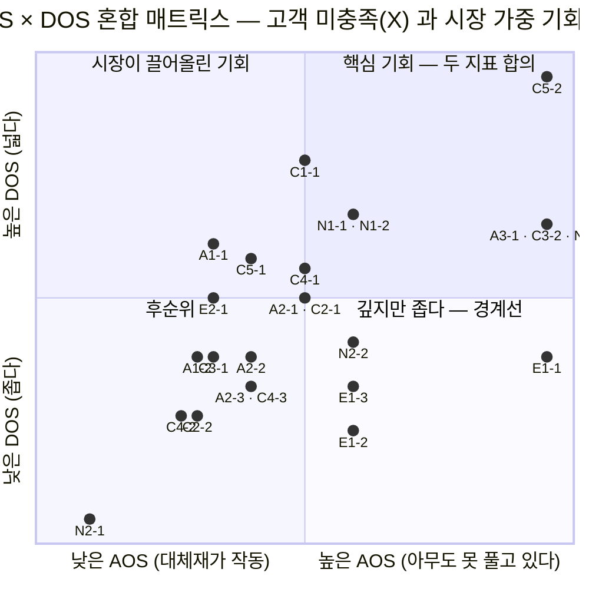
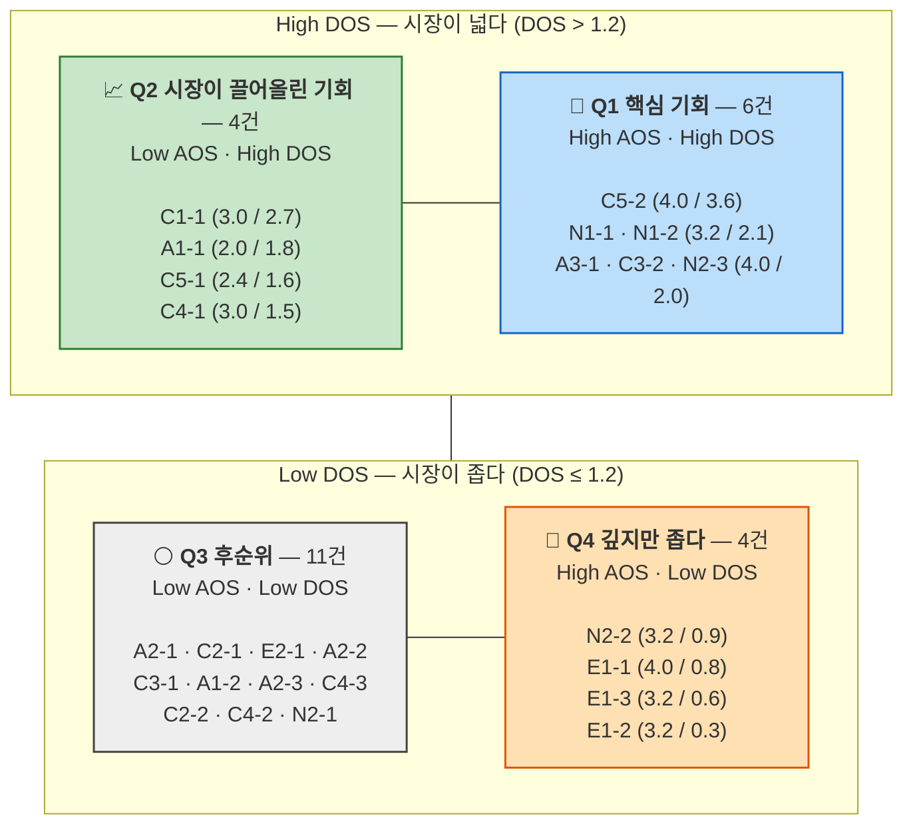

# OS04 — AOS × DOS 혼합 매트릭스

> 입력: [OS02 — AOS 산출](./OS02-AOS-산출.md) · [OS03 — DOS 산출](./OS03-DOS-산출.md)
> 축: **X = AOS**(고객 미충족 강도) · **Y = DOS**(시장 가중 기회)
> 경계선: 각 지표의 **중앙값** — AOS 3.0 · DOS 1.2 (중앙값 초과를 상위로 판정)
> 대상: 현재 상태 Pain **25개**
> 작성일: 2026-08-11

## 이 지도가 답하는 것

AOS와 DOS는 같은 25개를 다른 각도에서 잰다. AOS는 **한 사람이 얼마나 아픈가**를, DOS는 **그 아픔이 얼마나 넓게 퍼져 있는가**를 본다. 두 점수를 나란히 놓으면 세 가지가 한눈에 들어온다.

- 두 지표가 **함께 높은** 항목 — 이견 없는 1순위
- 두 지표가 **갈리는** 항목 — 판단이 필요한 자리
- 두 지표가 **함께 낮은** 항목 — 후순위

실무에서 값이 나오는 곳은 가운데다. **한쪽 지표만 보면 놓치는 항목이 이 지도에서 드러난다.**

## 좌표 변환 규칙

Mermaid 사분면 차트는 축을 0~1로 받고 경계선이 0.5에 고정된다. 이 저장소는 사분면 기준점을 중앙값으로 쓰기로 했으므로, **중앙값이 0.5에 오도록 구간별 선형 변환**했다.

| 축 | 원값 범위 | 중앙값 | 변환식 |
|---|---|:---:|---|
| **X (AOS)** | 0.6 ~ 4.0 | **3.0** | `v ≤ 3.0` → `0.5 × v / 3.0`<br/>`v > 3.0` → `0.5 + 0.45 × (v − 3.0) / 1.0` |
| **Y (DOS)** | −0.3 ~ 3.6 | **1.2** | `v ≤ 1.2` → `0.05 + 0.45 × (v + 0.3) / 1.5`<br/>`v > 1.2` → `0.5 + 0.45 × (v − 1.2) / 2.4` |

> **좌표는 사분면 판정용이지 거리 비교용이 아니다.** 구간별로 축척이 달라지므로 점 사이의 간격을 그대로 읽으면 안 된다. 원값은 [아래 좌표표](#좌표표)에 있다.

좌표가 겹치는 항목은 라벨을 묶었다. `A3-1 · C3-2 · N2-3`은 셋 다 AOS 4.0 · DOS 2.0으로 같은 자리에 놓인다.

---

## 혼합 매트릭스



사분면 구성 요약이다. 위 차트가 렌더링되지 않는 환경을 위해 같은 내용을 상자로도 남긴다.



<sub>괄호 안은 (AOS / DOS)</sub>

---

## 사분면 해석

| 사분면 | 조건 | n | 뜻 | 행동 |
|---|---|:---:|---|---|
| **Q1 핵심 기회** | AOS ↑ · DOS ↑ | 6 | 두 지표가 합의한다. 깊고 넓다 | 로드맵 1순위. 이견 없음 |
| **Q2 시장이 끌어올린 기회** | AOS ↓ · DOS ↑ | 4 | 개인 체감은 대체재에 눌렸지만 **모수가 크다** | **AOS만 봤다면 놓쳤을 항목.** 착수 후보 |
| **Q3 후순위** | AOS ↓ · DOS ↓ | 11 | 얕고 좁다 | 자원을 넣지 않는다 |
| **Q4 깊지만 좁다** | AOS ↑ · DOS ↓ | 4 | 절박하지만 도달 인구가 작다 | 경계선 기록 · 파트너 협의 |

### Q1 — 두 지표가 합의한 여섯

| 항목 | AOS | DOS | 실행 주체 |
|---|:---:|:---:|---|
| **C5-2** 접근성 이름의 자기 배제 | 4.0 | **3.6** | 파트너 플레이어 연동 |
| **N1-1** 과거 실패가 취향으로 굳음 | 3.2 | 2.1 | 커뮤니케이션 |
| **N1-2** '접근성 지원'이 방어 반응을 부름 | 3.2 | 2.1 | 커뮤니케이션 |
| **A3-1** 동행자의 설명 노동 | 4.0 | 2.0 | 1차 제품 |
| **C3-2** 스크린리더 라벨 부재 | 4.0 | 2.0 | 파트너 협의 (선행) |
| **N2-3** 설치·로그인·결제 세 관문 | 4.0 | 2.0 | 파트너 협의 (선행) |

여섯 중 **1차 제품이 단독으로 착수할 수 있는 것은 A3-1 하나**다. 나머지는 파트너 연동 하나, 파트너 협의 둘, 커뮤니케이션 둘이다. 두 지표가 모두 동의해도 실행 주체는 여전히 흩어져 있다.

### Q2 — AOS만 봤다면 놓쳤을 넷

이 사분면이 혼합 매트릭스를 그린 이유다.

| 항목 | AOS(순위) | DOS(순위) | 왜 AOS에서 눌렸나 |
|---|:---:|:---:|---|
| **C1-1** 비언어 이벤트 미전달 | 3.0 (12위) | **2.7 (2위)** | 포털 문자 중계가 득점 사실만은 알려줘 만족도가 2로 올라갔다 |
| **A1-1** 무음 환경에서 정보 0 | 2.0 (19위) | 1.8 (8위) | 문자 중계 + 득점 알림 앱이 꽤 잘 대체해 만족도 3 |
| **C5-1** 노화로 받아들여 문제로 안 봄 | 2.4 (18위) | 1.6 (9위) | 볼륨을 올려 듣는 우회가 작동 중 |
| **C4-1** 확대하면 스코어가 밀려남 | 3.0 (14위) | 1.5 (10위) | OS 확대 + 캡처라는 우회가 번거롭지만 작동 |

**네 항목 모두 "대체재가 부분적으로 작동해서" AOS가 눌렸다.** 그런데 넷 다 모수가 크다. C1-1은 청각 43만 전원이고, A1-1은 스포츠 OTT 이용자 전체이며, C5-1은 미등록 난청까지 포함한다.

**C1-1이 이 사분면의 대표다.** 1차 제품(Live Event Caption Layer)의 핵심 기능인데 AOS 12위였다. DOS에서 2위로 올라오면서 제자리를 찾았다. AOS 순위만 들고 로드맵을 짰다면 우리 제품의 본체가 중위권에 묻혔을 것이다.

### Q4 — 절박하지만 좁은 넷

| 항목 | AOS(순위) | DOS(순위) | 처리 |
|---|:---:|:---:|---|
| **E1-1** 두 감각 채널 모두 차단 | 4.0 (4위) | 0.8 (18위) | 백로그 · 제품 경계 기록 |
| **E1-3** 촉각 출력 실행 시점 부재 | 3.2 (7위) | 0.6 (21위) | 백로그 |
| **E1-2** 개선 발표마다 배제 재확인 | 3.2 (6위) | 0.3 (24위) | 백로그 |
| **N2-2** 권유가 실행으로 이어지지 않음 | 3.2 (10위) | 0.9 (14위) | 파트너 협의 안건 |

E1 세 항목이 나란히 있다. **AOS에서 상위권이던 이유는 아무도 촉각·점자를 제공하지 않아 만족도가 1이었기 때문**이고, DOS에서 내려온 이유는 국내 인구 통계조차 없기 때문이다.

**이 칸은 버리는 칸이 아니다.** CJM01이 E1의 여정을 그린 이유가 "개선안을 내기 위해서가 아니라 우리 제품의 경계를 명시하기 위해"였다. 여기 있는 세 줄이 그 경계다. 그리고 **DOS를 낮춘 근거가 관측이 아니라 우리가 매긴 MR 0.1~0.2**라는 점은 남겨 둔다. 시청각 중복장애 인구 통계가 나오면 이 넷은 다시 계산해야 한다.

### 정중앙에 걸린 둘

**A2-1**과 **C2-1**은 AOS 3.0 · DOS 1.2로 **두 지표 모두 정확히 중앙값**이다. 좌표 [0.50, 0.50], 즉 교차점 위에 놓인다.

"중앙값 초과를 상위로" 규칙을 쓰므로 형식상 Q3(후순위)로 분류되지만, **이 둘은 어느 사분면에도 속하지 않는다고 읽는 편이 정확하다.** 기준점을 한 칸만 옮겨도 Q1으로 올라간다. 둘 다 1차 제품 범위의 결핍 항목(A2-1 용어·속도, C2-1 자막 형식 불일치)이라 후순위로 밀어 두기에는 성격이 맞지 않는다.

---

## 두 지표가 갈리는 구간이 판단의 자리다

```
                     Q2 (4건)              Q1 (6건)
                시장이 끌어올림    ←합의→   핵심 기회
                     ↑                        ↑
        AOS만 보면 놓친다              둘 다 동의한다
        ─────────────────────────────────────────────
        둘 다 낮다                     DOS만 보면 놓친다
                     ↓                        ↓
                     Q3 (11건)             Q4 (4건)
                    후순위                깊지만 좁다
```

25개 중 **8개(32%)가 두 지표의 불일치 구간(Q2 · Q4)에 있다.** 한 지표만 썼다면 이 여덟 개의 위치를 잘못 잡았을 것이다.

| 한 지표만 썼을 때 | 무슨 일이 생기나 |
|---|---|
| **AOS만 본다** | Q2 넷을 중위권으로 묻는다. **1차 제품의 핵심 기능 C1-1이 12위에 남는다** |
| **DOS만 본다** | Q4 넷을 목록에서 지운다. **제품 경계(E1 3건)가 기록되지 않는다** |

두 지표를 곱해 하나로 줄이는 방법(`DOS_alt = AOS × MR`)도 있지만, 그러면 이 불일치 자체가 사라진다. **불일치를 보존하는 것이 혼합 매트릭스의 목적이다.**

---

## 좌표표

| ID | 인물 | **AOS** | **DOS** | x | y | 사분면 | 유형 | 실행 주체 |
|---|---|:---:|:---:|:---:|:---:|:---:|---|---|
| **C5-2** | 임정호 | 4.0 | 3.6 | 0.95 | 0.95 | **Q1** | 발견 | 파트너 연동 |
| **N1-1** | 문세림 | 3.2 | 2.1 | 0.59 | 0.67 | **Q1** | 신뢰 | 커뮤니케이션 |
| **N1-2** | 문세림 | 3.2 | 2.1 | 0.59 | 0.67 | **Q1** | 신뢰 | 커뮤니케이션 |
| **A3-1** | 한지영 | 4.0 | 2.0 | 0.95 | 0.65 | **Q1** | 결핍 | 1차 제품 |
| **C3-2** | 배현우 | 4.0 | 2.0 | 0.95 | 0.65 | **Q1** | 관문 | 파트너 협의 |
| **N2-3** | 배옥순 | 4.0 | 2.0 | 0.95 | 0.65 | **Q1** | 관문 | 파트너 협의 |
| **C1-1** | 강민서 | 3.0 | 2.7 | 0.50 | 0.78 | **Q2** | 결핍 | 1차 제품 |
| **A1-1** | 조하늘 | 2.0 | 1.8 | 0.33 | 0.61 | **Q2** | 결핍 | 1차 제품 |
| **C5-1** | 임정호 | 2.4 | 1.6 | 0.40 | 0.58 | **Q2** | 신뢰 | 커뮤니케이션 |
| **C4-1** | 정소윤 | 3.0 | 1.5 | 0.50 | 0.56 | **Q2** | 결핍 | 1차 제품 |
| A2-1 | 응웬 티 마이 | 3.0 | 1.2 | 0.50 | 0.50 | Q3 *(정중앙)* | 결핍 | 1차 제품 |
| C2-1 | 윤태경 | 3.0 | 1.2 | 0.50 | 0.50 | Q3 *(정중앙)* | 결핍 | 1차 제품 |
| E2-1 | 오재민 | 2.0 | 1.2 | 0.33 | 0.50 | Q3 | 결핍 | 1차 제품 |
| A1-2 | 조하늘 | 1.8 | 0.8 | 0.30 | 0.38 | Q3 | 발견 | 파트너 연동 |
| A2-2 | 응웬 티 마이 | 2.4 | 0.8 | 0.40 | 0.38 | Q3 | 품질 | 1차 제품 |
| C3-1 | 배현우 | 2.0 | 0.8 | 0.33 | 0.38 | Q3 | 결핍 | 1차 제품 |
| A2-3 | 응웬 티 마이 | 2.4 | 0.6 | 0.40 | 0.32 | Q3 | 결핍 | 1차 제품 |
| C4-3 | 정소윤 | 2.4 | 0.6 | 0.40 | 0.32 | Q3 | 품질 | 1차 제품 |
| C2-2 | 윤태경 | 1.8 | 0.4 | 0.30 | 0.26 | Q3 | 발견 | 파트너 연동 |
| C4-2 | 정소윤 | 1.6 | 0.4 | 0.27 | 0.26 | Q3 | 결핍 | 1차 제품 |
| N2-1 | 배옥순 | 0.6 | **−0.3** | 0.10 | 0.05 | Q3 | 결핍 | — |
| **N2-2** | 배옥순 | 3.2 | 0.9 | 0.59 | 0.41 | **Q4** | 관문 | 파트너 협의 |
| **E1-1** | 서기범 | 4.0 | 0.8 | 0.95 | 0.38 | **Q4** | 구조 | 백로그 |
| **E1-3** | 서기범 | 3.2 | 0.6 | 0.59 | 0.32 | **Q4** | 구조 | 백로그 |
| **E1-2** | 서기범 | 3.2 | 0.3 | 0.59 | 0.23 | **Q4** | 신뢰 | 백로그 |

---

## 이 지도에서 나온 결론

1. **Q1 여섯이 1순위다.** 두 지표가 합의했다. 다만 그중 1차 제품 단독 착수는 A3-1 하나뿐이고, 나머지는 파트너와 메시지의 영역이다.
2. **Q2 넷을 반드시 함께 올린다.** 특히 **C1-1** — 1차 제품의 본체인데 AOS 12위였다. 대체재가 부분적으로 작동해 만족도가 눌렸을 뿐, 모수는 청각 43만 전원이다.
3. **Q4 넷은 지우지 않고 경계선으로 기록한다.** E1 세 항목의 DOS가 낮은 근거는 관측이 아니라 우리가 매긴 MR 0.1~0.2다.
4. **정중앙의 A2-1 · C2-1은 사분면으로 판정하지 않는다.** 두 지표 모두 정확히 중앙값이라 기준점을 한 칸만 옮겨도 Q1으로 간다.
5. **25개 중 8개가 불일치 구간에 있다.** 한 지표만 썼다면 그 여덟의 위치를 잘못 잡았을 것이다. 두 점수를 하나로 합치지 않고 나란히 두는 이유다.
