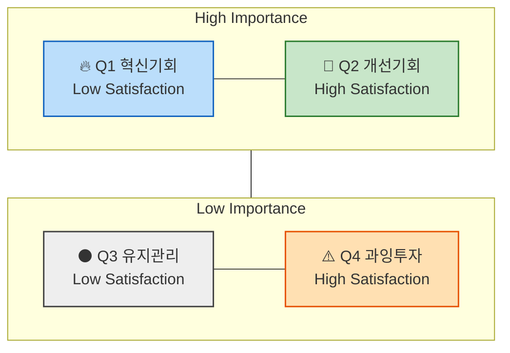

# 06 — 기회점수(OS · AOS · DOS) 산출 방법론

> CJM이 **어디서 막히는지**를 펼쳤다면, 기회점수는 그 막힌 지점 중 **무엇부터 손댈지**를 숫자로 세운다.
> 선행 분석: [시장규모](../시장규모/) · [페르소나](../페르소나/) · [CJM](../CJM/)
> 작성일: 2026-08-11

## 1. 기회점수(OS)와 조정형 기회점수(AOS)

전통적인 기회점수(Opportunity Score)는 고객의 불만족 수준을 계산할 때 기대치(Importance)와 만족도(Satisfaction)를 그대로 뺀 값을 쓴다. 문제는 그 앞에도 Importance가 한 번 더 들어간다는 점이다.

```
OS = Importance + (Importance − Satisfaction) = Importance × 2 − Satisfaction
```

식을 펼쳐 보면 Importance가 두 번 반영된다. 중요도가 높은 항목은 만족도와 무관하게 점수가 밀려 올라가고, 그만큼 **실제 시장 감각이 왜곡된다.**

조정형 기회점수(AOS, Adjusted Opportunity Score)는 이 부분을 고친다. 불만족 수준을 기대치와 무관한 **비율**로 먼저 뽑고(`1 − Satisfaction / 5`), 거기에 Importance를 곱해 혁신 기회의 강도를 낸다.

```
AOS = Importance × (1 − Satisfaction / 5)
```

Importance는 가중치 자리로 한 번만 들어가고, 나머지 한 축은 순수하게 "얼마나 안 풀렸는가"만 담는다.

### AOS의 정의

| 항목 | 설명 |
|---|---|
| **Importance** | 고객에게 이 Pain/Goal이 얼마나 중요한가 (1~5점) |
| **Satisfaction** | 현재 이 Pain이 얼마나 잘 해결되고 있는가 (1~5점) |
| **1 − Satisfaction/5** | 충족되지 않은 영역(Unmet Need)의 비율 |
| **AOS** | "중요하지만 덜 해결된 문제"의 강도 |

### 점수 해석 예시

| Pain / Goal | Importance | Satisfaction | 1 − Satisfaction(rate) | AOS | 해석 |
|---|---|---|---|---|---|
| 리포트 자동화의 한계 | 5 | 2 (40%) | 0.6 | 5 × (1 − 0.4) = **3.0** | 명확한 혁신 기회 |
| AI 학습 피로감 | 3 | 2 (40%) | 0.6 | 3 × (1 − 0.4) = **1.8** | 부분적 개선 기회 |
| 데이터 공유 비효율 | 4 | 3 (60%) | 0.4 | 4 × (1 − 0.6) = **1.6** | 유지관리 대상 |
| 신뢰 부족 | 2 | 4 (80%) | 0.2 | 2 × (1 − 0.8) = **0.4** | 저기회 영역 |

### 사분면 시각화

X축은 Satisfaction(충족도), Y축은 Importance(중요도)로 놓고 각 Pain을 배치한다. AOS는 버블 크기로 얹는다.



| 사분면 | 조건 | 의미 | 전략 행동 |
|---|---|---|---|
| **Q1** | High AOS | 혁신 기회 (High Importance + Low Satisfaction) | JTBD 인터뷰 대상, MVP 실험 우선 |
| **Q2** | 중간 AOS | 개선 기회 | 지속적 개선 필요 |
| **Q3** | Low AOS | 유지·보완 | UX·마케팅 최적화 중심 |
| **Q4** | 0 근처 | 과잉투자 위험 | 자원 분배 재검토 |

> **[남겨둔 질문]** 매트릭스에서 사분면의 상하·좌우를 가르는 수치 기준점은 어디인가?
> 중앙값 3점을 기계적으로 쓸지, 실제 응답의 평균이나 중위값을 쓸지에 따라 같은 Pain이 Q1에 갔다가 Q3로 내려간다. 사례 문서에서는 기준점을 반드시 명시하고 그 근거를 함께 적는다.

## 2. 평가 대상 정의 — 무엇을 점수화하는가

점수를 매기는 재료는 **우리가 설계한 솔루션**이 아니라, **기존 솔루션 생태계 아래에서 고객이 실제로 겪고 있는 Pain/Job 상황**이다. 그 재료는 앞 단계인 페르소나 스펙트럼과 고객 여정 지도에서 가져온다.

| 분석 단계 | 평가 단위 = 고객 타겟 | 평가 대상 = Pain 정의 내용 |
|---|---|---|
| 페르소나 단계 | 각 페르소나의 주요 Pain·Goal | "이 사람에게 가장 중요한 고통은 무엇인가?" |
| 고객 여정 지도 | 여정 단계별 Pain Point / 개선 기회 | "고객 여정 중 어디서 좌절이 가장 큰가?" |
| ~~JTBD 인터뷰 사전 단계~~ | ~~Job Statement 단위~~ | ~~"이 고객이 진보를 이루기 위해 수행하는 일(Job)은 무엇인가?"~~ |

> **✅ 앞선 분석 결과 중 무엇을 사용하는가**
>
> - 페르소나가 도출되기 전, "문제정의"·"Segment" 단계의 Pain List를 사용하면 어떻게 될까?
> - 페르소나 스펙트럼 4가지 중 어떤 페르소나가 가진 Pain List를 사용해야 할까?

분석·기획 단계에서는 범위를 좁히지 않는다. 최대한 많은 **"유효한"** 문제에 시장 기회 점수를 매긴 뒤 내림차순으로 정렬해 본다.

## 3. AOS 산출 5단계 워크플로우

| 단계 | 설명 | AI 지원 프롬프트 | 산출물 |
|---|---|---|---|
| **① Pain 리스트 정리** | Persona/CJM에서 Pain·Goal 정리 | "각 페르소나의 주요 Pain/Goal을 표로 정리해줘." | Pain List |
| **② Importance 평가** | 고객 입장에서 중요도 평가 (1~5) | "각 Pain이 고객의 목표 달성에 얼마나 중요한지 1~5로 평가해줘." | Importance Table |
| **③ Satisfaction 평가** | 현재 충족 수준 평가 (1~5) | "현재 사용 중인 대체 솔루션의 만족도를 1~5로 평가해줘." | Satisfaction Table |
| **④ AOS 계산** | AOS = Importance × (1 − Satisfaction/5) | "위 표에 AOS 계산식을 적용하고 결과를 내줘." | AOS Table |
| **⑤ Matrix 시각화** | X: Satisfaction, Y: Importance, Bubble: AOS | "AOS 기준으로 기회가 큰 항목 순으로 정렬하고, Matrix 사분면에 배치해줘." | (Adjusted) Opportunity Score Matrix |

> **🌟 심화 질문 — 원샷 프롬프팅을 쓰면 안 되는 상황도 있을까**
>
> Few-Shot 프롬프팅 전략에서는 "가능하다면 One-Shot으로"라는 방침이 언급된다. 하지만 One-Shot 프롬프트가 모든 상황에서, 아무 때나 효과적이지는 않다.
> 그렇다면 One-Shot 프롬프트는 언제 부작용을 낳고, 언제 효과적일 거라고 가정해 볼 수 있을까?

## 4. 다음 축 — 시장 가중형 점수 DOS

AOS는 고객 한 명의 체감만 담는다. 그래서 **한 사람이 겪는 고통의 깊이**와 **그 고통을 겪는 사람의 수**를 구분하지 못한다. 여기에 시장이라는 두 번째 축을 붙이는 것이 DOS(Discovered Opportunity Score)다.

```
기회 점수 = 고객 미충족 × 시장 파급력

DOS = (Importance − Satisfaction) × Market Relevance
```

| 구분 | AOS | DOS |
|---|---|---|
| 계산 기준 | 고객 체감 중심 | 시장 가중 중심 |
| 데이터 출처 | 페르소나, CJM, 인터뷰 | TAM/SAM/SOM, 산업 리서치 |
| 목적 | 혁신 아이디어 탐색 | 시장 확장성 검증 |
| 적용 시점 | 리서치 초기 | 비즈니스 모델 검증 |
| 답하는 질문 | 이 사람은 얼마나 아픈가 | 이 아픔은 얼마나 넓게 퍼져 있는가 |

Market Relevance 산정 절차, 음수의 의미, `DOS ≠ AOS × MR`인 이유, 프롬프트 템플릿, 그리고 이 프로젝트에서 어떤 모수를 분모로 쓸지에 대한 판단은 별도 문서에 정리했다.

→ **[06-2 — 시장 가중형 기회점수(DOS) 산출 방법론](./DOS-시장가중형-방법론.md)**

## 적용 사례

- [OS01 — CJM 기반 Pain·Goal 리스트](./OS01-CJM-Pain-리스트.md) — ①단계
- [OS02 — AOS 산출과 Opportunity Matrix](./OS02-AOS-산출.md) — ②~⑤단계
