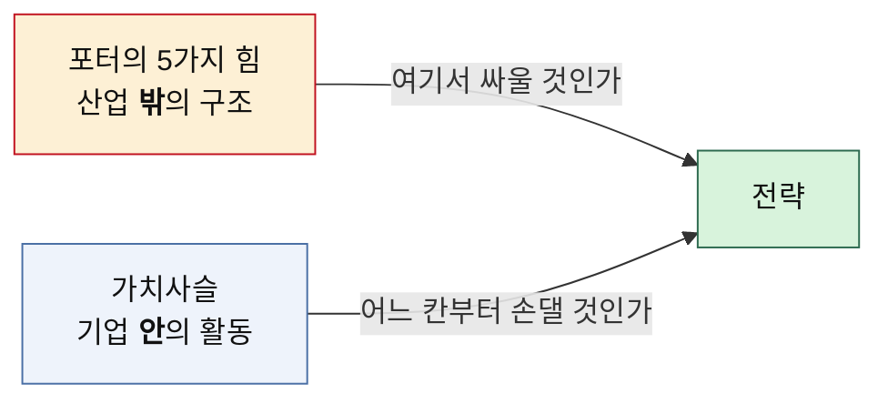

# github-prac

Git·GitHub 사용을 익히면서, 비즈니스 분석 프레임워크를 실제로 적용해 본 학습 저장소입니다.
분석 프레임워크 하나를 배울 때마다 **방법론 → 시장 두 곳 개별 분석 → 비교 분석** 순서로 정리합니다.

## 분석 문서

### 📊 [포터의 5가지 힘](./포터/) — 산업 밖의 구조

산업 자체가 돈이 되는 구조인지 판정하는 도구입니다.

| 문서 | 내용 |
|---|---|
| [포터의 5가지 힘 분석 방법론](./포터/포터의-5가지-힘-분석-방법론.md) | 다섯 힘의 정의와 판정 기준 |
| [분석01 — OTT](./포터/분석01-OTT.md) | 스포츠 중계 + 영화·드라마 |
| [분석02 — 온라인 커머스](./포터/분석02-온라인커머스.md) | 오프라인 매장 없는 판매 사업 |
| [비교 — OTT vs 온라인 커머스](./포터/비교-OTT-vs-온라인커머스.md) | 두 시장 대조와 전략 시사점 |

> **결론 요약** — 두 시장 모두 매력도가 낮습니다. 시장 규모는 크지만 부가가치가 상류(리그·스튜디오 / 플랫폼)로 빠져나가기 때문입니다. 갈림길은 **후방 통합 가능성**이었습니다. OTT 사업자는 리그를 살 수 없지만, 커머스 판매자는 자체 제조로 올라갈 수 있습니다.

### 🔗 [가치사슬 분석](./가치사슬/) — 기업 안의 활동

기업이 어느 활동에서 값을 만들고 어디서 새는지 짚는 도구입니다.

| 문서 | 내용 |
|---|---|
| [가치사슬 분석 방법론](./가치사슬/가치사슬-분석-방법론.md) | 주요활동 5 + 지원활동 4, 설계/개선 2축 질문표 |
| [분석03 — OTT 가치사슬](./가치사슬/분석03-OTT-가치사슬.md) | 활동별 원가·차별화 진단 |
| [분석04 — 온라인 커머스 가치사슬](./가치사슬/분석04-온라인커머스-가치사슬.md) | 활동별 원가·차별화 진단 |
| [비교 — 가치사슬 대조](./가치사슬/비교-가치사슬-OTT-vs-온라인커머스.md) | 누수 지점과 처방의 차이 |

> **결론 요약** — 5힘에서 하나로 묶였던 두 시장이 갈렸습니다. OTT는 **첫 번째 칸(투입 물류)** 을 빼앗겼고, 온라인 커머스는 **네 번째 칸(마케팅·영업)** 을 플랫폼에 임대해 쓰고 있습니다. 넘긴 칸이 다르니 처방도 달라집니다.

## 두 프레임워크의 관계



앞의 질문만 던지면 진단에서 멈추고, 뒤의 질문만 던지면 애초에 이길 수 없는 산업에서 활동만 열심히 개선하게 됩니다. 두 질문을 이어서 던져야 전략이 됩니다.

## 폴더 구조

```
├── 포터/            5가지 힘 분석
├── 가치사슬/         가치사슬 분석
└── README.md        이 문서
```

## Git 연습 메모

이 저장소는 아래 흐름을 익히는 용도로도 씁니다.

- 브랜치 만들고 합치기
- 커밋 되돌리기, 충돌 해결해 보기
- 원격 저장소와 주고받기 (clone / push / pull / fetch)
- Pull Request 흐름 따라가 보기

```bash
git status                 # 현재 상태 보기
git add .                  # 변경분 스테이징
git commit -m "메시지"      # 커밋
git push origin main       # 원격에 반영
git pull origin main       # 원격 변경분 가져오기
```
