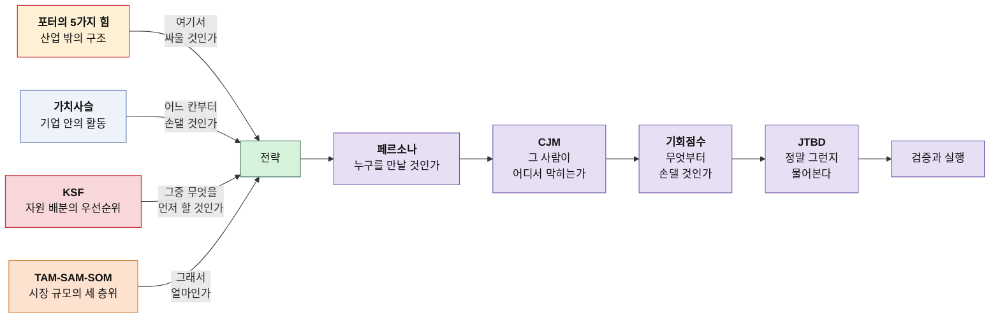

# github-prac

Git·GitHub 사용을 익히면서, 비즈니스 분석 프레임워크를 실제로 적용해 본 학습 저장소입니다.
분석 프레임워크 하나를 배울 때마다 **방법론 → 시장 두 곳 개별 분석 → 비교 분석** 순서로 정리합니다. 사례가 아직 하나뿐인 챕터는 **방법론 → 사례** 까지만 있습니다.

## 분석 문서

### 📊 [포터의 5가지 힘](./포터/) — 산업 밖의 구조

산업 자체가 돈이 되는 구조인지 판정하는 도구입니다.

| 문서 | 내용 |
|---|---|
| [포터의 5가지 힘 분석 방법론](./포터/포터의-5가지-힘-분석-방법론.md) | 다섯 힘의 정의와 판정 기준 |
| [분석01 — OTT](./포터/분석01-OTT.md) | 스포츠 중계 + 영화·드라마 |
| [분석02 — 온라인 커머스](./포터/분석02-온라인커머스.md) | 오프라인 매장 없는 판매 사업 |
| [비교 — OTT vs 온라인 커머스](./포터/비교-OTT-vs-온라인커머스.md) | 두 시장 대조와 전략 시사점 |

> **결론 요약** — 두 시장 모두 매력도가 낮습니다. 시장 규모는 크지만 부가가치가 상류(리그·스튜디오 / 플랫폼)로 빠져나가기 때문입니다. 갈림길은 **후방 통합 가능성**이었습니다. OTT 사업자는 리그를 살 수 없지만, 커머스 판매자는 자체 제조로 올라갈 수 있습니다.

### 🔗 [가치사슬 분석](./가치사슬/) — 기업 안의 활동

기업이 어느 활동에서 값을 만들고 어디서 새는지 짚는 도구입니다.

| 문서 | 내용 |
|---|---|
| [가치사슬 분석 방법론](./가치사슬/가치사슬-분석-방법론.md) | 주요활동 5 + 지원활동 4, 설계/개선 2축 질문표 |
| [분석03 — OTT 가치사슬](./가치사슬/분석03-OTT-가치사슬.md) | 활동별 원가·차별화 진단 |
| [분석04 — 온라인 커머스 가치사슬](./가치사슬/분석04-온라인커머스-가치사슬.md) | 활동별 원가·차별화 진단 |
| [비교 — 가치사슬 대조](./가치사슬/비교-가치사슬-OTT-vs-온라인커머스.md) | 누수 지점과 처방의 차이 |

> **결론 요약** — 5힘에서 하나로 묶였던 두 시장이 갈렸습니다. OTT는 **첫 번째 칸(투입 물류)** 을 빼앗겼고, 온라인 커머스는 **네 번째 칸(마케팅·영업)** 을 플랫폼에 임대해 쓰고 있습니다. 넘긴 칸이 다르니 처방도 달라집니다.

### 🎯 [핵심 성공 요인(KSF)](./KSF/) — 분석에서 전략으로

한정된 자원을 어디에 먼저 쓸지 정하는 도구입니다.

| 문서 | 내용 |
|---|---|
| [KSF 도출 방법론](./KSF/KSF-도출-방법론.md) | 5힘·가치사슬에서 KSF로 넘어가는 4단계 규칙 |
| [KSF01 — OTT](./KSF/KSF01-OTT.md) | 신규 진입자를 위한 Top 5 핵심 성공 요인 |
| [KSF02 — 온라인 커머스](./KSF/KSF02-온라인커머스.md) | 신규 진입자를 위한 Top 5 핵심 성공 요인 |
| [비교 — KSF 대조](./KSF/비교-KSF-OTT-vs-온라인커머스.md) | 집중형 vs 순차형, 자원 배분의 차이 |

> **결론 요약** — 두 시장의 KSF는 자원 배분 방식에서 갈립니다. OTT는 다섯 중 셋이 투입 물류에 몰린 **집중형**이라 한 곳에 자본을 걸어야 하고, 온라인 커머스는 다섯 칸에 흩어진 **순차형**이라 순서를 지키는 규율이 필요합니다. 신규 진입자에게는 경쟁자가 적은 시장보다 **틀렸을 때 다시 해볼 수 있는 시장**이 유리합니다.

### 📐 [시장 규모 분석(TAM-SAM-SOM)](./시장규모/) — 그래서 얼마인가

무엇을 먼저 할지 정한 다음, 그것으로 얼마를 벌 수 있는지 세는 도구입니다.

| 문서 | 내용 |
|---|---|
| [TAM-SAM-SOM 방법론](./시장규모/TAM-SAM-SOM-방법론.md) | 세 층위 정의, 하향식·상향식 교차 검증, Market Segment Map 축 선정, 7단계 워크플로우 대응 구조 |
| [시장규모01 — 스포츠 OTT 접근성](./시장규모/시장규모01-스포츠OTT-접근성.md) | 시·청각장애인 스포츠 중계 접근성 레이어의 TAM·SAM·SOM과 세그먼트 지도 |

> **결론 요약** — 세 숫자의 절댓값보다 **두 개의 낙차**가 결론을 만듭니다. 스포츠 OTT 접근성 사례에서 SAM은 TAM의 0.5%였고, 이는 국내 사업만으로는 천장이 낮다는 뜻입니다. 그래서 리그 파트너십이 아니라 **플레이어에 탑재되는 SDK/API** 형태가 1순위 수익 모델로 올라옵니다. 원자료: [서비스 개선 기획서](./서비스_개선_기획서_스포츠OTT_접근성.pdf)

### 🧑‍🤝‍🧑 [페르소나](./페르소나/) — 시장에서 사람으로

시장 규모가 센 숫자를, 실제로 만나서 검증할 사람으로 바꾸는 도구입니다.

| 문서 | 내용 |
|---|---|
| [페르소나01 — Market Segment 기반 추출](./페르소나/페르소나01-Market-Segment-기반-추출.md) | 세그먼트 4분면에서 뽑은 사용자 6명 + 구매 의사결정자 3명 |
| [페르소나02 — 페르소나 스펙트럼 ① 1차 생성](./페르소나/페르소나02-스펙트럼-1차생성.md) | 핵심 5 · 확장 3 · 극단 2 · 비활성 2, 총 12명의 발산 단계 원본 |
| [페르소나03 — 스펙트럼 ②~⑤단계](./페르소나/페르소나03-스펙트럼-수렴-검증-통합.md) | 채점으로 4명 선별 → 카드 재기술 → 실존 확률 검증 → Spectrum Map |

> **결론 요약** — 세그먼트에서 곧바로 뽑은 페르소나는 **이미 우리 제품을 쓸 만한 사람들**이었습니다. 스펙트럼으로 넓히자 12명 중 8명이 새로 나왔고, 그중 두 명이 시장 산정의 약한 가정을 정면으로 건드립니다. 미등록 노인성 난청(SAM 과소 추정)과 학습된 회피(의향률 30%의 남은 70%)입니다. 다시 4명으로 줄였을 때 **네 사람의 요구가 모두 하나의 1차 제품으로 모였습니다** — 페르소나를 넓혔는데 제품이 늘지 않았다는 점이 이 작업의 성과입니다.

### 🗺️ [고객 여정 지도(CJM)](./CJM/) — 어디서 막히는가

페르소나가 누구인지를 정했다면, CJM은 그 사람이 시간 순으로 무엇을 겪는지 펼치는 도구입니다.

| 문서 | 내용 |
|---|---|
| [CJM 작성 방법론](./CJM/CJM-작성-방법론.md) | 정의·유형 4종·구성 요소·작성 8절차, 그리고 맨 끝의 경고 |
| [CJM01 — 스포츠 OTT 접근성](./CJM/CJM01-스포츠OTT-접근성.md) | 페르소나 12인 전원의 개별 여정 지도, 단계별 기대·Pain Point·개선 기회와 검증 지표 |

> **결론 요약** — 이 지도는 접근 가능한 경기 단서가 제때 전달되지 않으면 상황 이해와 현장감이 끊기고, 반복된 실패가 흥미 저하와 시청 회피로 굳어질 수 있다는 가설을 검증합니다. 열두 사람의 공통 Pain Point 다섯 개 중 넷은 배치·지연·표현·계측의 문제였고, 다섯 번째는 감각 채널·지불 능력·기기가 만드는 **구조적 배제**였습니다. 개선 과제도 1차 제품, 파트너 플레이어 연동, 인증·결제 정책 협의로 실행 범위를 나눴습니다. 열두 사람의 단계 구성은 양식을 반복하지 않고 각자의 실제 문턱에 맞게 새로 정의했습니다.

### 🎚️ [기회점수(OS · AOS · DOS)](./OS/) — 무엇부터 손댈 것인가

CJM에서 나온 Pain을 점수로 세워, 손댈 순서를 정하는 도구입니다.

| 문서 | 내용 |
|---|---|
| [기회점수 산출 방법론](./OS/기회점수-AOS-방법론.md) | OS 수식의 이중 계상 문제와 AOS 보정, 사분면 해석, 5단계 워크플로우 |
| [DOS 시장 가중형 방법론](./OS/DOS-시장가중형-방법론.md) | Market Relevance 산정 5단계, 음수의 의미, 프롬프트 템플릿, 이 프로젝트의 모수 판단 |
| [OS01 — CJM 기반 Pain·Goal 리스트](./OS/OS01-CJM-Pain-리스트.md) | 페르소나 12인 × 대표 Pain 3 = 36개, Goal 2층위와 유형·상태 분류, AOS 대상 25개 확정 |
| [OS02 — AOS 산출과 Opportunity Matrix](./OS/OS02-AOS-산출.md) | 25개의 Importance·Satisfaction 채점, AOS 계산과 순위, 중앙값 기준 사분면 배치 |
| [OS03 — DOS 산출과 시장 가중 우선순위](./OS/OS03-DOS-산출.md) | Market Segment Map 기반 Market Relevance 산정, DOS 계산과 순위 이동, 실행 순서 |
| [OS04 — AOS × DOS 혼합 매트릭스](./OS/OS04-AOS-DOS-혼합매트릭스.md) | 두 점수를 X·Y축에 놓은 사분면 차트, 두 지표가 갈리는 8개 항목의 해석 |

> **결론 요약** — 전통적 OS 수식은 `Importance × 2 − Satisfaction`으로 펼쳐져 **중요도가 두 번 반영**됩니다. AOS는 불만족을 `1 − Satisfaction/5`라는 비율로 따로 뽑아 Importance를 한 번만 곱합니다. CJM의 Pain 59칸을 36개로 줄이면서 계산에 넣기 전에 걸러야 할 것이 셋 나왔습니다 — **계측 실패**(주어가 고객이 아니라 우리), **미래 상태 Pain**(아직 없는 제품의 만족도), **관문 유형**(Goal 기여도는 낮지만 순서상 먼저). 남은 25개를 채점한 결과는 더 불편합니다. **1차 제품이 겨냥하는 결핍(2.42)·품질(2.40)이 여섯 유형 중 꼴찌 둘이고, 우리가 단독으로 못 푸는 관문(3.73)·구조(3.60)가 1·2위**입니다. 결핍에는 문자 중계·라디오 같은 대체 수단이 이미 작동해 만족도가 올라가 있기 때문입니다. AOS는 아무도 안 하고 있는 곳을 정확히 짚지만, 그곳이 우리가 할 수 있는 곳인지는 말해 주지 않습니다.
>
> 시장 규모를 곱하자 그림이 정리됩니다. **구조는 3.60에서 0.70으로 무너지고**(아프지만 좁았습니다) **발견은 4위에서 2위로 올라옵니다**(이름과 자리를 바꾸는 일이 가장 남는 장사였습니다). DOS 1위는 기능 개발이 아니라 **접근성 메뉴의 이름을 바꾸는 과제**입니다. 다만 상위 10위 중 다섯 개, 그리고 1위의 시장 가중치가 '가정'이라 이 표는 결론이 아니라 **조사 순서**입니다.

### 🔍 [JTBD(Jobs To Be Done)](./JTBD/) — 처음으로 사람을 만나는 단계

점수로 정한 우선순위를 실제 사람의 이야기로 확인하는 도구입니다.

| 문서 | 내용 |
|---|---|
| [JTBD 인터뷰 방법론](./JTBD/JTBD-인터뷰-방법론.md) | 문제해결 활동 구조, 전환을 결정하는 네 가지 힘, 참가자 3그룹 모집, 질문 스크립트 19개 |
| [JTBD 결과 보고서 작성법](./JTBD/JTBD-결과보고서-작성법.md) | 요약 카드 10개 필드, Outcome 목록 표, Pain에서 Outcome으로의 단위 전환 |
| [JTBD01 — 인터뷰 문항지 (데모 체험 기반)](./JTBD/JTBD01-인터뷰-문항지.md) | 공통 문항 40개 + 페르소나 12인 전용 문항, 데모 과업 T1~T5, 네 힘 채점 시트 |
| [JTBD02 — 모의 응답지 (리허설용)](./JTBD/JTBD02-모의-응답지.md) | ⚠️ **실제 인터뷰 아님.** 12인 전원 모의 응답으로 문항지·채점·대조 시트를 리허설한 기록 |

> **결론 요약** — 사용자는 제품을 **사지 않고 고용합니다.** Job을 못 해내면 해고되고, 경쟁자는 같은 카테고리가 아니라 **그 Job을 지금 해내고 있는 모든 것**입니다 — 종이와 펜, 지인에게 묻기, 아무것도 하지 않기까지. 전환은 `Push + Pull > Habit + Anxiety`일 때만 일어나므로, 기능을 좋게 만드는 개선은 네 힘 중 하나(Pull)만 건드립니다. 그리고 이 챕터가 앞 챕터들과 다른 점이 하나 있습니다 — **여기까지는 전부 책상에서 만든 판단이었습니다.** 페르소나 12인은 실존 인물이 아니고 AOS·DOS도 우리 채점입니다. 모집 세 그룹 중 **떠난 사람(B)** 이 가장 중요합니다. "접근성 부족이 이탈의 원인인가"라는 아직 확인되지 않은 명제의 답은 잘 쓰는 사람에게서는 나오지 않습니다.

## 프레임워크의 관계



앞의 네 질문을 이어서 던져야 분석이 전략이 됩니다. 5힘에서 멈추면 진단만 남고, 가치사슬에서 멈추면 손댈 곳은 알아도 순서를 모릅니다. KSF까지 왔어도 규모를 세지 않으면 그 순서가 돈이 되는지 알 수 없습니다.

그리고 전략에서 멈추면 검증할 대상이 없습니다. 페르소나와 CJM은 **시장이라는 숫자를 실제로 만나서 확인할 사람과 순간으로 바꾸는 단계**입니다. 이 저장소의 문서들이 서로를 인용하며 이어지는 이유도 여기 있습니다 — 뒤 문서의 가정은 앞 문서에서 왔고, 앞 문서의 약한 칸은 뒤 문서에서 사람 형태로 드러납니다.

CJM까지 오면 막히는 지점이 수십 개로 늘어납니다. 기회점수는 그 목록을 **중요도와 충족도라는 두 축으로 다시 세워 순서를 매기는 단계**입니다. 여기서 시장 규모를 곱하면 앞의 TAM-SAM-SOM이 다시 들어와, 한 바퀴가 닫힙니다.

그런데 여기까지는 전부 책상 위의 작업입니다. 페르소나도 감정 곡선도 점수도 문서에서 문서로 이어지며 만들어진 판단이고, 그 사슬 어디에도 실제 사용자는 없습니다. **JTBD는 이 저장소에서 처음으로 사람을 만나는 단계**이고, 그래서 앞의 모든 표를 흔들 수 있는 유일한 단계입니다.

## 🗂️ [kb_home](./kb_home/) — 문서를 찾아 들어가는 층

챕터가 여덟 개로 늘어나면서 목차만으로는 필요한 문서를 집기 어려워졌습니다. `kb_home`은 원문을 옮기지 않고 그 위에 색인과 요약을 얹은 층입니다.

| 들어갈 곳 | 언제 |
|---|---|
| [분석 사슬 지도](./kb_home/01_maps/moc-analysis-chain.md) | 여덟 단계가 무엇을 주고받는지 볼 때 |
| [방법론 지도](./kb_home/01_maps/moc-frameworks.md) | 절차만 다시 쓰려고 찾을 때 |
| [사례 지도](./kb_home/01_maps/moc-cases.md) | 특정 시장의 결론만 확인할 때 |
| [열린 질문](./kb_home/01_maps/moc-open-questions.md) | 아직 검증되지 않은 가정을 확인할 때 |
| [용어집](./kb_home/00_meta/glossary.md) | 약어 뜻이 헷갈릴 때 |

LLM으로 이 저장소를 다룰 때의 읽기·쓰기 규칙은 [kb_home/AGENTS.md](./kb_home/AGENTS.md)에 있습니다.

## 폴더 구조

```
├── 포터/            5가지 힘 분석 — 산업 매력도 판정
├── 가치사슬/         가치사슬 분석 — 활동별 가치 누수 진단
├── KSF/             핵심 성공 요인 — 신규 진입자 자원 배분
├── 시장규모/         TAM-SAM-SOM — 시장 규모 세 층위와 세그먼트 지도
├── 페르소나/         페르소나 추출과 스펙트럼 — 세그먼트를 사람으로
├── CJM/             고객 여정 지도 — 그 사람이 막히는 지점
├── OS/              기회점수(AOS·DOS) — 막힌 지점의 우선순위
├── JTBD/            Jobs To Be Done — 점수를 사람의 이야기로 확인
├── kb_home/         LLM 위키 — 위 문서들의 색인·요약·템플릿 (원문은 옮기지 않음)
└── README.md        이 문서
```

## Git 연습 메모

이 저장소는 아래 흐름을 익히는 용도로도 씁니다.

- 브랜치 만들고 합치기
- 커밋 되돌리기, 충돌 해결해 보기
- 원격 저장소와 주고받기 (clone / push / pull / fetch)
- Pull Request 흐름 따라가 보기

```bash
git status                 # 현재 상태 보기
git add .                  # 변경분 스테이징
git commit -m "메시지"      # 커밋
git push origin main       # 원격에 반영
git pull origin main       # 원격 변경분 가져오기
```
