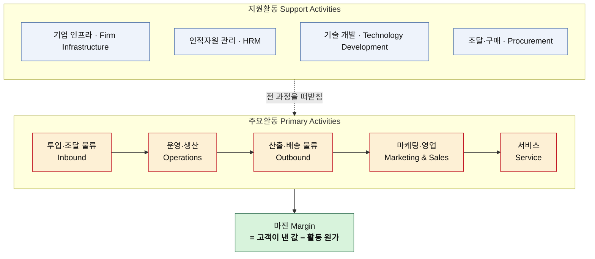
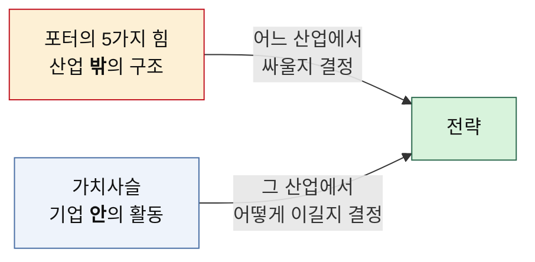

# 02 — 기업 내부 활동의 가치사슬 분석 (방법론)

> 포터의 5가지 힘이 **산업 밖**을 보는 도구라면, 가치사슬은 **기업 안**을 보는 도구다.
> 5힘 분석: [포터의-5가지-힘-분석-방법론.md](../포터/포터의-5가지-힘-분석-방법론.md)
> 작성일: 2026-08-06

> **문서 안내**
> 원본을 옮기는 과정에서 표의 줄바꿈 지점마다 글자가 잘려 나가 문맥으로 복원했다(`Inbound` → `In/ound`, `• 고객 동의 기반…` → `• / - 동의 기반…`).
> 원본 질문은 핀테크·금융 플랫폼을 전제로 쓰여 있었으나, 어느 산업에나 그대로 던질 수 있도록 질문을 일반화했다. 금융 특화 표현이 필요하면 커밋 `1af98af`에 원본 표현이 남아 있다.

## 가치사슬 전체 구조

- **주요활동**은 가치가 실제로 만들어지고 고객에게 전달되는 흐름이다.
- **지원활동**은 그 흐름 전체를 떠받친다. 특정 단계에만 붙는 게 아니다.
- 각 활동을 **설계** 관점과 **개선** 관점 두 축으로 나눠 묻는 것이 이 방법론의 핵심이다. 처음 만들 때 던지는 질문과, 굴러가는 걸 고칠 때 던지는 질문은 다르다.

---

## 1. 가치사슬 주요활동 분석

### 1-1. 주요활동 공통 분석 질문표

| 항목명(Activity) | 가치사슬 **설계**를 위한 질문 🏗️ | 가치사슬 **개선**을 위한 질문 🚀 |
| --- | --- | --- |
| **투입·조달 물류** Inbound Logistics  **핵심 투입자원·파트너 확보** | • 제품이나 서비스를 만드는 데 필요한 핵심 투입자원은 무엇인가? • 그 자원을 어떤 경로로 확보할 것인가 — 직접 생산, 매입, 제휴, 외부 서비스 중 무엇인가? • 공급자·파트너·유통 채널과 어떤 방식과 조건으로 연결할 것인가? • 어떤 자원을 자체 확보하고, 어떤 기능은 외부에 맡길 것인가? • 확보한 자원(원재료·데이터·권리·인력)을 어떻게 수집·정제·표준화할 것인가? • 공급자와 파트너가 우리와 거래할 유인은 무엇인가? | • 외부에서 들어오는 투입물의 품질·최신성·가용성을 어떻게 높일 것인가? • 특정 공급자나 특정 인프라에 대한 의존도를 줄일 수 있는가? • 공급 중단이나 장애에 대비한 대체 경로가 있는가? • 축적된 데이터와 경험을 다음 조달 판단에 다시 활용하고 있는가? • 조직이나 채널별로 중복 확보되는 자원을 줄일 수 있는가? • 최소한만 확보하는 것과 넉넉히 확보하는 것 사이의 균형을 어떻게 잡을 것인가? |
| **운영·생산** Operations  **투입을 고객 가치로 변환** | • 고객의 요청을 실제 가치로 바꾸는 핵심 처리 과정은 무엇인가? • 요청 접수 → 확인 → 처리 → 완료 → 결과 안내 흐름을 어떻게 설계할 것인가? • 각 단계에서 무엇을 표준화하고 무엇을 개별 대응할 것인가? • 품질·보안·안전·규정 준수를 공정 안에서 어떻게 수행할 것인가? • 수요가 급증해도 안정적으로 처리할 수 있는가? • 자동 처리와 사람의 판단 사이 경계를 어디에 둘 것인가? | • 처리 성공률과 완료 전환율을 어떻게 높일 것인가? • 고객이 처리 도중 이탈하는 단계와 원인은 무엇인가? • 처리시간, 오류율, 중단시간과 수작업 비율을 줄일 수 있는가? • 문제 감지율을 높이면서 정상 건의 오탐을 줄일 수 있는가? • 정산·분류·검수 같은 반복 업무를 자동화할 수 있는가? • 변경을 빠르게 반영하면서 운영 안정성을 함께 확보할 수 있는가? |
| **산출·배송 물류** Outbound Logistics  **결과물 전달** | • 고객은 결과물을 어떤 채널과 형태로 전달받는가? • 처리 결과와 핵심 정보를 어떤 형식으로 보여줄 것인가? • 고객이 현재 상태와 다음에 할 일을 즉시 이해할 수 있는가? • 앱·웹·알림·메일·파트너 연동 등 채널별 역할을 어떻게 구분할 것인가? • 제품과 서비스의 비용과 위험을 충분히 설명할 수 있는가? • 파트너와 협력사에게 필요한 정보는 어떤 방식으로 제공할 것인가? | • 결과를 고객이 더 빠르고 정확하게 이해하도록 개선할 수 있는가? • 핵심 정보와 부가 정보의 우선순위가 명확한가? • 선택지를 비교 가능한 형태로 제공하고 있는가? • 지연이나 장애가 생겼을 때 현재 상태와 다음 조치를 먼저 안내할 수 있는가? • 불필요하거나 과도한 알림을 줄일 수 있는가? • 접근성과 이해 난이도를 낮춰 더 넓은 사용자층이 쓰게 할 수 있는가? |
| **마케팅 및 영업** Marketing & Sales | • 여러 고객군 중 핵심 고객은 누구인가? • 고객이 경쟁자가 아니라 우리를 택해야 하는 핵심 이유는 무엇인가? • 첫 거래 고객을 다음 상품·서비스로 어떻게 연결할 것인가? • 기능뿐 아니라 신뢰·안전·가격·혜택을 어떻게 전달할 것인가? • 파트너와 공급자를 어떤 방식으로 유치할 것인가? • 콘텐츠·검색·광고·추천·프로모션 채널의 역할은 각각 무엇인가? | • 고객획득비용(CAC)을 낮추고 고객생애가치(LTV)를 높일 수 있는가? • 프로모션이 끝난 뒤에도 고객이 남는가? • 상품·서비스 간 교차 이용률을 어떻게 높일 것인가? • 추천이 실제 고객 편익으로 이어지는가? • 판매 유도와 객관적 정보 제공 사이의 이해상충을 어떻게 관리할 것인가? • 지인 추천과 입소문 유입이 장기 고객으로 전환되는가? |
| **서비스** Service  **거래 이후 지원과 고객보호** | • 실패, 오류, 분실, 계정 도용, 환불 지연을 어떻게 처리할 것인가? • 고객이 스스로 문제를 해결할 수 있는 기능은 무엇인가? • 자동 응대와 담당자 응대의 역할을 어떻게 구분할 것인가? • 사고 발생 시 조사·보상·신고·재발방지를 어떻게 수행할 것인가? • 파트너와 협력사에게 어떤 기술·정산 지원을 제공할 것인가? • 고객 문의를 제품 개선으로 연결하는 체계가 있는가? | • 반복 문의를 제품 자체의 개선으로 제거할 수 있는가? • 문제를 고객이 문의하기 전에 먼저 탐지할 수 있는가? • 자동 응대의 잘못된 안내를 어떻게 방지할 것인가? • 응답 시간이 아니라 실제 문제해결률을 측정하고 있는가? • 문의 원인을 상품·UX·시스템·파트너·정책 문제로 분류할 수 있는가? • 상담 채널이 바뀌어도 고객 맥락이 유지되는가? |

---

## 2. 가치사슬 지원활동 분석

### 2-1. 지원활동 공통 분석 질문표

| 항목명(Activity) | 가치사슬 **설계**를 위한 질문 🏗️ | 가치사슬 **개선**을 위한 질문 🚀 |
| --- | --- | --- |
| **기업 인프라** Firm Infrastructure | • 어떤 사업을 어떤 법인과 조직이 담당할 것인가? • 본사와 자회사·사업부 사이의 책임·데이터·브랜드 경계를 어떻게 설정할 것인가? • 이사회·경영진·리스크관리·준법·정보보호·내부감사의 역할은 무엇인가? • 해당 산업의 규제와 개인정보·소비자보호 요구를 어떻게 반영할 것인가? • 신규 사업의 법률·보안·리스크 검토 절차는 무엇인가? | • 법인과 조직이 늘어나면서 책임이 분산되고 있지 않은가? • 성장지표와 리스크지표가 충돌할 때 어떤 기준으로 판단하는가? • 준법·보안 조직이 제품설계 초기부터 참여하는가? • 장애·정보 유출·사고 대응 지휘체계가 명확한가? • 조직 간 데이터 활용과 고객 동의를 일관되게 관리하는가? |
| **인적자원 관리** Human Resource Management | • 필요한 기획·개발·데이터·보안·도메인·법무·리스크 인재는 누구인가? • 도메인 전문성과 제품 개발 역량을 어떻게 결합할 것인가? • 빠른 실험과 안정성·규정 준수를 어떻게 조정할 것인가? • 서비스별 최종 책임자와 의사결정권은 누구에게 있는가? • 고객보호와 데이터 윤리를 조직문화에 어떻게 내재화할 것인가? | • 직원이 규제·보안·AI·데이터 윤리를 지속적으로 학습하는가? • 성과평가가 매출뿐 아니라 안정성·고객보호·협업을 반영하는가? • 특정 인력에게 지식과 권한이 집중되어 있지 않은가? • 조직이 커져도 제품 주인의식과 의사결정 속도를 유지할 수 있는가? • 장애 대응 등 고강도 업무에 따른 번아웃을 관리하는가? |
| **기술 개발** Technology Development | • 핵심 경쟁력을 만드는 기술은 무엇인가? • 자체 개발과 외부 솔루션 도입의 기준은 무엇인가? • 서비스를 여러 개 얹으면서 기술적 결합도를 낮출 수 있는가? • 시스템의 보안·가용성·복구성을 어떻게 확보할 것인가? • 코드·데이터·모델·API를 어떻게 기술자산으로 관리할 것인가? • AI를 이상탐지·개인화·상담·개발생산성에 어떻게 적용할 것인가? | • 서비스별 중복개발을 줄이고 공통 플랫폼 재사용률을 높일 수 있는가? • 장애를 사전에 예측하고 자동 복구할 수 있는가? • 배포속도와 운영 안정성을 동시에 높일 수 있는가? • 추천·탐지 모델의 편향과 오탐을 관리하는가? • 생성형 AI가 만든 결과물의 오류를 검증하는 체계가 있는가? • API 변경에 따른 파트너 비용을 최소화할 수 있는가? |
| **조달·구매** Procurement | • 필요한 인프라·보안·인증·데이터·유통망·고객센터 솔루션은 무엇인가? • 공급자를 가격뿐 아니라 보안·가용성·규정 준수 기준으로 평가하는가? • 핵심 공급자에 대한 협상력을 어떻게 확보할 것인가? • 공급자 장애나 계약 종료 시 서비스를 지속할 수 있는가? • 외부 업체가 처리하는 데이터와 개인정보를 어떻게 통제할 것인가? | • 구매 규모 증가에 따라 단가와 SLA를 개선할 수 있는가? • 특정 인프라나 솔루션에 과도하게 종속되어 있지 않은가? • 핵심 공급자에 대한 대안과 전환계획이 있는가? • 계약에 데이터 반환·삭제·보안감사·장애 대응 조건이 포함되는가? • 공급자의 재무·보안·규제 위험을 지속적으로 모니터링하는가? |

---

## 3. 5힘 분석과의 관계

두 도구는 겹치지 않는다. 5힘이 "이 산업이 돈이 되는 구조인가"를 묻는다면, 가치사슬은 "그 안에서 우리가 어디서 값을 만들고 어디서 새고 있는가"를 묻는다.

5힘 분석에서 "공급자의 힘이 세다"는 결론이 나왔다면, 가치사슬에서는 그 힘이 **어느 활동에 붙어 있는지**를 짚어야 한다. 투입 물류에 붙었는지, 조달·구매에 붙었는지, 아니면 기술 개발에 붙었는지에 따라 손댈 곳이 완전히 달라지기 때문이다.

## 4. 적용 사례

이 방법론을 실제로 적용한 분석은 아래에 있다.

- [분석03-OTT-가치사슬.md](./분석03-OTT-가치사슬.md)
- [분석04-온라인커머스-가치사슬.md](./분석04-온라인커머스-가치사슬.md)
- [비교-가치사슬-OTT-vs-온라인커머스.md](./비교-가치사슬-OTT-vs-온라인커머스.md)

각 분석에서는 위 범용 질문을 해당 산업의 언어로 바꿔 던졌다. 예를 들어 투입·조달 물류의 "핵심 투입자원은 무엇인가"는 OTT에서 중계권·라이선스·제작 인력을 묻는 질문이 되고, 온라인 커머스에서는 사입이냐 자체 제조냐를 묻는 질문이 된다. **질문의 뼈대는 같고 살만 바뀐다** — 이것이 이 질문표를 범용으로 두는 이유다.
