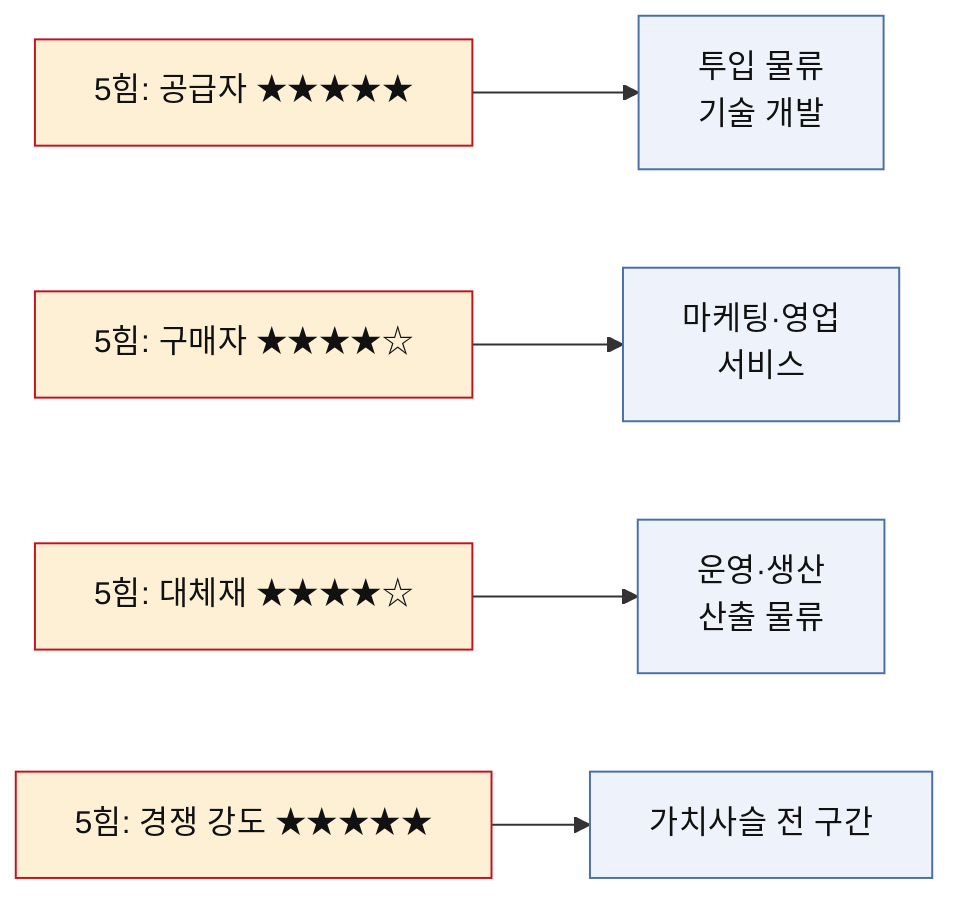
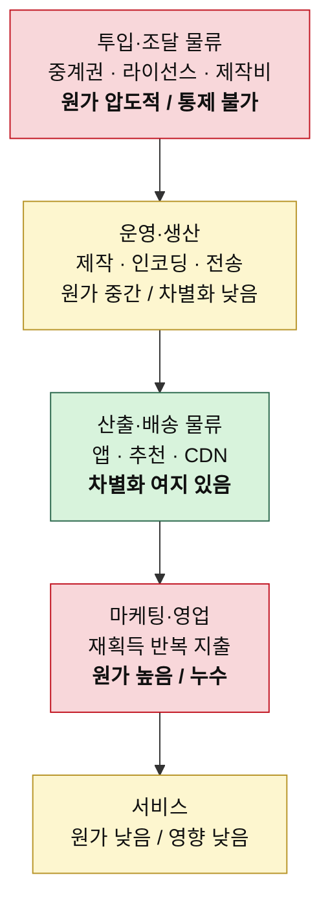

# 가치사슬 분석 — OTT (스포츠 중계 + 영화·드라마)

> 방법론: [가치사슬-분석-방법론.md](./가치사슬-분석-방법론.md)
> 같은 시장의 5힘 분석: [분석01-OTT.md](../포터/분석01-OTT.md)
> 비교 분석: [비교-가치사슬-OTT-vs-온라인커머스.md](./비교-가치사슬-OTT-vs-온라인커머스.md)
> 작성일: 2026-08-06

## 5힘 분석에서 넘어온 숙제

앞서 5힘 분석은 이 산업의 매력도를 낮음으로 판정했다. 공급자의 힘이 압도적이고(리그·스튜디오), 구매자 전환 비용이 0이며, 무료 대체재가 가격 인상을 막는다는 것이 이유였다. 가치사슬에서 확인할 것은 **그 압력이 아홉 개 활동 중 어디에 붙어 있고, 손댈 수 있는 곳이 어디인가**다.

## 활동별 원가 비중과 차별화 기여도

가치사슬의 실익은 **어디에 돈이 나가고 어디서 차별화가 생기는지가 어긋나는 지점**을 찾는 데 있다.

| 활동 | 원가 비중 | 차별화 기여 | 판정 |
|---|---|---|---|
| 투입·조달 물류 (콘텐츠 확보) | 압도적 | 높음 | 여기가 이 사업의 전부 |
| 운영·생산 (제작·인코딩·전송) | 중간 | 낮음 | 위생 요인 — 못하면 죽지만 잘해도 안 알아줌 |
| 산출·배송 물류 (앱·추천·CDN) | 중간 | 중간 | 추천만 차별화 여지 있음 |
| 마케팅·영업 | 높음 | 중간 | 오리지널 공개 시점에 집중 |
| 서비스 | 낮음 | 낮음 | 구독 해지가 쉬워 문의 자체가 적음 |

---

# 1. 주요활동 분석

## 1-1. 투입·조달 물류 (Inbound Logistics)
### 콘텐츠 권리와 제작 자원 확보

**이 산업에서 투입 물류는 원재료 조달이 아니라 권리 조달이다.** 확보 대상은 스포츠 중계권, 영화·드라마 라이선스, 오리지널 제작을 위한 인력과 IP다. 5힘 분석에서 공급자 힘이 ★★★★★로 나온 이유가 정확히 이 칸에 응축돼 있다.

| 가치사슬 **설계**를 위한 질문 🏗️ | 가치사슬 **개선**을 위한 질문 🚀 |
| --- | --- |
| • 확보해야 할 핵심 투입자원은 무엇인가 — 중계권, 라이선스, 제작 인력, 원작 IP 중 어디에 무게를 둘 것인가? • 스포츠 리그·스튜디오와 어떤 계약 구조로 연결할 것인가(기간·독점 범위·갱신 조건)? • 어떤 콘텐츠를 직접 제작하고, 어떤 콘텐츠를 사올 것인가? • 오리지널 제작 파이프라인(기획·투자·제작사 네트워크)을 어떻게 구축할 것인가? • 확보한 권리를 어떤 형태로 자산화·표준화할 것인가(메타데이터·자막·더빙·화질 규격)? • 제작사와 창작자가 우리 플랫폼을 택할 유인은 무엇인가? | • 중계권료 재입찰 때마다 가격이 오르는 구조를 완화할 수 있는가(장기 계약·공동 입찰·부분 권리)? • 특정 리그나 특정 스튜디오에 대한 의존도를 낮출 수 있는가? • 대형 계약이 끊겼을 때 시청 시간을 메울 대체 라인업이 있는가? • 시청 데이터를 다음 제작 투자 결정에 실제로 되먹이고 있는가? • 지역별로 중복 구매되는 권리를 줄일 수 있는가? • 오리지널 투자 비중을 늘릴 때 흥행 실패 위험을 어떻게 분산할 것인가? |

**핵심 진단** — 이 칸의 지출은 대부분 **고정비이면서 매몰비용**이다. 중계권료는 시청자가 한 명이든 천만 명이든 똑같이 나간다. 그래서 규모를 키우는 것 말고는 단가를 낮출 방법이 없고, 규모를 키우려면 또 더 비싼 권리를 사야 한다. 5힘에서 본 "장벽이 최악의 경쟁자만 걸러 들여보낸다"는 현상이 여기서 만들어진다.

## 1-2. 운영·생산 (Operations)
### 제작 실행과 스트리밍 전송

| 가치사슬 **설계**를 위한 질문 🏗️ | 가치사슬 **개선**을 위한 질문 🚀 |
| --- | --- |
| • 기획 → 제작 → 후반 작업 → 인코딩 → 배포 흐름을 어떻게 설계할 것인가? • 라이브 중계와 VOD의 처리 경로를 어떻게 분리할 것인가? • 자막·더빙·화질 등급을 어느 범위까지 자체 처리할 것인가? • DRM·불법 유출 대응·지역 제한을 어떻게 수행할 것인가? • 인기 경기 동시 접속이 폭증해도 견딜 수 있는가? • 외주 제작과 내부 제작의 경계를 어떻게 정할 것인가? | • 버퍼링률·재생 시작 지연·라이브 지연을 줄일 수 있는가? • 시청 도중 이탈이 발생하는 구간과 원인은 무엇인가? • 인코딩·전송 단가를 화질 저하 없이 낮출 수 있는가? • 오리지널 제작비의 회수 주기를 단축할 수 있는가? • 자막·더빙 공정을 자동화하면서 품질을 유지할 수 있는가? • 라이브 장애가 발생했을 때 복구 시간을 어떻게 줄일 것인가? |

**핵심 진단** — 이 칸은 전형적인 **위생 요인**이다. 버퍼링이 잦으면 즉시 이탈하지만, 아무리 매끄럽게 틀어도 그걸 이유로 구독하지는 않는다. 돈을 써도 차별화로 돌아오지 않는 구간이라 원가 절감 대상으로 보는 게 맞다. 다만 **라이브 스포츠만은 예외**다. 결승 경기 중 장애 한 번이 브랜드를 통째로 깎아먹는다.

## 1-3. 산출·배송 물류 (Outbound Logistics)
### 앱·추천·전송 경로

| 가치사슬 **설계**를 위한 질문 🏗️ | 가치사슬 **개선**을 위한 질문 🚀 |
| --- | --- |
| • 고객은 어떤 기기와 화면으로 콘텐츠를 만나는가(모바일·TV·웹·셋톱)? • 첫 화면에서 무엇을 먼저 보여줄 것인가 — 신작, 이어보기, 추천 중 무엇인가? • 추천 알고리즘이 개인 취향과 신작 밀어주기 사이에서 어떤 비중을 가질 것인가? • 라이브 편성표와 VOD 카탈로그를 어떻게 함께 보여줄 것인가? • 통신사·제조사·셋톱박스 파트너에게는 어떤 형태로 공급할 것인가? • CDN과 자체 전송망의 역할을 어떻게 나눌 것인가? | • 고객이 볼 것을 찾기까지 걸리는 시간을 줄일 수 있는가? • 추천이 실제 시청 시간 증가로 이어지는가, 아니면 클릭만 늘리는가? • 카탈로그에서 한 번도 재생되지 않는 콘텐츠 비중을 줄일 수 있는가? • 알림과 푸시가 이탈을 막는가, 오히려 부추기는가? • 기기별 화질·음질 편차를 줄일 수 있는가? • 시청 이력이 기기를 바꿔도 이어지는가? |

**핵심 진단** — 이 산업에서 **차별화 여지가 남아 있는 몇 안 되는 칸**이다. 같은 콘텐츠를 가지고도 무엇을 언제 보여주느냐에 따라 시청 시간이 갈린다. 다만 추천 성능이 아무리 좋아도 볼 것 자체가 없으면 소용없어서, 투입 물류에 종속된 차별화라는 한계가 있다.

## 1-4. 마케팅 및 영업 (Marketing & Sales)

| 가치사슬 **설계**를 위한 질문 🏗️ | 가치사슬 **개선**을 위한 질문 🚀 |
| --- | --- |
| • 핵심 고객은 누구인가 — 스포츠 팬, 드라마 시청층, 가족 단위 중 어디에 맞출 것인가? • 고객이 다른 서비스가 아니라 우리를 택해야 하는 이유는 무엇인가? • 요금제를 어떻게 나눌 것인가(광고형·표준·프리미엄·스포츠 패스)? • 통신사 번들과 직접 가입 중 어디에 무게를 둘 것인가? • 오리지널 공개 일정을 마케팅 캠페인과 어떻게 맞물릴 것인가? • 무료 체험을 제공할 것인가, 제공한다면 어떤 조건으로 할 것인가? | • CAC를 낮추고 LTV를 높일 수 있는가? • 특정 작품이나 시즌이 끝난 뒤에도 고객이 남는가? • 스포츠 가입자를 드라마·영화 시청으로 넘길 수 있는가? • 번들 가입자의 실제 시청률과 유지율은 직접 가입자와 어떻게 다른가? • 해지 직전 고객을 붙잡는 개입이 효과가 있는가, 아니면 할인만 새는가? • 광고 요금제 도입이 상위 요금제를 잠식하고 있지 않은가? |

**핵심 진단** — 5힘에서 본 구매자 힘의 압력이 이 칸에 몰린다. **'가입 → 몰아보기 → 해지' 패턴 때문에 마케팅비가 유지가 아니라 재획득에 반복 지출된다.** 같은 고객을 여러 번 사오는 셈이라, CAC가 낮아지지 않으면 구조적으로 마진이 나오지 않는다.

## 1-5. 서비스 (Service)

| 가치사슬 **설계**를 위한 질문 🏗️ | 가치사슬 **개선**을 위한 질문 🚀 |
| --- | --- |
| • 재생 오류, 결제 실패, 계정 도용, 환불 요청을 어떻게 처리할 것인가? • 고객이 스스로 해결할 수 있는 범위는 어디까지인가? • 계정 공유 정책을 어떻게 안내하고 집행할 것인가? • 라이브 장애 시 보상 기준은 무엇인가? • 파트너(통신사·제조사) 경유 고객의 문의는 누가 받는가? • 고객 문의를 제품 개선으로 연결하는 체계가 있는가? | • 반복 문의를 제품 수정으로 없앨 수 있는가? • 재생 장애를 고객이 문의하기 전에 탐지할 수 있는가? • 해지 절차의 마찰을 늘리는 방식이 장기적으로 손해가 아닌가? • 응답 시간이 아니라 실제 해결률을 보고 있는가? • 문의 원인을 콘텐츠·앱·결제·파트너 문제로 분류할 수 있는가? • 채널이 바뀌어도 고객 맥락이 유지되는가? |

**핵심 진단** — 원가 비중이 가장 낮은 칸이다. 구독 해지가 쉬워서 고객이 불만을 제기하는 대신 그냥 떠나기 때문이다. 문의가 적은 것이 서비스가 좋아서가 아니라 **불만이 이탈로 직행하기 때문**이라는 점을 놓치면 안 된다.

---

# 2. 지원활동 분석

## 2-1. 기업 인프라 (Firm Infrastructure)

| 가치사슬 **설계**를 위한 질문 🏗️ | 가치사슬 **개선**을 위한 질문 🚀 |
| --- | --- |
| • 콘텐츠 투자 의사결정 권한을 어느 조직에 둘 것인가? • 제작 자회사와 플랫폼 사이의 책임·수익 배분 경계는 어디인가? • 국가별 콘텐츠 심의·저작권·개인정보 규제를 어떻게 반영할 것인가? • 대규모 중계권 입찰의 승인 절차는 무엇인가? • 콘텐츠 투자 회수 기간을 회계상 어떻게 인식할 것인가? | • 콘텐츠 투자 실패의 책임 소재가 분명한가? • 시청 시간 지표와 수익성 지표가 충돌할 때 무엇을 기준으로 판단하는가? • 지역 확장 때마다 규제 대응 비용이 반복되고 있지 않은가? • 라이브 장애 대응 지휘체계가 명확한가? • 시청 데이터 활용과 고객 동의를 일관되게 관리하는가? |

## 2-2. 인적자원 관리 (Human Resource Management)

| 가치사슬 **설계**를 위한 질문 🏗️ | 가치사슬 **개선**을 위한 질문 🚀 |
| --- | --- |
| • 콘텐츠 기획·편성 인력과 엔지니어링 인력을 어떤 비율로 둘 것인가? • 창작자·제작사와의 관계를 누가 책임지는가? • 크리에이티브 판단과 데이터 기반 판단의 결정권을 어떻게 나눌 것인가? • 라이브 중계 운영 인력을 상시로 둘 것인가, 시즌제로 둘 것인가? • 오리지널 실패를 감당하는 조직 문화를 어떻게 만들 것인가? | • 편성·기획 노하우가 특정 개인에게만 쌓여 있지 않은가? • 성과평가가 화제성뿐 아니라 유지율·수익성을 반영하는가? • 시즌 집중 업무로 인한 번아웃을 관리하는가? • 창작자 이탈이 라인업에 미치는 영향을 줄일 수 있는가? • 조직이 커져도 편성 의사결정 속도를 유지할 수 있는가? |

## 2-3. 기술 개발 (Technology Development)

| 가치사슬 **설계**를 위한 질문 🏗️ | 가치사슬 **개선**을 위한 질문 🚀 |
| --- | --- |
| • 핵심 경쟁력을 만드는 기술은 무엇인가 — 추천, 인코딩, 라이브 전송 중 어디인가? • 자체 CDN과 외부 CDN 도입의 기준은 무엇인가? • 기기·플랫폼별 클라이언트를 어떻게 공통화할 것인가? • 라이브 트래픽 급증에 대비한 확장 구조를 어떻게 설계할 것인가? • 시청 데이터와 추천 모델을 어떻게 자산으로 관리할 것인가? • AI를 자막·더빙·추천·콘텐츠 태깅에 어떻게 적용할 것인가? | • 기기별 중복 개발을 줄이고 공통 플랫폼 재사용률을 높일 수 있는가? • 장애를 사전에 예측하고 자동 복구할 수 있는가? • 전송 비용을 화질 저하 없이 낮출 수 있는가? • 추천 모델이 인기작 편중을 강화하고 있지 않은가? • AI 자막·더빙의 오역을 검증하는 체계가 있는가? • 신규 기기 대응 비용을 줄일 수 있는가? |

**핵심 진단** — 기술은 이 산업에서 **차별화 원천이 아니라 원가 방어선**이다. 스트리밍 기술은 상용 솔루션으로 상당 부분 해결되고, 경쟁사와의 격차도 시청자가 체감할 만큼 벌어지지 않는다. 예외는 추천과 전송 단가 두 곳이다.

## 2-4. 조달·구매 (Procurement)

| 가치사슬 **설계**를 위한 질문 🏗️ | 가치사슬 **개선**을 위한 질문 🚀 |
| --- | --- |
| • 필요한 클라우드·CDN·DRM·결제·고객센터 솔루션은 무엇인가? • 공급자를 가격뿐 아니라 가용성·확장성 기준으로 평가하는가? • 리그·스튜디오에 대한 협상력을 어떻게 확보할 것인가? • 공급자 장애 시 서비스를 지속할 수 있는가? • 외주 제작사가 다루는 미공개 콘텐츠를 어떻게 통제할 것인가? | • 트래픽 증가에 따라 CDN 단가와 SLA를 개선할 수 있는가? • 특정 클라우드에 과도하게 종속되어 있지 않은가? • 핵심 공급자에 대한 대안과 전환계획이 있는가? • 계약에 장애 보상과 데이터 반환 조건이 포함되는가? • 외주 제작사의 납기·품질 위험을 지속적으로 모니터링하는가? |

**핵심 진단** — 여기서 짚을 것은 **조달·구매와 투입 물류가 사실상 분리되지 않는다**는 점이다. 클라우드나 CDN 협상은 정상적인 조달 활동이지만, 중계권 협상은 조달이라기보다 사업 그 자체다. 방법론의 두 칸이 이 산업에서는 하나로 겹친다.

---

# 3. 종합

## 가치가 새는 지점

## 세 가지 결론

**첫 번째 칸이 전부다.** 아홉 개 활동 중 투입·조달 물류 하나가 원가와 차별화를 동시에 쥐고 있다. 나머지 여덟 개를 아무리 잘해도 볼 것이 없으면 고객은 오지 않는다. 그런데 바로 그 칸이 공급자가 통제하는 칸이다. 5힘에서 나온 "매력도 낮음" 판정이 가치사슬에서는 **"손댈 수 있는 칸과 돈이 걸린 칸이 어긋나 있다"** 는 형태로 다시 나타난다.

**마케팅비가 유지가 아니라 재획득에 쓰인다.** 전환 비용이 0이라 고객이 계속 나갔다 들어온다. 정상적인 사업이라면 초기에 한 번 쓰고 마는 획득 비용이 여기서는 반복 비용이 된다. 이 칸을 줄이려면 마케팅을 줄일 게 아니라 **떠날 이유를 없애야 하는데, 그 수단이 다시 첫 번째 칸(콘텐츠)에 있다.**

**기술은 방어선이지 무기가 아니다.** 버퍼링을 없애도 구독으로 이어지지 않는다. 기술 개발에 투자할 때는 차별화가 아니라 전송 단가 절감과 장애 예방을 목표로 잡는 편이 정직하다. 예외는 추천 하나다.

## 그래서 어디에 손대야 하는가

우선순위는 5힘 분석의 결론과 같은 방향을 가리킨다. **투입 물류를 자체 제작 쪽으로 옮기는 것** 말고는 구조를 바꿀 방법이 없다. 사온 권리는 계약이 끝나면 사라지지만 자체 IP는 남는다. 이 이동이 성공하면 투입 물류가 통제 가능한 칸으로 바뀌고, 그때 비로소 마케팅비의 재획득 굴레도 끊긴다.

다만 자체 제작은 흥행 실패 위험을 회사가 직접 떠안는 선택이다. 사온 콘텐츠는 실패해도 계약 기간이 끝나면 정리되지만, 직접 만든 실패작은 제작비가 그대로 손실로 남는다. **통제권을 얻는 대가로 위험을 사오는 거래**라는 점을 계산에 넣어야 한다.
