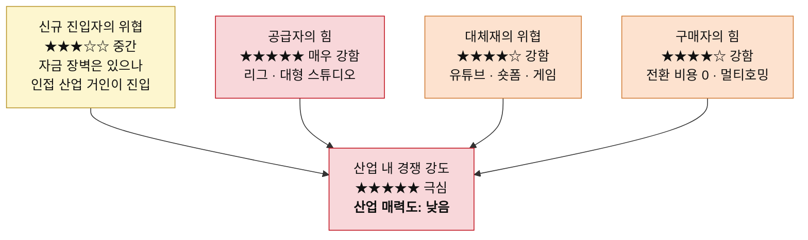
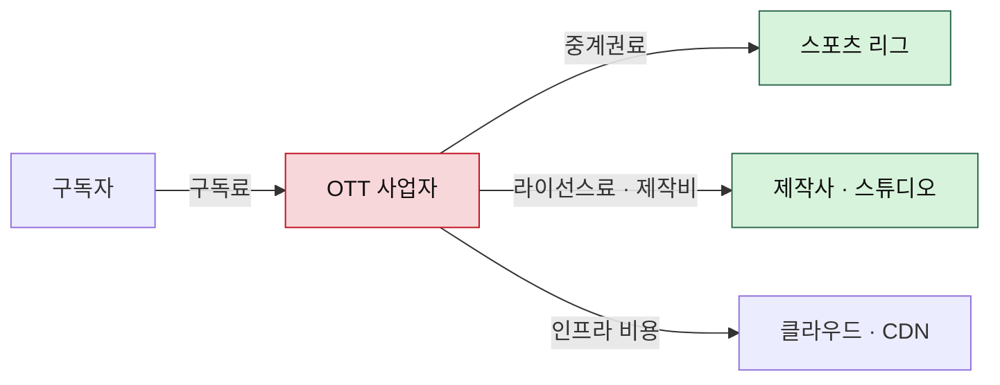

# 포터의 5가지 힘 분석 — OTT (스포츠 중계 + 영화·드라마)

> 방법론: [포터의-5가지-힘-분석-방법론.md](./포터의-5가지-힘-분석-방법론.md)
> 비교 분석: [비교-OTT-vs-온라인커머스.md](./비교-OTT-vs-온라인커머스.md)
> 작성일: 2026-08-06

## 분석 범위

넷플릭스·티빙·쿠팡플레이·디즈니+처럼 구독료를 받고 영상을 트는 사업자 기준으로 본다. 콘텐츠를 만드는 제작사와 스포츠 리그는 이 산업의 '공급자'로 놓는다. 스포츠와 영화·드라마는 같은 서비스 안에 담기지만 힘의 구조가 상당히 달라서 항목마다 나눠 본다.

## 한눈에 보기

| 5가지 힘 | 강도 | 핵심 근거 |
|---|---|---|
| 공급자의 힘 | ★★★★★ 매우 강함 | 리그는 하나뿐인 독점 공급자, 스튜디오는 전방 통합 완료 |
| 구매자의 힘 | ★★★★☆ 강함 | 전환 비용 0, 멀티호밍 상시화 (스포츠만 예외) |
| 신규 진입자의 위협 | ★★★☆☆ 중간 | 자금 장벽은 있으나 채산성 무시하는 거인이 통과 |
| 대체재의 위협 | ★★★★☆ 강함 | 무료이면서 공급 무한한 유튜브·숏폼 |
| 산업 내 경쟁 강도 | ★★★★★ 극심 | 가입자 포화 + 사업자 과다, 한계비용 0 |

---

## 1) 공급자의 힘 — 매우 강함 ★★★★★

이 산업에서 가장 결정적인 힘이다. 공급자가 두 종류인데 둘 다 세다.

### 스포츠 중계권 (리그)

리그는 세상에 하나뿐이다. EPL을 못 사면 EPL 비슷한 걸 다른 데서 사올 방법이 없으니, 협상이라는 말 자체가 성립하지 않는 완벽한 독점 공급자인 셈이다. 중계권료가 원가의 대부분을 차지한다는 점에서 방법론이 말한 "원가의 대부분을 그들의 재료가 차지하는" 상황 그대로다.

계약이 끝날 때마다 재입찰이라 가격은 계속 오른다. 사업자끼리 경쟁이 붙을수록 리그만 돈을 번다. 여기에 전방 통합도 실재해서, 리그가 자체 스트리밍 서비스를 직접 운영하며 중간 유통을 건너뛰는 일이 이미 벌어지고 있다.

### 영화·드라마 (제작사·스튜디오)

인기 IP를 쥔 대형 스튜디오는 매우 강하다. 이들은 라이선싱을 끊고 자기 OTT를 차렸다. 전방 통합이 예고가 아니라 이미 지나간 일이다. 반면 중소 제작사는 약하다. 유통 창구가 OTT뿐이라 오히려 끌려다닌다. 스타 배우·작가·감독의 몸값 상승도 공급자 힘으로 봐야 한다.

그래서 오리지널을 만든다. '오리지널 콘텐츠 전략'은 취향이나 브랜딩의 문제로 읽히지만 본질은 공급자 힘을 낮추려는 구조적 대응이다. 남의 콘텐츠를 빌려 트는 순간 이 산업은 유통 대행업이 된다.

### 돈이 흘러가는 방향

## 2) 구매자의 힘 — 강함 ★★★★☆

스포츠는 예외다. 응원하는 팀 경기를 봐야 하니 시즌 내내 묶이고, 구독료 인상을 받아들이는 정도도 다르며, 계정 공유 단속마저 스포츠 쪽이 훨씬 잘 먹힌다. 이 산업에서 구매자 힘을 낮추는 거의 유일한 수단이다.

문제는 나머지 전부다. 구독자는 잘게 흩어져 있어 개별 협상력이 없는데도 힘이 센데, 전환 비용이 사실상 0이기 때문이다. 해지 버튼 하나면 끝이고 잃는 건 시청 기록 정도다. '가입 → 몰아보기 → 해지'가 하나의 소비 패턴으로 굳었고, 여러 서비스를 갈아타며 쓰는 멀티호밍이 기본이 됐다. 가격 민감도도 높아서 구독료를 올리면 이탈이 즉시 숫자로 보인다.

## 3) 신규 진입자의 위협 — 중간 ★★★☆☆

기술 장벽은 낮다. 스트리밍 자체는 상용 솔루션으로 해결된다. 진짜 장벽은 콘텐츠 확보 자금과 구독자 규모의 경제다. 콘텐츠 제작비는 고정비라서 구독자가 많을수록 1인당 원가가 떨어지는, 작은 신규 업체가 따라오기 힘든 전형적인 규모의 경제가 작동한다.

문제는 이 장벽을 넘을 수 있는 상대가 하필 가장 무서운 상대라는 점이다. 자금력이 압도적인 인접 산업의 거인들이 중계권을 사간다. 이들에게 OTT는 하드웨어나 커머스를 팔기 위한 미끼라서 수지가 안 맞는 가격에도 입찰할 수 있다. 아무나 못 들어오지만, 들어오는 자는 채산성을 무시하고 싸운다. **장벽이 오히려 최악의 경쟁자만 걸러 들여보내는 셈이다.**

## 4) 대체재의 위협 — 강함 ★★★★☆

이 산업의 경쟁 상대는 다른 OTT만이 아니다. 저녁 시간을 두고 다투는 모든 것이 대체재다. 유튜브, 숏폼, 게임, SNS. 특히 유튜브는 공짜인 데다 공급량이 무한해서 가격을 올리기 어렵게 만드는 가장 강한 압력으로 작용한다.

스포츠도 안전하지 않다. 하이라이트 클립은 무료로 풀리고, 스포츠 바나 직관도 같은 욕구를 처리한다. 불법 스트리밍은 특히 스포츠에서 실질적인 대체재로 작동한다. 여기서도 전환 비용이 0이라 위협이 그대로 전달된다. 앱을 닫고 유튜브를 켜는 데 드는 비용은 없다.

## 5) 산업 내 경쟁 강도 — 극심 ★★★★★

국내 가입자는 사실상 포화인데 사업자 수는 많다. 방법론이 짚은 "성장 정체 + 경쟁사 과다"라는 격화 조건을 정확히 만족한다. 경쟁 수단도 죄다 마진을 깎는 쪽이다. 오리지널 제작비 출혈 경쟁, 통신사 번들 끼워팔기, 광고 요금제라는 이름의 사실상 가격 인하.

게다가 콘텐츠가 고정비라 가입자 한 명을 더 받는 한계비용이 거의 0이다. 그러니 할인해서라도 받는 게 각자에게는 합리적이고, 그 합리적 판단이 모여 업계 전체 수익률을 끌어내린다.

---

## 종합 판정: 매력도 낮음

스포츠 독점 중계권은 구매자 힘과 대체재 위협을 동시에 낮춰주는 강력한 카드다. 문제는 그 카드값을 리그에 지불한다는 것이다. **결국 이 산업이 만든 부가가치는 리그와 대형 스튜디오로 흘러간다.**

## 이 산업에서 싸운다면

남의 콘텐츠를 빌려 트는 유통업으로는 구조상 돈을 벌 수 없다. 자체 IP 보유나 장기 독점 계약으로 공급자 쪽으로 올라가는 것이 유일한 방향이고, 그마저도 완전히 올라갈 수는 없다는 한계를 안고 시작해야 한다. 리그를 살 수는 없기 때문이다.
