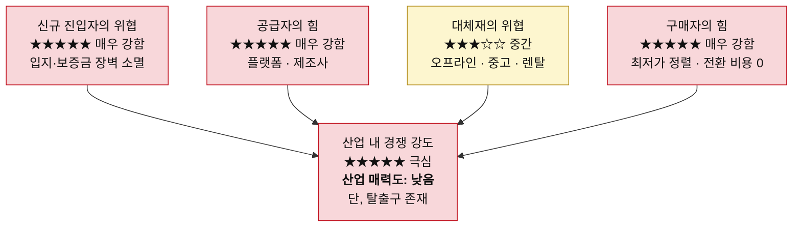
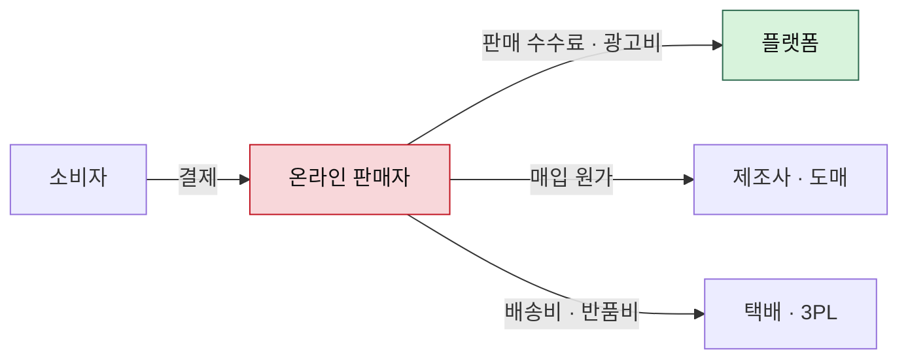
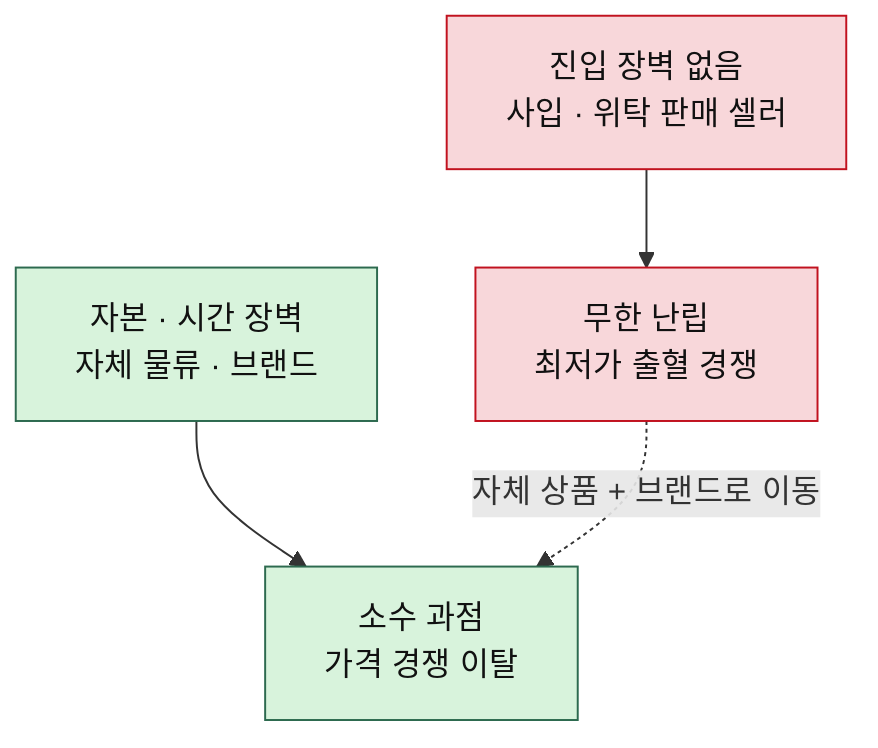
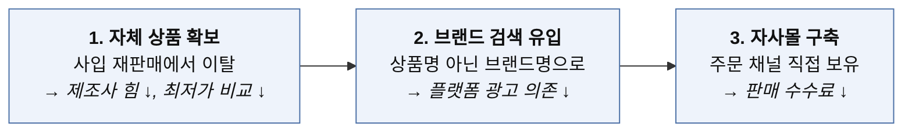

# 포터의 5가지 힘 분석 — 온라인 커머스 (오프라인 매장 없음)

> 방법론: [포터의-5가지-힘-분석-방법론.md](./포터의-5가지-힘-분석-방법론.md)
> 비교 분석: [비교-OTT-vs-온라인커머스.md](./비교-OTT-vs-온라인커머스.md)
> 작성일: 2026-08-06

## 분석 범위

오픈마켓 셀러부터 자사몰을 운영하는 D2C 브랜드까지, 매장 없이 온라인으로만 물건을 파는 판매 사업자 기준이다. 쿠팡·네이버 같은 플랫폼은 이 산업의 '공급자(유통 채널)'로 놓는다. OTT 분석에서 리그를 공급자로 놓은 것과 같은 구도다.

## 한눈에 보기

| 5가지 힘 | 강도 | 핵심 근거 |
|---|---|---|
| 공급자의 힘 | ★★★★★ 매우 강함 | 수요가 100% 플랫폼 안에만 존재, 전방 통합(PB) 진행 중 |
| 구매자의 힘 | ★★★★★ 매우 강함 | '낮은 가격순' 정렬이 상시 작동, 반품이 사실상 무료 체험 |
| 신규 진입자의 위협 | ★★★★★ 매우 강함 | 상권·보증금·권리금 장벽이 통째로 소멸 |
| 대체재의 위협 | ★★★☆☆ 중간 | 무료 대체재가 없다는 점이 유일한 숨통 |
| 산업 내 경쟁 강도 | ★★★★★ 극심 | 같은 검색 결과 한 화면에서 직접 비교 |

---

## 1) 공급자의 힘 — 매우 강함 ★★★★★

공급자가 두 갈래인데, 흔히 뒤쪽만 보고 앞쪽을 놓친다.

### 판매 채널 (플랫폼)

매장이 없다는 건 손님이 오는 길이 플랫폼 하나뿐이라는 뜻이다. 검색 노출이 끊기면 매출이 그날로 0이 된다. 판매 수수료에 광고비가 얹히는데, 상단에 뜨려면 광고를 사야 하고 다들 사니까 입찰가가 오르고 오른 만큼 마진이 빠지는, 잘될수록 더 내는 구조다. 노출 순위 알고리즘도 플랫폼이 정한다. 규칙이 바뀌면 매출이 통째로 흔들리는데 항의할 창구는 없다.

**전방 통합이 가장 노골적인 지점이 여기다.** 플랫폼은 어떤 상품이 얼마나 팔리는지 다 본다. 그 데이터로 자체 브랜드를 만들어 검색 상단에 올린다. 내가 시장을 검증해주고 그 결과를 넘기는 셈이다. 물류를 플랫폼에 맡기면 배송 속도는 얻지만 종속은 더 깊어진다. 거기서 빠져나오는 순간 경쟁력이 사라지도록 설계돼 있다.

### 상품 공급처 (제조사·도매)

사입해서 되파는 구조라면 제조사 힘이 세다. 같은 물건을 누구나 뗄 수 있으니 차별화가 원천적으로 불가능하고, 결국 가격으로만 싸우게 된다. 자체 제조로 넘어가면 이 힘이 확 줄어든다. 이 산업의 유일한 탈출구가 여기서 시작된다.

### 택배·물류

단가 협상력은 물량에 비례한다. 작을수록 불리하지만, 3PL 업체 간 대체가 가능해 앞의 둘보다는 약하다.

### 돈이 흘러가는 방향

## 2) 구매자의 힘 — 매우 강함 ★★★★★

가격 비교가 기계로 자동화됐다. 오프라인에서는 최저가를 찾으려면 발품이 들지만 온라인에서는 '낮은 가격순' 정렬 한 번이면 끝난다. 구매자 힘을 이보다 더 키우기는 어렵다.

전환 비용도 0이다. 뒤로 가기 한 번이면 다른 판매자다. 리뷰와 별점이 구매를 좌우해서 후기 몇 줄에 매출이 흔들리고, 반품·교환이 쉬워지면서 사실상 무료 체험이 된 탓에 반품 물류비와 재판매 불가 재고가 마진을 그대로 갉아먹는다. 방법론이 말한 "제품이 너무 흔해서 다른 곳에서 쉽게 사 올 수 있는" 상태가 표준화 상품에서 극단적으로 나타난다. 똑같은 물건이면 최저가 하나만 팔린다.

빠져나갈 구멍은 브랜드뿐이다. 상품을 검색하지 않고 브랜드명을 검색해서 들어오는 고객은 애초에 최저가 정렬을 거치지 않는다.

## 3) 신규 진입자의 위협 — 매우 강함 ★★★★★

진입 장벽이 거의 없다. 사업자등록과 오픈마켓 입점이면 오늘 시작할 수 있고, 위탁 판매를 쓰면 재고 없이도 가능하다. 오프라인 리테일을 지켜주던 장벽이 통째로 사라졌다는 게 핵심이다. 상권 입지, 보증금, 권리금, 인테리어, 진열 공간이 전부 무의미해졌다. 목이 좋든 나쁘든 검색 결과에서는 같은 목록에 뜬다.

잘 팔리는 상품은 곧바로 복제된다. 소싱처가 사실상 공개돼 있어 따라 하는 데 며칠이면 된다.

다만 위로 올라갈수록 장벽이 생긴다. 당일·새벽 배송, 자체 물류망, 브랜드 인지도는 자본과 시간이 드는 영역이다. 그래서 이 산업은 아래는 무한 난립, 위는 과점으로 양극화된다.

## 4) 대체재의 위협 — 중간 ★★★☆☆

다섯 힘 중 유일하게 숨통이 트이는 항목이다. '물건이 필요하다'는 욕구는 다른 것으로 대체하기 어렵다. OTT의 시간 소비와 달리, 세제가 떨어지면 세제를 사야 한다.

그래도 대체 경로는 있다. 직접 보고 만져보고 사는 오프라인 매장, 실질적으로 큰 규모로 성장한 중고 거래, 소유하지 않고 쓰는 렌탈·구독이 그것이다. 카테고리마다 편차도 크다. 생필품처럼 규격이 정해진 상품은 온라인이 압도적으로 편해서 위협이 낮고, 의류·가구·화장품처럼 직접 확인이 중요한 상품은 오프라인이 여전히 강하다.

## 5) 산업 내 경쟁 강도 — 극심 ★★★★★

진입이 쉬우니 판매자 수가 계속 늘고, 같은 검색 결과 한 화면에서 직접 비교된다. 경쟁이 이보다 노골적으로 드러나는 구조도 드물다. 경쟁 수단은 전부 자기 마진을 깎는 방식이다. 최저가 경쟁, 무료 배송, 쿠폰, 광고 입찰. 고정비가 낮아 퇴출도 쉬운 탓에 한 곳이 나가면 곧바로 다른 곳이 들어와 경쟁 강도가 리셋되지 않는다.

브랜드를 세운 소수는 이 싸움에서 빠져나온다. 같은 산업 안에서 완전히 다른 경쟁 환경에 서게 된다.

---

## 종합 판정: 매력도 낮음 — 그러나 탈출구는 있다

다섯 힘이 대부분 강한 쪽에 몰려 있고, 부가가치는 플랫폼으로 흘러간다. **다만 자체 브랜드 제조와 자사몰 트래픽이라는 명확한 탈출 경로가 존재한다는 점에서 완전히 막힌 시장은 아니다.**

## 이 산업에서 싸운다면 — 순서가 정해져 있다

순서를 뒤집으면 안 된다. 브랜드 없이 자사몰부터 열면 아무도 오지 않는다. 다섯 힘 중 공급자 힘부터 손대는 게 정석이다.
