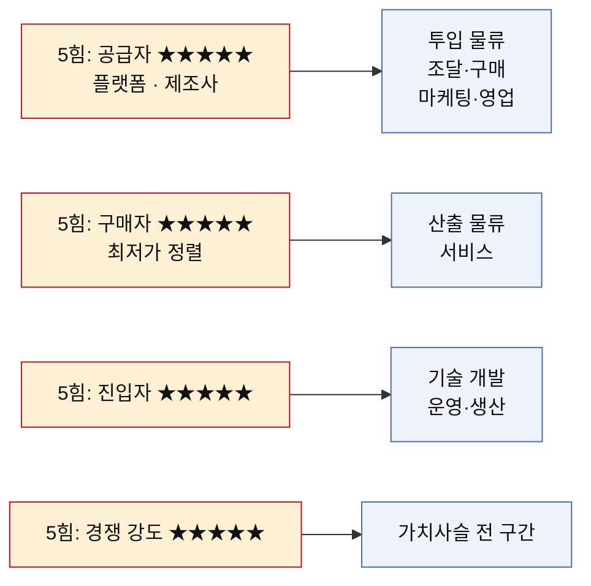
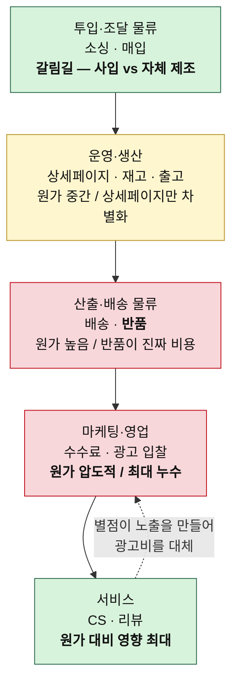
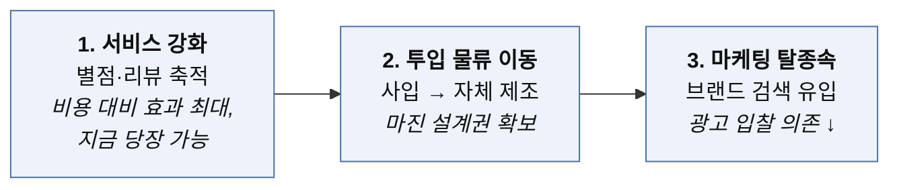

# 가치사슬 분석 — 온라인 커머스 (오프라인 매장 없음)

> 방법론: [가치사슬-분석-방법론.md](./가치사슬-분석-방법론.md)
> 같은 시장의 5힘 분석: [분석02-온라인커머스.md](./분석02-온라인커머스.md)
> 비교 분석: [비교-가치사슬-OTT-vs-온라인커머스.md](./비교-가치사슬-OTT-vs-온라인커머스.md)
> 작성일: 2026-08-06

## 5힘 분석에서 넘어온 숙제

5힘 분석의 판정은 매력도 낮음이었다. 수요가 100% 플랫폼 안에만 있고, 최저가 정렬이 구매자 편에서 상시 작동하며, 입지라는 진입 장벽이 통째로 사라졌기 때문이다. 다만 자체 브랜드 제조라는 탈출구가 있다는 단서가 붙었다. 가치사슬에서 확인할 것은 **그 탈출구가 실제로 어느 활동에서 열리는가**다.

주목할 점은 **공급자 압력이 세 칸에 걸쳐 있다**는 것이다. 플랫폼은 상품을 대주는 쪽이 아니라 손님을 대주는 쪽이라서, 투입 물류가 아니라 마케팅·영업 칸으로도 압력이 들어온다. 5힘에서는 하나로 묶였던 힘이 가치사슬에서는 갈라진다.

## 활동별 원가 비중과 차별화 기여도

| 활동 | 원가 비중 | 차별화 기여 | 판정 |
|---|---|---|---|
| 투입·조달 물류 (소싱·매입) | 높음 | 사입은 낮음 / 자체 제조는 높음 | 갈림길이 여기 |
| 운영·생산 (상세페이지·재고·포장) | 중간 | 중간 | 상세페이지만 차별화 여지 |
| 산출·배송 물류 (배송·반품) | 높음 | 중간 | 속도는 상위 사업자만 무기화 |
| 마케팅·영업 (광고·수수료) | 압도적 | 낮음 | 최대 누수 지점 |
| 서비스 (CS·리뷰 관리) | 중간 | 높음 | 원가 대비 영향이 큰 유일한 칸 |

---

# 1. 주요활동 분석

## 1-1. 투입·조달 물류 (Inbound Logistics)
### 상품 소싱과 매입

| 가치사슬 **설계**를 위한 질문 🏗️ | 가치사슬 **개선**을 위한 질문 🚀 |
| --- | --- |
| • 무엇을 팔 것인가 — 사입 재판매, 위탁 판매, 자체 제조(OEM·ODM) 중 무엇으로 시작할 것인가? • 어떤 카테고리를 고를 것인가(회전율·단가·반품률·보관 난이도)? • 국내 도매와 해외 소싱의 비중을 어떻게 둘 것인가? • 초도 물량과 재고 회전 목표를 어떻게 잡을 것인가? • 상품 정보(규격·원산지·인증)를 어떻게 수집·표준화할 것인가? • 제조사가 우리에게 물건을 줄 이유는 무엇인가? | • 매입 단가를 낮출 수 있는가, 아니면 물량이 늘어도 그대로인가? • 특정 제조사·도매처에 대한 의존도를 낮출 수 있는가? • 공급 지연이나 품절이 발생했을 때 대체 소싱 경로가 있는가? • 판매 데이터를 다음 발주와 신상품 기획에 되먹이고 있는가? • 재고 회전율을 높이면서 품절률을 낮출 수 있는가? • 사입에서 자체 제조로 넘어갈 시점과 조건은 무엇인가? |

**핵심 진단** — 이 칸이 사업 전체의 성격을 결정한다. **사입 재판매를 택하면 같은 물건을 누구나 뗄 수 있으므로 차별화가 원천적으로 봉쇄되고**, 가치사슬의 나머지 여덟 칸이 전부 가격 경쟁에 끌려간다. 자체 제조로 넘어가면 매입 단가가 원가가 아니라 설계 변수가 되고, 그때부터 다른 칸에서 손댈 여지가 생긴다. 5힘 분석에서 말한 탈출구가 열리는 지점이 정확히 여기다.

## 1-2. 운영·생산 (Operations)
### 상품화·재고·출고 준비

| 가치사슬 **설계**를 위한 질문 🏗️ | 가치사슬 **개선**을 위한 질문 🚀 |
| --- | --- |
| • 소싱한 상품을 판매 가능한 형태로 만드는 과정은 무엇인가(촬영·상세페이지·옵션 구성·가격 책정)? • 재고를 직접 보관할 것인가, 플랫폼 물류나 3PL에 맡길 것인가? • 주문 접수 → 결제 확인 → 피킹 → 포장 → 출고 흐름을 어떻게 설계할 것인가? • 여러 판매 채널의 재고를 어떻게 동기화할 것인가? • 주문 폭증(행사·시즌) 시 처리 능력을 어떻게 확보할 것인가? • 어디까지 자동화하고 어디부터 사람이 볼 것인가? | • 상세페이지 제작 시간을 줄이면서 전환율을 높일 수 있는가? • 오출고·파손·오배송 비율을 줄일 수 있는가? • 채널 간 재고 불일치로 발생하는 취소를 없앨 수 있는가? • 포장재와 포장 공수를 줄이면서 파손률을 유지할 수 있는가? • 재고 보관 비용과 품절 손실의 균형점을 찾고 있는가? • 시즌 물량 급증을 상시 인력 증원 없이 감당할 수 있는가? |

**핵심 진단** — 상세페이지는 이 칸에서 유일하게 **차별화가 발생하는 지점**이다. 같은 물건이라도 어떻게 찍고 설명하느냐에 따라 전환율이 갈린다. 반면 재고와 출고는 위생 요인에 가깝다. 잘해도 칭찬받지 못하고 실수하면 별점으로 돌아온다.

## 1-3. 산출·배송 물류 (Outbound Logistics)
### 배송과 반품

| 가치사슬 **설계**를 위한 질문 🏗️ | 가치사슬 **개선**을 위한 질문 🚀 |
| --- | --- |
| • 고객에게 상품이 도달하는 경로를 어떻게 설계할 것인가(택배·플랫폼 물류·직접 배송)? • 배송 속도를 어느 수준으로 약속할 것인가? • 배송비 정책을 어떻게 정할 것인가(무료·조건부·유료)? • 주문·발송·도착 상태를 어떤 방식으로 알릴 것인가? • 반품·교환 절차를 어떻게 설계할 것인가? • 도서·산간, 해외 배송을 어떻게 처리할 것인가? | • 배송 소요일과 지연율을 줄일 수 있는가? • 반품률을 낮출 수 있는가 — 원인이 상품인가, 상세페이지인가, 배송인가? • 반품 물류비와 재판매 불가 재고를 줄일 수 있는가? • 배송 지연 시 고객이 문의하기 전에 먼저 알릴 수 있는가? • 과대 포장을 줄이면서 파손 클레임을 늘리지 않을 수 있는가? • 배송 경험이 재구매로 이어지고 있는가? |

**핵심 진단** — **반품이 이 칸의 진짜 비용이다.** 5힘 분석에서 짚었듯 쉬워진 반품은 사실상 무료 체험으로 작동하고, 그 비용은 판매자가 진다. 배송 속도는 상위 사업자만 무기로 쓸 수 있다. 자체 물류망이 없는 판매자에게는 플랫폼 물류에 들어가는 것 말고 선택지가 없고, 들어가는 순간 종속이 깊어진다.

## 1-4. 마케팅 및 영업 (Marketing & Sales)

| 가치사슬 **설계**를 위한 질문 🏗️ | 가치사슬 **개선**을 위한 질문 🚀 |
| --- | --- |
| • 어느 채널에서 팔 것인가 — 오픈마켓, 종합몰, 자사몰, SNS 중 어디에 무게를 둘 것인가? • 검색 노출을 어떻게 확보할 것인가(키워드·광고·리뷰 수)? • 광고 예산을 어떤 기준으로 배분할 것인가? • 가격을 어떻게 책정할 것인가 — 최저가 추종인가, 브랜드 프리미엄인가? • 리뷰와 별점을 어떻게 쌓을 것인가? • 브랜드를 만들 것인가, 상품만 팔 것인가? | • 광고비 대비 매출(ROAS)이 개선되고 있는가, 입찰가만 오르고 있는가? • 광고를 끄면 매출이 얼마나 남는가? • 브랜드명 검색 유입 비중이 늘고 있는가? • 신규 획득과 재구매의 비용 차이를 알고 있는가? • 쿠폰·할인이 없으면 팔리지 않는 상태가 되어 있지 않은가? • 플랫폼 알고리즘 변경이 매출에 미치는 영향을 줄일 수 있는가? |

**핵심 진단** — **원가 비중이 가장 크면서 차별화 기여는 가장 낮은 칸이다.** 판매 수수료에 광고비가 얹히고, 상단 노출을 두고 모두가 입찰하니 입찰가는 계속 오른다. 잘 팔릴수록 더 내는 구조라서, 매출이 늘어도 마진이 따라오지 않는다.

여기서 던져야 할 질문 하나가 다른 모든 질문보다 무겁다. **"광고를 끄면 매출이 얼마나 남는가?"** 답이 0에 가깝다면 이 사업은 판매업이 아니라 광고 대행업에 가깝다.

## 1-5. 서비스 (Service)

| 가치사슬 **설계**를 위한 질문 🏗️ | 가치사슬 **개선**을 위한 질문 🚀 |
| --- | --- |
| • 문의·교환·환불·파손·오배송을 어떻게 처리할 것인가? • 고객이 스스로 해결할 수 있는 범위는 어디까지인가? • 채널별로 흩어진 문의를 어떻게 한곳에서 볼 것인가? • 리뷰와 별점에 어떻게 대응할 것인가? • A/S가 필요한 상품은 누가 책임지는가(판매자·제조사·플랫폼)? • 고객 문의를 상품 개선으로 연결하는 체계가 있는가? | • 반복 문의를 상세페이지 수정으로 없앨 수 있는가? • 배송 지연이나 품절을 고객 문의 전에 먼저 알릴 수 있는가? • 낮은 별점의 원인을 상품·배송·설명 중 무엇으로 분류하고 있는가? • 응답 시간이 아니라 실제 해결률을 보고 있는가? • CS 응대가 재구매로 이어지는가? • 악성 리뷰와 정당한 불만을 구분해 대응하고 있는가? |

**핵심 진단** — OTT와 정반대다. **원가 비중은 중간인데 차별화 기여는 이 사업에서 가장 높다.** 리뷰와 별점이 검색 노출과 구매 결정을 동시에 좌우하기 때문이다. CS는 비용 센터가 아니라 마케팅 활동에 가깝게 봐야 한다. 문의 한 건을 잘 처리하면 별점이 남고, 그 별점이 광고비를 대신한다.

---

# 2. 지원활동 분석

## 2-1. 기업 인프라 (Firm Infrastructure)

| 가치사슬 **설계**를 위한 질문 🏗️ | 가치사슬 **개선**을 위한 질문 🚀 |
| --- | --- |
| • 통신판매업 신고, 각종 인증(KC·식약처 등), 세무 구조를 어떻게 갖출 것인가? • 브랜드와 판매 법인을 분리할 것인가? • 전자상거래법·표시광고법·개인정보 요구를 어떻게 반영할 것인가? • 상표권과 디자인권을 언제 확보할 것인가? • 신규 카테고리 진입 시 인증·규제 검토 절차는 무엇인가? | • 매출은 느는데 인증·세무 리스크가 방치되고 있지 않은가? • 매출 지표와 마진 지표가 충돌할 때 무엇으로 판단하는가? • 상표 도용과 무단 복제에 대응할 체계가 있는가? • 플랫폼 제재나 계정 정지에 대비한 대응 절차가 있는가? • 채널별로 흩어진 정산을 일관되게 관리하는가? |

**핵심 진단** — 진입 장벽이 낮다는 것은 인프라를 갖추지 않고도 시작할 수 있다는 뜻이다. 문제는 **그 상태로 규모가 커질 때다.** 상표를 뒤늦게 출원하려는데 이미 남이 가져간 경우가 이 산업에서 반복된다.

## 2-2. 인적자원 관리 (Human Resource Management)

| 가치사슬 **설계**를 위한 질문 🏗️ | 가치사슬 **개선**을 위한 질문 🚀 |
| --- | --- |
| • 소싱·상세페이지·광고 운영·CS·물류 중 누구를 먼저 뽑을 것인가? • 어디까지 직접 하고 어디부터 외주로 돌릴 것인가? • 광고 운영을 대행사에 맡길 것인가, 내재화할 것인가? • 상품 기획 판단과 데이터 판단의 결정권을 어떻게 나눌 것인가? • 시즌 물량 급증기의 인력을 어떻게 확보할 것인가? | • 소싱 노하우가 대표 한 사람에게만 쌓여 있지 않은가? • 광고 대행사에 계정 통제권까지 넘어가 있지 않은가? • 성과평가가 매출뿐 아니라 반품률·마진을 반영하는가? • CS 인력의 이직이 응대 품질에 미치는 영향을 줄일 수 있는가? • 인원이 늘어도 상품 출시 속도를 유지할 수 있는가? |

## 2-3. 기술 개발 (Technology Development)

| 가치사슬 **설계**를 위한 질문 🏗️ | 가치사슬 **개선**을 위한 질문 🚀 |
| --- | --- |
| • 핵심 경쟁력을 만드는 기술은 무엇인가 — 재고 관리, 가격 자동화, 데이터 분석 중 어디인가? • 채널 통합 관리 도구를 직접 만들 것인가, 사서 쓸 것인가? • 자사몰을 어떤 방식으로 구축할 것인가(솔루션·자체 개발)? • 주문·재고·정산 데이터를 어떻게 한곳에 모을 것인가? • 고객 데이터를 어떤 형태로 자산화할 것인가? • AI를 상세페이지 제작·CS 응대·수요 예측에 어떻게 적용할 것인가? | • 채널이 늘어날 때 관리 공수가 선형으로 늘고 있지 않은가? • 품절과 과잉 재고를 사전에 예측할 수 있는가? • 가격 변경을 채널 전체에 즉시 반영할 수 있는가? • 자사몰 데이터가 실제 의사결정에 쓰이고 있는가? • AI가 만든 상품 설명의 과장·허위 표시를 검증하는 체계가 있는가? • 플랫폼 API 변경 대응 비용을 줄일 수 있는가? |

**핵심 진단** — OTT와 달리 여기서 기술은 **차별화가 아니라 규모 확장의 전제 조건**이다. 채널이 셋을 넘어가는 순간 수작업으로는 재고와 가격을 맞출 수 없다. 기술 투자의 목표는 남보다 잘하는 게 아니라 **판매자 수가 늘어도 관리 공수가 늘지 않게 만드는 것**이다.

## 2-4. 조달·구매 (Procurement)

| 가치사슬 **설계**를 위한 질문 🏗️ | 가치사슬 **개선**을 위한 질문 🚀 |
| --- | --- |
| • 필요한 물류·촬영·포장재·솔루션·광고 대행을 어떻게 조달할 것인가? • 공급자를 가격뿐 아니라 납기·품질 기준으로 평가하는가? • 제조사와 물류사에 대한 협상력을 어떻게 확보할 것인가? • 공급자 이탈이나 계약 종료 시 판매를 지속할 수 있는가? • 외주 업체가 다루는 고객 개인정보를 어떻게 통제할 것인가? | • 물량 증가에 따라 택배 단가와 물류 조건을 개선할 수 있는가? • 특정 물류사나 솔루션에 과도하게 종속되어 있지 않은가? • 핵심 공급자에 대한 대안과 전환계획이 있는가? • 계약에 품질·납기 미달 시 책임 조항이 포함되는가? • 공급자의 재무 위험을 지속적으로 보고 있는가? |

**핵심 진단** — 택배 단가는 **물량에 정직하게 비례하는 몇 안 되는 항목**이다. 광고비처럼 잘될수록 오르는 게 아니라 잘될수록 내려간다. 규모의 경제가 실제로 작동하는 유일한 칸이라, 성장의 보상이 여기서 나온다.

---

# 3. 종합

## 가치가 새는 지점

## 세 가지 결론

**마케팅·영업 칸이 사실상 공급자에게 넘어가 있다.** 5힘에서 플랫폼을 공급자로 놓았던 판단이 가치사슬에서 구체적인 모습을 드러낸다. 보통의 사업이라면 마케팅은 스스로 통제하는 활동인데, 여기서는 노출 순위를 남이 정하고 입찰가도 남이 만든 경매장에서 결정된다. **자기 가치사슬의 한 칸을 통째로 임대해 쓰는 셈이다.**

**서비스 칸의 투자 수익률이 가장 높다.** 원가 비중은 중간인데 별점을 통해 노출과 전환에 직접 연결된다. 문의 응대를 잘하면 별점이 남고, 별점이 검색 순위를 올리고, 순위가 광고비를 줄인다. CS를 비용으로만 보면 이 고리를 놓친다.

**투입 물류에서 갈림길이 갈린다.** 사입에 머무르면 나머지 여덟 칸이 전부 가격 경쟁의 하청이 되고, 자체 제조로 넘어가면 마진 설계권이 생긴다. 5힘 분석에서 말한 탈출구는 추상적인 전략이 아니라 **첫 번째 칸의 선택**이었다.

## 그래서 어디에 손대야 하는가

순서가 중요하다. 광고비가 가장 아프다고 해서 광고부터 줄이면 매출이 먼저 사라진다.

먼저 서비스 칸에서 별점을 쌓아 광고 의존도를 조금이라도 낮추고, 그 여유로 자체 상품 개발에 들어가고, 자체 상품이 생긴 다음에 브랜드 검색 유입을 만든다. **광고를 줄이는 것은 목표이지 수단이 아니다.**
