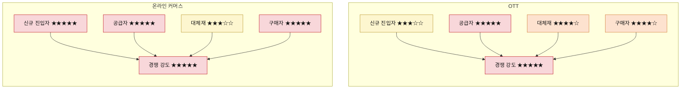
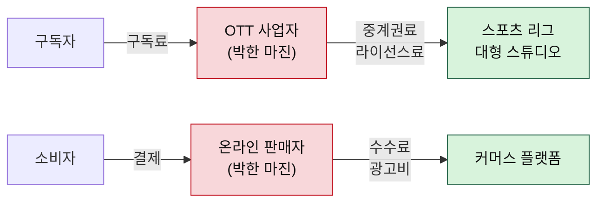
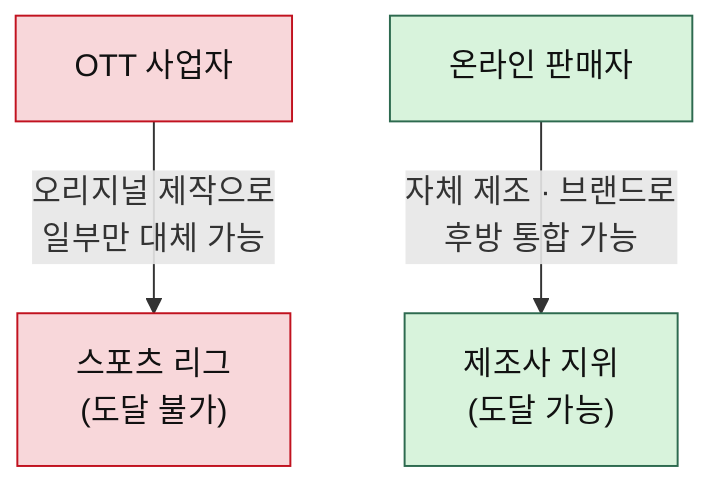

# 비교 분석 — OTT vs 온라인 커머스

> 방법론: [포터의-5가지-힘-분석-방법론.md](./포터의-5가지-힘-분석-방법론.md)
> 개별 분석: [분석01-OTT.md](./분석01-OTT.md) · [분석02-온라인커머스.md](./분석02-온라인커머스.md)
> 작성일: 2026-08-06

## 힘의 강도 비교표

| 5가지 힘 | OTT (스포츠·영화·드라마) | 온라인 커머스 |
|---|---|---|
| 공급자의 힘 | ★★★★★ 매우 강함 (리그·스튜디오) | ★★★★★ 매우 강함 (플랫폼·제조사) |
| 구매자의 힘 | ★★★★☆ 강함 (스포츠는 예외적으로 약함) | ★★★★★ 매우 강함 (최저가 정렬) |
| 신규 진입자의 위협 | ★★★☆☆ 중간 (자금 장벽 존재) | ★★★★★ 매우 강함 (장벽 소멸) |
| 대체재의 위협 | ★★★★☆ 강함 (유튜브·숏폼) | ★★★☆☆ 중간 |
| 산업 내 경쟁 강도 | ★★★★★ 극심 | ★★★★★ 극심 |
| **산업 매력도** | **낮음** | **낮음 (단, 층에 따라 갈림)** |

---

## 공통점 — 둘 다 통행세를 내고 있다

가장 크게 겹치는 대목은 수익이 산업 안에 남지 않고 위로 빨려 올라간다는 점이다. OTT는 리그와 스튜디오에, 온라인 커머스는 플랫폼에 낸다. 둘 다 거래 규모는 어마어마한데 정작 그 안에서 장사하는 쪽에는 남는 게 없다.

여기서 이번 비교의 첫 번째 결론이 나온다. **산업의 매력도는 시장이 얼마나 크냐가 아니라 만들어진 부가가치를 누가 가져가느냐로 결정된다.**

---

## 차이가 갈리는 지점

### 장벽이 있어도 수익성은 지켜지지 않았다

OTT는 조 단위 콘텐츠 자금이라는 장벽 덕에 소수만 남았고, 온라인 커머스는 장벽이 없어 무수히 난립한다. 정반대인데 수익성은 둘 다 나쁘다. 한쪽은 소수의 거인이 제작비로 출혈하고, 다른 쪽은 다수의 판매자가 최저가로 출혈할 뿐이다.

진입 장벽은 필요조건이지 충분조건이 아니다. 문을 잠가놔도 안에 들어온 사람들끼리 죽기 살기로 싸우면 수익성은 지켜지지 않는다.

### 무료 대체재가 있느냐 없느냐

OTT의 대체재는 유튜브와 숏폼이다. 공짜인 데다 공급이 무한해서 가격을 올릴 여지를 원천 차단한다. 커머스의 대체재인 오프라인 매장이나 중고 거래는 결국 돈을 내야 하는 것들이다. 무료 대체재가 없다는 게 커머스가 가진 유일한 구조적 우위이고, 방법론이 대체재를 별도 항목으로 뺀 이유도 여기서 드러난다.

### 최저가 정렬이라는 기계

OTT에는 스포츠 독점 중계권이라는 락인 카드가 있다. 시즌 내내 못 떠나게 만드는 장치다. 커머스에는 그런 게 없을 뿐 아니라, 최저가 정렬이 구매자 편에서 상시 작동한다. 사람이 발품 팔아 비교하던 시절과는 힘의 크기가 다르다.

### 위로 올라갈 수 있는가 — 진짜 갈림길

OTT 사업자는 공급자가 될 수 없다. 리그를 살 수는 없다. 오리지널 제작으로 일부는 대체하지만 스포츠 중계권은 영원히 남의 것이고, 통행세를 없앨 방법이 구조적으로 막혀 있다.

커머스 판매자는 공급자가 될 수 있다. 사입에서 자체 제조로 올라가는 후방 통합의 길이 실제로 열려 있고, 브랜드를 세우면 플랫폼 의존도까지 함께 낮아진다.

→ 같은 '낮은 매력도'라도 **개별 기업이 힘의 구조를 다시 짤 여지가 있느냐**에서 갈린다. 방법론 3장이 "우리 자원과 산업 매력도를 비교해 전략을 짜라"고 한 대목이 바로 이 판단이다.

---

## 전략 시사점

**OTT에서 싸운다면**
남의 콘텐츠를 빌려 트는 유통업으로는 구조상 돈을 벌 수 없다. 자체 IP 보유나 장기 독점 계약으로 공급자 쪽으로 올라가는 것이 유일한 방향이고, 그마저도 완전히 올라갈 수는 없다는 한계를 안고 시작해야 한다.

**온라인 커머스에서 싸운다면**
순서가 정해져 있다. 자체 상품을 갖고, 브랜드 검색 유입을 만들고, 그다음에 자사몰을 붙인다. 순서를 뒤집으면 안 된다. 브랜드 없이 자사몰부터 열면 아무도 오지 않는다. 상세한 단계는 [분석02-온라인커머스.md](./분석02-온라인커머스.md)에 있다.

**공통 원칙**

> **"내 위에 나보다 힘센 공급자가 있는가? 그리고 나는 거기로 올라갈 수 있는가?"**

앞 문장이 산업의 현재 매력도를 설명한다면, 뒷 문장은 그 산업에서 내가 가질 수 있는 미래를 묻는다. 두 시장의 차이는 정확히 뒷 문장에서 갈렸다.
