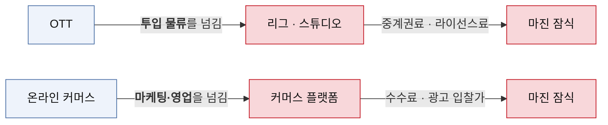
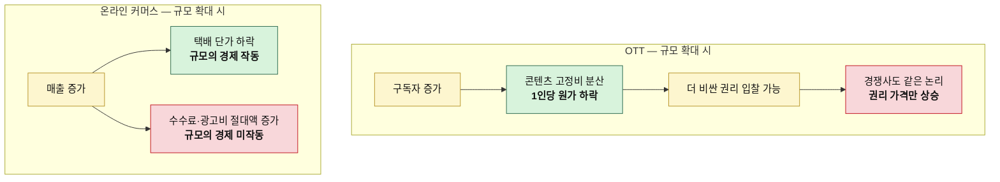
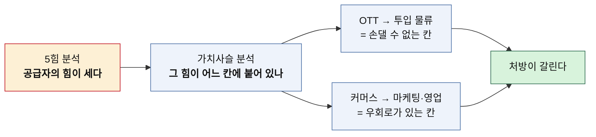

# 가치사슬 비교 분석 — OTT vs 온라인 커머스

> 방법론: [가치사슬-분석-방법론.md](./가치사슬-분석-방법론.md)
> 개별 분석: [분석03-OTT-가치사슬.md](./분석03-OTT-가치사슬.md) · [분석04-온라인커머스-가치사슬.md](./분석04-온라인커머스-가치사슬.md)
> 같은 시장의 5힘 비교: [비교-OTT-vs-온라인커머스.md](./비교-OTT-vs-온라인커머스.md)
> 작성일: 2026-08-06

## 이 비교로 확인하려는 것

5힘 비교에서 두 시장은 같은 결론에 도달했다. 둘 다 매력도가 낮고, 둘 다 부가가치를 상류에 넘긴다는 것이었다. 그런데 5힘은 **얼마나 새는지**까지만 알려주고 **어디서 새는지**는 알려주지 않는다. 가치사슬 비교는 그 구멍의 위치를 짚는 작업이다.

결론부터 적으면, 두 시장은 **누수 지점이 다르고 그래서 처방도 다르다.**

---

## 1. 활동별 대조표

| 활동 | OTT | 온라인 커머스 |
|---|---|---|
| **투입·조달 물류** | 원가 압도적 · 차별화 최대 **통제 불가** (리그·스튜디오) | 원가 높음 · 차별화는 선택에 달림 **통제 가능** (자체 제조 가능) |
| **운영·생산** | 원가 중간 · 차별화 낮음 위생 요인 | 원가 중간 · 차별화 중간 상세페이지만 유효 |
| **산출·배송 물류** | 원가 중간 · 차별화 중간 추천이 유일한 무기 | 원가 높음 · 차별화 중간 **반품이 진짜 비용** |
| **마케팅·영업** | 원가 높음 · 차별화 중간 **재획득 반복 지출** | 원가 압도적 · 차별화 낮음 **플랫폼에 임대된 칸** |
| **서비스** | 원가 낮음 · 영향 낮음 불만이 이탈로 직행 | 원가 중간 · **영향 최대** 별점이 노출을 만듦 |
| **기술 개발** | 차별화 아닌 **원가 방어선** | 차별화 아닌 **확장 전제 조건** |
| **조달·구매** | 투입 물류와 사실상 한 칸 | **규모의 경제가 유일하게 작동** |

---

## 2. 공통점 — 두 시장 모두 한 칸을 남에게 맡기고 있다

5힘 비교에서 "둘 다 통행세를 낸다"고 정리했다. 가치사슬로 내려오면 그 통행세가 **가치사슬의 특정 칸을 외부에 넘긴 대가**라는 게 드러난다.

넘긴 칸이 다르다는 게 중요하다. OTT는 **가치사슬의 첫 칸**을 넘겼고, 커머스는 **네 번째 칸**을 넘겼다. 첫 칸을 넘기면 만들 것 자체가 남의 것이 되고, 네 번째 칸을 넘기면 만든 것을 팔 길이 남의 것이 된다.

또 하나 겹치는 대목은 **기술 개발이 어느 쪽에서도 무기가 아니라는 점**이다. OTT에서 기술은 버퍼링을 막는 방어선이고, 커머스에서 기술은 채널이 늘어도 관리 공수가 안 늘게 하는 전제 조건이다. 둘 다 잘해도 고객이 알아주지 않고 못하면 죽는다. 소프트웨어를 다루는 사업이라고 해서 기술이 자동으로 차별화가 되지는 않는다.

---

## 3. 차이가 갈리는 지점

### 통제 가능한 칸에 돈이 걸려 있는가

OTT에서 원가와 차별화를 동시에 쥔 칸은 투입 물류다. 그런데 이 칸은 리그와 스튜디오가 통제한다. **돈이 걸린 칸과 손댈 수 있는 칸이 어긋나 있다.**

커머스에서 원가가 가장 큰 칸은 마케팅·영업이지만, 차별화를 만드는 칸은 투입 물류(자체 제조)와 서비스(별점)다. 이 둘은 판매자가 직접 통제한다. 어긋남이 있긴 해도 **손댈 곳이 자기 손 안에 남아 있다.**

이게 5힘 비교에서 "위로 올라갈 수 있는가"로 정리했던 차이의 실체다. 그때는 후방 통합 가능성이라는 추상적 표현이었는데, 가치사슬로 내려오니 **첫 번째 칸의 소유권 문제**로 구체화된다.

### 서비스 칸의 위상이 정반대다

같은 활동인데 두 시장에서 정반대 역할을 한다.

| | OTT | 온라인 커머스 |
|---|---|---|
| 불만이 생기면 | 문의 없이 그냥 해지 | 별점으로 남음 |
| 그래서 서비스는 | 비용 센터 | **마케팅 활동** |
| 투자 판단 | 최소화가 합리적 | 확대가 합리적 |

OTT는 해지가 쉬워서 불만이 문의로 오지 않고 이탈로 직행한다. 문의가 적은 게 서비스가 좋아서가 아니다. 반면 커머스는 불만이 공개 리뷰로 남고, 그 리뷰가 검색 노출과 다음 구매자의 결정을 좌우한다. **커머스의 CS는 비용이 아니라 광고비를 대체하는 투자다.**

방법론의 질문표를 그대로 적용했다면 이 차이를 놓쳤을 것이다. "반복 문의를 제품 개선으로 제거할 수 있는가"는 두 시장에 똑같이 유효한 질문이지만, 그 답에 얼마를 걸어야 하는지는 완전히 다르다.

### 규모가 커질 때 원가가 어떻게 움직이는가

이 항목이 두 사업의 미래를 가른다.

OTT는 콘텐츠가 고정비라 규모의 경제가 강하게 작동한다. 문제는 그 이익이 회사에 남지 않는다는 것이다. **단가가 낮아진 만큼 더 비싼 권리를 살 여력이 생기고, 경쟁사도 똑같이 움직이니 결국 리그가 가져간다.** 규모의 경제가 공급자에게 흡수되는 구조다.

커머스는 칸마다 다르다. 택배 단가는 물량에 정직하게 비례해 내려가지만, 플랫폼 수수료와 광고비는 매출에 비례해 올라간다. **한 사업 안에서 규모의 경제가 작동하는 칸과 역행하는 칸이 공존한다.** 그래서 "규모를 키우면 나아지는가"라는 질문에 하나로 답할 수 없고, 칸별로 따로 답해야 한다.

---

## 4. 처방이 갈리는 지점

| | OTT | 온라인 커머스 |
|---|---|---|
| **손댈 칸** | 투입 물류 (오리지널 제작) | 서비스 → 투입 물류 → 마케팅 |
| **난이도** | 매우 높음 — 조 단위 투자 | 단계적으로 가능 |
| **얻는 것** | 계약 만료 후에도 남는 IP | 마진 설계권과 노출 확보 |
| **치르는 대가** | 흥행 실패 위험을 직접 부담 | 시간 — 별점과 브랜드는 빨리 안 쌓임 |
| **실패 시** | 제작비가 그대로 손실 | 원래 자리로 복귀, 손실은 제한적 |

두 처방의 성격이 다르다. OTT의 해법은 **한 번에 크게 걸어야 하는 판단**이다. 오리지널 제작으로 옮겨가려면 대규모 투자가 선행돼야 하고, 실패하면 제작비가 그대로 사라진다. 사온 콘텐츠는 계약이 끝나면 정리되지만 직접 만든 실패작은 회수할 곳이 없다. **통제권을 얻는 대가로 위험을 사오는 거래**다.

커머스의 해법은 **작게 시작해 순서대로 밟는 경로**다. 지금 당장 CS 응대를 개선해 별점을 쌓는 일은 추가 자본이 거의 들지 않는다. 그 여유로 자체 상품을 개발하고, 자체 상품이 생긴 뒤에 브랜드 검색 유입을 만든다. 각 단계가 다음 단계의 재원을 만든다.

순서를 뒤집으면 둘 다 실패한다. 브랜드 없이 자사몰부터 열면 아무도 오지 않고, 시청자 없이 오리지널부터 만들면 볼 사람이 없다.

---

## 5. 두 프레임을 함께 쓸 때 얻는 것

이번 실습에서 확인한 것은 **5힘과 가치사슬이 같은 사실을 다른 해상도로 보여준다**는 점이다.

5힘만 봤다면 두 시장은 "공급자가 세서 매력도가 낮은 산업" 하나로 묶였을 것이다. 가치사슬로 내려오니 한쪽은 첫 칸을 빼앗겼고 다른 쪽은 네 번째 칸을 빌려 쓰는 중이라는 게 드러났고, 그 차이에서 서로 다른 처방이 나왔다.

> **5힘은 "여기서 싸울 것인가"를 묻고, 가치사슬은 "그렇다면 어느 칸부터 손댈 것인가"를 묻는다.**

두 질문을 이어서 던져야 전략이 된다. 앞의 질문만 던지면 진단에서 멈추고, 뒤의 질문만 던지면 애초에 이길 수 없는 산업에서 활동만 열심히 개선하게 된다.
