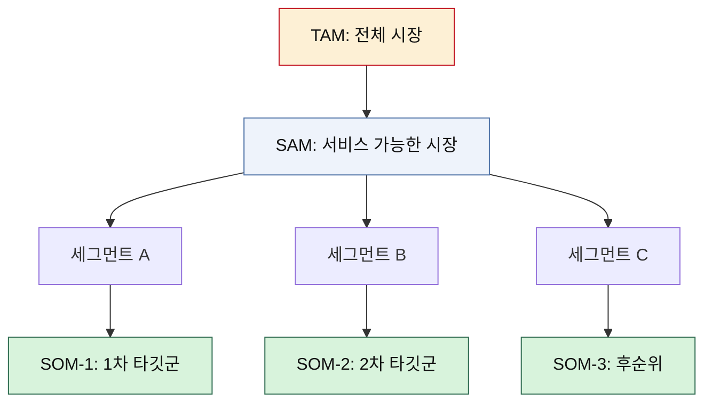
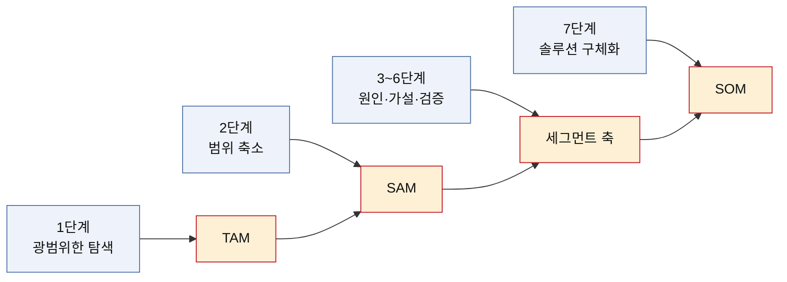

# 04 — 시장 규모 분석 방법론 (TAM · SAM · SOM과 Market Segment Map)

> KSF가 **무엇을 먼저 할지**를 정했다면, 시장 규모 분석은 **그것으로 얼마를 벌 수 있는지**를 센다.
> 선행 분석: [포터의 5가지 힘](../포터/) · [가치사슬](../가치사슬/) · [KSF](../KSF/)
> 작성일: 2026-08-10

## 세 층위로 쪼개는 이유

시장 규모를 하나의 숫자로 말하면 반드시 틀린다. "이 시장은 3조 원입니다"라는 문장은 두 가지를 동시에 숨긴다. 그 3조 원 중 우리 제품이 닿을 수 있는 범위가 얼마인지, 그리고 올해 실제로 가져올 수 있는 몫이 얼마인지다. 투자자가 시장 규모를 물을 때 확인하려는 것은 시장이 큰지가 아니라 **큰 시장과 작은 실행 사이의 거리를 사업자가 아는지**다.

그래서 시장 규모는 층위를 나눠 센다.

| 구분 | 의미 | 답하는 질문 | 주요 데이터 출처 |
|---|---|---|---|
| **TAM** (Total Addressable Market) | 전체 시장 규모 — 이론적으로 접근 가능한 전체 수요 | 이 문제가 걸린 판이 얼마나 큰가 | Statista, IBISWorld, 국제기구 통계, 산업 협회 |
| **SAM** (Serviceable Available Market) | 실제로 서비스 가능한 시장 — 우리 제품이 현실적으로 도달 가능한 영역 | 지역·규제·채널을 감안하면 얼마가 남는가 | 국가 통계, 부처·공공기관 조사, 업계 계약 규모 |
| **SOM** (Serviceable Obtainable Market) | 단기적으로 점유 가능한 시장 — 현재 리소스로 실현 가능한 목표 범위 | 올해 이 팀이 실제로 가져올 몫은 얼마인가 | 설문·인터뷰, 파일럿 계약, 검색 트렌드 |

세 층위의 관계에서 읽어야 하는 것은 절댓값이 아니라 **비율**이다. TAM 대비 SAM이 지나치게 작으면 그 사업은 국내에서 규모의 한계에 부딪힌다. SAM 대비 SOM이 지나치게 크면 1년 차 목표가 과대하다. 숫자 세 개가 아니라 두 개의 낙차가 결론을 만든다.

## 산정 방식 — 두 방향에서 세고 맞춰본다

| 방식 | 계산 방향 | 강점 | 약점 |
|---|---|---|---|
| **하향식(Top-down)** | 큰 시장 통계에서 비율을 곱해 내려온다 | 빠르고 외부 근거로 시작할 수 있다 | 곱하는 비율이 곧 결론이라 부풀리기 쉽다 |
| **상향식(Bottom-up)** | 단가 × 수량으로 쌓아 올린다 | 실행 계획과 바로 연결된다 | 시장 전체를 놓치기 쉽다 |

두 방향의 결과가 자릿수까지 어긋나면 어느 한쪽의 가정이 틀렸다. 그 불일치를 찾는 과정이 시장 규모 분석의 실제 작업이다. 숫자를 맞추는 일보다 어긋난 이유를 아는 것이 더 쓸모 있다.

## 흔히 어긋나는 네 지점

1. **TAM 부풀리기.** 남의 사업 매출까지 끌어와 판을 키우는 경우다. TAM은 "이 문제를 해결해서 돈이 흐를 수 있는 최대 범위"이지 인접 산업의 합계가 아니다.
2. **근거 없는 SOM 비율.** "SAM의 1%만 먹어도"라는 문장은 근거가 아니다. 1%가 몇 개의 계약, 몇 명의 사용자, 몇 번의 거래인지로 환산되지 않으면 그 1%는 희망이다.
3. **단위 혼동.** 사람 수, 거래 건수, 매출액을 섞어 쓰면 층위 간 비교가 무너진다. 세 층위는 반드시 같은 단위로 세고 단위가 여러 개 필요하면 표를 나눈다.
4. **가정과 통계의 뒤섞임.** 직접 관측된 수치와 우리가 세운 가정을 같은 표에 같은 글씨로 적으면, 읽는 사람은 전부 사실로 받아들인다. 흔들리는 숫자가 무엇인지 표시하지 않은 시장 규모는 검증할 수 없다.

## 서술 규칙 — 모든 숫자에 근거 강도를 붙인다

이 저장소의 시장 규모 문서는 숫자마다 아래 라벨 중 하나를 명시한다.

| 라벨 | 뜻 | 다룰 때의 태도 |
|---|---|---|
| 직접통계 | 공식 통계에서 그 정의 그대로 관측된 값 | 그대로 인용 가능 |
| 기관조사 | 특정 기관의 조사 결과. 표본·시점 한계가 있음 | 시점과 정의를 함께 적는다 |
| 공식사례 | 사업자·기관이 공개 발표한 실행 사실 | 규모 근거가 아니라 실현 가능성 근거 |
| 추정 | 외부 자료를 근거로 계산했으나 원출처 확인이 필요한 값 | 인용 전 원출처 확인 |
| 가정 | 우리가 세운 값. 근거는 논리뿐 | 민감도 분석 대상 |
| 데이터 공백 | 확인해야 하는데 자료가 없는 지점 | 다음 조사 항목으로 이관 |

라벨을 붙이면 시장 규모 표가 **결론이 아니라 검증 계획**으로 바뀐다. 어느 칸이 '가정'인지 보이는 순간, 다음에 무엇을 조사해야 하는지도 같이 보인다.

## Market Segment Map — 수치가 아니라 맥락으로 시장을 자른다

세그먼트 지도는 시장을 인구통계로 잘게 쪼개는 도구가 아니다. 행동 단서와 구매 맥락을 축으로 삼아 "누구에게 먼저 팔아야 하는가"를 보이게 만드는 그림이다. 20대 남성과 30대 여성으로 나눈 지도는 아무것도 알려주지 않지만 "이미 돈을 쓰고 있는가 / 쓸 수 있는 통로가 있는가"로 나눈 지도는 순서를 알려준다.

축을 고르는 기준은 하나다. **그 축이 갈리면 우리가 만들 제품도 갈려야 하는가.** 갈리지 않는다면 그 축은 지도가 아니라 장식이다.

| 시각화 형태 | 적합한 상황 |
|---|---|
| 매트릭스(2×2) | 두 개의 축이 제품 라인을 실제로 나눌 때 |
| 좌표평면(산점) | 세그먼트가 연속적이고 개체 수가 많을 때 |
| 벤 다이어그램 | 세그먼트가 겹치며 그 교집합이 기회일 때 |
| 히트맵 | 축이 셋 이상이거나 밀도 차이를 보여야 할 때 |

형태를 미리 정해두고 데이터를 맞추면 안 된다. 세그먼트를 먼저 적고 그것을 가장 오해 없이 보여주는 형태를 나중에 고른다.

## 7단계 워크플로우와의 대응 구조

TAM·SAM·SOM은 따로 계산하는 작업이 아니다. 문제의식에서 솔루션으로 내려가는 리서치 과정을 제대로 밟으면 세 층위가 각각 다른 단계에서 저절로 떨어진다.

| 층위 | 도출 단계 | 그 단계에서 하는 일 |
|---|---|---|
| **TAM** | 1단계 — 광범위한 탐색 | 문제의 전체 규모를 정성·정량으로 동시에 파악한다 |
| **SAM** | 2단계 — 범위 축소 | 사용자·콘텐츠·채널·지역이라는 제약을 걸어 범위를 한정한다 |
| **세그먼트** | 3~6단계 — 원인 분석과 가설 검증 | 손실이 어디서 발생하는지 쪼개다 보면 세그먼트 축이 나온다 |
| **SOM** | 7단계 — 솔루션 구체화 | MVP 범위와 파트너가 정해지면 1년 차 규모가 계산된다 |

거꾸로 말하면, SOM을 먼저 정해놓고 TAM을 역산하는 문서는 이 순서를 뒤집은 것이다. 그런 문서에서는 원하는 결론에 맞는 비율이 중간에 끼워진다.

### 7단계 각 단계의 작업 내용

| 단계 | 사용자 행동 | AI 활용 방식 | 산출물 |
|---|---|---|---|
| 1. 광범위한 탐색 | 거시적·복합적 문제를 정의한다 | 데이터 탐색 + Deep Research | 문제 전체 규모의 초기 그림 |
| 2. 범위 축소 | 제약 조건을 걸어 연구 범위를 좁힌다 | 논리 정제 및 검토 | 한정된 연구 범위 |
| 3. 핵심 원인 분석 | 표면 문제에서 근본 원인으로 초점을 옮긴다 | 데이터 탐색 + Deep Research | 심층 원인 구조 |
| 4. 가설 수립 | 원인을 근거로 검증 가능한 가설을 세운다 | 논리 정제 및 검토 | 가설과 뒷받침 논거 |
| 5. 정량적 검증 | 상반되는 데이터를 나란히 놓고 비교한다 | Deep Research + 시각화 | 비교 차트 초안 |
| 6. 반복적 정제 | 초안을 검토하고 세분화를 지시한다 | 시각화 + 논리 정제 | 최종 시각 자료 |
| 7. 솔루션 구체화 | 검증된 데이터로 실행을 계획한다 | 브레인스토밍 + Deep Research | 실행 계획, MVP 명세 |

이 단계표에서 시장 규모와 직접 연결되는 지점은 1단계와 2단계, 그리고 7단계다. 3~6단계는 숫자를 만들지 않지만 **세그먼트 축을 만든다.** 원인을 쪼개는 일과 시장을 쪼개는 일이 같은 작업이기 때문이다.

## 적용 사례

- [시장규모01 — 스포츠 OTT 접근성 레이어](./시장규모01-스포츠OTT-접근성.md)
