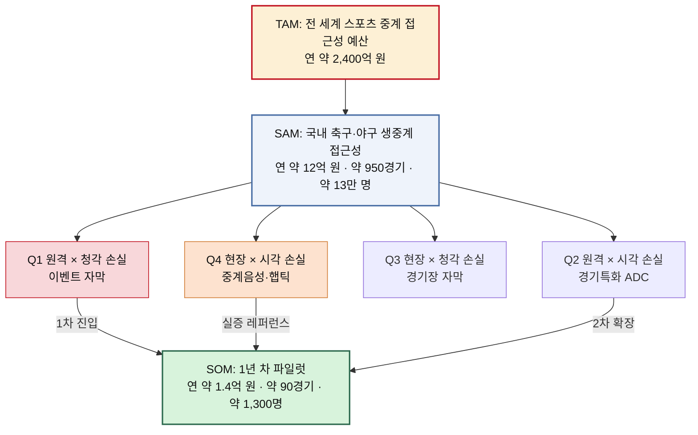

# 시장규모01 — 스포츠 OTT 접근성 레이어 (TAM · SAM · SOM)

> 산정 방법론: [TAM-SAM-SOM-방법론.md](./TAM-SAM-SOM-방법론.md)
> 원자료: [서비스_개선_기획서_스포츠OTT_접근성.pdf](../서비스_개선_기획서_스포츠OTT_접근성.pdf) (2026.08, 7단계 문제정의–검증–솔루션 워크플로우)
> 대상 독자: 스포츠 생중계 접근성 기능을 사업화하려는 창업가 또는 전략 기획팀
> 작성일: 2026-08-10

## 이 문서가 세려는 것

원자료 기획서는 시·청각장애인 스포츠 팬의 실시간 중계 경험 격차를 다룬다. 사업 기회를 "단순 장애인용 자막"이 아니라 **스포츠 생중계의 정보·몰입 격차를 줄이는 Accessibility Layer**로 규정했다. 수익 구조도 B2C 구독이 아니라 SDK/API, 리그 공동 패키지, 경기장 패키지, 데이터 엔진이라는 **B2B2C 인프라**로 정리됐다.

이 문서에서 세는 대상은 장애인 시청자가 낼 구독료가 아니다. **이미 중계권과 트래픽을 가진 OTT·리그·구단·방송사가 접근성 기능에 지불할 금액**이다. 세는 대상을 잘못 잡으면 뒤의 계산은 전부 무의미해진다.

### 흔히 이렇게 세지만, 이렇게 세면 틀린다

국내 시·청각장애 인구 약 67만 명에 월 구독료 1.3만 원을 곱하고 12개월을 곱하면 연 약 1,045억 원이 나온다. 발표 자료에 쓰기 좋은 숫자지만 세 가지 이유로 쓸 수 없다.

1. **사업 구조와 어긋난다.** 기획서의 결론은 "단독 장애인 OTT를 새로 만드는 것보다, 이미 중계권과 트래픽을 가진 OTT/리그에 기능을 공급하는 구조가 초기 진입장벽이 낮다"였다. 구독료 전액을 우리 시장으로 세는 것은 남의 매출을 끌어오는 계산이다.
2. **접근성의 몫이 분리되지 않는다.** 구독료는 중계권·제작·플랫폼 비용의 대가다. 그중 접근성 레이어에 귀속되는 부분만 우리 시장이다.
3. **인과 근거가 없다.** 기획서가 명시한 가장 중요한 발견은 숫자가 아니라 공백이다. 국내에 "접근성 부족 → 스포츠 OTT 시청 포기"를 잇는 직접 공개통계는 **0개**다. 접근성이 구독 전환을 만든다는 전제를 깔고 매출을 세울 근거가 아직 없다.

그래서 이 분석은 **과금 접점(경기 수·계약 건수)** 을 기본 단위로 삼고 수요 인구는 그 접점의 가치를 설명하는 보조 단위로 둔다.

---

## 1단계 대응 — TAM

> 7단계 중 **1단계(광범위한 탐색)**: 문제가 걸린 판의 전체 크기를 잡는다.

접근성 레이어가 이론적으로 붙을 수 있는 최대 범위는 **전 세계 유료 스포츠 중계**다. 경기가 중계되는 곳이라면 어디든 시각·청각 정보 변환이 필요하고 그 비용을 지불할 주체(리그·방송사·OTT)가 이미 존재하기 때문이다.

| 항목 | 값 | 근거 강도 |
|---|---|---|
| 전 세계 난청 인구 | 약 15억 명 | 추정 (WHO 발표치, 원출처 확인 필요) |
| 전 세계 시각손상 인구 | 약 22억 명 | 추정 (WHO 발표치, 경증 포함) |
| 글로벌 스포츠 중계권 시장 규모 | 연 약 600억 달러 | 추정 (업계 집계, 원출처 확인 필요) |
| 중계권 규모 중 접근성 지출 비중 | 0.3% | **가정** |
| **TAM (매출 기준)** | **연 약 1.8억 달러 ≈ 2,400억 원** | 위 두 값의 곱 |

인구 수치는 TAM의 상한을 말해주지만 매출로 환산할 수 없다. 경증 난청·저시력을 포함한 값이고 이들이 스포츠를 본다는 근거도, 접근성 기능에 개인이 지불한다는 근거도 없다. 그래서 TAM은 **인구가 아니라 중계권 시장에 붙는 접근성 예산**으로 세는 편이 실행 계획과 이어진다.

0.3%라는 비중은 관측값이 아니라 가정이다. 이 한 칸이 TAM 전체를 결정하므로 이 문서에서 가장 먼저 검증해야 할 숫자이기도 하다.

---

## 2단계 대응 — SAM

> 7단계 중 **2단계(범위 축소)**: 기획서가 걸어둔 네 개의 제약을 그대로 시장 정의에 옮긴다.

기획서는 범위를 이렇게 좁혔다.

| 축 | 넓은 범위 | 이번 프로젝트의 범위 |
|---|---|---|
| 사용자 | 전체 장애인 | 스포츠 시청 욕구가 있는 시각장애인·청각장애인 |
| 콘텐츠 | 모든 영상 | 축구·야구 등 실시간성이 강한 스포츠 |
| 채널 | TV·극장·경기장·OTT | OTT/모바일 생중계 + 경기장 연계 |
| 성과 | 접근성이 불편함 | 이해도·몰입·시청지속·재이용 개선 |

이 네 줄이 그대로 SAM의 경계다. 지역은 국내로 한정한다.

### SAM — 과금 접점 기준

| 항목 | 계산 | 값 | 근거 강도 |
|---|---|---|---|
| KBO 정규시즌 경기 수 | 10팀 × 144경기 ÷ 2 | 720경기 | 직접통계 |
| K리그1 정규시즌 경기 수 | 12팀 × 38라운드 ÷ 2 | 228경기 | 직접통계 |
| 연간 국내 양대 리그 중계 경기 | 720 + 228 | **약 950경기** | 직접통계 |
| 경기당 접근성 레이어 단가 | — | 40만 원 | **가정** |
| 경기 기반 매출 | 950 × 40만 | 약 3.8억 원 | 산출 |
| SDK 라이선스 (스포츠 생중계 OTT·방송사 6곳) | 6 × 7,000만 | 약 4.2억 원 | **가정** |
| 경기장 패키지 (KBO 10구장 + K리그1 12구장) | 22 × 2,000만 | 약 4.4억 원 | **가정** |
| **SAM (매출 기준)** | 합계 | **연 약 12억 원 (범위 10~15억)** | 산출 |

포스트시즌, 국제대회, 아마추어·대학 스포츠, 여성 리그는 제외했다. 연간 반복 매출로 세기 어려운 구간이기 때문이다.

### SAM — 수요 인구 기준

| 항목 | 계산 | 값 | 근거 강도 |
|---|---|---|---|
| 국내 시각장애 등록 인구 | — | 약 25만 명 | 추정 (등록장애인 통계, 확인 필요) |
| 국내 청각장애 등록 인구 | — | 약 43만 명 | 추정 (등록장애인 통계, 확인 필요) |
| 합계 | 25 + 43 | 약 67만 명 | 추정 |
| OTT 접근 가능 비율 | — | 65% | **가정** (2021 국내 OTT 이용률 69.5%를 상한으로 참고) |
| 스포츠 시청 의향 비율 | — | 30% | **가정** |
| **SAM (인구 기준)** | 67만 × 0.65 × 0.30 | **약 13만 명** | 산출 |

등록장애인 기준은 SAM을 낮게 잡는다. 경도 난청과 저시력 상당수가 등록되지 않기 때문이다. 이 방향의 오차는 SAM을 과소평가하는 쪽으로 기울므로 사업 판단에서는 안전한 쪽이다.

### 두 개의 가정이 결론을 좌우한다

기획서가 직접통계로 확인한 것은 **장애인의 영상 소비 욕구가 낮지 않다**는 사실까지다. 평일 TV·동영상 시청 60.4%, 주말 50.2%로 비장애인보다 각각 6.0%p, 10.5%p 높다. 그런데 여기에는 TV, IPTV, 유튜브, 넷플릭스가 함께 섞여 있어 스포츠 OTT 이용률로 옮겨 쓸 수 없다.

문화예술·스포츠 관람 격차는 -17.7%p, 참여 격차는 -22.2%p, 스포츠 경기 현장 관람은 장애인 7.2% 대 비장애인 11.8%다. **영상은 더 보는데 스포츠 경험은 적다**는 이 어긋남이 이 사업의 출발점이지만 어긋남의 크기가 곧 시장 크기는 아니다.

그래서 위 표의 '스포츠 시청 의향 30%'는 통계가 아니라 가정으로 남는다. 민감도는 이렇다.

| 스포츠 시청 의향 가정 | SAM 인구 | 1년 차 SOM 사용자 (SAM의 1%) |
|---|---|---|
| 20% | 약 8.7만 명 | 약 870명 |
| **30% (기준안)** | **약 13.1만 명** | **약 1,300명** |
| 40% | 약 17.4만 명 | 약 1,700명 |

세 시나리오 어디에서도 결론이 뒤집히지 않는다. 국내 SAM은 인구로는 10만 명대, 매출로는 10억 원대다. **가정을 흔들어도 자릿수는 바뀌지 않는다. 이 추정에서 유일하게 튼튼한 대목이다.**

---

## 3~6단계 대응 — 세그먼트 축

> 7단계 중 **3~6단계(핵심 원인 분석·가설 수립·정량 검증·반복 정제)**: 손실이 어디서 생기는지 쪼개면 세그먼트 축이 나온다.

기획서가 짚은 핵심 원인은 "접근성 기능의 부재" 자체가 아니었다. **스포츠의 시각·청각 정보를 각 장애 유형에 맞는 다른 감각 채널로 실시간 변환하는 시스템이 부족하다**는 진단이었다. "시각장애와 청각장애를 동일한 문제로 묶지 않는다"를 원칙으로 못 박았다.

이 두 문장이 세그먼트의 첫 번째 축을 정한다. 손실되는 감각 채널이 다르면 만들어야 하는 제품이 다르다. 두 번째 축은 채널 정의에서 나온다. OTT 원격 시청과 경기장 현장 관람은 지연 요구, 하드웨어, 계약 상대가 전부 다르다.

### Market Segment Map — 손실 감각 채널 × 시청 맥락

| | **청각 정보 손실** (청각장애·난청, 약 43만 명) | **시각 정보 손실** (시각장애·저시력, 약 25만 명) |
|---|---|---|
| **원격** (OTT·모바일 생중계) | **Q1: 이벤트 자막 (1차 SOM)** · 손실: 해설·관중음·휘슬·효과음·화자 구분 · 제품: Live Event Caption Layer · 근거: KBS 2026 월드컵 AI 자막 송출 (공식사례) · 판단: **기술 난도 최저 + 인구 최대 + 국내 OTT 영역은 공백.** 여기서 시작한다 | **Q2: 경기특화 ADC (2차)** · 손실: 공 위치·선수 움직임·전술·스코어 변화 · 제품: Enhanced Audio Description · 근거: FIFA 2026 전 104경기 ADC (공식사례) · 판단: 실시간 전문인력·자동화 난도가 높다. Q1으로 파트너를 확보한 뒤 확장 |
| **현장** (경기장 연계) | **Q3: 경기장 자막 (후순위)** · 손실: 장내 방송·심판 판정·VAR 안내 · 근거: FIFA 2026 경기장 자막 (공식사례) · 판단: 시설·하드웨어 의존이 커 소프트웨어 사업자가 단독으로 진입하기 어렵다 | **Q4: 현장 중계음성·햅틱 (레퍼런스)** · 제품: Stadium-OTT Link · 근거: KBO 잠실·사직·광주·대전 4개 구장 FM 단말기 중계음성 (공식운영), FIFA 일부 경기장 햅틱 · 판단: **국내에서 유일하게 실증된 영역.** 규모는 작지만 리그·구단을 설득할 명분이 여기 있다 |

기획서의 네 가지 제품 컨셉 중 **C. Accessible Sports Mode**(자막·ADC·TTS·이벤트 알림·컨트롤의 개인화 프로필 통합)는 이 매트릭스의 한 칸에 들어가지 않는다. 네 분면 전체가 공유하는 기반 레이어이기 때문이다. 분면에 억지로 배치하지 않고 공통 토대로 따로 둔다.

### 축을 이렇게 고른 이유

매트릭스 축을 "장애 유형 × 연령"이나 "장애 유형 × 소득"으로 잡을 수도 있었다. 그러나 그 축이 갈려도 만들 제품은 갈리지 않는다. **손실 감각 채널이 갈리면 변환 방식이 갈리고, 시청 맥락이 갈리면 지연 요구와 계약 상대가 갈린다.** 방법론에서 정한 기준 — "그 축이 갈리면 우리가 만들 제품도 갈려야 하는가" — 를 통과하는 축은 이 둘이었다.

---

## 7단계 대응 — SOM

> 7단계 중 **7단계(솔루션 구체화)**: MVP 범위와 파트너가 정해지면 1년 차 규모가 계산된다.

기획서의 MVP 계단은 이렇다. MVP 0은 축구 10분 클립과 수작업 프로토타입, MVP 1은 AI 보조 실시간 이벤트 태깅, MVP 2는 실제 1경기 파일럿, Scale은 리그·데이터 사업자로 확장하는 단계다. 1년 차 SOM은 MVP 2까지 도달한 상태를 기준으로 센다.

| 항목 | 계산 | 값 | 근거 강도 |
|---|---|---|---|
| 초기 사용자 패널 | 기획서 권고 표본 | 100~200명 | 기획서 설계 |
| 1개 구단 홈경기 (KBO) | 144 ÷ 2 | 72경기 | 직접통계 |
| 1개 구단 홈경기 (K리그1) | 38 ÷ 2 | 19경기 | 직접통계 |
| **1년 차 커버 경기 수** | 72 + 19 | **약 90경기** | 산출 |
| 경기 기반 매출 | 90 × 40만 | 3,600만 원 | **가정** |
| 실증·공동사업 계약 1건 | — | 1억 원 | **가정** |
| **SOM (매출 기준)** | 합계 | **연 약 1.4억 원** | 산출 |
| **SOM (사용자 기준)** | SAM 인구 13만 × 1% | **약 1,300명** | 산출 |

이 규모는 KBO가 4개 구장에서 시작한 실제 전개와 자릿수가 같다. 처음부터 전 구장·전 경기를 대상으로 잡은 계획이 아니어서 실행 가능성이 있다.

### 접점 커버리지와 사용자 도달률이 어긋나는 이유

1년 차에 확보하는 경기 수 90개는 SAM 950경기의 약 9%다. 그런데 사용자 도달은 SAM 인구의 1%로 잡았다. 두 비율이 어긋나는 것은 계산 오류가 아니다. 한 구단의 홈경기를 전부 커버해도 그 구단 팬이 아닌 시·청각장애 팬에게는 닿지 않기 때문이다. **과금 단위(경기)와 가치 단위(사용자)는 다른 속도로 늘어난다.** 이 사업의 구조적 특징이어서 두 단위를 하나의 표에 섞지 않았다.

### SOM이 SAM의 11%라는 사실을 어떻게 읽을 것인가

방법론은 "SAM 대비 SOM이 지나치게 크면 1년 차 목표가 과대하다는 뜻"이라고 적었다. 여기서 SOM은 SAM의 약 11%다. 통상적인 기준으로는 과대한 목표다.

그러나 이 경우 원인은 목표가 큰 것이 아니라 **SAM 자체가 작은 것**이다. 국내 SAM이 연 12억 원 규모이므로 1억 원대 계약 한 건이 시장의 10%를 차지한다. B2B 니치에서는 정상적인 형태다. 목표를 낮추기보다 **SAM을 넓히는 경로를 함께 준비하는 편**이 맞다.

---

## 세 층위 요약

| 구분 | 정의 | 규모 | 대응 단계 |
|---|---|---|---|
| **TAM** | 전 세계 유료 스포츠 중계에 붙을 수 있는 접근성 예산 | 연 약 2,400억 원 (1.8억 달러) | 1단계 |
| **SAM** | 국내 축구·야구 생중계의 접근성 레이어 지출 (약 950경기, 시·청각장애 스포츠 시청 의향군 약 13만 명) | 연 약 12억 원 | 2단계 |
| **SOM** | 1개 구단 홈경기 시즌 파일럿 + 실증 계약 1건 (약 90경기, 사용자 약 1,300명) | 연 약 1.4억 원 | 7단계 |

### 두 개의 낙차가 말하는 것

| 비율 | 값 | 해석 |
|---|---|---|
| SAM ÷ TAM | 약 0.5% | **국내만으로는 규모가 나오지 않는다.** SDK/API 형태로 설계해 처음부터 해외 이식을 전제해야 한다 |
| SOM ÷ SAM | 약 11% | 목표가 과대한 것이 아니라 SAM이 작다. 계약 한 건의 비중이 큰 니치 구조다 |

기획서가 수익 모델 1순위로 "SDK/API Accessibility Layer"를 꼽은 판단은 이 비율이 뒷받침한다. 국내 리그 파트너십만으로는 연 10억 원대에서 천장에 닿지만 플레이어에 탑재되는 라이선스 형태라면 같은 제품으로 TAM 쪽 시장에 올라탈 수 있다.

---

## SAM을 몇 배로 바꾸는 변수

SAM을 늘리는 방법은 영업 강화가 아니다. 시장의 경계 자체를 움직이는 변수는 셋이다.

| 변수 | SAM에 미치는 영향 | 현재 상태 |
|---|---|---|
| **접근성 의무화 제도** | 생중계 접근성이 권고에서 의무로 바뀌면 지불 주체가 선택이 아니라 준수 예산으로 집행한다. SAM이 수 배로 확대 | 기획서 진단: "OTT 생중계의 접근성 기준 공백" |
| **종목 확장** | 농구·배구·e스포츠·아마추어 리그 편입 시 과금 접점이 늘어난다 | 현재 범위는 축구·야구로 한정 |
| **해외 이식** | 동일 SDK로 타 국가 리그에 진입하면 SAM이 TAM 쪽으로 이동한다 | FIFA 2026이 국제 표준 레퍼런스를 만드는 국면 |

세 변수 중 첫 번째가 가장 크고 사업자가 통제할 수 없는 유일한 변수다. 그래서 제도 변화를 기다리는 계획이 아니라 **제도가 바뀌는 시점에 이미 레퍼런스를 확보한 위치**를 목표로 두는 편이 타당하다. Q4(KBO 4개 구장 사례가 있는 영역)를 규모 대비 중요하게 다루는 이유도 여기에 있다.

## 이 추정을 무너뜨릴 수 있는 것

기획서가 남긴 데이터 공백이 그대로 이 추정의 취약점이다.

| 무너지는 지점 | 필요한 조사 | 흔들리면 바뀌는 값 |
|---|---|---|
| 스포츠 시청 의향 30% 가정 | 장애유형별 스포츠 OTT 사용률과 중도이탈률 | SAM 인구, SOM 사용자 |
| 접근성 지출 비중 0.3% 가정 | 리그·OTT의 실제 접근성 예산 집행 규모 | TAM 전체 |
| 경기당 단가 40만 원 가정 | 파트너 후보와의 실제 견적·WTP | SAM·SOM 매출 |
| 청각 우선 진입 판단 | 축구·야구 종목별 필요 이벤트 정보 차이 | 세그먼트 우선순위 |
| 2022년 기준 OTT 앱 접근성 조사 | 2026년 현재 앱 재감사 | 문제 존재 여부 자체 |

이 표는 결론이 아니라 다음 작업 목록이다. 시장 규모를 세는 목적은 숫자를 확정하는 데 있지 않고 **어느 숫자를 먼저 조사할지 정하는 데 있다**. 방법론의 원칙이 여기서 그대로 적용된다.

## 요약

1. 세는 대상은 장애인의 구독료가 아니라 **OTT·리그·구단이 접근성 기능에 지불하는 금액**이다. 인구 × 구독료로 세면 1,000억 원대가 나오지만 사업 구조와 어긋난 숫자다.
2. TAM 2,400억 원, SAM 12억 원, SOM 1.4억 원. **SAM이 TAM의 0.5%라는 낙차가 이 분석의 결론**이다. 국내 사업만으로는 천장이 낮다.
3. 세그먼트는 손실 감각 채널 × 시청 맥락으로 나뉜다. 1차 진입은 **Q1(원격 × 청각 손실, 이벤트 자막)** — 인구가 가장 많고 기술 난도가 가장 낮으며 국내 OTT 영역은 비어 있다.
4. SAM을 키우는 가장 큰 변수는 접근성 의무화 제도이고 그것은 통제 불가능하다. 그러므로 전략은 제도를 기다리는 것이 아니라 **제도가 움직일 때 레퍼런스를 이미 보유한 상태**를 만드는 것이다.
5. 표의 '가정' 라벨이 붙은 네 칸이 이 추정 전체를 지탱한다. 그 네 칸을 조사 항목으로 옮기는 것이 다음 작업이다.

> 출처 | 한국장애인개발원(KODDI), 2024, 「통계로 보는 장애인의 여가생활」 (원자료: 통계청 2023년 사회조사, 문화체육관광부 2023 국민여가활동조사)
> 출처 | 정보통신정책연구원(KISDI), 2022, 「OTT 무료 및 유료 이용자 비교 분석」 (원자료: 2021 방송매체 이용행태조사)
> 출처 | KBO, 「KBO 리그 구장 시각장애인 중계 음성 지원 서비스」
> 출처 | KBS, 2026-06-18, 「북중미 월드컵 중계에 장애인 위한 AI 적극 활용」
> 출처 | FIFA, 2026, 「FIFA World Cup 2026 accessibility」
> 출처 | 울산광역시시각장애인복지관, 2022, 한국웹접근성평가센터 OTT 모바일 앱 접근성 조사
>
> 리그 경기 수와 구장 수는 2025~2026 시즌 편성 기준으로 계산했다. 등록장애인 인구, 글로벌 중계권 시장 규모, WHO 인구 추정치는 공개 발표를 기준으로 정리했으므로 인용 전 원출처 확인을 권한다. 단가·비중·의향률에 '가정' 라벨이 붙은 값은 관측치가 아니다.
