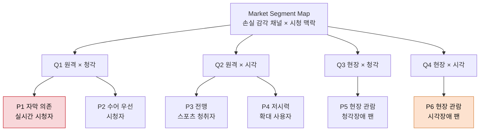

# 페르소나01 — Market Segment 기반 페르소나 추출 (일반)

> 상위 분석: [시장규모01 — 스포츠 OTT 접근성 레이어](../시장규모/시장규모01-스포츠OTT-접근성.md)
> 후속 작업: [페르소나02 — 페르소나 스펙트럼 1차 생성](./페르소나02-스펙트럼-1차생성.md)
> 원자료: [서비스_개선_기획서_스포츠OTT_접근성.pdf](../서비스_개선_기획서_스포츠OTT_접근성.pdf)
> 서비스 정의: 스포츠 OTT 시장에서 **시·청각장애인의 실시간 중계 접근성을 높이는 Accessibility Layer**
> 작성일: 2026-08-10
>
> 이 문서는 Market Segment Map의 네 분면에서 곧바로 뽑은 **일반 페르소나 추출**이다. 스펙트럼(핵심·확장·극단·비활성) 관점의 확장 작업은 페르소나02에서 별도로 진행한다.

## 페르소나를 어떻게 뽑았는가

상위 문서의 Market Segment Map은 시장을 **손실 감각 채널 × 시청 맥락**으로 갈랐다. 이 두 축이 갈리면 만들어야 하는 제품이 갈리기 때문이다. 페르소나도 같은 경계를 따른다. 축을 넘어 사람을 묶으면 세그먼트를 나눈 의미가 사라진다.

기획서가 못 박은 원칙이 여기서 그대로 제약으로 작동한다. **"시각장애와 청각장애를 동일한 문제로 묶지 않는다."** 표본 설계 원칙은 한 걸음 더 나갔다. "시각장애/저시력과 청각장애/난청을 한 그룹으로 합치지 않는다. 기능 효과가 감각 채널별로 다르므로 최소한 장애 유형별 층화 분석이 필요하다."

그래서 4분면을 각각 하나의 페르소나로 두지 않고 분면 안에서 **정보를 받는 방식이 다른 지점**을 한 번 더 쪼갰다. 같은 청각장애라도 자막이 충분한 사람과 자막이 부담인 사람은 다른 제품을 원한다.

| 세그먼트 | 페르소나 | 갈라진 이유 | 대응 제품 | 우선순위 |
|---|---|---|---|---|
| Q1 원격 × 청각 손실 | **P1** 자막 의존 실시간 시청자 | 한국어 자막으로 정보 처리가 가능 | Live Event Caption Layer | **1차 (SOM)** |
| Q1 원격 × 청각 손실 | **P2** 수어 우선 시청자 | 한국어 자막의 속도·용어가 부담 | 수어·아이콘 기반 이벤트 표시 | 1차 확장 |
| Q2 원격 × 시각 손실 | **P3** 전맹 스포츠 청취자 | 화면 정보를 전량 언어로 받아야 함 | Enhanced Audio Description | 2차 |
| Q2 원격 × 시각 손실 | **P4** 저시력 확대 사용자 | 화면은 보지만 정보 밀도·대비가 벽 | Accessible Sports Mode (표시 계층) | 2차 |
| Q3 현장 × 청각 손실 | **P5** 현장 관람 청각장애 팬 | 장내 음성 정보 손실이 별개 문제 | 경기장 자막 (모바일 연계) | 후순위 |
| Q4 현장 × 시각 손실 | **P6** 현장 관람 시각장애 팬 | 지연·하드웨어 제약이 원격과 다름 | Stadium-OTT Link | 레퍼런스 |

> 각 페르소나의 '대표 스케치' 한 줄은 이해를 돕기 위한 **가정**이다. 인터뷰로 확인된 인물이 아니다. 문제·목표·맥락 항목 중 기획서에서 직접 확인된 대목은 근거 줄에 표시했다.

---

## P1 — 자막 의존 실시간 시청자 (Q1 · 1차 타깃)

**대표 스케치**(가정) — 후천적 중증 난청. 한국어 문해에 문제가 없고 야구를 시즌 내내 따라간다.

| 항목 | 내용 |
|---|---|
| **유형명** | 자막 의존 실시간 시청자 (Caption-Dependent Live Viewer) |
| **역할** | 모바일·TV로 생중계를 직접 소비하는 최종 사용자. 접근성 기능의 효과가 가장 먼저 측정되는 대상 |
| **주요 문제** | 자막이 있어도 **해설 음성만 옮겨진다.** 휘슬, 함성, 타구음, 화자 구분, VAR·교체·득점 같은 비언어 이벤트가 빠진다. 자막 지연 때문에 SNS 알림이 경기 상황보다 앞서 도착해 결과부터 알게 된다 |
| **목표** | 경기 흐름을 **지금** 이해하는 것. 결정적 장면에서 무슨 일이 일어났는지 되돌리지 않고 파악하고 비장애인 시청자와 같은 시점에 반응하는 것 |
| **사용 맥락** | 퇴근 후 저녁, 모바일 또는 거실 TV. 소리를 켜지 않거나 켜도 도움이 되지 않는 환경. 실시간 채팅·커뮤니티를 병행하므로 지연에 특히 민감. 3시간 가까이 이어지는 야구 경기를 끝까지 켜두는 패턴 |
| **근거** | 기획서 3단계 — "해설·관중음·휘슬·효과음·화자 구분 누락", "자막 지연·누락·음향사건 미표현", "다중 사건이 수초 내 동시 발생". 목표 지연 <3~5초, 핵심 이벤트 정확도 ≥90%는 기획서의 사전 성공기준 |
| **검증 KPI** | 이해도, 몰입도, 10분 유지율 (기획서 H1) |

이 페르소나가 1차 타깃인 이유는 세 가지가 겹치기 때문이다. 청각장애 등록 인구가 약 43만 명으로 가장 크고, 자막은 네 제품 중 기술 난도가 가장 낮으며, KBS가 2026 월드컵에서 AI 자막을 실제 송출했으므로 구현 가능성 논쟁을 건너뛸 수 있다.

---

## P2 — 수어 우선 시청자 (Q1 하위 · 1차 확장)

**대표 스케치**(가정) — 선천적 청각장애. 수어가 제1 언어이고 한국어는 제2 언어에 가깝다.

| 항목 | 내용 |
|---|---|
| **유형명** | 수어 우선 시청자 (Sign-First Viewer) |
| **역할** | P1과 같은 화면을 보지만 정보를 받는 언어 자체가 다른 최종 사용자 |
| **주요 문제** | 자막을 더 넣으면 오히려 부담이 커진다. 생중계 자막은 속도가 빠르고 전술·기록 용어가 그대로 쏟아지기 때문에 **자막량 증가가 곧 이해도 증가가 아니다.** 경기를 보면서 자막을 읽으면 화면을 놓치는 시선 분할도 겹친다 |
| **목표** | 읽는 부담 없이 상황을 파악하는 것. 수어 해설 창, 또는 득점·반칙·교체를 즉시 알아볼 수 있는 시각 기호로 핵심만 받는 것 |
| **사용 맥락** | 커뮤니티·가족과 함께 보는 동시 시청이 많다. 수어 통역 창과 경기 화면을 같은 기기에 띄워야 하므로 화면 배치·크기 조절이 실사용을 좌우한다 |
| **근거** | 기획서 7단계 — FIFA World Cup 2026이 전 경기 수어를 제공한 사례. 기획서 제품 컨셉 C의 "자막/ADC/TTS/이벤트 알림/컨트롤을 개인화 프로필로 통합" |
| **검증 KPI** | 상황 이해도, 피로도, 재시청 의향 |

P1과 P2를 하나로 묶으면 "자막을 더 정확하게, 더 많이"라는 결론이 나온다. 그 결론은 P2에게 역효과다. **같은 청각장애 안에서도 처방이 반대 방향인 지점이 있다**는 것이 이 분리의 이유다.

---

## P3 — 전맹 스포츠 청취자 (Q2 · 2차)

**대표 스케치**(가정) — 전맹. 스크린리더로 앱을 조작하고 라디오 중계로 야구를 따라온 이력이 있다.

| 항목 | 내용 |
|---|---|
| **유형명** | 전맹 스포츠 청취자 (Blind Play-by-Play Listener) |
| **역할** | 화면 정보를 전량 음성으로 받아야 하는 최종 사용자. 동시에 OTT 앱 조작 자체가 과제인 사용자 |
| **주요 문제** | 두 층에서 막힌다. **콘텐츠 층** — 일반 해설은 화면을 보는 사람을 전제하므로 공 위치, 선수 움직임, 전술 배치, 세리머니, 스코어 변화를 말로 옮기지 않는다. **조작 층** — 스크린리더 라벨과 포커스가 부실해 재생·좌석 이동·자막 설정 같은 라이브 컨트롤에 닿기 어렵다 |
| **목표** | 경기 공간을 머릿속에 재구성하는 것. 그리고 그 과정을 **남의 도움 없이** 시작하고 끝내는 것 |
| **사용 맥락** | 이어폰 착용, 청각에 완전히 의존하므로 병행 작업을 하지 않는다. TalkBack·VoiceOver 사용. 화면을 보지 않으니 조작은 전부 순차 탐색이며, 라이브 도중 설정을 바꾸는 일은 사실상 불가능하다 |
| **근거** | 기획서 3단계 — "공 위치·선수 움직임·전술·세리머니·스코어 변화 누락", "일반 해설이 화면정보를 충분히 설명하지 못함", "스크린리더 라벨·포커스·재생조작 접근 난도" |
| **검증 KPI** | 상황 이해도, 경기 완료율, 태스크 성공률 (기획서 H2·H4) |

2차인 이유는 수요가 작아서가 아니라 공급이 어려워서다. 기획서가 지적한 대로 실시간 ADC는 전문인력과 자동화 난도가 모두 높다. P1으로 파트너와 매출을 확보한 뒤 들어가는 순서가 맞다.

---

## P4 — 저시력 확대 사용자 (Q2 하위 · 2차)

**대표 스케치**(가정) — 저시력. 화면은 보이지만 확대 없이는 스코어보드를 읽지 못한다.

| 항목 | 내용 |
|---|---|
| **유형명** | 저시력 확대 사용자 (Low-Vision Magnifier User) |
| **역할** | 시각을 쓰지만 정보 밀도와 대비가 벽이 되는 최종 사용자. P3와 달리 음성 대체가 아니라 **표시 방식**의 문제를 겪는다 |
| **주요 문제** | 확대하면 정보가 화면 밖으로 밀려난다. 스코어·이닝·잔여 시간이 화면 모서리에 작게 붙어 있어 확대 상태에서는 보이지 않는다. 저대비 그래픽과 빠른 화면 전환이 겹치면 상황 파악이 경기 속도를 못 따라간다 |
| **목표** | 확대해도 **핵심 정보가 사라지지 않는 화면**. 스코어·이벤트·시간을 고대비·대형으로 고정해 두고 자막 크기와 색을 직접 조절하는 것 |
| **사용 맥락** | 태블릿을 얼굴 가까이 두고 200~400% 배율로 본다. 조명을 조절한다. 눈의 피로 때문에 연속 시청 시간이 짧다. 확대·색반전 같은 OS 접근성 기능을 이미 켜둔 상태에서 앱을 실행한다 |
| **근거** | 기획서 5단계 표본 설계 원칙 — "시각장애/저시력을 한 그룹으로 합치지 않는다". 기획서 제품 컨셉 B의 타깃 "시각장애·저시력" |
| **검증 KPI** | 태스크 성공률, 피로도, 재사용률 |

P3와 P4를 합치면 "음성 해설을 넣으면 된다"는 결론이 나온다. P4는 음성이 아니라 **보이는 방식의 재배치**를 원한다. 이 페르소나가 있어야 제품 컨셉 C(개인화 표시 프로필)가 왜 별도 레이어여야 하는지 설명된다.

---

## P5 — 현장 관람 청각장애 팬 (Q3 · 후순위)

**대표 스케치**(가정) — 중증 난청. 시즌권을 갖고 홈경기를 직접 보러 간다.

| 항목 | 내용 |
|---|---|
| **유형명** | 현장 관람 청각장애 팬 (Deaf In-Stadium Spectator) |
| **역할** | 경기장 좌석에서 장내 음성 정보를 놓치는 관람객. OTT 사용자가 아니라 **구단·시설 운영의 고객** |
| **주요 문제** | 장내 방송, 심판 판정 안내, VAR 결과, 안전·대피 안내를 듣지 못한다. 주변 관중의 반응을 보고 상황을 뒤늦게 추론한다. 판정 사유 같은 정보는 끝까지 알 수 없다 |
| **목표** | 장내에서 나오는 말을 **내 화면에서 글로** 받는 것. 특히 판정과 안전 안내는 지연 없이 확인하는 것 |
| **사용 맥락** | 경기장 좌석, 높은 소음, 관중 밀집으로 네트워크가 혼잡하다. 경기 화면과 모바일 사이로 시선이 갈라지므로 알림은 짧아야 한다. 2~3시간 연속, 야외 조명 조건 |
| **근거** | 기획서 7단계 — FIFA World Cup 2026의 경기장 자막 제공 (공식사례) |
| **검증 KPI** | 현장 이용률, 만족도 |

수요의 정당성이 약해서 후순위로 둔 것은 아니다. 사업자가 통제하지 못하는 요소가 많다. 상위 문서의 판정대로 시설·하드웨어 의존이 커서 소프트웨어 사업자가 단독으로 진입하기 어렵다.

---

## P6 — 현장 관람 시각장애 팬 (Q4 · 레퍼런스)

**대표 스케치**(가정) — 시각장애. 구장에서 FM 단말기를 대여해 중계 음성을 들으며 관람한다.

| 항목 | 내용 |
|---|---|
| **유형명** | 현장 관람 시각장애 팬 (Blind In-Stadium Spectator) |
| **역할** | 국내에서 **접근성 지원을 실제로 받아본 유일한 사용자군.** 동행 가족·활동지원사가 함께 있는 경우가 많다 |
| **주요 문제** | 지원 자체는 존재하지만 조건이 붙는다. 지원 구장이 네 곳뿐이고, 단말기를 대여·반납해야 하며, 중계 음성이 현장 함성보다 늦게 도착해 **주변이 먼저 환호한 뒤에 이유를 듣는다.** 동행자가 상황을 설명해주는 구조라 관람의 자립도가 낮고 동행자의 부담도 크다 |
| **목표** | 함성과 어긋나지 않는 저지연 음성. 동행자에게 묻지 않고 경기를 따라가는 것 |
| **사용 맥락** | 경기장 좌석, 이어폰 한쪽만 착용해 현장 소리를 함께 듣는 경우가 많다. 네트워크 혼잡, 배터리 제약, 2~3시간 연속 사용. 대여 절차가 관람 시작 시점을 지연시킨다 |
| **근거** | 기획서 7단계 — KBO 잠실·사직·광주·대전 4개 구장 FM 단말기 중계음성 지원 (공식운영, 2023년 시작), FIFA 일부 경기장 햅틱 장치 |
| **검증 KPI** | 현장 이용률, 만족도, 지연 체감 |

규모는 여섯 페르소나 중 가장 작다. 그런데도 비중을 두는 이유는 **이미 운영되는 유일한 사례**이기 때문이다. 리그·구단에 접근성 투자를 설명할 때 이 페르소나의 실사용 기록이 근거가 된다.

---

## 돈을 내는 쪽의 페르소나

상위 문서의 결론상 이 서비스는 B2B2C다. **사용자와 구매자가 분리되므로 위 여섯 페르소나만으로는 제품이 팔리지 않는다.** Market Segment Map이 정의한 네 분면은 사용자 쪽이고 아래 세 페르소나는 기획서의 수익 모델 표(SDK/API, 리그 공동 패키지, 경기장 패키지)에서 끌어낸 구매 의사결정자다.

| 항목 | **B1 — OTT 서비스 기획자** | **B2 — 리그·구단 팬경험 담당자** | **B3 — 중계 기술 운영 PD** |
|---|---|---|---|
| **유형명** | 접근성 요구를 받는 프로덕트 오너 | 보편적 관람권 담당자 | 생중계 운영 책임자 |
| **역할** | SDK 도입 여부를 결정하고 개발 리소스를 배정한다 | 시즌 단위 접근성 사업을 기획하고 예산을 정당화한다 | 경기 당일 자막·해설 송출을 실제로 돌린다 |
| **주요 문제** | 접근성 요구는 들어오지만 투자 근거가 없다. 국내에 "접근성 부족 → 이탈"을 잇는 직접 데이터가 **0개**라 내부 설득이 막힌다. 생중계에 기능을 얹는 것 자체가 장애 리스크다 | ESG·보편적 관람권 요구는 커지는데 성과를 무엇으로 보고할지 정해지지 않았다. 구장별 시설 격차 때문에 전 구장 동시 적용이 불가능하다 | 속기사·수어 통역 운영비가 경기마다 발생하고 인력 확보가 시즌 중에 흔들린다. 자막 지연이 곧 시청자 항의로 돌아온다 |
| **목표** | 개발 리소스를 최소로 쓰면서 접근성 요구에 대응하고 제도가 바뀔 때 이미 대응이 끝난 상태이기를 원한다 | 시즌 성과로 보고할 수 있는 숫자(이용 인원·만족도)와 확장 계획 | 지연 <3~5초, 핵심 이벤트 정확도 ≥90%를 사람 수를 늘리지 않고 달성하는 것 |
| **사용 맥락** | 스프린트 단위 의사결정, 시즌 개막 전 도입 검토 창구가 좁다. 기존 플레이어에 탑재 가능한지가 첫 질문 | 시즌 계약·공동사업 형태, 회계연도 예산 주기 | 중계차·부조에서 경기 당일 실시간 운영. 실패를 되돌릴 시간이 없다 |
| **대응 수익 모델** | SDK/API Accessibility Layer (라이선스·MAU·경기 수 과금) | 리그 공동 패키지 (시즌 계약), 경기장 패키지 | 접근성 데이터 엔진 (API 사용량) |

B1의 첫 번째 문제가 이 사업의 가장 큰 장벽이다. 기획서가 남긴 데이터 공백이 그대로 **구매자의 결재 근거 공백**이 된다. 그래서 1차 실험 KPI를 "관심 증가"가 아니라 이해도·10분 유지율·완료율 같은 가까운 지표로 잡았다. 이 판단은 사용자 검증 설계이면서 동시에 **B1을 설득할 자료를 만드는 작업**이다.

---

## 페르소나로 쓰면 안 되는 것

| 잘못된 묶음 | 왜 안 되는가 |
|---|---|
| "장애인 스포츠 팬" 하나 | 기획서가 첫 줄에서 금지한 묶음이다. P1과 P3는 필요한 제품이 정반대다 |
| "청각장애인" 하나 | P1은 자막을 더 원하고 P2는 자막이 부담이다. 합치면 P2에게 역효과인 처방이 나온다 |
| "시각장애인" 하나 | P3는 음성 대체를, P4는 표시 재배치를 원한다. 합치면 P4가 제품에서 빠진다 |
| "접근성이 필요한 사용자" | 원격과 현장은 지연 요구·하드웨어·계약 상대가 전부 다르다 |
| 사용자 페르소나만 | 돈을 내는 쪽은 B1~B3다. 사용자 문제만 정리하면 팔 대상이 없다 |

## 다음에 확인할 것

이 페르소나들의 문제·근거는 기획서에서 확인된 대목이지만 **목표와 사용 맥락 상당 부분은 아직 가정이다.** 기획서의 다음 조사 항목과 그대로 이어진다.

| 확인 대상 | 조사 방법 | 흔들리면 바뀌는 페르소나 |
|---|---|---|
| 자막과 수어 중 어느 쪽 수요가 큰가 | 장애유형별 선호·문해 수준 조사 | P1 대 P2의 우선순위 |
| 불편 원인 Top 5 (자막·효과음·ADC·UI·지연) | 사용자 설문 | 여섯 페르소나 전체의 문제 서열 |
| 종목별 필요 이벤트 정보 차이 | 축구·야구 비교 인터뷰 | P1·P3의 이벤트 사전 설계 |
| 기능별 지불 의향(WTP) | 구매자 인터뷰 | B1~B3의 목표 항목 |
| 현장 관람 실제 이용 경험 | KBO 4개 구장 이용자 인터뷰 | P6의 문제 우선순위 |

기획서가 권고한 초기 표본 100~200명을 **여섯 페르소나로 층화**해 모으면 표본이 작아도 감각 채널별 효과 차이를 볼 수 있다. 층화하지 않고 200명을 모으면 P2·P4처럼 수가 적은 유형이 통째로 사라진다.
