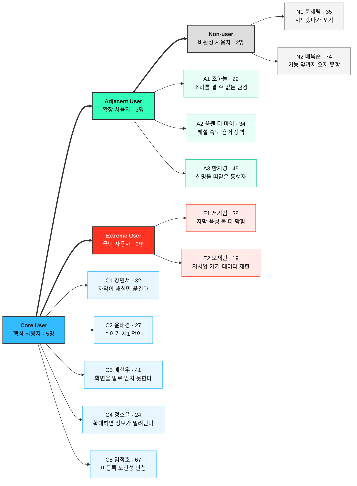

# 페르소나02 — 페르소나 스펙트럼 ① 1차 생성 (Divergent Thinking)

> 선행 작업: [페르소나01 — Market Segment 기반 페르소나 추출 (일반)](./페르소나01-Market-Segment-기반-추출.md)
> 상위 분석: [시장규모01 — 스포츠 OTT 접근성 레이어](../시장규모/시장규모01-스포츠OTT-접근성.md)
> 원자료: [서비스_개선_기획서_스포츠OTT_접근성.pdf](../서비스_개선_기획서_스포츠OTT_접근성.pdf)
> 서비스 정의: 스포츠 OTT 시장에서 **시·청각장애인의 실시간 중계 접근성을 높이는 Accessibility Layer**
> 작성일: 2026-08-10

## 이 단계가 하는 일

5단계 작업 중 **① 1차 생성**이다. 목적은 고르는 것이 아니라 **넓히는 것**이다. 그래서 여기서 나온 12명은 전원 가상이며 아직 검증되지 않았다. 이름·나이·직무는 상황을 구체적으로 상상하기 위한 장치이고 실제 인물이나 인터뷰 결과가 아니다.

| 단계 | 하는 일 | 이 문서의 위치 |
|---|---|---|
| **① 1차 생성 (Divergent)** | 스펙트럼별 3~5개 버전 생성 | **← 지금 여기 (12명)** |
| ② 2차 평가 (Convergent) | 현실성 기준으로 유형별 상위 1명 선별 | 다음 (4명으로 축소) |
| ③ 3차 보정 (Contextual) | 서비스 맥락에 맞춰 재기술 | 이후 |
| ④ 4차 검증 (AI Peer Review) | 실존 확률과 근거 교차검증 | 이후 |
| ⑤ 5차 통합 (Spectrum Map) | 페르소나 간 관계 구조화 | 이후 |

발산 단계이므로 **말이 되는 후보와 말이 안 될 것 같은 후보를 같이 올려둔다.** 걸러내는 일은 ②단계의 몫이다. 지금 자체 검열을 하면 스펙트럼을 넓히는 목적이 사라진다.

## 스펙트럼 네 유형

| 구분 | 이 서비스에서의 정의 | 도출 질문 |
|---|---|---|
| **핵심(Core)** | 접근성 레이어가 없으면 지금 당장 경기를 놓치는 사람 | 사용 빈도와 이탈 위험이 가장 큰 사람은 누구인가 |
| **확장(Adjacent)** | 같은 정보 손실을 다른 이유로 겪는 사람 | 유사한 대체 수단을 이미 쓰는 사람은 누구인가 |
| **극단(Extreme)** | 기능을 켜도 여전히 실패하는 사람 | 가장 자주 실패하는 사람은 누구인가 |
| **비활성(Non-user)** | 시도할 이유나 수단이 없는 사람 | 이 서비스를 **사용할 수 없는** 사람은 누구인가 |

> 이름·나이·직무는 전부 **가상**이다. 문제 항목 일부는 기획서에서 확인된 손실 유형을 반영했고, 목표·감정·대체 솔루션은 아직 가정이다. 맨 아래 매핑 표에서 페르소나01의 P1~P6과 어디가 겹치고 어디가 새로 나왔는지 표시했다.

---

## 핵심 사용자 (Core) — 5명

| # | 이름 · 나이 | 직무 | 문제 | 목표 | 감정 | 대체 솔루션 (지금 쓰는 것) |
|---|---|---|---|---|---|---|
| **C1** | 강민서 · 32 | IT 회사 QA 엔지니어 | 자막이 켜져 있어도 해설 음성만 글로 바뀐다. 휘슬, 함성의 크기, 타구음, 화자 구분, VAR 판독이 들어왔다는 신호가 전부 빠진다. 자막이 3~5초 밀리는 동안 커뮤니티 알림이 먼저 떠서 결과를 알아 버린다 | 경기를 **지금** 이해하는 것. 결정적 장면을 되돌리지 않고 파악하고 같이 보는 사람들과 같은 순간에 반응하는 것 | 매번 반 박자 늦게 아는 데서 오는 소외감. 되돌려 보다가 흐름을 놓치면 화가 난다 | 문자 중계를 옆 창에 띄워 놓고 영상과 번갈아 본다. 커뮤니티 실시간 게시판을 자막 대신 쓴다 |
| **C2** | 윤태경 · 27 | 프리랜스 그래픽 디자이너 | 수어가 제1 언어여서 한국어 자막은 제2 언어로 읽어야 한다. 생중계 자막은 속도가 빠르고 전술·기록 용어가 그대로 쏟아진다. 자막을 읽는 동안 화면을 놓친다 | 읽는 부담 없이 상황을 아는 것. 수어 해설이나 득점·반칙·교체를 즉시 알아볼 기호로 핵심만 받는 것 | 자막이 있어도 "내 언어가 아니다"는 피로. 배려를 받았는데 여전히 못 따라간다는 자책 | 수어 유튜버의 경기 요약 영상을 다음 날 본다. 청각장애인 커뮤니티의 수어 영상 채팅을 켜 두고 함께 본다 |
| **C3** | 배현우 · 41 | 공공기관 사무직 (전맹) | 일반 해설은 화면을 보는 사람을 전제한다. 공 위치, 선수 움직임, 전술 배치, 세리머니, 스코어 변화가 말로 옮겨지지 않는다. 앱 쪽에서도 스크린리더 라벨과 포커스가 부실해 라이브 컨트롤에 닿기 어렵다 | 경기 공간을 머릿속에 다시 세우는 것. 그 과정을 **남의 도움 없이** 시작하고 끝내는 것 | 라디오 중계가 줄어든 뒤의 상실감. 앱이 바뀔 때마다 조작을 다시 배워야 하는 데서 오는 피로 | 라디오 중계를 듣는다. 문자 중계를 스크린리더로 읽힌다. 막히면 가족에게 상황을 묻는다 |
| **C4** | 정소윤 · 24 | 대학생 (저시력, 잔존시력 0.08) | 확대하면 정보가 화면 밖으로 밀려난다. 스코어·이닝·잔여 시간이 모서리에 작게 붙어 있어 확대 상태에서는 보이지 않는다. 저대비 그래픽과 빠른 화면 전환이 겹치면 상황 파악이 경기 속도를 못 따라간다 | 확대해도 핵심 정보가 사라지지 않는 화면. 스코어·이벤트·시간을 크고 진하게 고정해 두고 자막 크기와 색을 직접 고르는 것 | "보이는데 못 본다"는 애매한 자리에서 오는 답답함. 지원 대상 논의에서 자주 빠진다는 서운함 | 태블릿을 얼굴 가까이 두고 OS 확대를 200~400%로 쓴다. 스코어를 캡처해 확대해서 확인한다 |
| **C5** | 임정호 · 67 | 은퇴 (노인성 난청, 미등록) | 해설이 잘 안 들려 볼륨을 올리면 가족이 항의한다. 자막을 켜면 속도를 못 따라가고 글씨가 작다. 스스로를 장애인으로 분류하지 않으므로 접근성 메뉴를 찾아볼 생각을 하지 않는다 | 큰 글씨로 중요한 장면만 표시되는 화면. 가족에게 묻지 않고 혼자 끝까지 보는 것 | 도움을 요청하는 일 자체가 자존심에 걸린다. 나이 때문이라고 넘기며 참는다 | TV 볼륨을 최대로 올린다. 놓친 장면은 다음 날 하이라이트로 확인한다 |

C5는 페르소나01의 여섯 유형에 없던 인물이다. 등록장애인 통계로 시장을 셌기 때문에 **미등록 난청 인구가 통째로 빠져 있었다.** 상위 문서가 "등록장애인 기준은 SAM을 낮게 잡는다"고 적은 대목이 여기서 사람 형태로 나타난다.

---

## 확장 사용자 (Adjacent) — 3명

| # | 이름 · 나이 | 직무 | 문제 | 목표 | 감정 | 대체 솔루션 (지금 쓰는 것) |
|---|---|---|---|---|---|---|
| **A1** | 조하늘 · 29 | 제약회사 영업 담당 | 청력에 문제는 없지만 소리를 켤 수 없는 환경에서 경기를 본다. 지하철·거래처 대기실·사무실에서는 무음으로 봐야 하고 그 상태에서는 상황을 거의 알 수 없다 | 소리 없이도 흐름을 놓치지 않는 것. 득점·위기 상황만이라도 즉시 알아보는 것 | 실시간을 놓치는 데서 오는 초조함. 결과를 먼저 알게 될까 봐 알림을 못 켠다 | 문자 중계를 대신 본다. 이어폰을 한쪽만 꽂고 소리를 최소로 낮춘다. 득점 알림 앱을 따로 깔았다 |
| **A2** | 응웬 티 마이 · 34 | 제조업 생산직 (이주 10년차) | 한국어 청취는 되지만 해설 속도와 야구 용어를 따라가지 못한다. 규칙을 설명해주는 정보가 중계 안에 없다 | 경기 상황과 규칙을 같이 이해하는 것. 동료들과 같은 화제로 이야기하는 것 | 같이 응원하고 싶은데 대화에 끼지 못하는 소외. 물어보기가 민망하다 | 자국어 커뮤니티의 중계 채팅을 본다. 번역 앱으로 기사 요약을 읽는다 |
| **A3** | 한지영 · 45 | 사무직 · 시각장애 가족의 동행자 | 함께 경기를 볼 때 상황을 계속 말로 설명한다. 설명하는 동안 본인은 경기를 즐기지 못하고 놓친 장면은 설명도 못 한다 | 설명 역할을 내려놓고 **같이 보는** 것. 가족이 스스로 상황을 아는 것 | 설명을 멈추면 드는 죄책감과 계속하면 쌓이는 피로 사이에서 흔들린다 | 본인이 실시간으로 구술한다. 이어폰을 한쪽씩 나눠 끼고 소리를 공유한다 |

A1은 시장 논리에서 특히 중요하다. 접근성 레이어가 **비장애인 무음 시청자에게도 그대로 유효**하다면, 상위 문서가 지적한 "구매자의 결재 근거 공백"을 메울 논거가 된다. 접근성 예산이 아니라 시청 유지율 예산으로 팔 수 있다.

페르소나01에서 P6의 배경으로만 언급됐던 동행자를 이번 발산에서 독립된 인물로 세웠다. A3은 사용자도 구매자도 아닌 제3의 위치다.

---

## 극단 사용자 (Extreme) — 2명

| # | 이름 · 나이 | 직무 | 문제 | 목표 | 감정 | 대체 솔루션 (지금 쓰는 것) |
|---|---|---|---|---|---|---|
| **E1** | 서기범 · 38 | 장애인단체 활동가 (시청각 중복장애) | 자막도 음성 해설도 닿지 않는다. 두 채널이 모두 막혀 있어 지금까지 나온 접근성 기능 전부가 무효다. 남는 통로는 촉각과 점자뿐이다 | 경기의 리듬과 결정적 순간을 촉각으로 감지하는 것. 결과만 아는 게 아니라 진행을 함께 겪는 것 | 애초에 대상에서 빠져 있다는 체념. 접근성 발표를 봐도 자신의 이야기로 읽지 않는다 | 점자정보단말기로 문자 중계를 읽는다. 활동지원사의 촉수어 통역에 의존한다 |
| **E2** | 오재민 · 19 | 고3 기숙사 생활 (중증 난청, 지방 거주) | 구형 스마트폰과 데이터 제한 요금제를 쓴다. 기숙사 와이파이가 저녁마다 혼잡해 자막이 크게 밀리거나 아예 뜨지 않는다. 접근성 기능이 무거워지면 가장 먼저 탈락한다 | 데이터를 적게 쓰고 이벤트만 받는 것. 저사양 기기에서도 지연 없이 뜨는 것 | 늘 나중에 알게 되는 데 익숙해진 무력감. 기대를 접는 편이 편하다 | 영상을 끄고 텍스트 중계만 본다. 친구가 메신저로 알려주는 것에 의존한다 |

극단 사용자 두 명은 둘 다 **기능을 켰는데도 실패한다.** E1은 감각 채널 자체가 막혀서, E2는 기능이 요구하는 성능을 기기가 못 내서 실패한다. 두 실패는 성격이 반대다. E1은 새 감각 채널을 요구하고 E2는 기존 기능을 가볍게 만들라고 한다.

---

## 비활성 사용자 (Non-user) — 2명

| # | 이름 · 나이 | 직무 | 문제 | 목표 | 감정 | 대체 솔루션 (지금 쓰는 것) |
|---|---|---|---|---|---|---|
| **N1** | 문세림 · 35 | 회계 사무 (청각장애) | 학생 때 몇 번 시도했다가 무슨 일이 벌어지는지 알 수 없어 그만뒀다. 지금은 스포츠 자체에 흥미가 없다고 말한다. 접근성 기능이 나온다는 소식을 들어도 "생색"으로 여긴다 | 스포츠를 보고 싶다는 목표 자체가 없다. 다시 시도할 이유가 필요하다 | 흥미 없음으로 굳어진 체념. 여러 번 기대하고 실망한 뒤에 남은 무관심 | 스포츠 대신 예능·드라마를 본다. 경기 결과는 뉴스 제목으로만 확인한다 |
| **N2** | 배옥순 · 74 | 은퇴 (농업, 청각장애) | OTT 앱을 직접 설치·로그인하지 못한다. 유료 결제에 거부감이 크고 자녀에게 부탁하는 일을 미안해한다. 그래서 접근성 기능이 있어도 그 앞까지 가지 못한다 | 지금 보는 TV에서 그냥 자막이 잘 나오는 것 | 새 기술에 대한 불신, 부탁하는 미안함, 속아 결제될까 하는 경계심 | 지상파 TV의 자막 방송을 본다. 자녀가 틀어주는 채널을 그대로 본다 |

N1과 N2는 막히는 지점이 다르다. **N1은 기능 앞까지 왔다가 돌아선 사람이고, N2는 기능 앞까지 오지 못하는 사람이다.** 전자는 제품 경험의 문제이고 후자는 유통·결제·기기의 문제다. 하나로 묶으면 "홍보를 더 하자"는 결론이 나오는데, 둘 다에게 틀린 처방이다.

N1은 상위 문서의 가장 약한 가정과 정면으로 닿는다. SAM 인구를 셀 때 '스포츠 시청 의향 30%'를 곱했는데, 남은 70%가 N1이다. 그 70%가 원래 관심이 없는 것인지, **접근성 때문에 관심을 잃은 것인지**가 이 사업의 크기를 바꾼다. 기획서가 "국내 직접 인과 데이터 0개"라고 적은 자리가 바로 여기다.

---

## 페르소나01과의 매핑

| 스펙트럼 | 페르소나 | 페르소나01 대응 | 새로 나온 것인가 |
|---|---|---|---|
| Core | C1 강민서 | P1 자막 의존 실시간 시청자 | 기존 |
| Core | C2 윤태경 | P2 수어 우선 시청자 | 기존 |
| Core | C3 배현우 | P3 전맹 스포츠 청취자 | 기존 |
| Core | C4 정소윤 | P4 저시력 확대 사용자 | 기존 |
| Core | **C5 임정호** | — | **신규** — 미등록 노인성 난청 |
| Adjacent | **A1 조하늘** | — | **신규** — 무음 환경 비장애인 |
| Adjacent | **A2 응웬 티 마이** | — | **신규** — 언어 장벽 |
| Adjacent | **A3 한지영** | P6의 배경으로만 언급 | **신규** — 동행자를 독립 인물로 |
| Extreme | **E1 서기범** | — | **신규** — 시청각 중복장애 |
| Extreme | **E2 오재민** | — | **신규** — 저사양·저대역 |
| Non-user | **N1 문세림** | — | **신규** — 학습된 회피 |
| Non-user | **N2 배옥순** | — | **신규** — 진입 장벽 |

열두 명 중 여덟 명이 페르소나01에 없던 인물이다. 세그먼트 매트릭스에서 곧바로 뽑은 페르소나는 **이미 우리 제품을 쓸 만한 사람들**이었고 스펙트럼은 그 바깥을 보게 했다. P5(현장 관람 청각장애 팬)는 이번 12명에 대응 인물이 없는데, 현장 세그먼트가 후순위라 발산 단계에서 밀렸다. ②단계에서 이 누락이 의도된 것인지 확인해야 한다.

## ②단계로 넘길 때의 평가 기준

다음 단계는 유형별로 한 명씩만 남기는 수렴 작업이다. 무엇을 기준으로 자를지 미리 적어 둔다.

| 기준 | 확인할 것 |
|---|---|
| **문제의 현실성** | 기획서·공개통계에서 확인되는 손실 유형인가, 우리가 상상한 것인가 |
| **행동의 현실성** | '대체 솔루션' 칸이 실제로 존재하는 수단인가. 없는 대안을 적었다면 그 인물은 검증되지 않았다 |
| **맥락의 현실성** | 사용 환경·기기·시간대가 서로 모순되지 않는가 |
| **사업 연결성** | 이 인물의 문제를 풀면 상위 문서의 SOM(Q1 이벤트 자막)과 이어지는가 |
| **접근 가능성** | 초기 표본 100~200명 안에서 실제로 만날 수 있는 사람인가 |

마지막 기준을 특히 세게 걸어야 한다. E1처럼 제품을 근본부터 개선하게 하는 인물은 모집 자체가 어렵다. 만나지 못하면 검증할 수 없고 검증하지 못한 페르소나는 다시 상상으로 돌아간다. **극단 사용자를 남길지는 그 사람의 중요성이 아니라 우리가 그 사람을 만날 수 있는지로 정해야 한다.**
