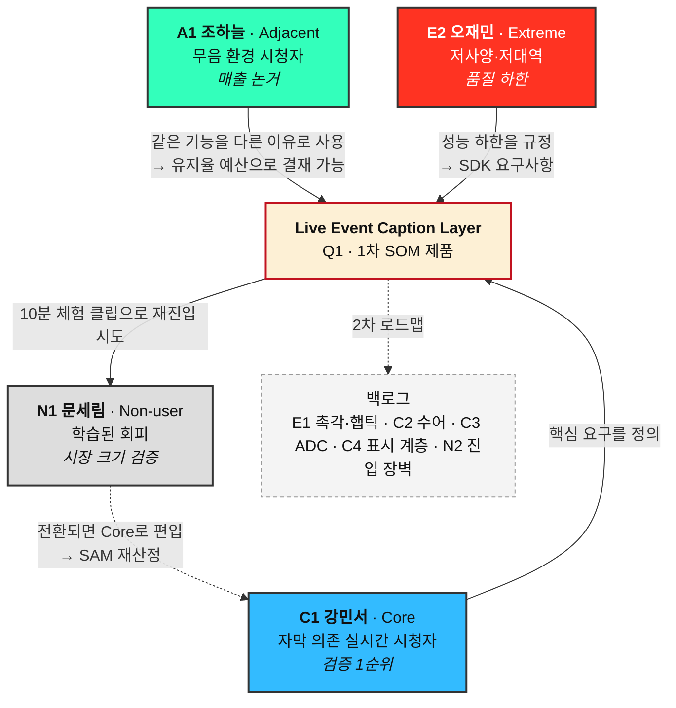

# 페르소나03 — 페르소나 스펙트럼 ②~⑤단계 (수렴 · 보정 · 검증 · 통합)

> 선행 작업: [페르소나02 — 페르소나 스펙트럼 ① 1차 생성](./페르소나02-스펙트럼-1차생성.md) · [페르소나01 — Market Segment 기반 추출](./페르소나01-Market-Segment-기반-추출.md)
> 상위 분석: [시장규모01 — 스포츠 OTT 접근성 레이어](../시장규모/시장규모01-스포츠OTT-접근성.md)
> 후속 작업: [CJM01 — 고객 여정 지도](../CJM/CJM01-스포츠OTT-접근성.md)
> 서비스 정의: 스포츠 OTT 시장에서 **시·청각장애인의 실시간 중계 접근성을 높이는 Accessibility Layer**
> 작성일: 2026-08-10

## 이 문서가 다루는 범위

①단계에서 12명을 만들었다. 그 문서는 발산 기록이므로 그대로 보존하고 여기서는 **줄이고 다듬고 따지고 묶는** 네 단계를 이어서 진행한다.

| 단계 | 하는 일 | 산출물 | 위치 |
|---|---|---|---|
| ① 1차 생성 (Divergent) | 스펙트럼별 후보 생성 | 12명 원본 | [페르소나02](./페르소나02-스펙트럼-1차생성.md) |
| **② 2차 평가 (Convergent)** | 현실성 기준으로 채점해 유형별 1명 선별 | 대표 4명 | **이 문서** |
| **③ 3차 보정 (Contextual)** | 서비스 맥락에 맞춰 재기술 | 페르소나 카드 4종 | **이 문서** |
| **④ 4차 검증 (Peer Review)** | 실존 확률과 반증 위험 교차검토 | 검증 코멘트 리포트 | **이 문서** |
| **⑤ 5차 통합 (Spectrum Map)** | 네 명의 관계 구조화 | Spectrum Map | **이 문서** |

---

# ② 2차 평가 — 12명을 4명으로

페르소나02가 미리 적어 둔 다섯 기준을 그대로 쓴다. 기준을 나중에 만들면 원하는 인물을 남기는 방향으로 기준이 휘어진다.

| 기준 | 5점의 뜻 | 1점의 뜻 |
|---|---|---|
| **문제의 현실성** | 기획서·공개통계에서 확인되는 손실 유형 | 우리가 상상한 문제 |
| **행동의 현실성** | '대체 솔루션'이 실재하는 수단 | 존재하지 않는 대안을 적었다 |
| **맥락의 현실성** | 환경·기기·시간대가 서로 모순되지 않음 | 설정이 서로 어긋난다 |
| **사업 연결성** | 이 문제를 풀면 1차 SOM(Q1 이벤트 자막)과 이어짐 | 우리 로드맵과 무관 |
| **접근 가능성** | 초기 표본 100~200명 안에서 만날 수 있음 | 모집 경로가 없다 |

## 채점 결과

| 페르소나 | 문제 | 행동 | 맥락 | 사업 | 접근 | 합계 | 판정 |
|---|---|---|---|---|---|---|---|
| **C1 강민서** 자막 의존 | 5 | 5 | 5 | 5 | 4 | **24** | **Core 대표** |
| C3 배현우 전맹 | 5 | 5 | 4 | 3 | 3 | 20 | 보류 |
| C4 정소윤 저시력 | 4 | 4 | 4 | 3 | 4 | 19 | 보류 |
| C5 임정호 노인성 난청 | 4 | 5 | 4 | 4 | 2 | 19 | 보류 |
| C2 윤태경 수어 우선 | 4 | 4 | 4 | 3 | 3 | 18 | 보류 |
| **A1 조하늘** 무음 환경 | 3 | 5 | 5 | 5 | 5 | **23** | **Adjacent 대표** |
| A3 한지영 동행자 | 4 | 4 | 4 | 3 | 4 | 19 | 보류 |
| A2 응웬 티 마이 언어 장벽 | 3 | 4 | 4 | 2 | 3 | 16 | 보류 |
| **E2 오재민** 저사양·저대역 | 4 | 5 | 5 | 4 | 4 | **22** | **Extreme 대표** |
| E1 서기범 시청각 중복 | 5 | 5 | 4 | 2 | 1 | 17 | 보류 (백로그 이관) |
| **N1 문세림** 학습된 회피 | 4 | 4 | 4 | 5 | 3 | **20** | **Non-user 대표** |
| N2 배옥순 진입 장벽 | 4 | 5 | 4 | 2 | 2 | 17 | 보류 (파트너 협의) |

## 이 채점에서 갈린 지점

**C1이 Core 대표가 된 이유는 점수가 높아서가 아니라 다섯 기준이 한 방향으로 몰렸기 때문이다.** 청각장애 등록 인구가 가장 크고 기획서가 손실 유형을 직접 열거했고 1차 SOM인 이벤트 자막과 정면으로 닿는다. 다른 Core 넷은 어느 한 칸에서 반드시 걸렸다.

E1 서기범이 17점으로 떨어진 대목은 예고된 결과다. 문제와 행동은 만점인데 사업 연결성 2점, 접근 가능성 1점을 받았다. 페르소나02가 적어 둔 대로 **극단 사용자를 남길지는 그 사람의 중요성이 아니라 만날 수 있는지로 정한다.** 대신 E1을 그냥 버리지 않는다.

| 탈락자 | 어디로 보내는가 |
|---|---|
| E1 서기범 (시청각 중복) | **포용적 설계 백로그.** 촉각·햅틱 출력 요구사항으로 남긴다. Q4 경기장 햅틱 사례와 묶어 ⑤단계 이후 재검토 |
| C2 윤태경 (수어) · C3 배현우 (전맹) · C4 정소윤 (저시력) | **2차 제품 로드맵.** Q2 ADC와 표시 계층 설계 시 되살린다 |
| C5 임정호 (노인성 난청) | **시장 재산정 항목.** 미등록 인구를 SAM에 넣을 근거를 조사한 뒤 Core로 승격 검토 |
| A2 응웬 티 마이 (언어 장벽) · A3 한지영 (동행자) | **확장 시나리오.** 종목·언어 확장 국면에서 재소환 |
| N2 배옥순 (진입 장벽) | **파트너 협의 항목.** 설치·로그인·결제는 OTT 파트너 영역이라 우리 단독으로 못 푼다 |

보류는 기각이 아니다. 지금 4명으로 줄이는 것은 **한 번에 검증할 수 있는 인원이 그 정도**이기 때문이다.

---

# ③ 3차 보정 — 서비스 맥락에 맞춘 페르소나 카드

①단계의 서술은 "이 사람이 어떤 불편을 겪는가"에 머물렀다. 여기서는 같은 인물을 **우리 제품 안에서 무엇을 하는 사람인가**로 다시 쓴다. 항목이 달라진다.

## 카드 1 — C1 강민서 · 32 · Core

| 항목 | 내용 |
|---|---|
| **한 줄 정체** | 시즌 내내 야구를 켜 두지만 자막이 옮기지 못한 정보 때문에 매 경기 반 박자 늦게 아는 사람 |
| **서비스 접점** | Q1 원격 × 청각 손실 → **Live Event Caption Layer** (1차 SOM 제품) |
| **과업 (JTBD)** | 소리를 쓰지 않고, 경기가 진행되는 동안 상황을 남들과 같은 시점에 파악한다 |
| **성공의 정의** | 이벤트 자막 지연 3~5초 이내, 핵심 이벤트 정확도 90% 이상. 10분 유지율과 경기 완료율 상승 |
| **실패의 정의** | 자막이 밀려 커뮤니티 알림이 먼저 뜬다. 득점 순간 자막이 비어 있다 |
| **우리 제품에서 만나는 것** | 이벤트 자막 레이어, 비언어 이벤트 아이콘(휘슬·함성·VAR), 화자 구분 표시, 지연 표시기 |
| **이 사람이 사업에 주는 것** | 1차 검증의 기준선. 이 사람에게서 KPI가 움직이지 않으면 뒤의 어떤 제품도 팔 근거가 없다 |
| **한계** | 후천적 난청이라 한국어 문해에 문제가 없다. 이 카드만 보고 만들면 수어 우선 사용자가 빠진다 |

## 카드 2 — A1 조하늘 · 29 · Adjacent

| 항목 | 내용 |
|---|---|
| **한 줄 정체** | 청력에 문제는 없지만 소리를 켤 수 없어서 접근성 기능을 접근성으로 여기지 않고 쓰는 사람 |
| **서비스 접점** | Q1과 같은 제품을 **다른 이유로** 사용 → Live Event Caption Layer |
| **과업 (JTBD)** | 이동 중 짧은 틈에, 소리 없이 경기의 결정적 순간만 붙잡는다 |
| **성공의 정의** | 무음 상태 시청 시작률과 5분 유지율 상승. 자막 기능 사용 비중이 비장애 사용자에게서도 관측됨 |
| **실패의 정의** | 무음으로는 상황을 알 수 없어 앱을 닫고 문자 중계로 옮겨간다 |
| **우리 제품에서 만나는 것** | 동일한 이벤트 자막 레이어. 다만 짧게 끊어 보는 패턴이므로 '지금 상황' 요약 표시가 더 중요하다 |
| **이 사람이 사업에 주는 것** | **구매자를 설득할 논거.** 접근성 예산이 아니라 시청 유지율 예산으로 결재를 올릴 수 있게 만든다 |
| **한계** | 이 사람의 문제는 기획서가 확인한 손실 유형이 아니다. 상식적으로 그럴 것이라는 가정이므로 검증 순위가 C1보다 뒤다 |

## 카드 3 — E2 오재민 · 19 · Extreme

| 항목 | 내용 |
|---|---|
| **한 줄 정체** | 접근성 기능이 무거워지는 순간 가장 먼저 탈락하는, 성능 하한선에 서 있는 사람 |
| **서비스 접점** | Q1 제품의 **경량 모드** → 이벤트 태깅만 저대역으로 수신 |
| **과업 (JTBD)** | 데이터와 성능을 거의 쓰지 않고 이벤트 정보만 지연 없이 받는다 |
| **성공의 정의** | 구형 기기·혼잡 네트워크에서도 지연 목표를 지킨다. 저대역 모드 사용자의 완료율이 일반 모드와 벌어지지 않는다 |
| **실패의 정의** | 자막이 10초 이상 밀리거나 아예 뜨지 않는다. 영상을 끄고 텍스트 중계로 옮겨간다 |
| **우리 제품에서 만나는 것** | 텍스트 전용 이벤트 스트림, 저화질·자막 우선 모드, 지연 상태 표시 |
| **이 사람이 사업에 주는 것** | **품질 하한을 정의한다.** 이 사람이 되면 나머지 전원이 된다. SDK를 파트너 플레이어에 얹을 때의 성능 요구사항이 여기서 나온다 |
| **한계** | 학생·기숙사라는 설정이 특정 시간대에 몰려 있다. 성인 저소득 사용자와 제약이 같은지는 확인되지 않았다 |

## 카드 4 — N1 문세림 · 35 · Non-user

| 항목 | 내용 |
|---|---|
| **한 줄 정체** | 예전에 시도했다가 이해할 수 없어 그만둔 뒤, 지금은 스포츠에 흥미가 없다고 말하는 사람 |
| **서비스 접점** | 제품 이전 단계. **재진입 경로**(체험 클립, 커뮤니티 노출)가 접점이다 |
| **과업 (JTBD)** | 다시 시도할 이유를 찾는다. 10분 안에 "이번엔 다르다"를 확인한다 |
| **성공의 정의** | 체험 클립 완주율, 7일 내 자발적 재사용. 관심 없음이라는 응답이 시도 후에 바뀌는지 |
| **실패의 정의** | 접근성 기능 소식을 생색으로 읽고 시도하지 않는다. 시도해도 10분 안에 닫는다 |
| **우리 제품에서 만나는 것** | 로그인 없이 보는 10분 이벤트 자막 클립. 기능을 설명하기보다 **경험 자체를 먼저 보여주는 진입면** |
| **이 사람이 사업에 주는 것** | **시장 규모 가정의 검증자.** SAM 산정에 쓴 '스포츠 시청 의향 30%'의 남은 70%가 이 사람이다. 관심이 없어서인지 접근성 때문에 잃었는지가 여기서 갈린다 |
| **한계** | 무관심을 자기 언어로 설명하는 사람이라 인터뷰에서 접근성 문제를 스스로 지목하지 않을 가능성이 크다 |

## 보정에서 달라진 것

①단계 카드가 인물의 사정을 적었다면, ③단계 카드는 **우리가 무엇을 만들어야 그 사정이 바뀌는가**를 적는다. 그래서 '성공의 정의'와 '실패의 정의'를 새로 넣었다. 이 두 줄이 없으면 페르소나는 공감 자료로만 남고 검증 계획으로 넘어가지 못한다.

'한계' 줄도 새로 넣었다. **각 카드가 무엇을 빠뜨리는지 카드 안에 적어 두지 않으면, 카드 넷이 곧 사용자 전체라는 착각이 생긴다.**

---

# ④ 4차 검증 — 실존 확률과 반증 위험

이 단계의 출력은 근거가 아니라 **가설의 순위**다. 확률 수치는 판단이지 관측값이 아니다. 아래 표 전체에 '추정' 라벨이 붙는다고 보아야 한다.

| 페르소나 | 실존 확률 (추정) | 지지 근거 | 반증 위험 | 판정 |
|---|---|---|---|---|
| **C1 강민서** | 매우 높음 | 청각장애 등록 인구 약 43만 명. 기획서가 손실 유형을 직접 열거(해설·관중음·휘슬·화자 구분 누락, 자막 지연). 문자 중계·커뮤니티라는 대체 수단이 실재 | 스포츠를 실제로 시즌 내내 보는 비중은 확인되지 않았다. 열혈 팬 설정이 과장일 수 있다 | **검증 대상 1순위** |
| **A1 조하늘** | 높음 | 무음 시청과 문자 중계·득점 알림 앱 사용은 널리 관측되는 행동 | 이 사람이 접근성 기능을 실제로 켤지는 미확인. 자막이 없어도 그냥 참고 볼 가능성이 있다. 그렇다면 매출 논거가 무너진다 | **검증 대상 2순위** |
| **E2 오재민** | 중간 | 저사양 기기·데이터 제한·혼잡 네트워크는 실재하는 제약 | 청각장애 + 저대역 + 지방 + 기숙사가 한 사람에게 겹칠 확률은 낮다. 제약을 한 인물에 몰아넣은 합성 인물일 수 있다 | **분해 검토 필요** |
| **N1 문세림** | 중간~높음 | 기획서가 지적한 문화·스포츠 경험 격차(-17.7%p, -22.2%p)와 방향이 일치 | 접근성 때문에 이탈했다는 인과는 국내 직접 통계가 0개다. 원래 관심이 없었을 가능성을 배제할 근거가 없다 | **가장 중요하고 가장 취약** |

## 검증 코멘트 요약

**1. 네 명 중 어느 하나도 근거로 확정되지 않았다.** C1이 가장 튼튼한데, 그조차 손실 유형은 확인됐고 시청 빈도는 확인되지 않았다. 카드에 적힌 목표·감정·대체 솔루션은 전부 가정이다.

**2. E2는 인물을 쪼개서 다시 봐야 한다.** 저사양 기기, 데이터 제한, 네트워크 혼잡을 한 사람에게 다 얹으면 극단성은 뚜렷해지지만 실존 확률이 떨어진다. 제약을 **환경 조건 목록으로 분리**해 두고 인물은 그중 하나만 갖게 하는 편이 검증에 유리하다. 극단 사용자를 인물 대신 조건으로 다루는 방법도 있다.

**3. A1의 반증 위험이 사업 논리에 가장 크게 작동한다.** A1을 근거로 "접근성이 아니라 시청 유지율"이라는 판매 논리를 세웠는데, 무음 시청자가 자막 없이도 그냥 본다면 그 논리가 사라진다. **이 하나를 확인하는 실험이 다른 어떤 인터뷰보다 값이 싸다.** 무음 상태 시청 로그와 자막 사용률만 보면 된다.

**4. N1은 확인 비용이 가장 크고 판돈도 가장 크다.** 무관심의 원인을 묻는 조사라서 응답자가 스스로 접근성을 지목하지 않는다. 과거에 무엇을 시도했고 언제 그만뒀는지를 되짚는 회고형 인터뷰가 필요하다. 여기서 나오는 답이 SAM 인구 추정을 직접 흔든다.

**5. 이 표를 근거처럼 인용하면 안 된다.** 확률 칸은 우리가 매긴 순위이며 다음 조사로 대체되어야 하는 자리다. 순위의 쓰임은 **어느 인터뷰를 먼저 잡을지 정하는 것**까지다.

---

# ⑤ 5차 통합 — Spectrum Map

네 명을 나란히 두는 것으로는 부족하다. 서로 어떻게 이어지는지가 로드맵이 된다.

## 네 명이 서로에게 하는 일

| 관계 | 내용 |
|---|---|
| C1 → 제품 | 무엇을 만들지 정한다. 이벤트 종류, 지연 목표, 정확도 목표가 이 사람에게서 나온다 |
| A1 → 제품 | 같은 기능을 팔 명분을 하나 더 준다. **기능은 같고 예산 항목이 달라진다** |
| E2 → 제품 | 만들어도 되는 무게의 상한을 정한다. 여기를 넘으면 기능이 아니라 장식이 된다 |
| 제품 → N1 | 재진입 경로가 제품의 마지막 관문이다. N1이 움직이면 시장이 커진다 |
| N1 → C1 | 전환되면 Core로 넘어온다. 이 화살표가 실제로 작동하는지가 SAM 재산정의 근거다 |

이 지도에서 읽어야 하는 것은 화살표가 **모두 하나의 제품으로 모인다**는 사실이다. 네 명이 서로 다른 사람인데도 1차 제품이 갈라지지 않는다. 페르소나를 넓혔는데 제품이 늘어나지 않았다는 점이 이번 스펙트럼 작업의 실질적인 성과다.

반대로 백로그로 밀린 다섯 명은 전부 **다른 제품을 요구한다.** 촉각 출력, 수어 창, 실시간 ADC, 표시 계층, 결제·설치 개선은 각각 별개 개발이다. 그래서 1차에서 뺐다.

## 다음 단계

네 명이 확정됐으므로 각자가 서비스를 만나기 전부터 만난 뒤까지 무엇을 겪는지 시간축으로 펼친다. → [CJM01 — 고객 여정 지도](../CJM/CJM01-스포츠OTT-접근성.md)

| 남은 조사 | 흔들리면 바뀌는 것 |
|---|---|
| C1의 실제 시청 빈도와 중도 이탈률 | Core 대표의 타당성 |
| 무음 시청자의 자막 사용률 (로그 분석) | A1의 매출 논거 전체 |
| 저대역 환경의 실제 분포 | E2를 인물로 둘지 조건으로 둘지 |
| 무관심의 원인 (회고형 인터뷰) | SAM 인구 추정과 N1의 위치 |
| 시청각 중복장애 사용자 모집 경로 | E1을 백로그에서 꺼낼 시점 |
